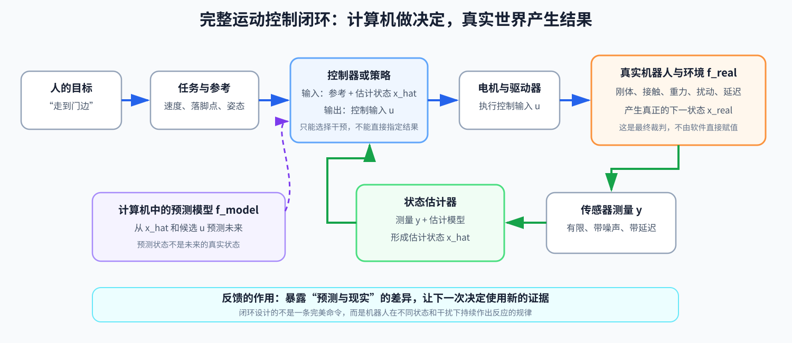
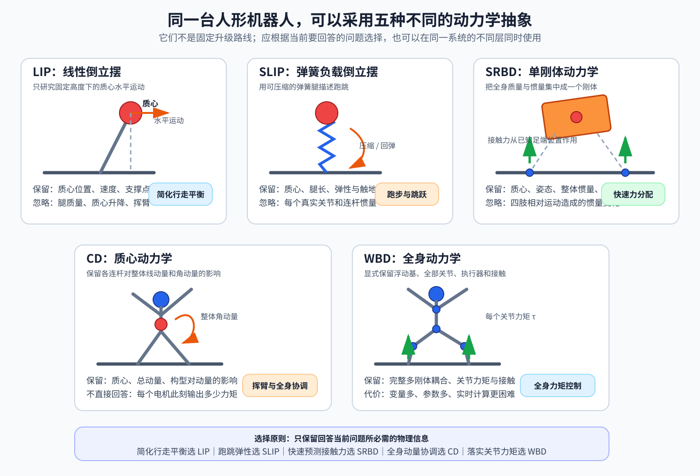

# 第 00 章：先看全局——机器人运控到底在做什么

## 读完本章你应该能回答

1. 运动规划和运动控制有什么不同？
2. 为什么机械臂能按关节位置运动，人形机器人却容易倒？
3. “建模 + 求解”如何统一传统控制与强化学习？
4. 模型预测、状态估计和真实世界的变化有什么区别？
5. 学这套教程最终要获得什么能力？

## 1. 从一个软件接口开始

假设上层发来命令：

```go
command := MotionCommand{
	ForwardVelocity: 0.8, // 单位 m/s：向前速度
	YawRate:         0.2, // 单位 rad/s：绕竖直轴的转动速度
}
```

机器人有 29 个可驱动关节。控制程序不能把 `0.8 m/s` 直接写进任何一个电机，它必须把任务逐层翻译：

```text
身体应怎样移动
→ 左右脚什么时候支撑、落在哪里
→ 质心和各关节下一刻应处于什么状态
→ 地面应给每只脚多大反作用力
→ 每个关节应输出多大力矩
```

这里的“运控”是“运动控制”的简称。它关注如何让机器人按照目标运动，并在真实物理世界中保持稳定、安全和可执行。

## 2. 状态、输入、动力学

所有控制方法都绕不开三个对象。

### 2.1 状态

状态 `x` 是“只要知道它，就足以预测系统后续变化”的信息集合。一个简化小车可以用：

```text
x =
[
p_x  p_y  θ  v
]ᵀ
```

符号解释：

- `x`：状态向量；
- `p_x`、`p_y`：小车在平面上的横、纵坐标，单位是米（m）；
- `θ`：车头方向角，单位是弧度（rad）；
- `v`：车身前进速度，单位是米每秒（m/s）；
- `ᵀ`：转置标记，把横向排列写成列向量。

人形机器人的状态更大，通常包含浮动身体的位置、姿态、线速度、角速度，以及所有关节的位置和速度。

### 2.2 控制输入

控制输入 `u` 是控制器能主动施加的量。根据硬件接口，它可能是：

- 关节期望位置；
- 关节期望速度；
- 关节期望力矩；
- 位置/速度与 PD（Proportional-Derivative，比例—微分控制）增益的组合。PD 根据位置误差和速度误差修正电机输出。

人形机器人身体在空中没有“推进器”。电机只能对关节内部施力，机器人整体移动依靠脚与地面的接触反力。因此，人形是“欠驱动系统”：系统的所有自由度不能被执行器直接控制。

### 2.3 动力学：先区分模型与现实

离散时间下，控制器在计算机里使用的预测模型可以写成：

```text
x_model[k+1] = f_model(x_hat[k], u[k])
```

符号解释：

- `k`：当前离散时刻的编号，不是时间单位；
- `x_hat[k]`：控制器当前拿到的估计状态，读作“x hat”；
- `u[k]`：当前控制输入；
- `x_model[k+1]`：模型预测的下一状态；
- `f_model(·)`：计算机中用于预测的状态转移模型。

对软件工程师而言，`f` 很像一个纯函数：

```go
// 根据当前状态估计和动作，预测下一时刻的模型状态。
nextState := physicsStep(estimatedState, action)
```

但真实世界不是这个函数的返回值。真正的机器人更接近：

```text
x_real[k+1] = f_real(x_real[k], u[k], disturbance[k])
```

- `x_real`：真实状态，无论控制软件是否知道，它都客观存在；
- `f_real`：真实物理世界，包括没有建进模型的摩擦、柔性、延迟和接触；
- `disturbance`：外力、地面变化等扰动。

传统控制显式写出或近似 `f_model`；强化学习通常让仿真器的 `step()` 承担训练时的模型。二者最后都要把动作交给 `f_real` 检验。

### 2.4 控制器实际上知道什么

真机上，控制器通常不能直接读取 `x_real`。传感器只提供测量：

```text
y[k] = sensor(x_real[k]) + noise[k]
```

状态估计器再把测量、历史和模型融合成 `x_hat[k]`。因此需要明确区分：

```text
x_real：真实发生了什么
y：传感器看到了什么
x_hat：控制器相信现在发生了什么
x_model：模型预测将会发生什么
```



控制器不能直接命令“机器人下一刻必须在这里”。它只能选择 `u` 去影响真实世界；真正结果由机器人、接触、重力、环境和扰动共同产生。传感器随后把结果的一部分重新带回计算机。

## 3. 建模 + 求解

原始《人形机器人运动控制 Know-How》的总纲是“建模 + 求解”。这四个字很容易被一句带过，所以我们先不谈任何缩写。

### 3.1 建模

#### 先回答：为什么要建模？

控制器每隔几毫秒都要决定下一条电机命令。它真正想知道的是：

> 如果我现在给左膝 8 N·m 的力矩、给右膝 6 N·m 的力矩，机器人下一刻会更直，还是会向后倒？

`N·m` 读作“牛顿米”，是力矩的单位；这里暂时把力矩理解为“电机让关节转动的作用强度”即可。

这个“如果做 A，接下来会发生什么”的预测能力，就是建模的目的。

假如完全没有模型，控制器只能盲试：

```text
试一个动作
→ 等机器人真的动起来
→ 看有没有摔
→ 再试另一个动作
```

对游戏角色也许可以，对几十公斤的真机不行：试错很慢，摔倒会损坏硬件，而且等看到机器人已经明显倒下时，往往来不及挽救。

这里不是说“没有精确动力学模型，任何控制都不能工作”。恒温器和简单 PD 控制器可以看到误差后再纠正，并不需要先写出完整物理方程。但它们至少隐含知道“动作往哪个方向改变系统”，而且主要是在误差已经出现后响应。人形平衡速度快、变量多、约束多；若还要提前规划落脚点，就更需要预测未来。

有了模型，控制器可以在计算机里先做许多次“假想实验”：

```text
当前估计 x_hat
├─ 假设动作 u₁ → 模型预测 x_model,1
├─ 假设动作 u₂ → 模型预测 x_model,2
└─ 假设动作 u₃ → 模型预测 x_model,3
```

然后再从这些候选动作里选择一个真正发给电机。

这就是上一节公式的意义：

```text
x_model[k+1] = f_model(x_hat[k], u[k])
```

它不是为了把事情写得“数学化”，而是在表达：

```go
// 在计算机中预测候选动作的结果，不立即把动作发给真机。
predictedNextState := model.Predict(estimatedState, candidateAction)
```

#### “模型”不是机器人的 3D 外观

这里的模型不是 Blender 里的外观模型，也不只是 CAD（Computer-Aided Design，计算机辅助设计）图或 URDF（Unified Robot Description Format，统一机器人描述格式）文件。CAD 描述零件外形，URDF 描述连杆和关节结构；这里关注的是动作如何造成状态变化。

```text
当前身体和关节是什么状态
+ 电机施加什么作用
+ 地面对脚有什么作用
→ 身体接下来怎样运动
```

最简单的模型可以只是一条经验规则；复杂模型则会包含质量、惯量、关节、重力、摩擦和接触等方程。

#### 一个具体例子：机器人正在向前倒

假设某一瞬间，机器人的质心投影仍在两脚之间。只看这一张“照片”，它似乎还站得住。

但是有两种可能：

```text
情况 A：身体几乎静止
情况 B：身体正在以很快的速度向前倾倒
```

两者的位置相同，未来却完全不同：

- 情况 A 可能只需轻微调整脚底受力；
- 情况 B 可能必须马上向前迈一步，否则惯性会让它继续倒下。

这里的“惯性”可以先理解为：物体已经在运动时，会倾向于保持原来的运动趋势，不会因为位置暂时还安全就自动停住。

所以模型不能只保存“现在在哪里”，还可能需要保存速度、质量、接触状态等信息。否则它无法区分这两种未来。

这里的“保存”不是指写入数据库，而是指：这些物理量是否出现在控制器的状态和预测公式中。

#### 为什么不把真实世界的一切都放进模型？

真实机器人涉及的因素几乎无穷无尽：

- 每个零件的质量和惯量；
- 电机、减速器、轴承和线缆的摩擦；
- 鞋底橡胶的形变；
- 地面的软硬和粗糙程度；
- 结构受力后的微小弯曲；
- 电池电压、温度和通信延迟；
- 空气阻力，甚至螺丝的微小松动。

若把所有因素都精确模拟，计算可能比真实时间还慢。机器人却没有时间等：1 kHz 表示每秒控制 1000 次，每次循环只有 1 ms（毫秒，即千分之一秒）。

更麻烦的是，很多参数根本测不准。一个极复杂但参数错误的模型，不一定比一个抓住主要矛盾的简单模型更好。

所以“建模”实际上是在做工程取舍：

> 为了回答当前控制问题，我至少必须保留哪些信息？哪些次要细节可以暂时忽略？

这很像软件系统中的抽象：

- TCP（Transmission Control Protocol，传输控制协议）实现很复杂，但业务代码通常只保留“可靠字节流”这个接口；
- 数据库内部有缓存、日志和锁，业务层可能只保留“事务”这个抽象；
- 模型不是现实的完整复制，而是针对问题设计的、可计算的接口。

#### “保留哪些物理信息”到底是什么意思？

假设现在只想研究机器人向前、向后保持平衡，可以有不同抽象层级。

**第一种：把全身看成一个质点。**

你不关心膝盖和手臂分别怎样运动，只记录：

```text
质心在哪里
质心移动多快
脚底支撑区域在哪里
```

它能回答“质心会不会跑出脚能支撑的范围”，却不能回答“左膝需要多少力矩”。

**第二种：把全身看成一个有方向的刚体。**

除了质心，还记录身体朝向、转动速度和转动惯量。它能预测身体会不会向前翻转，但仍然忽略手臂和腿各自摆动造成的影响。

**第三种：保留每一段肢体和每个关节。**

此时能研究手臂挥动如何影响平衡，也能计算每个关节力矩，但状态和方程会大很多，求解也更慢。

因此，“模型更完整”不是一句抽象评价，而是：

```text
它能区分更多不同的物理情况，
也能回答更细的问题，
但需要更多参数和计算。
```

#### 现在再看五种模型

下面这些名称不是五个互相替代的软件库，而是观察同一台机器人的五种“物理抽象级别”。先展开缩写：

- LIP（Linear Inverted Pendulum，线性倒立摆）：用固定高度的倒立摆近似行走；
- SLIP（Spring-Loaded Inverted Pendulum，弹簧负载倒立摆）：加入腿的压缩和回弹；
- SRBD（Single Rigid Body Dynamics，单刚体动力学）：把全身近似成一个刚体；
- CD（Centroidal Dynamics，质心动力学）：研究质心和全身动量怎样变化；
- WBD（Whole-Body Dynamics，全身动力学）：保留浮动身体、关节和接触的完整动力学。



读图时注意：绿色箭头表示地面对接触点的作用力，橙色箭头表示我们关心的运动或动量变化。虚线腿表示该模型知道接触位置，但不显式保留腿部每根连杆的惯量。

| 模型 | 它把机器人想成什么 | 主要保留什么 | 故意忽略什么 | 适合先回答的问题 |
|---|---|---|---|---|
| LIP | 固定高度的倒立摆 | 质心水平位置、速度和脚底支撑点 | 腿部质量、质心高度变化、手臂摆动 | 简化行走中质心怎样保持动态可恢复 |
| SLIP | 带弹簧腿的倒立摆 | 质心、腿长、腿的压缩和回弹 | 详细关节和全身连杆 | 跑跳时腿如何像弹簧一样储存和释放能量 |
| SRBD | 一个有质量和方向的完整刚体 | 质心、身体姿态、线动量和角动量 | 四肢相对身体的惯量变化 | 各只脚应提供多大的地面反力 |
| CD | 由多根连杆组成，但重点观察整体动量 | 质心、整体动量，以及关节运动对整体动量的影响 | 关节力矩的完整细节 | 挥臂、弯腰、迈步怎样共同影响全身平衡 |
| WBD | 浮在空间中的完整多关节机器人 | 浮动身体、所有关节、接触力和关节力矩 | 仍会忽略材料形变等次要现实细节 | 每个关节最终需要输出什么力矩 |

这五个模型不是“越往后越高级，所以永远用最后一个”。例如：

- 只规划质心时，LIP 可能已经够用；
- 要快速预测未来多步接触力时，SRBD 计算更划算；
- 要把任务落实成关节力矩时，才需要 WBD；
- 一个控制系统甚至会同时使用多个模型：高层用简单模型看得更远，低层用完整模型控制得更细。

### 3.2 求解

模型只负责预测：

```text
给定当前状态和某个候选动作，未来可能怎样变化？
```

它并不会自动告诉我们“该选哪个动作”。从候选动作里做选择，才叫求解。

还是以机器人向前倒为例，控制器可能想到：

```text
方案 A：脚底向后发力
方案 B：身体向后仰
方案 C：向前迈一步
方案 D：同时挥臂并迈步
```

究竟选哪个，取决于三个东西：

- 目标：例如速度跟踪误差小、身体直立、动作省电；
- 等式约束：例如必须遵守动力学；
- 不等式约束：例如力矩不能超限、脚不能打滑。

可以把“求解”理解成带规则的搜索：

```go
var bestAction Action
bestScore := math.Inf(1) // 初始值设为正无穷，任何正常分数都会更小

for _, action := range candidateActions {
	// 用模型和状态估计预测这个候选动作会带来什么后果。
	future := model.Predict(estimatedState, action)

	// 违反物理规律或硬件限制的方案直接淘汰。
	if violatesPhysicsOrHardwareLimits(future, action) {
		continue
	}

	// 分数同时考虑跟踪、稳定和能耗；越小越好。
	score := evaluateTrackingStabilityAndEnergy(future, action)
	if score < bestScore {
		bestAction = action
		bestScore = score
	}
}
```

真实算法当然不会这样暴力枚举，但下面这些方法做的核心事情相同：利用问题的数学结构，更快找到一个目标较好且不违反约束的动作。

- QP（Quadratic Programming，二次规划）：快速求解二次目标和线性约束；
- MPC（Model Predictive Control，模型预测控制）：反复预测未来，只执行当前第一步；
- DDP（Differential Dynamic Programming，微分动态规划）：利用时间递推结构优化整条动作轨迹。

#### 为什么叫“最合适”，而不是“正确答案”？

控制问题通常没有唯一完美答案。例如机器人迈一步时：

- 步子大，可能更快接住身体，但关节速度和冲击更大；
- 步子小，动作省力，却可能来不及恢复平衡；
- 身体保持绝对直立，外观好看，但可能限制加速能力。

因此控制器需要在多个目标之间权衡。“求解”就是在物理可行的候选方案中，按照我们定义的偏好选一个。

#### 传统控制和强化学习都在做这件事

传统控制通常在机器人运行时显式计算：

```text
当前状态
→ 用方程预测
→ 在线求最合适动作
→ 发给电机
```

强化学习通常把大量搜索放到训练阶段：

```text
在仿真中试过大量状态和动作
→ 把经验压进神经网络参数
→ 部署时用一次网络推理直接给动作
```

强化学习看似没有显式写出模型，但仿真器的 `step()` 仍承担了“动作会导致什么结果”的预测角色。

到这里，“建模 + 求解”可以用一句话概括：

> 建模负责预测不同动作的后果；求解负责从这些后果中挑出当前最值得执行、而且物理上做得到的动作。

## 4. 为什么人形比机械臂难

一句话版本：

> 人形机器人是一个高维、强非线性、有接触模式切换、静态稳定裕度低的浮动基系统。

逐项拆开：

- **高维**：几十个关节，每个关节的位置和速度都会进入状态；
- **强非线性**：关节是串联的，髋关节的一点误差会改变膝和脚的位置；
- **接触切换**：双脚支撑、单脚支撑和腾空时，动力学方程的有效约束不同；
- **浮动基**：躯干没有固定在世界上，只能借助接触力移动；
- **稳定裕度低**：质心高、脚底支撑区域小，轻微推力就可能造成倾倒。

机械臂的基座固定在地面，误差通常意味着“末端没到目标点”；人形的误差可能意味着“接触改变，然后摔倒”。这是一种会改变系统拓扑的故障，而不仅是数值偏差。

## 5. 运动学可行不等于动力学可行

动捕数据告诉机器人“每个时刻摆成什么姿势”。这只说明：

- 关节角可能没有超限；
- 身体几何上没有明显穿模；
- 轨迹看起来像人。

但它没有保证：

- 电机力矩足够；
- 脚底摩擦力足够；
- 落地冲击可承受；
- 质心和角动量能被地面反力支撑。

这类似于给服务指定每毫秒必须完成的请求量，却没有检查 CPU（Central Processing Unit，中央处理器）、内存、网络和依赖服务容量。接口合法不代表系统可运行。

## 6. 传统控制与学习控制不是敌人

| 维度 | 传统模型控制 | 学习控制 |
|---|---|---|
| 物理知识放在哪里 | 方程、约束、代价函数 | 仿真器、奖励、观测与随机化 |
| 主要计算发生在哪里 | 部署时在线求解 | 训练时离线优化 |
| 可解释性 | 较强 | 较弱 |
| 非线性表达能力 | 受模型与求解速度限制 | 神经网络表达能力强 |
| 约束保证 | 可显式表达 | 常用惩罚或安全层近似 |
| 对仿真数据依赖 | 中等 | 很高 |

真正有用的工程能力是知道两者各自把复杂度放在了哪里，并能根据任务组合它们。

## 7. 本教程的学习终点

学完后，你不一定能立刻写出 Atlas 的控制器，但应该能够：

1. 看懂机器人论文中状态、动作、模型、约束和损失的定义；
2. 解释后续的平衡模型、全身控制、预测控制和强化学习算法分别位于系统哪一层；
3. 用 Pinocchio 一类库计算运动学和动力学量；
4. 在 MuJoCo 或 Isaac Lab 中判断一个训练/控制方案为什么失败；
5. 设计一个从双脚站立到速度跟踪的可验证项目；
6. 与机械、电机、算法同事使用同一套概念交流。

## 8. 小练习

不用写代码，先回答：

1. 对恒温空调，真实状态 `x_real`、控制输入 `u` 和预测模型 `f_model` 分别可以是什么？
2. 对两轮平衡车，为什么只指定轮子转速不能保证车身不倒？
3. 如果仿真中机器人能走，真机不能走，问题可能落在“状态、输入、模型、约束、目标”中的哪些部分？

参考思路：第三问的答案不是单选。传感器导致测量和估计误差，执行器导致实际输入偏离命令，接触和质量参数导致 `f_model` 与 `f_real` 不一致，真机限位导致约束不同，奖励漏洞则意味着目标定义错误。
