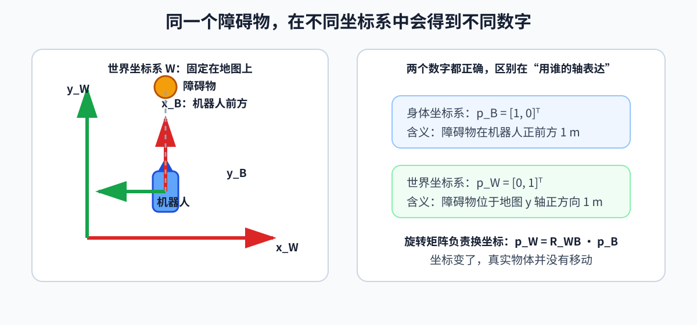

# 第 02 章：坐标系与姿态——同一个位置，为什么会有不同数字

## 1. 坐标值必须带“命名空间”

假设机器人面朝东，机器人自己的正前方记作 `x` 轴。一个物体在机器人前方 1 m：

- 在机器人身体坐标系中可能是 `[1,0,0]ᵀ`；
- 在世界坐标系中可能是 `[0,1,0]ᵀ`。

两个向量都正确，只是坐标系不同。工程中最好把变量命名成：

```go
var (
	pWorldFoot Vec3   // 脚的位置，用世界坐标系表达
	pBodyFoot  Vec3   // 脚的位置，用身体坐标系表达
	rWorldBody Matrix // 把身体坐标转换到世界坐标的旋转矩阵
)
```



图中的障碍物没有移动，只是表达它所使用的坐标轴变了。看到任何位置、速度或力时，都应该先问“它在哪个坐标系中表达”。

`p_world_foot` 表示“脚在世界坐标系下的位置”，而不是模糊的 `foot_pos`。

坐标是对物理事实的描述，不是物理事实本身。换坐标系后，分量可以改变，但两点的真实距离、刚体之间的真实夹角、脚是否接触地面不会凭空改变。如果某个控制结论会随着任意选择的坐标系而改变，就要检查它究竟是物理结论，还是表示方式造成的假象。

## 2. 旋转矩阵

上一节只说明了“同一个点可以有不同坐标”，但控制程序还必须把一种坐标换算成另一种坐标。

例如，摄像头报告“障碍物在机身前方 1 m”，导航模块却要在世界地图中标出它的位置。若不知道机身当前朝向，就不能直接把两个模块给出的数字相加。旋转矩阵正是这个换算工具：它回答“一个方向在坐标系 B 中这样写，换到坐标系 W 中应该写成什么”。

二维旋转角 `θ` 对应：

```text
R(θ)=
[
cosθ  -sinθ
sinθ  cosθ
]
```

- `R`：rotation matrix，旋转矩阵；
- `θ`：逆时针旋转角；
- `cos`、`sin`：余弦和正弦函数；
- `R∈ℝ^(2×2)`。

向量从身体坐标系转换到世界坐标系：

```text
p^W = R_WB · p^B
```

- 左上标 `W`：该向量用 World（世界）坐标系表达；
- 左上标 `B`：用 Body（身体）坐标系表达；
- `R_WB`：把 B 系坐标转换到 W 系；
- 下标顺序可以理解为目标在前、来源在后。

若 `θ=90°`，身体前方 `[1,0]ᵀ` 转到世界系就是 `[0,1]ᵀ`。

### 旋转矩阵的两个性质

```text
RᵀR=I,  det(R)=1
```

- `I`：单位矩阵；
- `det`：行列式；
- `Rᵀ=R⁻¹`：逆旋转可用转置得到。

这些约束意味着 3D 旋转矩阵虽然有 9 个数，真正独立的自由度只有 3 个。

## 3. 平移与齐次变换

旋转矩阵只能处理“朝向不同”。如果两个坐标系的原点也不在同一位置，还要再补上平移。机器人中的传感器通常既有安装角度，也有安装位置，因此实际程序大多需要同时处理旋转和平移。

刚体变换同时包含旋转和平移：

```text
p^W = R_WB · p^B + t_B^W
```

- `t_B^W`：身体坐标系原点在世界坐标系中的位置，并用世界坐标表达；
- 先旋转局部点，再加上坐标系原点的平移。

齐次变换把两步合成一个矩阵：

```text
T_WB=
[
R_WB  t_B^W
0ᵀ  1
]
```

`T∈ℝ^(4×4)` 属于 `SE(3)`。`SE(3)` 是 Special Euclidean Group in 3D，中文常译“三维特殊欧氏群”，可以暂时理解为“所有合法三维刚体位姿的集合”。

## 4. 欧拉角

欧拉角常用：

- roll：横滚，绕前后轴转；
- pitch：俯仰，绕左右轴转；
- yaw：偏航，绕竖直轴转。

优点是符合人的直觉；缺点是：

1. 旋转顺序不同，结果不同；
2. 某些姿态会发生万向锁（gimbal lock）；
3. 在 `π` 与 `-π` 附近数值不连续。

所以日志和用户接口常用欧拉角，内部状态和插值常用旋转矩阵或四元数。

## 5. 四元数

单位四元数常写成：

```text
q=
[
w  x  y  z
]ᵀ,
w²+x²+y²+z²=1
```

- `w`：标量部分；
- `x,y,z`：向量部分；
- 单位长度约束保证它表示纯旋转。

注意不同库可能采用 `[w, x, y, z]` 或 `[x, y, z, w]`。这类顺序错误不会触发类型异常，却会产生完全错误的姿态，是非常典型的机器人接口 bug。

绕单位轴 `a=[a_x,a_y,a_z]ᵀ` 旋转角 `θ`：

```text
q=
[
cos(θ/2)
a_xsin(θ/2)
a_ysin(θ/2)
a_zsin(θ/2)
]
```

四元数 `q` 和 `-q` 表示同一旋转，所以比较两个四元数时不能简单做逐元素相等。

## 6. 角速度不是欧拉角速度

角速度 `ω` 表示刚体瞬时绕哪个轴、以多快速度转动，单位是 rad/s。欧拉角的三个导数通常不等于角速度的三个分量，中间存在与当前姿态有关的映射。

这解释了一个常见 bug：把 IMU（Inertial Measurement Unit，惯性测量单元）输出的陀螺仪角速度直接积分到 roll、pitch、yaw 上。IMU 用来测量加速度和角速度；小角度短时间内直接积分似乎能工作，姿态变大后误差会明显。

## 7. 浮动基机器人的广义坐标

固定基机械臂只需关节角：

```text
q∈ℝ^n
```

`n` 是关节自由度数。人形的躯干没有固定，所以要加上浮动基位姿。工程中常写：

```text
q=
[
p_WB
q_WB
q_j
]
```

- `p_WB∈ℝ³`：基座位置；
- `q_WB∈ℝ^(4)`：基座单位四元数；
- `q_j∈ℝ^n`：关节角；
- 因而配置向量的存储长度是 `7+n`。

但速度写成：

```text
v=
[
v_base
ω_base
q_dot,j
]
∈ℝ^(6+n)
```

姿态用 4 个数存储却只有 3 个自由度，所以配置维度 `nq` 和速度维度 `nv` 不相同。Pinocchio 等库会明确区分它们。

## 8. 代码中的坐标变换

```go
theta := 90.0 * math.Pi / 180.0 // Go 的三角函数使用弧度
rWB := [2][2]float64{
	{math.Cos(theta), -math.Sin(theta)},
	{math.Sin(theta), math.Cos(theta)},
}

pB := [2]float64{1.0, 0.0} // 点在身体坐标系中的位置
tWB := [2]float64{2.0, 3.0} // 身体原点在世界坐标系中的位置

// 先旋转局部坐标，再加上身体原点的平移。
pW := [2]float64{
	rWB[0][0]*pB[0] + rWB[0][1]*pB[1] + tWB[0],
	rWB[1][0]*pB[0] + rWB[1][1]*pB[1] + tWB[1],
}
// pW 约等于 [2.0, 4.0]
```

检查清单：

- 角度是 degree（度）还是 radian（弧度）？
- 四元数分量顺序是什么？
- 旋转是主动旋转向量，还是被动变换坐标？
- 矩阵是 `R_WB` 还是 `R_BW`？
- 线速度和角速度在哪个坐标系表达？

调试时应先把“坐标或接口错误”和“模型、控制或执行错误”分开。若力的方向是因为坐标系写反了，继续调整 PD（Proportional-Derivative，比例—微分）增益只会暂时掩盖问题，无法修复错误的物理含义。

## 9. 小练习

1. 机器人在世界坐标 `(2,3)`，朝向世界 `y` 轴。其身体前方 2 m 的点在世界坐标哪里？
2. 为什么四元数有 4 个数，却只表示 3 个旋转自由度？
3. 对 29 关节人形，使用四元数保存基座姿态时，`nq` 和 `nv` 各是多少？

答案：1）`(2,5)`；2）有单位长度约束，并且正负四元数表示同一旋转；3）`nq=7+29=36`，`nv=6+29=35`。
