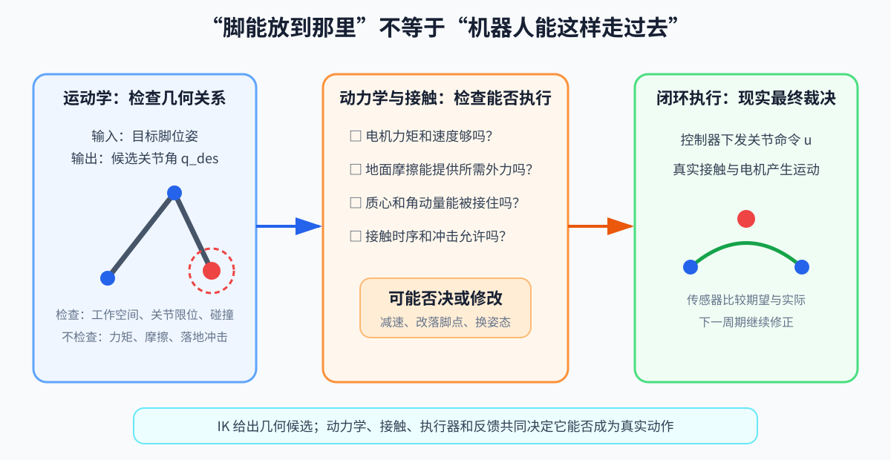

# 第 02 章：运动学与雅可比——从关节角到手脚的位置和速度

> **所属部分**：第一部分 · 物理与闭环基础。
>
> **前置知识**：[第 01 章](01-坐标系与姿态.md)；导数、矩阵和秩按需查[附录 A](附录A-数学急救包.md)。
>
> **核心问题**：关节角和关节速度怎样决定手脚的位置与瞬时速度？
>
> **下一步**：[第 03 章：动力学与接触](03-动力学与接触.md)。

## 怎么读这一章

- **第一遍读第 1～3 节和第 5.1～5.2 节**：理解 FK、IK、雅可比每一列，以及“完全伸直时少了一个瞬时运动方向”。
- **第二遍读第 4～6 节**：再理解伪逆、阻尼和加速度映射。
- **第三遍读第 7～9 节**：力映射、零空间和人形多任务等真正用到时再细读。

如果你想亲眼看到二关节雅可比是怎样从位置公式一步步长出来的，请先读[《雅可比矩阵从零推导——二维二关节机械臂》](雅可比矩阵从零推导-二维二关节机械臂.md)。本章保留全局地图，专题讲义负责慢速推导。

运动学只研究“几何上怎么动”，暂时不问需要多大的力。

为什么先学运动学？控制器收到的任务通常是“脚落到这里”“手碰到把手”“身体保持这个高度”，电机接口却对应关节。运动学负责在“任务空间”和“关节空间”之间翻译：

```text
关节角 ──正运动学──> 手脚的位置与姿态
目标位置 ──逆运动学──> 所需关节角
关节速度 ──雅可比──> 手脚的速度
```

这一章先解决“几何上能不能、怎么到达”；下一章才检查所需的力是否真实可行。

## 读完本章你应该能回答

1. 已知关节角，怎样算出手脚位置？反过来为什么可能有多解或无解？
2. 雅可比的每一列在物理上表示什么？
3. 二连杆完全伸直时，末端为什么不能瞬间继续向外移动？
4. 伪逆、阻尼和零空间分别在解决什么问题？

如果不熟悉秩和伪逆，先查阅[附录 A 的相关小节](附录A-数学急救包.md#7-秩逆矩阵和伪逆先看信息够不够)。本章会先用二连杆的具体运动解释现象，再给专业名称。



## 1. 正运动学

正运动学（Forward Kinematics，FK）回答：

> 已知所有关节角，末端在哪里、朝向哪里？

考虑平面二连杆机械臂：

```text
x=l_1cos q_1+l_2cos(q_1+q_2)
```

```text
y=l_1sin q_1+l_2sin(q_1+q_2)
```

符号解释：

- `q_1`、`q_2`：第一、第二关节角，单位 rad；
- `l_1`、`l_2`：两段连杆长度，单位 m；
- `x`、`y`：末端位置；
- `q_1+q_2`：第二段连杆相对世界的总角度。

若 `l_1=l_2=1` m，`q_1=0`、`q_2=90°`，末端在 `(1,1)`。

对人形机器人，FK 会沿着 URDF（Unified Robot Description Format，统一机器人描述格式）中的父子关节树，把每个局部变换逐级相乘，得到脚、手、头等 frame 的世界位姿。URDF 文件记录连杆、关节及其连接关系。

## 2. 逆运动学

逆运动学（Inverse Kinematics，IK）回答：

> 已知希望末端到哪里，关节应该取什么角度？

它通常没有唯一解：

- 手到同一个点，肘可以朝上或朝下；
- 自由度多于任务维度时，有无穷多个解；
- 目标超出工作空间时，没有精确解；
- 关节限位和碰撞会排除部分几何解。

数值 IK 常把问题写成最小化：

```text
min_q
(1)/(2)‖p(q)-p_des‖_2²
```

- `q`：所有待求关节角；
- `p(q)`：FK 算出的末端位置；
- `p_des`：desired position，期望位置；
- `1/2`：方便求导，对最优解位置没有影响。

整行还可以这样读：

- `min_q`：允许调整的是关节角 `q`，目标是找到让后面分数最小的那组角度；
- `p(q)-p_des`：当前末端位置与目标位置之间的误差向量；
- `‖·‖_2`：这个误差向量的欧氏长度；
- 外面的平方：让正负方向的误差都产生非负代价，而且误差越大惩罚越强。

因此，IK 不是普通意义上“输入一个位置就得到唯一反函数值”。它是在多个候选姿态中，结合末端误差、关节限位、碰撞距离和姿态偏好选择一个几何解。得到 `q` 只说明“可以把身体摆成这样”，还没有承诺电机有足够力矩、脚不会打滑，也没有承诺运动过程来得及完成。

## 3. 雅可比矩阵

FK 能算出某个姿态下末端在哪里，但控制循环还经常问一个更局部的问题：

> 如果这个关节现在轻微转快一点，脚会朝哪个方向移动多快？

每次都重新推导完整几何关系很不方便。雅可比把当前姿态附近的关节速度直接翻译成末端速度。

雅可比（Jacobian）是机器人学最常见的局部映射：

```text
x_dot=J(q)q_dot
```

- `x_dot`：整个任务变量 `x` 的变化速度，例如脚的线速度和角速度；这里的 `x` 是“任务变量”的通用名字，不是只指平面横坐标 `x`；
- `q_dot`：关节速度；
- `J(q)`：雅可比矩阵，它随当前关节角变化；
- 若末端任务是三维位置且有 `n` 个关节，`J∈ℝ^(3×n)`：三行对应末端三个速度分量，`n` 列对应 `n` 个关节。

把它读成函数签名：

```go
// 雅可比把关节速度映射为足端速度。
footVelocity := MatVecMul(jacobian(q), jointVelocity)
```

### 二连杆雅可比

对上一节的 `x,y` 分别对 `q_1,q_2` 求偏导：

```text
J=
[
-l_1sin q_1-l_2sin(q_1+q_2)  -l_2sin(q_1+q_2)
l_1cos q_1+l_2cos(q_1+q_2)  l_2cos(q_1+q_2)
]
```

你不需要背矩阵。关键直觉是：雅可比描述“当前姿态下，每个关节轻微转动会让末端往哪个方向移动多少”。

还可以按列来读它。若只让第一个关节以 `1 rad/s` 转动，其他关节不动，末端速度就是 `J` 的第一列；只转第二个关节，末端速度就是第二列。多个关节一起转时，最终末端速度就是这些列向量按关节速度缩放后的相加结果。

因此，后面判断机器人“此刻能让末端向哪些方向运动”，就是在看 `J` 的列向量能组合出哪些方向。

## 4. 用雅可比做迭代 IK

小步更新：

```text
Δq=
J†Δx
```

- `Δx`：末端期望移动的小位移；
- `Δq`：关节角应改变的量；
- `J†`：雅可比的伪逆（pseudo-inverse）；
- 伪逆用于矩阵不是方阵或不可直接求逆的情况。

这里不能把伪逆只记成“另一种逆矩阵”。它根据当前雅可比解决两类常见情况：

- 关节比任务需要的多：能完成同一个 `Δx` 的 `Δq` 有很多个，伪逆默认选择长度较小的一个；
- 目标小位移无法被精确产生：伪逆选择让末端误差尽量小的 `Δq`。

因此，一次迭代的完整意思是：先看末端还差多远，再在**当前姿态附近**用直线近似算一小步关节修正，然后重新做 FK。因为雅可比会随姿态变化，通常不能只算一次就结束。

迭代代码的骨架：

```go
for iteration := 0; iteration < maxIterations; iteration++ {
	// 先用正运动学计算当前足端位置，再得到位置误差。
	currentPosition := forwardKinematics(q)
	err := Sub(desiredPosition, currentPosition)
	if Norm(err) < tolerance {
		break // 误差已经足够小，停止迭代
	}

	// 用雅可比伪逆把足端误差换算成关节角修正量。
	j := computeJacobian(q)
	dq := MatVecMul(PseudoInverse(j), err)
	q = Add(q, Scale(stepSize, dq))
}
```

工程上更常用阻尼最小二乘（Damped Least Squares，DLS）：

```text
Δq
=
Jᵀ
(JJᵀ+λ²I)⁻¹
Δx
```

- `λ>0`：阻尼系数；
- `I`：单位矩阵；
- 阻尼减少奇异位形附近的巨大关节速度；下一节会用完全伸直的二连杆解释为什么会出现这种放大。

这个写法适合“任务维度不多于关节数”的常见机器人任务。不同矩阵形状还可以使用另一种等价的阻尼最小二乘写法；第一遍不需要把某一个排列背成万能公式。

`λ` 越大，关节更新通常越保守、越平稳，但末端误差也可能消除得更慢。它是在“严格追末端目标”和“不要让关节动作爆炸”之间做权衡。

## 5. 奇异位形

### 5.1 先观察一个真实动作

把自己的手臂向前完全伸直并锁住肘部。现在尝试只转肩和肘，让手再**沿手臂方向向前**移动一点：做不到，因为手臂长度已经用完了。若让手向旁边或上下移动，却仍然可以通过转动关节做到。

二连杆机械臂完全伸直时也是这样。为了让计算最简单，取：

```text
q_1=0,
q_2=0
```

两段连杆都沿 `x` 轴向右。把 `sin(0)=0`、`cos(0)=1` 代入雅可比：

```text
J_straight=
[
0        0
l_1+l_2  l_2
]
```

再乘任意关节速度：

```text
[
x_dot
y_dot
]
=
[
0        0
l_1+l_2  l_2
]
[
q_dot_1
q_dot_2
]
```

第一行清楚地给出：

```text
x_dot=0
```

也就是说，不论两个关节此刻转多快，末端的**瞬时水平速度**都为 0。第二行通常不为 0，所以仍能产生竖直速度。

这里强调“瞬时”很重要。机械臂可以先弯曲，再把手移向内侧；它只是在完全伸直的这一刻，无法产生沿手臂方向的非零一阶速度。向外则连最终位置都不可达，因为已经超过最大臂长。

### 5.2 现在再引入“秩”和“奇异”

在普通弯曲姿态下，二连杆雅可比的两列通常指向两个不同方向，组合它们可以产生平面内任意小速度。完全伸直时，两列都只沿 `y` 方向，能够独立产生的方向从 2 个变成 1 个。

“能够独立产生的方向数”就是附录 A 介绍的矩阵秩。这里雅可比的秩从 2 降到 1，称当前姿态是**奇异位形**（singular configuration），简称奇异。

一句话概括：

> 奇异位形不是“矩阵求逆代码坏了”，而是机器人在这个姿态下确实少了一个瞬时运动方向。

### 5.3 为什么“接近奇异”也麻烦

机械臂还没有完全伸直、只是非常接近伸直时，理论上仍能产生水平速度，但效率很低。两个关节造成的运动大部分会互相抵消，只留下很小的水平分量。于是为了得到普通大小的末端水平速度，反算出的关节速度可能非常大。

例如控制器要求末端只移动 `1 mm`，伪逆却可能给出很大的 `Δq`。这会带来：

- 关节速度或力矩超过上限；
- 编码器噪声和目标误差被明显放大；
- 数值结果在相邻控制周期剧烈跳变；
- 迭代 IK 冲过目标或无法收敛。

### 5.4 工程上怎样处理

常见做法不是假装奇异不存在，而是降低要求或改变姿态：

1. 使用阻尼最小二乘，避免伪逆输出无限放大；
2. 限制每次 `Δq` 和关节速度；
3. 给 IK 增加“肘部保持微弯”或“远离奇异”的次要目标；
4. 监控雅可比最小奇异值或条件数，提前减速；最小奇异值接近零表示某个可用运动方向正在消失，条件数很大表示不同方向的运动能力相差悬殊；
5. 若目标方向当前无法产生，允许任务暂时有误差，而不是强迫电机执行不可能的命令。

阻尼只能让数值和动作更平稳，不能恢复机器人在该姿态下真正缺失的运动方向。

## 6. 速度之外：加速度映射

对速度式再求一次时间导数：

```text
x_ddot
=
J · q_ddot
+ J_dot · q_dot
```

- `x_ddot`：任务空间加速度；
- `q_ddot`：关节加速度；
- `J_dot`：雅可比随时间的变化率；
- `J_dot · q_dot`：即使关节加速度为零，由于当前关节速度和构型变化，末端仍可能有加速度。

对固定基机器人，速度变量就是 `q_dot`，于是“某个末端加速度为零”可以写成：

```text
J_c · q_ddot + J_dot,c · q_dot = 0
```

- 下标 `c`：contact，表示这是接触点任务的雅可比；
- `J_dot,c`：`J_c` 随时间的变化率，不是另一个独立雅可比；
- 右侧 `0`：要求理想固定接触点的加速度为零。

人形是浮动基机器人，速度变量会改用包含基座与关节的广义速度 `v`，对应形式是 `J_c·v_dot+J_dot,c·v=0`。第 03 章会解释为什么不能只保留关节速度。

## 7. 力与力矩的对偶映射

先明确力的方向约定。下面把 `f` 定义为**外界在末端施加给机器人**的力；`f` 与末端速度必须在彼此匹配的同一坐标表示下。虚功原理给出：

```text
τ=Jᵀf
```

- `τ∈ℝ^n`：关节力矩；
- `f`：外界作用在末端上的力；若任务包含三维转动，它应扩展为“力与力矩”组成的 wrench；
- `Jᵀ`：雅可比转置。

为什么速度映射用 `J`，力映射用 `Jᵀ`？因为同一瞬间，末端外力通过机械结构对关节做功；忽略损耗时，两种坐标写出的功率应一致：

```text
τᵀq_dot
=
fᵀx_dot
=
fᵀ · J · q_dot
```

这里 `τᵀq_dot` 是关节侧功率，`fᵀx_dot` 是末端外力对机器人做功的功率。等式对任意 `q_dot` 成立，就得到 `τ=Jᵀf`。

这是非常重要的桥梁。如果高层算的是“地面对脚的力”，可直接按上述约定映射；如果算的是“脚对地面的力”，根据作用与反作用，它与地面对脚的力方向相反，不能不看符号约定就直接代入。

更慢的几何直觉和二关节推导见[雅可比专题的力矩部分](雅可比矩阵从零推导-二维二关节机械臂.md#9-现在进入第二个问题末端力如何变成关节力矩)。

## 8. 零空间

若机器人自由度多于任务维度，可以在不影响主要任务的方向上完成次要任务：

```text
q_dot
=
J†x_dot,des
+
(I-J†J)z
```

- 第一项完成末端任务；
- `I-J†J`：投影到主任务的零空间；
- `x_dot,des`：期望任务空间速度；下标 `des` 表示 desired；
- `z`：准备执行的次要关节速度，例如远离关节限位；
- `I`：与关节空间维度匹配的单位矩阵；
- `(I-J†J)z`：从 `z` 中只保留不会在一阶近似下改变主任务的部分。

具体例子：一个 7 自由度机械臂只要求手保持在某个三维位置时，手臂往往还能改变肘部姿态。所有“关节在动、手的位置却瞬时不变”的关节速度组成主任务的零空间。可以利用这部分自由度让肘部远离桌面、关节远离限位，或保持更容易发力的姿态。

软件类比可以作为补充：主任务像必须满足的接口契约，零空间像满足契约后仍可选择的内部实现。但判断一个动作是否真的在零空间，仍要回到物理定义 `Jq_dot=0`。

## 9. 人形机器人的运动学任务

常见任务包括：

- 双脚在支撑期保持世界位姿不变；
- 摆动脚沿轨迹抬起并落到目标点；
- 质心跟踪期望位置；
- 躯干保持直立；
- 手末端跟踪操作轨迹；
- 头部朝向视觉目标。

这些任务会相互竞争。仅做 IK 能保证几何协调，却不能保证所需接触力、关节力矩和动量变化可实现，这正是下一章动力学要解决的问题。

出现“脚没有到目标点”时，不要立刻断言 IK 算错了。可以按因果顺序检查：

1. 目标是否在几何工作空间内；
2. 当前姿态是否接近奇异位形；
3. 解是否触碰关节限位或碰撞约束；
4. 若几何解存在，再检查动力学、接触摩擦和电机能力；
5. 最后比较期望关节运动与实际关节运动，判断执行是否跟上。

这种顺序能区分“根本没有几何解”和“有几何解但真实机器人做不到”。

## 本章小结

- FK 从关节角得到手脚位姿，IK 从任务目标寻找关节角；IK 可能有多解、无解或受限解。
- 雅可比描述当前姿态附近关节速度怎样合成末端速度，它会随姿态变化。
- 奇异位形代表机器人真实缺少某个瞬时运动方向；伪逆和阻尼只能选择或稳定近似解，不能创造缺失能力。

## 10. 小练习

1. 6 维任务空间速度、29 个关节时，雅可比形状是什么？
2. 支撑脚速度为零时，写出关节速度约束。
3. 为什么腿完全伸直是危险姿态？
4. 已知足端力，为什么不能总用 `Jᵀf` 就结束控制问题？

答案：1）`6×29`；2）`J_c · q_dot = 0`；3）接近奇异位形，某些方向控制能力下降且力矩映射恶化；4）它只表达瞬时虚功关系，没有同时处理全身动力学、多个接触、力矩限幅、摩擦和多个任务。
