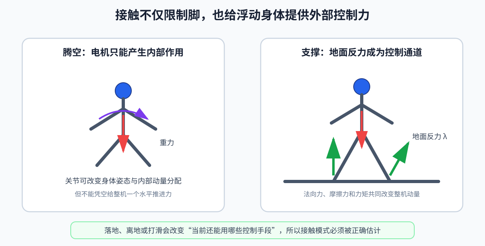

# 第 04 章：动力学与接触——机器人为什么会这样动

运动学说“关节怎样对应手脚的位置”；动力学继续问“要产生这种运动，需要什么力”。

## 1. 从牛顿第二定律开始

```text
F=ma
```

- `F`：物体受到的合力，单位 N；
- `m`：质量，单位 kg；
- `a`：质心加速度，单位 m/s²。

“合力”很重要。一个 50 kg 的机器人静止站立时，地面向上的支持力约等于重力：

```text
F_z=mg=50×9.81=490.5 N
```

- `F_z`：竖直方向地面反力；
- `g=9.81 m/s²`：重力加速度大小。

两脚均匀承重时，每脚约 245 N。这个简单数量级是调试接触力的第一条 sanity check（合理性检查）。

## 2. 单关节转动动力学

为什么不直接从完整人形方程开始？因为单关节已经包含动力学最重要的结构：想改变运动，要克服惯性、阻尼和重力。先看清每一项从哪里来，再把标量扩展成矩阵，会比直接面对几十个自由度更容易。

一个转动关节的简化方程：

```text
I · q_ddot + b · q_dot + m · g · l · sin(q) = τ
```

- `I`：绕关节的转动惯量，单位 kg·m²；
- `q`：关节角；
- `q_dot`：角速度；
- `q_ddot`：角加速度；
- `b`：黏性阻尼系数；
- `m`：连杆质量；
- `g`：重力加速度；
- `l`：质心到关节的距离；
- `τ`：电机施加的关节力矩。

三个左侧项分别表示：改变转速所需的惯性力矩、摩擦阻尼、对抗重力。`sin q` 让系统成为非线性系统。

## 3. 固定基多关节动力学

```text
M(q) · q_ddot + h(q,q_dot) = τ
```

- `q∈ℝ^n`：关节位置；
- `q_dot`、`q_ddot`：关节速度、加速度；
- `M∈ℝ^(n× n)`：质量矩阵（mass matrix）；
- `h`：科里奥利、离心和重力等项的合并；
- `τ`：关节力矩。

有些教材把 `h` 拆成：

```text
M(q) · q_ddot
+ C(q,q_dot) · q_dot
+ g(q)
= τ
```

- `Cq_dot`：科里奥利和离心项；
- `g(q)`：重力项。

不同库对 `h` 的定义可能不同，不能只看变量名，必须看 API（Application Programming Interface，应用程序接口）文档。

## 4. 浮动基全身动力学

人形的基座没有固定，要写成：

```text
M(q) · v_dot + h(q,v)
= Sᵀ · τ + J_cᵀ · λ
```

逐个解释：

- `q`：包含浮动基位姿和关节角的配置；
- `v∈ℝ^(6+n)`：浮动基 6 维速度与关节速度；
- `v_dot`：广义加速度；
- `M∈ℝ^((6+n)×(6+n))`：全身质量矩阵；
- `h`：速度相关项和重力；
- `S`：选择矩阵，只选择有电机的关节自由度；
- `τ∈ℝ^n`：电机力矩；
- `J_c`：接触点雅可比；
- `λ`：接触力或接触 wrench；
- wrench：力与力矩合成的 6 维量。

为什么有 `S`？方程左侧有 `6+n` 个自由度，但只有 `n` 个关节电机。基座前 6 个自由度没有执行器，不能直接给躯干施加一个“世界坐标系推进力”。

方程的前 6 行揭示了人形整体只能通过接触力改变动量；后 `n` 行描述关节电机、接触和关节运动的关系。

因此，接触不只是“脚碰到地面”的约束，也是欠驱动人形获得整体控制能力的通道。关节电机只能在身体内部相互施力；脚把力传给地面，地面的反作用力才能加速没有电机的浮动基。脚一旦离地，这条控制通道也随之消失，机器人能产生的整体运动会立刻改变。



## 5. 正动力学与逆动力学

### 正动力学（Forward Dynamics，FD）

已知状态、力矩和接触，求加速度：

```text
v_dot
=
M⁻¹
(Sᵀτ
+J_cᵀλ
-h)
```

仿真器每一步都在做某种形式的正动力学和积分。

### 逆动力学（Inverse Dynamics，ID）

已知期望加速度和接触力，求所需力矩。WBC（Whole-Body Control，全身控制）和 TSID（Task-Space Inverse Dynamics，任务空间逆动力学）会把它和任务、约束放在一个优化问题里一起求解。

不要在代码里显式计算 `M⁻¹`；数值计算通常解线性方程 `Mx=b`，更稳定、更高效。

## 6. 接触是人形控制的核心

### 6.1 接触模式

- 双支撑：两只脚都接地；
- 单支撑：只有一只脚接地；
- 腾空：没有脚接地；
- 多接触：脚之外，手、膝等也接触环境。

接触模式改变时，`J_c` 的行数、接触约束和可用控制力都会改变，这就是“混杂系统”（hybrid system）：系统既有连续状态演化，也有离散模式切换。

落脚并不只是多了一个布尔变量，而是可用外力和动力学结构都发生了变化。若实际落地比计划早、比计划晚，或者脚已经打滑而估计器仍认为它固定，控制器就会用错误的接触模式计算力矩。

### 6.2 支撑脚不动

理想刚性接触下：

```text
J_c · v = 0
```

加速度层：

```text
J_c · v_dot + J_dot,c · v = 0
```

这两个式子表达支撑脚相对地面的速度和加速度为零。

### 6.3 单边接触

地面能推脚，不能拉脚：

```text
λ_z≥0
```

`λ_z` 是法向接触力。

### 6.4 摩擦锥

库仑摩擦约束：

```text
√(λ_x²+λ_y²)≤μλ_z
```

- `λ_x,λ_y`：切向摩擦力；
- `λ_z`：法向力；
- `μ`：摩擦系数，无单位。

为便于 QP（Quadratic Programming，二次规划）求解，常把圆锥形的摩擦范围近似成由线性边界组成的摩擦棱锥：

```text
|λ_x|≤μλ_z,
|λ_y|≤μλ_z
```

这是一种保守或近似的线性化。若优化器输出超出真实摩擦能力的力，仿真里脚可能“粘住”，真机上则会滑倒。

## 7. 质心、动量和角动量

系统线动量：

```text
l=mv_com
```

- `l`：线动量；
- `v_com`：Center of Mass（COM，质心）速度。

外力决定线动量变化：

```text
l_dot
=
m · g + Σ_i f_i
```

- `g`：重力加速度向量，常取 `[0,0,-9.81]ᵀ`；
- `f_i`：第 `i` 个接触点的力；
- `Σ_i`：对所有接触点求和。

角动量变化：

```text
k_dot
=
Σ_i
(p_i-c)×f_i
+τ_i
```

- `k`：绕质心的角动量；
- `c`：质心位置；
- `p_i`：第 `i` 个接触点位置；
- `τ_i`：该接触的外力矩。

移动手臂会改变整体角动量，所以人失衡时会挥动手臂。只把机器人当质点，就无法描述这种全身协调。

## 8. 模型为什么总是不准

- URDF（Unified Robot Description Format，统一机器人描述格式）文件中的质量、质心、惯量有测量误差；
- 减速器摩擦、齿隙、线缆拉力难准确建模；
- 电机电流到输出力矩的映射会随温度变化；
- 地面不是理想刚体，鞋底会变形；
- 碰撞发生在有限时间内，不是数学上的瞬时事件；
- 控制命令和传感器都有延迟。

模型控制不是要求模型完美，而是结合反馈不断纠偏。学习控制也没有消灭模型问题，只是把显式模型误差变成仿真器与现实之间的分布差异。

这里的方程是对现实的模型，不是传感器直接给出的真相。真机动作异常时，可以沿因果链检查：状态估计是否错了、接触模式是否判断错了、模型参数是否失配、求解器是否被约束逼到饱和，以及驱动器是否真正执行了命令。只盯着最后的姿态误差，往往无法定位根因。

## 9. 小练习

1. 60 kg 机器人静止双脚均匀站立，每只脚的法向力约多少？
2. 浮动基动力学中为什么有 `6+n` 行方程，却只有 `n` 个电机力矩？
3. 摩擦系数 `μ=0.5`、法向力 200 N 时，线性近似下单个方向最大切向力是多少？
4. 为什么脚落地的一瞬间比空中摆腿更难仿真？

答案：1）约 `60×9.81/2=294.3` N；2）基座 6 自由度无直接执行器；3）100 N；4）接触引入冲击、互补关系、刚度和离散模式切换，对积分步长和接触模型很敏感。
