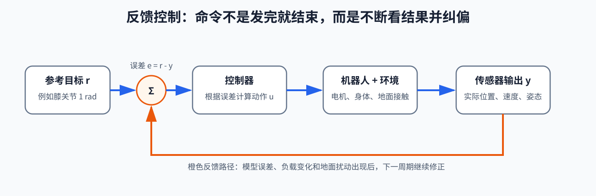

# 第 04 章：反馈控制基础——机器人怎样根据真实结果不断纠偏

> **所属部分**：第一部分 · 物理与闭环基础。
>
> **前置知识**：知道位置、速度、加速度和力矩分别是什么即可。忘记了也没关系，本章会在使用时重新解释。
>
> **核心问题**：机器人发出动作以后，怎样根据真实结果继续调整，而不是盲目相信命令已经实现？
>
> **下一步**：[第 05 章：状态估计](05-状态估计.md)会继续讨论“控制器拿到的测量是否真的代表机器人当前状态”。

这一章不从一串控制理论名词开始。我们只研究一个问题：

> 一个机械臂关节怎样可靠地停在目标角度？

这个问题足以带出反馈控制最重要的世界观。理解它以后，再看人形机器人的站立、行走和全身控制，只是身体自由度更多、目标更多、限制更多，基本闭环并没有改变。

建议分三遍阅读，不要要求自己一次吃完：

```text
第一遍：第 1～8 节
只理解闭环、P、D、前馈和 I 分别在做什么。

第二遍：第 9～13 节
理解稳定、延迟、噪声、饱和和级联为什么会破坏理想效果。

第三遍：第 14 节
需要继续学习后续数学方法时，再看状态空间。
```

第 15～17 节是调试手册，可以等真正做实验时回来查。第一遍读不完后半章，不代表前面的知识没有学会。

## 读完本章你应该真正理解

1. 命令、真实结果、测量和误差为什么不是同一个东西；
2. P 为什么像弹簧，D 为什么像减震器；
3. 为什么只有 P 时关节可能冲过目标并来回振荡；
4. 前馈和反馈为什么不是竞争关系；
5. I 为什么能处理长期偏差，又为什么会积累过头；
6. 延迟、频率、噪声和电机上限为什么会改变控制效果；
7. 状态空间公式到底是在压缩表达什么，而不是怎样背矩阵。

---

## 1. 先建立唯一的主角：一个真实关节

假设机械臂只有一个旋转关节：

```text
                  连杆
固定底座 ●────────────────●
          ↻ q              末端
```

我们约定：

- `q`：关节实际角度，单位是弧度 `rad`；
- `q_des`：desired，期望关节角，也就是我们希望到达的角度；
- `q_dot`：关节角速度，表示关节正在朝哪个方向转、转得多快，单位是 `rad/s`；
- `q_dot,des`：期望角速度；希望最终停住时通常取 `0`；
- `τ`：读作“tau”，电机输出的关节力矩，单位是牛顿米 `N·m`；
- `des`：desired 的缩写，表示“期望的”。

符号上方的点表示“对时间的变化速度”：

```text
q       现在的角度
q_dot   角度变化得多快，也就是角速度
q_ddot  角速度变化得多快，也就是角加速度
```

如果你不习惯这些符号，可以先在脑中替换：

```text
q       → 位置
q_dot   → 速度
q_ddot  → 加速度
τ       → 电机转动关节的作用强度
```

`N` 是牛顿，表示力的单位；`N·m` 是牛顿米，表示力矩。可以把力矩理解成“让关节发生转动的作用强度”：同样大的力，作用位置离转轴越远，通常越容易把关节转起来。

`rad` 是 radian（弧度）。它和角度制只是两种表示转角的方法：`180°=π rad`，其中 `π≈3.1416`。本章不要求熟练换算，只要确保目标、测量和增益采用同一套单位。`rad/s` 表示每秒转过多少弧度，`rad/s²` 表示角速度每秒改变多少。

### 1.1 目标和现实之间出现了差距

假设我们希望关节到达：

```text
q_des = 1.0 rad
```

编码器测到它现在只有：

```text
q = 0.8 rad
```

编码器是安装在关节上的传感器，用来测量关节角度，有些系统也会根据编码器变化估计关节速度。

为了先把反馈讲清楚，本章暂时把编码器读数直接记作 `q`。严格来说，“真实关节角”和“传感器测得的关节角”仍是两个对象，测量可能带噪声、偏差和延迟；这个区别会在下一章专门展开。

期望与实际之间的差叫作**误差**：

```text
e = q_des - q
```

代入数字：

```text
e = 1.0 - 0.8 = 0.2 rad
```

- `e`：error，误差；
- `e>0`：还需要向规定的正方向转；
- `e<0`：已经超过目标，需要向反方向转；
- `e=0`：位置正好等于目标，但不保证关节已经停止运动。

最后一句非常重要。关节可能正好经过目标位置，却仍然带着很高速度继续冲过去。因此：

```text
位置正确 ≠ 运动已经受控
```

---

## 2. 控制不是发命令，而是一个不断重复的闭环

最简单的想法是提前决定一条电机命令，然后直接执行：

```text
发出命令
→ 不再检查
→ 相信关节会到达目标
```

这叫**开环控制**（open-loop control）。开环不是绝对错误；如果环境固定、任务简单、系统重复性很好，它可以工作。但真实机器人会遇到：

- 连杆自身重力；
- 负载变化；
- 关节摩擦；
- 电池电压变化；
- 电机输出误差；
- 外界碰撞；
- 模型参数不准确。

同一条命令在不同条件下，不一定产生同一个结果。

因此机器人要让现实“回来发言”：

```text
设定目标
→ 测量实际结果
→ 计算误差
→ 根据误差产生新动作
→ 机器人在真实世界中运动
→ 再次测量
→ 继续纠正
```

这叫**闭环控制**（closed-loop control），也叫反馈控制。

用常见框图表示：

```text
参考值 r → [控制器] → 控制输入 u → [真实机器人] → 测量 y
             ↑                                  │
             └────────── 误差 r-y ──────────────┘
```

- `r`：reference，参考值，也就是目标；
- `y`：系统输出的测量值；
- `u`：控制器给出的控制输入；对力矩控制关节可以是 `τ`；
- `r-y`：目标与测量之间的误差。



### 2.1 “反馈”到底反馈了什么

反馈不是把电机命令重新送回来，而是把动作产生的**真实结果测量**送回控制器。

```text
命令：我让关节去 1.0 rad
结果：传感器说它现在在 0.8 rad
反馈：把 0.8 这个现实证据送回控制器
```

控制器不能因为自己发送了 `1.0 rad`，就假设关节真的已经到达 `1.0 rad`。

### 2.2 一次纠正不会结束控制

控制器第一次算出力矩以后，关节的位置和速度都会改变。下一时刻面对的已经是一个新问题：

```text
第 1 次：离目标较远，需要较大纠正
第 2 次：离目标近了一些，纠正应当变化
第 3 次：接近目标但速度很快，可能需要刹车
第 4 次：受到外力，又要重新纠正
```

所以控制器不是给出一个永远正确的答案，而是在每个控制周期重新回答：

> 根据现在测到的情况，这一瞬间应该怎样作用？

### 2.3 为什么误差写成“目标减实际”

我们采用：

```text
e = q_des-q
```

是为了让纠正作用倾向于缩小误差：

```text
实际角度低于目标
→ e>0
→ 给正方向力矩
→ q 增大
→ q 更接近 q_des
```

```text
实际角度高于目标
→ e<0
→ 给负方向力矩
→ q 减小
→ q 更接近 q_des
```

这种“结果回来以后，促使原来的偏差缩小”的连接叫作**负反馈**。这里的“负”不是说力矩数值永远为负，也不是说效果不好，而是反馈作用在抵消偏差。

如果传感器方向或电机方向接反，反馈可能变成：

```text
偏向右边
→ 控制器继续向右推
→ 偏得更多
→ 控制器推得更强
```

这叫正反馈式的放大。它解释了为什么真机调参前必须先确认符号方向：方向错了，增益越大，只会越快失控。

---

## 3. P 控制：离目标越远，拉得越用力

最朴素的控制规则是：

```text
误差大 → 纠正作用大
误差小 → 纠正作用小
没有误差 → 不纠正
```

写成公式：

```text
τ_P = K_p(q_des-q)
```

也可以写成：

```text
τ_P = K_p e
```

- `τ_P`：P 控制产生的关节力矩；
- `P`：Proportional，比例；
- `K_p`：比例增益，决定每单位位置误差产生多大力矩；
- `e`：位置误差。

“增益”可以先理解成**放大倍数**或**纠正强度**。

### 3.1 用数字算一次

假设：

```text
q_des = 1.0 rad
q = 0.8 rad
K_p = 100 N·m/rad
```

位置误差：

```text
e = 1.0-0.8 = 0.2 rad
```

P 力矩：

```text
τ_P = 100×0.2 = 20 N·m
```

单位也能互相检查：

```text
(N·m/rad) × rad = N·m
```

所以结果确实是力矩。

如果关节超过目标，到达 `1.1 rad`：

```text
e = 1.0-1.1 = -0.1 rad
```

```text
τ_P = 100×(-0.1) = -10 N·m
```

负号表示力矩方向反过来，要把关节拉回目标。

### 3.2 P 为什么像一根虚拟弹簧

想象目标位置和真实关节之间连接着一根看不见的弹簧：

```text
离目标越远 → 弹簧拉得越长 → 拉回作用越大
离目标越近 → 弹簧变形越小 → 拉回作用越小
到达目标   → 弹簧没有变形 → 拉回作用为零
```

`K_p` 就像弹簧刚度：

- `K_p` 小：虚拟弹簧柔软；
- `K_p` 大：虚拟弹簧很硬。

这个比喻不是说机器人内部真的安装了弹簧，而是电机根据位置误差产生了类似弹簧的作用。

### 3.3 为什么 K_p 太小会显得“软”

同样是 `0.2 rad` 的误差：

```text
K_p=20  → τ_P=4 N·m
K_p=100 → τ_P=20 N·m
```

如果关节受到重力或外力，`4 N·m` 可能根本不够抵抗，于是关节移动缓慢，甚至长期停在目标附近却到不了目标。

### 3.4 为什么 K_p 很大仍不一定控制得好

直觉容易认为：误差一出现就猛烈纠正，当然越快越准。

问题是关节有惯性。电机把关节拉向目标时，关节会逐渐获得速度。即使它已经到达目标位置，也不会自动瞬间停下：

```text
接近目标
→ 仍在快速运动
→ 经过目标时位置误差暂时为零
→ P 力矩也暂时为零
→ 但关节靠惯性继续前进
→ 冲过目标
```

冲过目标以后，误差变成负数，P 又向反方向猛拉。结果可能是：

```text
目标左边 → 猛拉向右
冲过目标 → 猛拉向左
再次冲过 → 再猛拉向右
```

这就是振荡。它很像一块只连接弹簧、没有减震器的物体，会在平衡点两边来回摆动。

因此：

> P 只看“离目标多远”，不知道关节正以多快的速度冲向目标。

这正是 D 项要补充的信息。

---

## 4. D 控制：根据运动趋势提前刹车

看下面两个瞬间：

```text
情况 A：q=0.9 rad，关节几乎静止
情况 B：q=0.9 rad，关节正以很高速度冲向 1.0 rad
```

两种情况的位置误差完全相同：

```text
e = 1.0-0.9 = 0.1 rad
```

如果只有 P，它们会得到相同的纠正力矩。但未来明显不同：

- 情况 A 还需要继续拉向目标；
- 情况 B 已经冲得很快，应该减少拉力，甚至反向刹车。

D 控制正是用速度判断这种运动趋势：

```text
τ_D = K_d(q_dot,des-q_dot)
```

- `τ_D`：D 项产生的力矩；
- `D`：Derivative，微分，关注误差变化速度；
- `K_d`：微分增益，也可理解为阻尼强度；
- `q_dot,des`：期望关节速度；
- `q_dot`：实际关节速度。

如果希望关节最终静止：

```text
q_dot,des = 0
```

于是：

```text
τ_D = -K_d q_dot
```

关节向正方向运动时，`q_dot>0`，D 给负方向力矩；关节向负方向运动时，`q_dot<0`，D 给正方向力矩。它总是倾向于抵抗相对目标的运动速度，所以像减震器或刹车。

### 4.1 用数字算一次

假设：

```text
q_dot,des = 0 rad/s
q_dot = 2 rad/s
K_d = 5 N·m·s/rad
```

那么：

```text
τ_D = 5×(0-2) = -10 N·m
```

这个负力矩在阻止关节继续高速向正方向运动。

### 4.2 D 为什么叫“微分”

位置误差是：

```text
e = q_des-q
```

误差变化速度是：

```text
e_dot = q_dot,des-q_dot
```

所以 D 项也可以写成：

```text
τ_D = K_d e_dot
```

“微分”在这里不用想得很神秘，它只是在问：

```text
误差正在变大还是变小？
变化得快还是慢？
```

位置误差告诉我们现在差多少，误差变化速度告诉我们照此趋势是否会冲过头。

### 4.3 P 和 D 合起来：虚拟弹簧加减震器

把两项相加：

```text
τ_PD
= K_p(q_des-q)
  + K_d(q_dot,des-q_dot)
```

可以读成：

```text
P：根据位置差距把关节拉向目标
D：根据运动速度抑制冲过头和来回摆动
```

它们分别像：

```text
P → 弹簧
D → 减震器
```

这就是 PD（Proportional-Derivative，比例—微分）控制。

### 4.4 D 也不是越大越好

`K_d` 太小，刹车不够，关节容易来回摆动。`K_d` 太大，关节会显得迟钝，运动被过度压制；传感器速度中的微小抖动也可能变成明显力矩抖动。

原因是“变化速度”对快速变化特别敏感。编码器位置即使只有一点点测量噪声，相邻时刻相减再除以很短时间，也可能得到跳动很大的速度估计。

所以真实系统中 D 项效果取决于：

- 速度测量是否可靠；
- 滤波是否引入太大延迟；
- 控制周期是否稳定；
- 电机是否真的能及时产生要求的力矩。

---

## 5. 把 PD 放进真实控制循环

PD 不是只计算一次。假设控制频率为 `1000 Hz`，表示每秒执行 1000 次，控制周期是：

```text
Δt = 1/1000 s = 0.001 s = 1 ms
```

- `Hz`：赫兹，表示每秒发生多少次；
- `Δt`：相邻两次控制计算之间经过的时间；
- `1 ms`：1 毫秒，也就是千分之一秒。

每个周期大致执行：

```go
for controlIsRunning {
    // 1. 从传感器读取关节实际位置和速度。
    q := encoder.Position()
    qDot := encoder.Velocity()

    // 2. 计算位置误差和速度误差。
    positionError := qDesired - q
    velocityError := qDotDesired - qDot

    // 3. 根据当前测量重新计算力矩。
    torqueCommand := kp*positionError + kd*velocityError

    // 4. 真电机能力有限，命令必须限制在安全范围内。
    torqueCommand = Clamp(torqueCommand, torqueMin, torqueMax)

    // 5. 把这一周期的命令交给驱动器。
    motor.SendTorque(torqueCommand)

    // 6. 等待下一周期；真实系统使用实时调度机制。
}
```

控制器每次只决定当前这个短周期的动作。真实机器人响应以后，新测量会进入下一轮。

### 5.1 命令力矩不一定等于实际力矩

上面的 `torqueCommand` 只是控制器请求的力矩。真实电机实际产生的力矩还会受到：

- 电流限制；
- 电池电压；
- 电机温度；
- 驱动器内部控制；
- 减速器摩擦和效率；
- 通信延迟；
- 标定误差。

因此必须区分：

```text
控制器算出的命令
≠ 驱动器实际执行的作用
≠ 机器人最终产生的运动
```

反馈存在的原因，正是这三个对象永远不会完全相同。

---

## 6. 为什么只有 PD，关节仍可能长期差一点

假设机械臂要水平托住一根连杆。重力一直把连杆向下拉，需要电机持续给出 `8 N·m` 的向上力矩才能保持目标位置。

先只看 P，并假设：

```text
K_p = 100 N·m/rad
```

当关节恰好到达目标时：

```text
q_des-q = 0
```

因此：

```text
τ_P = K_p×0 = 0
```

可是重力仍然存在。电机不给力以后，连杆会向下掉；掉出一点误差以后，P 才重新产生向上力矩。

它最终可能停在一个略低于目标的位置，使 P 力矩刚好等于重力力矩：

```text
K_p e = 8 N·m
```

因此：

```text
e = 8/100 = 0.08 rad
```

`0.08 rad` 大约是 `4.6°`。也就是说，关节需要长期保持约 `4.6°` 的位置误差，P 才能持续提供托住重力的力矩。

这种长期存在、最终不再明显变化的误差叫作**稳态误差**：

- 稳态：系统经过一段时间后进入相对稳定的状态；
- 稳态误差：在这种长期状态中仍然没有消失的误差。

解决它有两条常见路线：提前补偿已知作用，或者积累长期误差。

---

## 7. 前馈：根据已知物理提前用力

如果我们通过动力学估计出当前姿势需要约 `8 N·m` 才能抵抗重力，就可以在误差出现之前直接给出这部分力矩：

```text
τ_ff = 8 N·m
```

`ff` 是 feedforward，前馈。

再加上 PD：

```text
τ
= τ_ff
  + K_p(q_des-q)
  + K_d(q_dot,des-q_dot)
```

三部分的分工是：

```text
前馈：根据模型或策略，提前估计本来就需要的作用
P：根据真实位置误差继续纠正
D：根据真实运动趋势抑制冲过头
```

### 7.1 前馈不是反馈

前馈不必等真实误差出现。它根据我们已有的认识提前行动：

```text
我知道重力正在向下拉
→ 即使位置尚未掉下去，也提前向上托
```

反馈必须读取动作后的真实结果：

```text
我预计给 8 N·m 应该够
→ 传感器发现仍然偏低
→ 反馈继续增加纠正
```

### 7.2 为什么有了动力学前馈仍需要反馈

模型给出的 `8 N·m` 可能并不准确：

- 连杆质量有误差；
- 手里突然拿了东西；
- 关节存在没有建模的摩擦；
- 外界推了机械臂；
- 电机命令没有被完全执行。

因此：

> 前馈负责根据已知规律提前准备，反馈负责让真实世界纠正预测误差。

只有前馈，系统容易活在模型里；只有反馈，系统又必须等偏差出现后才开始处理本来可以预见的作用。

---

## 8. I 控制：长期总差一点，就逐渐增加补偿

如果重力或负载不知道，无法准确计算前馈，还可以让控制器观察：这个误差是不是长期一直存在？

假设每个控制周期都存在正误差：

```text
第 1 次：差 0.05 rad
第 2 次：仍差 0.05 rad
第 3 次：还是差 0.05 rad
……
```

一次微小误差可能只是传感器噪声；长期同方向误差则说明系统可能一直缺少一份持续作用。

积分项会把过去每个周期的误差累加：

```text
errorSum_next
= errorSum_now + e·Δt
```

然后产生：

```text
τ_I = K_i · errorSum
```

- `I`：Integral，积分；
- `errorSum`：误差随时间的累积；
- `K_i`：积分增益，决定长期误差累积后增加作用的速度；
- `Δt`：一个控制周期的时间。

连续时间中常写成：

```text
τ_I(t) = K_i ∫[0→t] e(s) ds
```

如果积分符号让你不舒服，先不用管它。它表达的就是前面的循环累加：把从开始到现在的误差一小份一小份加起来。积分里的 `s` 只是代表被累加的过去时刻，不是新的机器人变量。

### 8.1 P、I、D 各自在看什么

```text
P：现在离目标多远？
I：过去是否长期都偏向同一边？
D：按照当前运动趋势，会不会冲过头？
```

完整 PID（Proportional-Integral-Derivative，比例—积分—微分）可以写成：

```text
τ
= K_p e
  + K_i ∫e dt
  + K_d e_dot
```

但“公式里能加 I”不等于所有机器人关节都应该直接使用完整 PID。腿足机器人低层常见的是前馈加 PD；是否使用 I，要根据驱动器内部是否已有积分环节、接触任务和安全要求决定。

### 8.2 积分为什么可能积累过头

假设电机最多只能输出 `20 N·m`，机器人却被一个过重物体卡住。无论控制器怎样请求，关节都到不了目标：

```text
误差长期存在
→ 积分不断累加
→ 请求力矩越来越大
→ 但真实电机早已达到上限
```

后来物体突然被拿走，积累的积分不会自动瞬间消失。控制器可能继续给出巨大力矩，使关节猛烈冲过目标。

这叫作 **integral windup（积分饱和或积分累积过度）**。

常见的 anti-windup（抗积分饱和）思路包括：

- 输出已经饱和时暂停继续积累；
- 限制 `errorSum` 的范围；
- 输出与请求差距很大时，让积分项反向释放；
- 接触切换或任务切换时谨慎重置积分状态。

这里先记住：

> I 会记住过去，所以能弥补长期偏差；也因为它会记住过去，错误积累后不会立刻忘掉。

---

## 9. 稳定不是“这一帧误差很小”

控制器最关心的不是某一个瞬间看起来是否准确，而是误差经过许多轮闭环以后怎样发展。

受到一次小扰动后，可能出现：

```text
情况 A：误差一轮轮缩小
情况 B：误差来回摆动，但幅度逐渐缩小
情况 C：误差永远保持明显振荡
情况 D：误差越来越大，最终失控
```

前两种通常可以称为具有恢复趋势；后两种说明闭环表现存在问题。

### 9.1 一个不用高等数学的数字例子

假设某个简化系统每过一个周期，新误差等于旧误差的 `0.5` 倍：

```text
e_next = 0.5 e_now
```

从误差 `1` 开始：

```text
1 → 0.5 → 0.25 → 0.125 → 0.0625 → ……
```

误差越来越小。

如果：

```text
e_next = -0.8 e_now
```

则：

```text
1 → -0.8 → 0.64 → -0.512 → 0.4096 → ……
```

正负号反复变化，表示误差在目标两边来回摆动；但绝对值越来越小，所以振荡正在衰减。

如果：

```text
e_next = 1.1 e_now
```

则：

```text
1 → 1.1 → 1.21 → 1.331 → ……
```

误差越来越大，这就是发散趋势。

更一般地写：

```text
e_(k+1) = a e_k
```

- `k`：第几次控制更新；
- `a`：一轮闭环以后，旧误差会以多大比例进入新误差；
- `|a|<1`：误差绝对值逐渐缩小；
- `|a|>1`：误差绝对值逐渐放大。

`|a|` 表示绝对值，也就是暂时不看正负号，只看数值距离零有多远。例如 `|-0.8|=0.8`。

多关节系统会用矩阵和特征值推广这个判断。第一遍不需要计算特征值，只需理解它仍然在问：

> 各种误差经过一轮轮闭环后，是缩小还是放大？

### 9.2 稳定不等于静止

机器人可以一边行走，一边保持稳定。这里的稳定不代表每个关节都固定不动，而是：

> 受到合理扰动后，运动仍能回到可接受范围，或者至少仍存在可执行的恢复方案。

对单关节，恢复可能是回到目标角度；对人形，恢复可能是调整脚底受力、改变身体运动或迈出一步。

### 9.3 增益大不等于稳定性强

`K_p` 增大确实会让位置误差产生更强纠正，但真实系统还存在惯性、延迟、噪声、柔性和力矩上限。纠正过猛可能使机器人冲过目标；延迟又会让控制器继续根据旧误差向错误方向用力。

所以稳定不是“永远把增益调大”，而是让纠正强度、阻尼、响应速度和真实硬件能力彼此匹配。

---

## 10. 延迟：控制器看到的是已经过去的机器人

理想情况下，控制器读取“现在”的状态并立即施加动作。但真实系统需要时间：

- 传感器采样需要时间；
- 数据传输需要时间；
- 滤波和状态估计需要时间；
- 控制器计算需要时间；
- 命令传给驱动器需要时间；
- 电机建立电流和力矩也需要时间。

假设控制器收到测量时，关节在目标左边，于是向右用力。但在命令真正生效之前，关节可能已经靠惯性冲到目标右边。控制器此时仍根据旧信息继续向右推，反而加重误差。

```text
控制器看见的过去：关节还在左边
真实发生的现在：关节已经到了右边
迟到的命令：继续向右用力
```

这就是延迟为什么容易造成振荡。

### 10.1 控制频率与延迟不是同一个东西

控制频率高，表示更频繁地重新计算。例如：

```text
100 Hz  → 每 10 ms 计算一次
500 Hz  → 每 2 ms 计算一次
1000 Hz → 每 1 ms 计算一次
```

但频率高不保证信息新鲜。如果传感器和通信总延迟是 `20 ms`，即使控制器每 `1 ms` 计算一次，也可能只是反复使用过时数据。

因此要区分：

- **周期**：多久运行一次控制计算；
- **延迟**：真实事件发生到相应动作生效，一共晚了多久；
- **抖动**：每次周期或延迟是否忽长忽短；
- **带宽**：系统能够可靠跟随多快变化的能力。

第一遍可以把带宽理解成“有效反应速度”，它不只由代码循环频率决定，还受传感器、通信、驱动器和机械结构共同限制。

### 10.2 为什么高 K_p 遇到延迟尤其危险

高 `K_p` 会把一次已经过时的误差变成很大的纠正力矩。等控制器终于看到新的误差时，机器人可能已经被旧命令推向另一侧，于是又产生反方向的大动作。

这就是：

```text
强纠正
+ 旧信息
→ 强烈地纠正一个已经变化的问题
```

---

## 11. 噪声：传感器数字会轻微抖动

真实编码器即使静止，也可能出现很小的数字变化：

```text
1.0000
1.0002
0.9999
1.0001
……
```

这叫测量噪声。P 项会把位置噪声乘以 `K_p`；D 项根据速度或相邻位置变化工作，通常对这种快速抖动更加敏感。

可以用滤波让数字更平滑，但滤波需要观察一段时间才能判断趋势，因此往往又会引入延迟：

```text
滤波更强 → 测量更平滑，但反应可能更慢
滤波更弱 → 反应更快，但噪声更明显
```

这不是某个参数能彻底消灭的矛盾，而是工程取舍。

下一章会专门讨论：传感器提供的只是带噪声和延迟的证据，控制器怎样得到一个尽量可靠的当前状态判断。

---

## 12. 饱和：控制器想要，不等于电机做得到

真实电机有最大力矩：

```text
τ_min ≤ τ ≤ τ_max
```

例如：

```text
-20 N·m ≤ τ ≤ 20 N·m
```

如果 PD 算出：

```text
τ_command = 35 N·m
```

驱动器实际最多只能给：

```text
τ_actual ≈ 20 N·m
```

这种达到上下限、无法继续增加的现象叫作**饱和**（saturation）。

限幅常写成：

```text
τ_safe = clip(τ_command, τ_min, τ_max)
```

`clip` 表示把超过上限的数压回上限，把低于下限的数抬回下限。

### 12.1 限幅不是控制设计的最后补丁

如果目标本来就需要 `35 N·m`，简单裁成 `20 N·m` 并不会让任务突然可行。机器人会因为实际作用不足而继续出现误差，甚至摔倒。

因此需要区分：

```text
数值安全：命令没有超过允许范围
物理可行：允许范围内确实有办法完成任务
```

前者不能自动保证后者。

除力矩外，真实机器人通常还有：

- 关节位置限制；
- 关节速度限制；
- 电流限制；
- 电压限制；
- 功率限制；
- 电机温度限制。

增益调得再大，也不能让有限电机产生无限作用。

---

## 13. 级联控制：你发出的命令下面可能还有控制器

很多机器人接口不是直接把数字变成最终电机作用。驱动器内部可能已经包含多层闭环：

```text
外部位置目标
→ 位置控制器产生速度或力矩要求
→ 速度控制器继续修正
→ 电流控制器调节电机电流
→ 电机产生实际力矩
```

这叫**级联控制**：一个外层控制器的输出，成为下一层控制器的目标。

通常越靠近真实电机的内层运行越快，因为它要及时处理电流和电机自身的快速变化；外层任务可以相对慢一些。

### 13.1 为什么必须知道驱动器内部做了什么

假设驱动器已经根据位置误差运行了一套很强的 PD，而外部程序又把它误认为纯力矩接口，再重复施加强位置纠正，两个环路可能互相打架。

所以看到一个动作接口时，要问：

```text
这个数字代表期望位置、期望速度，还是期望力矩？
驱动器内部是否还有反馈控制？
内部增益是多少？
命令多久更新一次？
驱动器怎样限幅？
```

### 13.2 RL 策略下面也经常有 PD

RL 是 Reinforcement Learning，强化学习。策略通过在环境中反复尝试动作、获得奖励，逐渐学会从当前观测选择动作。

强化学习策略可能输出一个关节位置目标：

```text
RL 动作
→ q_des
→ PD 根据测得或估计的 q、q_dot 计算力矩
→ 电机
```

此时 RL 决定“关节希望去哪里”，PD 负责在高频闭环中根据真实误差执行。所谓学习控制并不自动意味着反馈、增益和电机环路消失；它可能只是改变了闭环中负责产生参考目标的那一层。

---

## 14. 状态空间到底是什么：把许多关系装进一个统一接口

> **第一遍可选读。**如果前面的 P、D、前馈、延迟和饱和已经需要消化，可以暂时跳过本节，不影响进入第 05 章。

控制器往往不能只知道位置，因为同一个位置可能对应不同未来：

```text
关节在 0.9 rad，几乎静止
关节在 0.9 rad，正以 2 rad/s 冲向目标
```

因此把“足以描述当前运动情况的一组信息”合成**状态**：

```text
x =
[
  q
  q_dot
]
```

这里：

- `x`：状态向量；
- 第一项是角度；
- 第二项是角速度；
- “向量”只是把一组有顺序的数放在一起共同处理。

这里的 `x` 是状态的通用名字，不是二维平面中的水平坐标。数学和机器人学会重复使用字母，必须根据当前定义判断含义。

### 14.1 从单关节动力学亲手得到状态变化

为了只看结构，暂时忽略重力和摩擦。单关节动力学是：

```text
I q_ddot = τ
```

这里的 `I` 是关节转动惯量，不是第 8 节 PID 中代表“积分作用”的字母 I，也不是矩阵里的单位矩阵。字母相同，物理含义由本节定义决定。

因此：

```text
q_ddot = τ/I
```

状态中第一项 `q` 的变化速度就是 `q_dot`：

```text
q 的变化率 = q_dot
```

状态中第二项 `q_dot` 的变化速度就是 `q_ddot`：

```text
q_dot 的变化率 = τ/I
```

把它们上下排在一起：

```text
x_dot
=
[
  q_dot
  τ/I
]
```

这已经是状态空间思想：根据当前状态和输入，统一描述状态怎样变化。

### 14.2 A 和 B 只是把上面的关系排成矩阵

把控制输入记成：

```text
u = τ
```

上面的两行可以写成：

```text
x_dot = Ax + Bu
```

其中：

```text
A =
[
  0  1
  0  0
]
```

```text
B =
[
  0
  1/I
]
```

不要急着做矩阵乘法，先按行读：

```text
第一行：q 的变化率等于 q_dot
第二行：q_dot 的变化率由 τ/I 决定
```

所以：

- `A`：没有新增输入时，当前状态各部分怎样影响状态变化；
- `B`：控制输入怎样影响状态变化；
- `x_dot`：状态正在怎样变化；
- `u`：控制输入。

`A、B` 不是新的物理实体，只是把已有的动力学关系排成一个方便计算的统一格式。

### 14.3 C 和 D 描述传感器看见什么

状态里有角度和角速度，但假设当前传感器只直接输出角度。为只看状态空间结构，这里暂时忽略测量噪声；第 05 章会把噪声和状态估计加回来：

```text
y = q
```

可以写成：

```text
y = Cx + Du
```

取：

```text
C = [1  0]
D = [0]
```

按人话解释：

- `C=[1,0]`：从状态中取出第一项角度，不直接取第二项速度；
- `D=0`：当前电机命令不会在完全没有物理过程的情况下瞬间直接变成编码器角度。

这里的矩阵 `D` 叫作直接传递项，与前面 PID 中代表微分的字母 D 不是同一个概念。它们只是碰巧使用了同一个字母。

因此：

```text
x_dot = Ax+Bu  描述系统内部状态怎样变化
y = Cx+Du      描述传感器或任务输出怎样由状态产生
```

真实机器人通常是非线性的，也就是不能用一组永远不变的固定比例描述所有姿势和速度。因此 `A、B` 可能只是在某个姿势附近的近似，或者随状态变化。但状态空间的世界观仍然只是：

```text
现在内部是什么状态
+ 当前施加什么输入
→ 状态怎样继续变化
→ 我们能测到什么输出
```

如果矩阵仍然不熟，可以先保留这句世界观，等后续具体方法真正需要它时再补计算。

---

## 15. 一套安全、可解释的 PD 调参顺序

调参前先确认机器人方向、单位和接口，否则任何增益都会把错误放大。

### 第一步：确认符号方向

手动给一个很小的正力矩，检查关节角 `q` 是否向规定的正方向增加。

如果希望向正方向纠正，却让关节向负方向运动，可能是：

- 电机力矩符号反了；
- 编码器方向反了；
- 目标和测量不在同一个角度定义中。

这种错误不能靠调增益解决。

### 第二步：确认单位

最常见的错误是把角度制和弧度制混用：

```text
90° = π/2 rad ≈ 1.5708 rad
```

如果控制器以为输入是 `1 rad`，实际程序却传入 `1°` 或反过来，误差和力矩都会严重错误。

### 第三步：从低 K_p 开始

先让虚拟弹簧较软，确认关节确实朝目标移动，并观察是否受到重力、摩擦和限幅影响。

### 第四步：逐渐增加 K_p

每次只增加一点，观察：

- 靠近目标是否更快；
- 是否开始冲过目标；
- 力矩是否触碰上限；
- 结构是否出现高频抖动。

### 第五步：加入并调整 K_d

从较小阻尼开始，逐渐增加，观察过冲和振荡是否减少。若动作变得迟钝或力矩噪声明显，可能是 `K_d` 太大或速度测量质量不足。

### 第六步：再考虑前馈或 I

先判断长期偏差来自哪里：

- 已知重力或已知负载，优先考虑合理前馈；
- 存在未知但长期稳定的偏差，才考虑谨慎加入 I；
- 电机已经饱和，增加 I 不能创造更多能力。

### 第七步：始终监控真实限制

至少记录：

- 期望位置和实际位置；
- 期望速度和实际速度；
- 命令力矩与实际可用力矩；
- 是否发生限幅；
- 控制周期和延迟；
- 电流、温度和异常振动。

真机调参应从安全姿势、小范围、低增益开始，并准备可靠的急停。能先在仿真或固定测试架上验证的，不要直接让完整人形自由站立承担第一次试验。

---

## 16. 出现问题时，沿因果链排查

### 现象一：一给控制就向错误方向猛跑

优先检查：

```text
关节方向
→ 编码器符号
→ 力矩符号
→ 目标单位
```

不要先继续增加 D。

### 现象二：能靠近目标，但来回摆动

可能原因：

- `K_p` 相对太高；
- `K_d` 不足；
- 延迟太大；
- 结构柔性产生额外振动；
- 电机输出饱和后形成非预期闭环。

### 现象三：长期停在目标旁边，始终差一点

可能原因：

- 重力或负载没有前馈补偿；
- `K_p` 太低，必须靠较大误差才能产生足够力矩；
- 摩擦造成死区；
- 电机实际力矩比命令小；
- 需要谨慎使用积分项。

### 现象四：仿真很好，真机高频抖动

可能原因：

- 真机编码器和速度测量有噪声；
- 仿真没有真实延迟；
- 真机结构并非理想刚体；
- 电机内部已经有一层高增益控制；
- 仿真执行器响应与真机不一致。

### 现象五：误差很大，但机器人就是不动

不要只看控制器公式，应检查：

- 力矩是否被限幅；
- 驱动器是否进入保护；
- 关节是否触碰机械限位；
- 是否有物体卡住；
- 电机模式是否正确；
- 命令是否真正送到硬件。

控制系统是一整条链，最后姿态不对并不自动说明 `K_p` 算错了。

---

## 17. 六个最容易混淆的问题

### 17.1 目标位置就是控制输入吗

不一定。

对位置接口，`q_des` 可以是你发给驱动器的命令；驱动器内部再把它变成电流或力矩。对直接力矩接口，真正控制输入是 `τ`，`q_des` 只是外部 PD 用来计算 `τ` 的参考值。

### 17.2 误差为零就代表控制成功吗

不一定。关节可能高速经过目标，位置误差瞬间为零，但速度并不为零。还要观察运动趋势和后续误差。

### 17.3 有反馈就一定稳定吗

不一定。符号反向会形成越错越推的正反馈；延迟、过高增益、饱和和噪声也可能让闭环振荡或发散。

### 17.4 D 是不是准确预测未来

不是。D 只是根据当前速度判断短期趋势，没有完整考虑惯性、接触和未来动作。它具有“提前刹车”的效果，但不等于完整动力学预测。

### 17.5 前馈准确以后能不能删除反馈

通常不能。前馈来自模型或策略，真实质量、摩擦、外力和执行器状态始终可能变化。反馈负责处理这些预测与现实的差距。

### 17.6 RL 是否意味着不再需要反馈

不是。策略若根据当前观测不断输出动作，本身就在闭环中工作；它的动作下面还可能有 PD、电流环和安全限幅。RL 改变了控制规律怎样获得，不会让真实反馈失去意义。

---

## 本章小结

- 反馈控制是“测量真实结果—计算误差—采取行动—再次测量”的持续循环，不是一次公式计算。
- P 根据当前位置误差产生类似弹簧的拉回作用；只有 P 时，关节可能因惯性冲过目标。
- D 根据速度误差产生类似减震器的作用，帮助抑制过冲和振荡，但会受到速度噪声和延迟影响。
- 前馈根据已知规律提前承担重力等可预测作用，反馈处理预测与现实的差距。
- I 累积长期误差，可以弥补持续偏差，也可能在执行器饱和时积累过头。
- 稳定描述误差经过多轮闭环后是缩小还是放大，不等于某一帧误差小，也不等于机器人必须静止。
- 控制频率、总延迟、测量噪声、执行器限制和内部级联环路共同决定真机效果。
- 状态空间只是把“当前状态和输入怎样决定状态变化、传感器看见什么”压缩成统一矩阵接口。

## 18. 小练习

### 练习 1：P 的方向

已知：

```text
q_des = 0.5 rad
q = 0.7 rad
K_p = 50 N·m/rad
```

P 力矩是多少？它为什么是这个方向？

### 练习 2：D 的方向

目标速度为零，关节正在以 `-1.5 rad/s` 转动，`K_d=4 N·m·s/rad`。D 力矩是多少？

### 练习 3：同一位置，不同趋势

两个关节都在 `q=0.9 rad`，目标都是 `1.0 rad`。一个静止，另一个正在以 `3 rad/s` 冲向目标。为什么不能只根据位置误差给它们完全相同的动作？

### 练习 4：稳态误差

关节需要持续 `6 N·m` 才能抵抗重力，只有 P 控制，`K_p=120 N·m/rad`。平衡时需要保留多大位置误差？

### 练习 5：频率和周期

`500 Hz` 控制循环每隔多少毫秒运行一次？

### 练习 6：判断问题属于哪里

控制器请求 `30 N·m`，电机上限为 `18 N·m`，关节始终到不了目标。继续增加 `K_p` 能否解决？为什么？

## 练习答案

### 答案 1

```text
e = 0.5-0.7 = -0.2 rad
```

```text
τ_P = 50×(-0.2) = -10 N·m
```

负号表示关节已经超过目标，需要向规定的负方向拉回。

### 答案 2

```text
τ_D = K_d(q_dot,des-q_dot)
    = 4×[0-(-1.5)]
    = 6 N·m
```

关节正在向负方向运动，所以 D 给正方向力矩进行制动。

### 答案 3

两者位置误差虽然相同，但未来趋势不同。静止关节还需要继续向目标加速；高速关节可能已经需要减少拉力或提前刹车。D 项正是用速度误差区分它们。

### 答案 4

平衡时 P 力矩等于重力力矩：

```text
K_p e = 6
```

因此：

```text
e = 6/120 = 0.05 rad
```

### 答案 5

```text
Δt = 1/500 s = 0.002 s = 2 ms
```

### 答案 6

不能。电机已经饱和，增加 `K_p` 只会让请求数字更大，不会让真实电机超过 `18 N·m`。必须降低任务需求、改变姿势或传动、减轻负载，或者使用能力更强的执行器。
