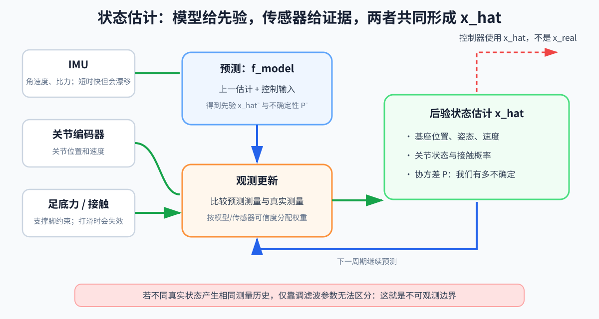

# 第 05 章：状态估计——传感器给的是证据，不是真相

> **所属部分**：第一部分 · 物理与闭环基础。状态估计同时服务于传统控制和学习控制。
>
> **前置知识**：[第 01 章](01-坐标系与姿态.md)、[第 04 章](04-反馈控制基础.md)。概率和期望只在进阶部分使用，看不懂时按需查[附录 A 第 6 节](附录A-数学急救包.md#6-概率估计和学习控制的共同语言)。
>
> **核心问题**：机器人怎样根据不完整、不准确的传感器读数，判断自己现在到底是什么状态？
>
> **下一步**：[第 06 章：最优化控制](06-最优化控制.md)。

---

## 怎么读这一章

这章分成三层，不要求第一遍全部掌握。

### 第一遍：只建立世界观

认真读第 1～8 节。读完后只要能解释下面这句话，就已经达标：

> 估计器拿着“上一时刻的判断”和“上一时刻已经发出的命令”，先用模型猜现在；等新的传感器读数来了，再修正这个猜测。

### 第二遍：理解为什么要表达“不确定”

读第 9～11 节。这里会出现方差、协方差和卡尔曼滤波，但重点仍然是“模型和测量应该各信多少”，不是背矩阵公式。

### 第三遍：按项目需要阅读

第 12～17 节讨论 IMU、足端里程计、EKF、接触估计、可观测边界和工程监控。等你真的要做腿式机器人估计器时再细读也不迟。第 18 节可用来反查自己是否还有常见误解。

---

## 1. 先从一个很朴素的问题开始：机器人怎样知道“现在”

第 04 章讲过反馈控制：

```text
设定目标
→ 测量现在
→ 计算偏差
→ 发出动作
→ 再次测量
```

这张图看起来很自然，却偷偷省略了一个难题：

> “测量现在”真的能直接得到机器人完整的现在吗？

通常不能。

假设一个人形机器人正在站立，控制器想知道：

- 身体在世界中的位置；
- 身体有没有前后倾斜；
- 身体正以多快的速度移动；
- 各关节的角度和速度；
- 左脚还是右脚正在可靠支撑；
- 脚有没有打滑。

机器人身上却没有一个叫作“完整状态传感器”的设备。它只有许多局部证人：

- 编码器说：“这个关节大约转到了这里。”
- 陀螺仪说：“身体此刻大约转得这么快。”
- 加速度计说：“我感受到这个方向的比力。”
- 足底力传感器说：“脚下大约有这么大的力。”
- 相机说：“画面里的物体大约移动了这些像素。”

每个证人只看见一部分，而且都可能有噪声、偏差、延迟或短暂失效。

把这些证据组合起来，对机器人当前状态作出一个尽量可靠的判断，这件事就叫 **状态估计**。

---

## 2. 先分清三个东西：真实状态、测量、估计

这是全章最重要的区分。

### 2.1 `x_real`：现实中真正存在的状态

`x_real` 表示真实状态。例如：

```text
x_real = [真实位置, 真实速度]
```

它存在于现实世界中，但控制程序通常不能完整、无误差地读取它。

这有点像一个人闭着眼睛坐在车里。车在道路上有一个真实位置，也有一个真实速度；但“真实位置和速度存在”不等于闭眼的人能直接知道它们。

### 2.2 `y`：传感器实际给出的读数

`y` 表示 measurement，也就是测量。

例如编码器显示 `30.2°`，IMU 报告一组角速度和加速度，这些数字都是 `y`。

测量不是现实本身，只是现实经过传感器以后留下的证据：

```text
y_k = h_real(x_real,k) + noise_k
```

先别怕这行公式，它只是在说：

```text
真实状态
→ 经过现实中的传感器测量过程
→ 再混入误差
→ 得到程序读到的数字
```

- 下标 `k`：第 `k` 个控制时刻；
- `h_real`：现实中的测量过程；
- `noise_k`：这一时刻的测量噪声；
- `y_k`：程序最后收到的传感器读数。

为什么需要 `h_real`？因为传感器通常不会把整个状态原样吐出来。

例如真实状态中有“位置和速度”，但一个位置传感器可能只测位置：

```text
x_real = [位置, 速度]
y      = [位置传感器读数]
```

从整个真实状态中取出传感器能看见的部分，这个现实过程就由 `h_real` 表示。

### 2.3 `x_hat`：估计器当前最相信的答案

`x_hat` 读作“x hat”，可以理解为“戴帽子的 x”。帽子提醒我们：

> 这不是上帝视角的真值，而是算法根据现有证据作出的判断。

例如：

```text
x_hat = [估计位置, 估计速度]
```

控制器实际使用的是 `x_hat`，不是它无法直接得到的 `x_real`。

所以真实闭环不是简单的“测量直接进入控制器”，而是：

```text
真实机器人 x_real
  → 传感器读数 y
  → 状态估计器
  → 当前状态判断 x_hat
  → 控制器
  → 控制命令 u
  → 真实机器人继续运动
```

---

## 3. `u` 到底是什么，为什么估计状态还要知道它

`u` 表示 **控制输入**。在机器人中，它可能是：

- 关节力矩命令；
- 电机电流命令；
- 期望关节位置；
- 期望速度；
- 推力或转向命令。

但只说“`u` 是控制输入”仍然不够。状态估计器真正关心的是：

> 从上一次判断到现在这段时间里，控制系统曾经命令机器人做什么？

因此，在离散时间公式中，预测第 `k` 时刻状态时使用的通常是：

```text
u_(k-1)
```

它表示在第 `k-1` 个时刻已经发出、会影响接下来运动的命令。

### 3.1 为什么不能只看上一次状态

假设两辆小车在上一时刻都满足：

```text
位置 = 0 m
速度 = 0 m/s
```

接下来：

- A 车没有踩油门；
- B 车收到向前加速命令。

过了 `0.1 s`，两辆车不应该还在同一个状态。

如果估计器只知道“它们刚才在哪里”，却不知道“刚才对它们做了什么”，就无法正确猜测它们现在在哪里。

这就是估计器需要 `u_(k-1)` 的根本原因。

### 3.2 `u` 是命令，不保证等于现实真正实现的输入

这里必须再区分一层：

```text
u_(k-1)       = 控制程序发出的命令
u_real,k-1    = 现实中真正作用到机器人上的输入
```

它们可能不同。例如：

- 电机已经饱和，命令 `20 N·m`，实际只能输出 `12 N·m`；
- 通信延迟使命令晚到了一周期；
- 电池电压下降，电机响应变慢；
- 齿轮摩擦、间隙或柔性吃掉了一部分效果；
- 机器人被外力推了一下，而控制程序并不知道。

估计器通常确切知道“程序发出了什么”，却不一定完全知道“现实最终实现了什么”。

所以 `u` 很有用，但不能被当作事实真相。模型预测以后仍然必须用传感器修正。

---

## 4. `f_model` 到底是什么，它怎样使用 `u`

`f_model` 是估计器内部的 **状态演化模型**。

它回答的问题是：

> 如果我上一时刻认为机器人处于 `x_hat_(k-1)`，而且那时发出了命令 `u_(k-1)`，经过一个控制周期 `Δt` 后，机器人现在大概会变成什么状态？

写成一行：

```text
x_hat^-_k
=
f_model(x_hat_(k-1), u_(k-1), Δt)
```

- `x_hat_(k-1)`：上一次修正后的状态判断；
- `u_(k-1)`：上一周期已经发出的控制命令；
- `Δt`：从上一时刻到现在经过的时间；
- `f_model`：估计器内部关于“状态会怎样变化”的规则；
- `x_hat^-_k`：看到本次新测量以前，对当前状态的预测；
- 上标 `-`：表示“还没有用第 `k` 次测量纠正”。它不是负数。

### 4.1 一个只有位置和速度的小例子

假设上一时刻估计为：

```text
估计位置 = 0 m
估计速度 = 1 m/s
```

控制命令要求产生大约 `2 m/s²` 的加速度，控制周期为 `0.1 s`。

一个很简单的内部模型可以说：

```text
新速度 ≈ 旧速度 + 加速度 × 时间
        ≈ 1 + 2 × 0.1
        ≈ 1.2 m/s

新位置 ≈ 旧位置 + 旧速度 × 时间
        ≈ 0 + 1 × 0.1
        ≈ 0.1 m
```

于是模型先预测：

```text
x_hat^-_k ≈ [0.1 m, 1.2 m/s]
```

这个预测不是宣告真相，只是在新测量到来前给出一个有根据的猜测。

### 4.2 为什么叫 `f_model`，而不是 `f_real`

现实世界也有自己的状态演化过程，可以想象成：

```text
x_real,k
=
f_real(x_real,k-1, u_real,k-1, 外部扰动, ...)
```

但 `f_real` 包含现实中的全部细节：真实摩擦、柔性、碰撞、电机延迟、外力和未建模现象。我们不可能完整拥有它。

估计器中能运行的只是简化版本 `f_model`。

因此：

```text
f_real  = 世界实际上怎样变化
f_model = 程序认为世界大概怎样变化
```

模型的价值不在于绝对正确，而在于比毫无依据地猜测更好。

---

## 5. 完整故事：现实走一条线，估计器走另一条线

现在可以把原先容易混在一起的箭头拆成两条。

### 5.1 现实世界真的发生了什么

```text
上一时刻真实状态 x_real,k-1
  + 现实真正实现的输入 u_real,k-1
  + 外界扰动
  ↓
现实按 f_real 演化
  ↓
当前真实状态 x_real,k
  ↓ 现实传感器 h_real + 噪声
当前测量 y_k
```

### 5.2 估计器内部怎样猜

```text
上一次状态估计 x_hat_(k-1)
  + 上一周期已知命令 u_(k-1)
  + 时间间隔 Δt
  ↓
内部模型 f_model
  ↓
当前先验预测 x_hat^-_k
  ↓
预测它应该产生什么测量 y_hat_k
  ↓
与真实收到的测量 y_k 比较
  ↓
修正为当前估计 x_hat_k
```

这两条线之间永远可能存在差距，因为：

```text
x_hat_(k-1) 可能已经有误差
u_(k-1) 不一定等于 u_real,k-1
f_model 不可能等于完整的 f_real
y_k 还带着测量误差
```

状态估计不是消灭这些差距，而是在有限信息下不断缩小和管理这些差距。



---

## 6. `h_model`：预测“如果我猜对了，传感器应该看到什么”

估计器已经通过 `f_model` 得到当前状态预测：

```text
x_hat^-_k
```

可是，状态预测和传感器读数往往不是同一种东西。

例如状态是：

```text
x = [位置, 速度]
```

传感器却只测位置。估计器需要把自己的完整状态预测，转换成“这个传感器理论上应该读到什么”：

```text
y_hat_k
=
h_model(x_hat^-_k)
```

- `h_model`：估计器内部的测量模型；
- `y_hat_k`：根据当前状态预测出来的传感器读数。

然后才能比较：

```text
测量残差
=
真实收到的测量 y_k
-
预测的测量 y_hat_k
```

如果位置传感器实际读到 `0.07 m`，模型却预测它应读到 `0.10 m`，残差就是：

```text
0.07 - 0.10 = -0.03 m
```

这个负号表示：传感器看到的位置比模型预测的更靠后。

注意 `h_real` 和 `h_model` 的区别：

```text
h_real  = 现实中的传感器实际上怎样形成读数
h_model = 估计器认为这个传感器大概怎样形成读数
```

它们和 `f_real`、`f_model` 的关系完全类似：一个属于真实世界，一个属于程序内部认识。

---

## 7. 状态估计的核心只有两步：先预测，再纠正

复杂的滤波算法有很多，但第一遍只需要抓住两步。

### 第一步：预测

```text
旧估计 + 已知命令 + 内部模型
→ 对现在的先验猜测
```

预测的好处：

- 传感器两次更新之间，状态仍可连续推进；
- 传感器没有直接测到的量，可以借助模型推断；
- 某个传感器短暂丢失时，不至于立刻失去全部状态；
- 控制命令已经告诉我们机器人“本来打算怎样动”。

预测的缺点：

- 模型不完整；
- 实际输入可能没有完全实现；
- 未知外力无法凭空预测；
- 误差会随时间积累。

### 第二步：纠正

```text
新测量 - 预测测量
→ 发现预测偏了多少
→ 修正状态判断
```

纠正的好处：

- 把预测重新拉回现实证据；
- 能发现模型没有预测到的变化；
- 能限制长期漂移。

纠正的缺点：

- 传感器本身有噪声、延迟和偏置；
- 传感器可能只看见部分状态；
- 脚滑时，“脚静止”这个观测前提会失效；
- 单次异常读数可能把估计带偏。

所以不能永远只信模型，也不能永远只信传感器。

---

## 8. 把状态估计放回完整控制闭环

现在全书可以使用更完整的关系：

```text
现实世界：
x_real,k-1
  → 在 u_real,k-1 和扰动作用下变化
  → x_real,k
  → y_k = h_real(x_real,k) + 测量误差

估计器内部：
x_hat_(k-1), u_(k-1), Δt
  → f_model
  → x_hat^-_k
  → h_model
  → y_hat_k
  → 与 y_k 比较并纠正
  → x_hat_k

控制：
x_hat_k
  → controller
  → u_k
  → 发给真实机器人，影响下一个时刻
```

这里的时间顺序非常重要：

1. 上一周期发出了 `u_(k-1)`；
2. 机器人在这段时间内运动；
3. 估计器用旧估计和 `u_(k-1)` 预测当前状态；
4. 当前测量 `y_k` 到来；
5. 估计器修正得到 `x_hat_k`；
6. 控制器根据 `x_hat_k` 算出下一条命令 `u_k`。

控制器不是先知道真相再行动，而是在一连串有误差的当前判断上行动。

这也解释了一个很深刻的工程事实：

> 控制器再聪明，如果喂给它的 `x_hat` 长期错误，它仍会坚定地做错事。

到这里，第一遍阅读的主线已经完成。下面开始讨论怎样表示“我有多确定”。

---

## 9. 为什么估计器不能只给答案，还要表达不确定性

比较两个判断：

```text
判断 A：我认为速度是 1.0 m/s，而且非常确定。
判断 B：我认为速度是 1.0 m/s，但可能相差 0.8 m/s。
```

它们的中心答案相同，含义却完全不同。

估计器不仅要输出 `x_hat`，还需要描述这个判断有多不可靠。

### 9.1 一维时先理解方差

如果只估计一个速度，可以暂时把不确定性理解成一个数：

- 数值小：估计器觉得误差通常较小；
- 数值大：估计器承认自己不太确定。

### 9.2 多维状态需要协方差 `P`

当状态同时包含位置、速度、姿态等多个量时，使用协方差矩阵 `P`：

```text
P
=
𝔼[(x_real-x_hat)(x_real-x_hat)ᵀ]
```

第一遍不必推导，只需知道：

- `x_real-x_hat`：真实值与估计值之间的误差；
- `𝔼[...]`：想象把许多次可能误差综合起来看平均规律；
- `P` 的对角线：每个状态分别有多不确定；
- `P` 的非对角线：两种误差是否会一起变大、一起变小。

例如位置估得偏大时，速度也常常估得偏大，那么它们的误差就有关联。

### 9.3 两种不确定性来源

状态估计中经常出现：

```text
Q：过程噪声协方差
R：测量噪声协方差
```

先用人话理解：

- `Q` 大：承认 `f_model` 对现实演化描述得不太准；
- `R` 大：承认传感器测量不太准。

注意：第 06 章的最优控制也可能用字母 `Q`、`R` 表示代价权重。字母相同不代表含义相同，必须看本节定义。

---

## 10. “模型和传感器各信多少”

回到前面的数字例子：

```text
模型预测位置：0.10 m
传感器测得位置：0.07 m
```

应该把结果改成多少？不能只看这两个数，还要问谁更可靠。

### 情况 A：传感器很准，模型很粗糙

结果应更靠近 `0.07 m`。

### 情况 B：传感器抖得厉害，模型短期很可靠

结果应更靠近 `0.10 m`。

### 情况 C：双方都不太可靠

估计器不但要给出折中答案，还应保留较大的不确定性，而不是假装自己已经知道真相。

卡尔曼滤波做的核心事情，就是根据预测和测量各自的不确定性，系统地计算这次修正应该有多大。

---

## 11. 卡尔曼滤波：先读故事，再读公式

KF 是 Kalman Filter，卡尔曼滤波。

它适用于一类线性模型。所谓线性，这里先粗略理解为：状态和输入通过矩阵相乘、相加来产生下一状态与测量。

### 11.1 状态怎样变化

```text
x_k
=
A x_(k-1)
+ B u_(k-1)
+ w_(k-1)
```

逐个解释：

- `x_(k-1)`：上一时刻状态；
- `u_(k-1)`：上一时刻已施加的已知控制输入；
- `A`：如果暂时不看本次新命令，旧状态怎样延续到现在；
- `B`：控制输入怎样影响各个状态；
- `w_(k-1)`：模型没有描述到的过程误差；
- `x_k`：当前状态。

`B` 不是装饰：同样一个电机命令，对位置、速度等状态的影响并不相同，`B` 就负责表达这种输入到状态的关系。

### 11.2 状态怎样变成测量

```text
y_k
=
H x_k
+ n_k
```

- `H`：从完整状态中取出或组合出传感器能看见的量；
- `n_k`：测量噪声；
- `y_k`：真实收到的测量。

这里全章始终用 `y_k` 表示测量，不再先用 `z_k` 表示测量、后又把 `y_k` 改成创新，以免同一个字母反复换身份。

### 11.3 预测状态与预测不确定性

```text
x_hat^-_k
=
A x_hat_(k-1)
+ B u_(k-1)
```

```text
P^-_k
=
A P_(k-1) Aᵀ
+ Q
```

第一行预测“现在大概在哪里”。

第二行预测“我对这个答案有多不确定”。其中：

- `P_(k-1)`：上一次修正后的不确定性；
- `A P Aᵀ`：旧的不确定性经过状态演化以后变成什么样；
- `Q`：本次预测额外加入的模型不确定性；
- `P^-_k`：本次测量到来前的预测不确定性。

### 11.4 比较预测测量与实际测量

```text
r_k
=
y_k - H x_hat^-_k
```

- `H x_hat^-_k`：根据预测状态算出的预测测量；
- `y_k`：实际传感器测量；
- `r_k`：innovation，也叫创新或观测残差。

`r` 可以理解成 residual（残差）的首字母。这样它不会和测量 `y` 混淆。

### 11.5 决定修正多少

```text
K_k
=
P^-_k Hᵀ
(H P^-_k Hᵀ + R)⁻¹
```

`K_k` 叫卡尔曼增益。暂时不要求手算，只读它表达的趋势：

- `R` 大，说明测量噪声大，这次少听传感器；
- `P^-_k` 大，说明预测很不确定，这次多接受传感器纠正。

最后更新：

```text
x_hat_k
=
x_hat^-_k
+ K_k r_k
```

也就是：

```text
修正后估计
=
模型预测
+ 修正比例 × 测量与预测的差
```

完整 KF 还会更新协方差：

```text
P_k
=
(I-K_kH)P^-_k
```

- `I`：单位矩阵，可以理解为矩阵世界里的数字 `1`；
- `P_k`：吸收本次测量以后剩余的不确定性。

工程实现中常使用数值性质更好的等价形式。初学阶段应先掌握因果关系，不要把精力耗在背这几行公式上。

---

## 12. 为什么 IMU 不能直接告诉机器人世界速度

IMU 是 Inertial Measurement Unit，惯性测量单元，通常包含陀螺仪和加速度计。

- 陀螺仪主要测角速度；
- 加速度计测的不是一个已经去除重力的世界坐标加速度，而是与机身方向相关的比力。

若想由加速度得到世界速度，至少要：

1. 知道 IMU 当前姿态；
2. 把测量转到正确坐标系；
3. 正确处理重力；
4. 对结果随时间积分。

任何很小的姿态误差或传感器偏置，积分以后都可能不断积累。

因此：

```text
IMU 很擅长感受短时间内的快速变化
但只靠它长期积分，位置和速度会漂移
```

这不是“滤波器还不够高级”这么简单，而是测量本身的误差会被积分放大。

---

## 13. 足端里程计：用“支撑脚暂时不动”帮助估计身体运动

人形机器人站立时，如果左脚可靠踩在地上而且没有打滑，可以暂时认为：

```text
左脚相对世界的速度 ≈ 0
```

身体、关节和脚通过机械结构连接。编码器知道关节怎样运动，运动学模型知道这些关节运动会怎样影响脚。于是：

> 既然支撑脚在世界里几乎不动，而关节正在这样变化，身体就应该以某种速度运动，才能让这两件事同时成立。

利用这种关系反推基座速度，叫 leg odometry，即腿式里程计或足端里程计。

更正式地写，支撑脚速度约束为：

```text
v_foot^W ≈ 0
```

- `v_foot^W`：脚在世界坐标系 `W` 中的速度。

计算中会用到第 02 章的接触雅可比，但第一遍只需要理解上面的因果关系。

这个证据也不是永远可靠：

- 脚可能已经打滑；
- 接触判断可能错误；
- 编码器速度有噪声；
- 落脚冲击时，“刚性、静止”只是近似；
- 某些腿部姿态会让反推对误差非常敏感。

所以足端里程计应被当作“满足条件时很有用的证据”，而不是真值按钮。

### IMU 与足端为什么互补

```text
IMU：短期响应快，但长期积分会漂
足端约束：可靠接触时能抑制漂移，但脚滑或腾空时会失效
```

估计器可以：

- 短期主要跟随 IMU 的快速变化；
- 支撑脚可靠时，用零速度约束校正漂移；
- 怀疑脚滑或进入摆动时，降低这条足端证据的权重，甚至暂时禁用。

这就是“多传感器融合”的真实含义：不是把数字简单平均，而是知道每条证据在什么条件下值得信。

---

## 14. 非线性系统与 EKF：只需先知道它在做什么

真实机器人通常不是严格线性的。状态演化和测量可以写成：

```text
x_k
=
f_model(x_(k-1), u_(k-1))
+ w_(k-1)
```

```text
y_k
=
h_model(x_k)
+ n_k
```

EKF 是 Extended Kalman Filter，扩展卡尔曼滤波。

它的核心想法是：

1. 原模型虽然弯曲、非线性；
2. 但在当前估计附近，只看很小的一块；
3. 用这一小块的线性近似完成类似 KF 的不确定性传播和测量更新；
4. 下一时刻再围绕新的估计重新近似。

近似时会用到雅可比：

```text
F_k = ∂f_model/∂x
H_k = ∂h_model/∂x
```

这里的雅可比仍然是第 02 章的同一个思想：

> 输入状态分别变化一点，模型输出会分别变化多少？

三维姿态不能在所有情况下都当普通三个数直接相加，因此姿态估计常使用 error-state EKF（误差状态扩展卡尔曼滤波）。这属于实现专题，第一遍知道它是在“小误差上做线性修正”即可。

---

## 15. 接触估计：机器人还要判断“这只脚能不能信”

足底传感器读到力，不一定就代表脚正在稳定支撑；脚在地上，也不一定没有滑。

接触估计可以综合：

- 足底法向力；
- 关节力矩反推出的接触力；
- 足端高度和速度；
- 步态规划器给出的预期接触阶段；
- 一段时间内证据是否连续一致。

不要只依赖一个瞬时硬阈值。例如：

```text
足底力 > 20 N → 接触
足底力 ≤ 20 N → 不接触
```

在 `20 N` 附近有噪声时，判断可能每个周期来回跳变。

接触估计错误尤其危险，因为它可能形成恶性循环：

```text
把打滑的脚误认为固定
→ 用错误的零速度证据修正身体速度
→ 控制器根据错误身体速度发力
→ 脚滑得更严重
→ 状态估计进一步错误
```

这说明估计器和控制器不是互不相关的两个盒子。估计错误会改变控制动作，而控制动作又会改变下一次估计面对的数据。

---

## 16. 状态估计有做不到的事：信息不能凭空产生

假设两个不同的真实状态，在现有传感器和一段历史中会产生几乎一样的测量，那么估计器就很难区分它们。

这叫作不可观或弱可观。

一个直觉例子：只看一张没有参照物的纯白墙照片，很难判断相机是在原地不动，还是沿着墙面平移了一小段。不是算法“不够努力”，而是画面里缺少能区分这两种情况的信息。

遇到这种问题，可能需要：

- 增加一种传感器；
- 让机器人主动做出能暴露差异的运动；
- 利用更长时间的历史；
- 引入可靠的环境特征或接触条件；
- 诚实地保留更大的不确定性。

不能只靠把滤波参数调得更激进，就凭空恢复不存在的信息。

---

## 17. 工程上怎样知道估计器正在说谎

估计器持续输出数字，不代表数字正确。至少应记录和监控：

- 测量 `y_k`；
- 预测测量 `y_hat_k`；
- 残差 `r_k=y_k-y_hat_k`；
- 状态估计 `x_hat_k`；
- 不确定性 `P_k`；
- 控制命令 `u_k`；
- 接触判断及其置信度；
- 各信号的时间戳。

常见检查包括：

### 静止检查

机器人明明静止时：

- 估计速度是否长期接近零；
- 姿态是否缓慢漂移；
- 足端是否被反复判为接触和离地。

### 残差检查

残差长期偏向同一方向，可能意味着：

- 传感器有偏置；
- 坐标轴或正负号写错；
- 时间没有对齐；
- 模型持续遗漏某种作用；
- 接触假设已经失效。

### 不确定性检查

如果估计明显错误，`P` 却越来越小，估计器就是在“越来越自信地犯错”。这通常比承认不确定更危险，因为控制器会把错误的 `x_hat` 当成非常可靠的依据。

### 外部对照

实验室中可以暂时使用动作捕捉等外部高精度系统离线对比。它不一定属于最终产品，但能帮助判断错误来自传感器、模型、时间同步还是滤波器实现。

---

## 18. 常见误解

### 误解一：编码器读数就是真实关节角

编码器读数也会受零位、安装误差、分辨率、传动弹性和时间延迟影响。它通常很好用，但仍然是测量。

### 误解二：传感器越多，估计一定越准

错误坐标、错误时间戳或失效观测会把估计拉得更偏。融合的关键是理解证据何时可信，而不是盲目增加数字。

### 误解三：模型足够准，就不需要测量

未建模扰动、执行器误差和初始状态误差会不断积累。没有现实证据，预测迟早会漂。

### 误解四：传感器足够准，就不需要模型

传感器可能只测部分状态、更新频率有限、短暂掉线，而且数值微分会放大噪声。模型提供了时间连续性和未直接测量状态之间的关系。

### 误解五：`u` 就是电机实际产生的力

`u` 通常是程序已知的控制命令。真实执行可能受饱和、延迟、摩擦和驱动器动态影响。正因为两者可能不同，预测以后才必须纠正。

### 误解六：滤波就是让曲线看起来更平滑

平滑只是可能出现的表面效果。状态估计真正做的是：利用时间模型、控制输入和多种测量，对无法直接读取的状态作出当前判断，并维护不确定性。

---

## 19. 本章小结

只带走下面五句话就够了：

1. `x_real` 是现实中的真实状态，但控制程序通常无法完整直接读取。
2. `y` 是传感器给出的证据；它经过现实测量过程 `h_real`，还带有噪声、偏差和延迟。
3. `u_(k-1)` 是上一周期已经发出的已知命令；估计器需要它，才能判断旧状态在这段时间内可能怎样变化。
4. `f_model` 用旧估计和旧命令预测现在；`h_model` 把状态预测变成预测测量，再与真实测量比较。
5. 控制器实际使用的是修正后的 `x_hat`，不是上帝视角的 `x_real`。

最核心的时间故事是：

```text
旧估计 x_hat_(k-1)
  + 旧命令 u_(k-1)
  → 用 f_model 预测现在 x_hat^-_k
  → 用 h_model 预测传感器应看到什么 y_hat_k
  → 与实际测量 y_k 比较
  → 修正成当前估计 x_hat_k
  → 控制器据此产生新命令 u_k
```

---

## 20. 练习

### 第一层：不用公式回答

1. 为什么控制器不能直接使用 `x_real`？
2. 为什么 `y` 不能直接等同于 `x_real`？
3. 估计第 `k` 时刻状态时，为什么要知道 `u_(k-1)`？
4. `f_real` 和 `f_model` 有什么区别？
5. 模型预测与传感器读数不一致，是否意味着模型一定错了？

### 第二层：沿时间顺序回答

假设上一时刻的估计是 `x_hat_(k-1)`，系统随后发出了 `u_(k-1)`，现在收到了 `y_k`。请不用专业术语，完整讲述估计器会做什么。

### 第三层：检查理解边界

1. 足端已经打滑，却仍被当成世界速度为零的支撑脚，会怎样污染基座速度估计？
2. `R` 变大表示传感器更可信还是更不可信？滤波器会更偏向模型还是测量？
3. 为什么 IMU 的短期变化很有用，但位置不能只靠它长期积分？
4. 为什么“估计器有稳定输出”不能证明估计正确？

### 第一层参考答案

1. 控制程序只能读取传感器和内部数据，无法获得现实的完整上帝视角状态。
2. 传感器只观察状态的一部分，并含噪声、偏差和延迟。
3. 相同旧状态在不同动作作用后会到达不同的新状态；旧命令提供了这段变化的重要原因。
4. `f_real` 是现实真正的演化过程，`f_model` 是估计器中可计算的近似。
5. 不一定；差异也可能来自传感器噪声、实际输入未完全执行、未知扰动或旧估计已经有误差。

第二层没有唯一措辞，只要讲清“预测测量—比较—纠正”的时间顺序，而且没有把 `u_(k-1)` 当作真实执行结果，就算掌握了主线。

### 第三层参考答案

1. 打滑脚被错误当成固定参照后，估计器会把脚的真实滑动误解释为身体运动，进而把基座速度拉偏。
2. `R` 变大表示测量更不可信，滤波器会更偏向模型预测。
3. 微小偏置、姿态误差和噪声经过积分会不断累积。
4. 稳定的数字也可能来自错误坐标、错误模型、错误接触假设或一个过度自信的滤波器，必须检查残差、时间戳和外部对照。
