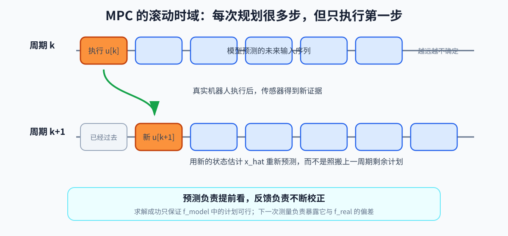

# 第 06 章：最优化控制——把“想要”和“不能”写进同一个问题

## 1. 为什么控制还需要“最优化”？

第 00 章说过：模型可以预测候选动作的后果。但是同一个目标通常有很多种做法。

例如机器人想从静止加速到 1 m/s：

```text
方案 A：猛地输出大力矩，很快达到速度
方案 B：缓慢增加力矩，动作平顺但响应慢
方案 C：迈大步，步数少但落地冲击大
方案 D：迈小步，稳定但可能跟不上命令
```

它们都可能让机器人向前走，却在速度、稳定、能耗和冲击上各有代价。与此同时，有些方案根本做不到：

- 电机力矩超过上限；
- 脚需要的摩擦力超过地面能提供的范围；
- 下一步超过腿能够到达的距离；
- 机器人没有遵守自己的动力学。

因此控制器面对的不是一道“算出唯一正确答案”的题，而是：

> 在所有物理上做得到的方案里，寻找一个最符合当前偏好的方案。

这就是最优化控制。

### 1.1 “最优”不等于绝对完美

“最优”只对我们写下来的评价规则成立。若只奖励速度，控制器可能动作很猛；加入能耗和冲击惩罚后，它可能走得平缓。

所以看到“最优控制”，应立即问：

1. 它允许改变什么？
2. 它想让什么指标变小或变大？
3. 它绝对不能违反什么？

这三问分别对应：

- **决策变量**：控制器可以选择的数，例如未来每一步的关节力矩；
- **目标函数**：用一个分数评价方案，例如跟踪误差和能耗；
- **约束**：候选方案必须遵守的规则。

## 2. 为什么要一次考虑未来多步？

只看当前一步，控制器可能做出“眼前最好、下一刻很糟”的决定。

开车接近红灯时，如果只追求当前速度，就会继续加速；看到未来几秒，才知道现在应该提前减速。人形机器人也一样：当前把身体推得更快也许能减小瞬时速度误差，却可能让下一步来不及接住身体。

因此最优控制经常同时选择一串未来动作：

```text
当前状态 x[0]
→ 动作 u[0] → 预测状态 x[1]
→ 动作 u[1] → 预测状态 x[2]
→ 动作 u[2] → 预测状态 x[3]
→ ...
```

这串状态和动作叫一条**轨迹**。控制器不是只评价一个动作，而是评价这串动作造成的整体后果。

## 3. 现在再看 OCP 的统一形式

OCP 是 Optimal Control Problem，最优控制问题。离散有限时域形式：

```text
在 x[0:N] 和 u[0:N-1] 中寻找：

让
    Σ[k=0→N-1] stage_cost(x[k], u[k])
    + terminal_cost(x[N])
最小
```

满足：

```text
x[0] = x_hat_now
```

```text
x[k+1] = f(x[k], u[k])
```

```text
g(x[k], u[k]) = 0
```

```text
h(x[k], u[k]) ≤ 0
```

符号解释：

- `N`：预测时域包含的离散步数；
- `x_hat_now`：估计器给出的当前状态估计，`hat` 表示估计值；
- `x[0:N]`：从第 0 步到第 `N` 步的所有状态；
- `u[0:N-1]`：从第 0 步到第 `N-1` 步的所有输入；
- `stage_cost`：每一步的阶段代价，例如速度误差和本步能耗；
- `terminal_cost`：最后一步的终端代价，例如窗口结束时是否接近目标；
- `f`：动力学；
- `g`：其他等式约束；
- `h`：不等式约束。

OCP 的本质是：在时间维度上选择一串动作，而不是只选择当前一个动作。

这里的 `f` 实际上是控制器内部的动力学模型 `f_model`，由它产生的 `x[1:N]` 是预测状态，不是真实机器人未来状态。因此“最优”始终是相对于当前状态估计、模型、目标函数、约束和预测时域而言的最优，不是现实世界中的绝对保证。

如果这一形式仍显得抽象，可以逐行翻译：

```text
模型 f：每个动作会把系统带到哪里
目标函数：整条轨迹的表现有多差
等式约束 g=0：必须精确成立的关系
不等式约束 h≤0：不能越过的上下限
求解器：寻找满足规则且总分最低的动作序列
```

## 4. 一个软件资源分配类比

把未来 10 分钟每分钟的副本数作为 `u_k`，请求积压作为 `x_k`：

- 动力学：当前积压 + 新请求 - 处理量 = 下一分钟积压；
- 目标：积压小、机器成本低、扩缩容不要剧烈；
- 约束：副本数有上下限，单分钟扩容速度有限。

机器人只是把“积压”换成物理状态，把“副本数”换成力矩或接触力。

## 5. QP：二次目标 + 线性约束

QP 是 Quadratic Programming，二次规划：

```text
在 z 中寻找：
    让 1/2 · zᵀ · H · z + gᵀ · z 最小
```

满足：

```text
Az=b,
Cz≤d
```

- `z`：决策变量；
- `H`：二次项矩阵；
- `g`：一次项向量，此处与重力符号同名但语境不同；
- `A,b`：线性等式约束；
- `C,d`：线性不等式约束。

当 `H` 半正定时，问题是凸的：局部最优也是全局最优，求解可靠而快速。WBC（Whole-Body Control，全身控制）常构造成 QP。

## 6. LQR：线性系统的最优反馈

LQR 是 Linear Quadratic Regulator，线性二次调节器。模型：

```text
x_(k+1)
=
Ax_k+Bu_k
```

代价：

```text
J=
Σ_(k=0)^(∞)
(x_kᵀQx_k
+u_kᵀRu_k)
```

- `Q`：状态偏差权重；
- `R`：控制输入权重；
- 上限 `∞`：无限时域理想形式。

最优控制律是：

```text
u_k=-Kx_k
```

`K` 是由模型和权重求出的反馈增益。LQR 可以理解为多变量、考虑耦合和控制成本的“系统化 PD（Proportional-Derivative，比例—微分控制）”。

## 7. MPC：每次只执行第一步

MPC 是 Model Predictive Control，模型预测控制。循环：

1. 读取当前状态估计；
2. 预测未来 `N` 步；
3. 求出最优输入序列；
4. 只执行第一个输入；
5. 下一控制周期重新测量并求解。

这叫 receding horizon（滚动时域）。

为什么只执行第一步？未来预测基于当前模型和状态，越远越不准。每一步重新规划，能利用新观测纠偏。



例子：窗口 `N=20`，时间步长 `Δt=0.02` s，则预测长度：

```text
T=NΔt=20×0.02=0.4 s
```

窗口太短看不到即将发生的失衡；太长则计算更慢，远端预测也不可信。

## 8. 线性 MPC 与 NMPC

- 线性 MPC：动力学和约束线性，常得到 QP；
- NMPC：Nonlinear MPC，非线性模型预测控制，保留 `f(x,u)` 的非线性；
- NMPC 表达能力更强，但需迭代线性化或非线性求解，实时性更难。

`Convex MPC` 通常是通过模型假设和线性化，把问题变成凸 QP 的 MPC。

## 9. 两条主要求解路线

### 动态规划路线

```text
OCP → Dynamic Programming（动态规划）
    → DDP → iLQR → 一系列 LQR 子问题
```

- DDP：Differential Dynamic Programming，微分动态规划；
- iLQR：iterative LQR，迭代线性二次调节。

它们利用时间递推结构，不把所有变量完全当作无结构的大向量。

### 数学规划路线

```text
OCP → NLP → SQP → 一系列 QP 子问题
```

- NLP：Nonlinear Programming，非线性规划；
- SQP：Sequential Quadratic Programming，序列二次规划。

NLP 会把轨迹上的状态、输入拼成大决策变量。direct shooting（直接打靶）和 collocation（配点法）是常见离散方式。

## 10. 权重不是“拍脑袋数字”

速度误差、姿态误差、力矩消耗的单位不同，原始数值尺度也不同。常用归一化：

```text
e_tilde=(e)/(e_scale)
```

- `e`：原始误差；
- `e_scale`：可接受误差尺度；
- `e_tilde`：无量纲归一化误差。

若可接受速度误差 0.2 m/s，实际误差 0.1 m/s，则 `e_tilde=0.5`。先按物理容差归一化，再调任务优先级，比直接尝试 `10³`、`10^(-4)` 更可解释。

## 11. 硬约束、软约束和松弛变量

硬约束必须满足；若约束冲突，问题 infeasible（不可行）。软约束引入松弛变量：

```text
h(z)≤ s,  s≥0
```

并在代价中强烈惩罚 `s`：

```text
J_new=J+ρ s²
```

- `s`：slack variable，松弛变量；
- `ρ`：大权重。

这相当于允许系统在迫不得已时“付出高代价违约”，避免求解器完全无解。安全相关约束是否可软化必须谨慎判断。

## 12. 实时优化的工程问题

- warm start：用上一次解平移后作为本次初值；
- sparsity：利用稀疏矩阵结构；
- conditioning：变量尺度差异会造成病态问题；
- iteration limit：给迭代次数设硬上限；
- fallback：求解失败时使用上次安全输入或降级控制器；
- watchdog：监控求解时间和可行性。

优化器返回 `success` 并不保证控制正确。模型、约束、参考轨迹和单位都可能错。

`success` 只表示求解器成功处理了它收到的数学问题。若摩擦系数、执行延迟或 `x_hat_now` 与现实不符，真机仍可能失败。MPC（Model Predictive Control，模型预测控制）之所以每周期重算，正是为了让新测量不断暴露这种预测偏差并形成反馈，而不是一次算完就盲目执行整条轨迹。

## 13. 一个极简速度控制 OCP

一维速度模型：

```text
v_(k+1)=v_k+(u_k)/(m)Δt
```

- `v_k`：当前速度；
- `u_k`：水平合力；
- `m`：质量；
- `Δt`：时间步长。

代价：

```text
J=Σ_(k=0)^(N-1)
[q(v_k-v_ref)²+ru_k²]
```

- `v_ref`：期望速度；
- `q`：速度误差权重；
- `r`：用力成本权重。

约束：

```text
-u_max≤ u_k≤ u_max
```

增大 `q` 会更积极追速度；增大 `r` 会更节制用力。这就是后面复杂 MPC 的最小原型。

## 14. 小练习

1. `N=30`、`Δt=0.01` s，MPC 看多远？
2. 为什么 MPC 不是某一种特定求解器？
3. QP 的目标和约束分别有什么结构要求？
4. 如果两个硬约束互相冲突，求解器会发生什么？

答案：1）0.3 s；2）MPC 是滚动有限时域的问题构造方式，可以用不同方法求解；3）二次目标、线性等式/不等式约束；4）问题不可行，需要修改约束、参考或合理引入松弛。
