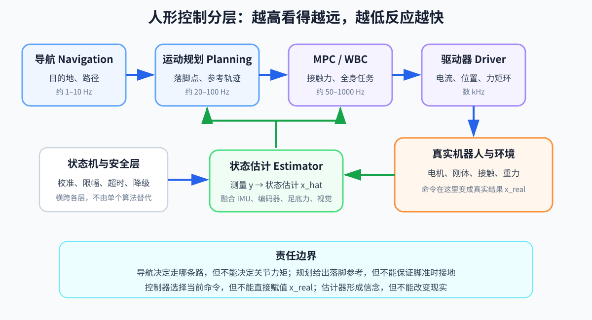

# 第 07 章：人形控制系统架构——从“去厨房”到关节力矩

> **所属部分**：第一部分 · 物理与闭环基础的综合章。
>
> **前置知识**：[第 01 章](01-坐标系与姿态.md)到[第 06 章](06-最优化控制.md)。
>
> **核心问题**：导航、规划、控制、估计、安全和日志怎样按时间尺度协作？
>
> **下一步**：选择[传统模型控制路线](08-LIP与ZMP.md)或[学习控制路线](13-强化学习基础.md)。

## 1. 经典分层

“去厨房”不能直接发给电机。它至少要经历几次翻译：

```text
去厨房
→ 绕过桌子，沿走廊前进
→ 下一步右脚落在哪里、身体怎样移动
→ 此刻每个关节输出多大力矩
```

每一层处理不同时间尺度和不同信息。分层不是为了把系统画复杂，而是避免让一个模块同时解决地图理解、未来落脚和毫秒级电机控制。上一章讲的优化器通常处在 Planning、MPC（Model Predictive Control，模型预测控制）或 Controller 中；MPC 会预测未来一段运动并不断重算，但它不是整套机器人系统本身。

一种常见的传统腿足系统框架是：

```text
Navigation → Planning → Controller → Robot
                   ↑         ↑
                 Estimator ← Sensors
```



这张简图省略了真实闭环的回边。完整的数据流是：人的目标生成任务和参考；传感器测到真实机器人的部分结果；估计器形成状态估计 `x_hat`；规划器和控制器依据参考与 `x_hat` 生成命令；电机作用于真实机器人和环境；新的物理结果再被传感器测到。

### Navigation：导航

决定从哪里走到哪里，输出全局或局部路径和可通行区域。它关心障碍物和目的地，一般不直接求每个关节力矩。

### Planning：运动规划

把路径变成机器人可跟踪的运动参考，例如：

- 哪只脚何时落地；
- 落脚点在哪里；
- 质心、躯干、手脚的参考轨迹；
- 接触序列。

TO 是 Trajectory Optimization，轨迹优化，常出现在该层。

### Controller：控制器

结合当前状态、参考轨迹、动力学和约束，输出关节位置、速度或力矩，使动作动力学可行。

### Estimator：状态估计器

融合 IMU（Inertial Measurement Unit，惯性测量单元）、编码器、足底力、视觉等信息，估计不能直接可靠测量的基座姿态、速度、位置和接触状态。

各层的责任边界可以这样理解：

| 模块 | 能决定什么 | 不能保证什么 |
|---|---|---|
| Navigation（导航） | 走哪条路径 | 具体关节力矩 |
| Planning（运动规划） | 落脚点、接触时序和参考轨迹 | 脚一定按计划时刻接地 |
| Controller（控制器） | 当前应下发什么关节命令 | 真实状态必然等于期望状态 |
| Estimator（状态估计器） | 根据测量形成 `x_hat` | 直接改变真实状态 `x_real` |
| Driver（驱动器） | 尝试执行电流、位置或力矩命令 | 绕过电压、温度和力矩极限 |

越高层通常看得更远、表示更粗；越低层更新更快、直接面对硬件，但能考虑的未来更短。某一层输出“可行”，只表示它在自己的信息和约束范围内可行。

## 2. 一组典型的数据结构

```go
type EstimatedState struct {
	BasePosition        Vec3       // 浮动基在世界坐标系中的位置
	BaseOrientation     Quaternion // 浮动基姿态
	BaseLinearVelocity  Vec3       // 浮动基线速度
	BaseAngularVelocity Vec3       // 浮动基角速度
	JointPosition       Vector     // 所有关节位置
	JointVelocity       Vector     // 所有关节速度
	Contacts            []bool     // 每个候选接触点是否接触
}

type MotionReference struct {
	BaseTrajectory  Trajectory      // 身体参考轨迹
	FootTrajectories []Trajectory   // 各只脚的参考轨迹
	ContactSchedule ContactSchedule // 未来接触时序
}

type JointCommand struct {
	Torque   Vector  // 关节力矩命令
	Position *Vector // 可选的关节位置命令；nil 表示不下发
	Velocity *Vector // 可选的关节速度命令；nil 表示不下发
}
```

关键不是具体类名，而是明确区分：

- 测量值（measurement）；
- 估计值（estimate）；
- 参考值（reference/desired）；
- 命令值（command）；
- 真值（ground truth，仅仿真可直接获得）。

混用这些命名会让日志和训练代码很难排错。

## 3. 多频率系统

典型示意：

| 模块 | 频率示例 | 输出 |
|---|---:|---|
| 全局导航 | 1–10 Hz | 路径 |
| 步态/轨迹规划 | 20–100 Hz | 落脚点与轨迹 |
| MPC | 30–200 Hz | 接触力/状态轨迹 |
| WBC（Whole-Body Control，全身控制） | 500–1000 Hz | 协调全身任务并输出关节力矩 |
| 电机电流环 | 5–20 kHz | 相电流 |

频率只是数量级示例，不是标准答案。实际取决于硬件、通信、求解器和任务。

跨频率模块要处理：

- 时间戳；
- 插值与保持；
- 数据过期；
- 线程安全；
- 实时线程内禁止动态内存分配；
- 时钟同步；
- 超时降级。

## 4. 控制状态机

人形系统不是永远运行一个控制律。常见状态：

```text
BOOT
→ CALIBRATE
→ STAND_UP
→ STAND
→ WALK
→ STOP
→ DAMPING / EMERGENCY
```

状态切换要有 guard condition（守卫条件）：

- 姿态是否在安全范围；
- 关节是否校准；
- 估计器是否收敛；
- 接触是否可信；
- 命令是否超时。

接触相位本身也可看成状态机：

```text
双支撑 → 左支撑/右摆动 → 双支撑 → 右支撑/左摆动
```

## 5. 端到端意味着什么

“端到端”不是一个绝对概念。可能是：

- 观测 → 关节目标：合并规划和控制；
- 相机图像 → 关节目标：连感知也合并；
- 语言命令 → 全身动作：合并更多上层。

即使神经网络端到端，系统仍需要：

- 传感器驱动和时间同步；
- 安全限幅；
- 电机内环；
- 故障监控；
- 状态机；
- 日志与回放。

算法边界减少不等于工程模块消失。

## 6. 三种未来架构思路

### 全身遥操作 → 数据 → VLA

VLA 是 Vision-Language-Action，视觉-语言-动作模型。先用可靠控制器支持人遥操作机器人采集数据，再训练策略。瓶颈是可靠遥操作和真机数据采集成本。

### 上下肢分离

下肢策略保证行走稳定，上肢按机械臂方式完成操作。工程简单，但上下肢动力学实际上耦合；弯腰搬重物时，上肢动作会改变质心和角动量。

### Navigation + Planning + 通用 Controller

导航处理空间路径；上层模型生成人类或机器人动作参考；重映射把人体轨迹转换成机器人参考；通用控制器负责动力学可行与抗扰。这种解耦让不同数据源和算法各自发挥优势。

## 7. 安全层

无论控制器来自 MPC 还是神经网络，命令下发前都应经过：

```text
NaN/Inf 检查
→ 位置/速度/力矩限幅
→ 变化率限制
→ 碰撞和姿态安全检查
→ 通信健康检查
→ 下发
```

安全层不能保证所有动态安全，但能阻止大量软件故障直接变成硬件事故。

### 常见降级策略

- 新命令超时：缓慢归零或保持安全站立；
- 估计失效：切换阻尼模式；
- 求解器失败：短时使用上一可行解，连续失败则停机；
- 姿态超过阈值：停止主动站立，进入低刚度保护；
- 通信丢包：驱动器本地 watchdog 触发。

## 8. 可观测性与日志

至少记录：

- 原始传感器和时间戳；
- 估计状态及协方差；
- 参考轨迹；
- 控制器各任务误差；
- 优化器状态、迭代次数、约束余量；
- 策略观测、动作、裁剪前后值；
- 电机反馈、温度、电压；
- 状态机和接触切换事件。

日志必须能对齐到同一时间轴。没有同步日志，调试“为什么第 12.37 秒摔倒”几乎只能猜。

## 9. 用三个环理解整套系统

### 物理环

电机 → 刚体与接触 → 传感器。

### 估计环

传感器 → 状态估计 → 控制所需状态。

### 优化/策略环

状态与目标 → 计算动作 → 电机。

任何一环的延迟、坐标系、单位或噪声错误都会传播到另外两环。

## 本章小结

- 高层目标必须经过导航、规划、控制和驱动接口逐层翻译，状态估计和真实反馈贯穿所有层。
- 不同模块运行频率不同，状态机、安全层、时间戳和日志是算法能够形成可靠系统的必要部分。
- 传统控制和学习控制都只是完整架构中的决策模块，不能代替传感器、执行器、安全和故障恢复。

## 10. 小练习

1. “走到门边”和“右脚下一步落在 `(0.2,-0.1)` m”分别更接近哪一层？
2. 为什么 50 Hz 的 MPC 可以和 1 kHz 的 WBC 一起工作？
3. 神经网络端到端策略为什么仍需要状态机和安全层？
4. 若控制日志没有时间戳，最难判断哪些问题？

参考答案：1）Navigation 与 Planning；2）MPC 低频更新未来参考，WBC 高频跟踪并纠偏；3）网络不负责启动校准、通信故障和硬件极限的完整处理；4）无法可靠判断观测、估计、动作与物理响应之间的因果和延迟。
