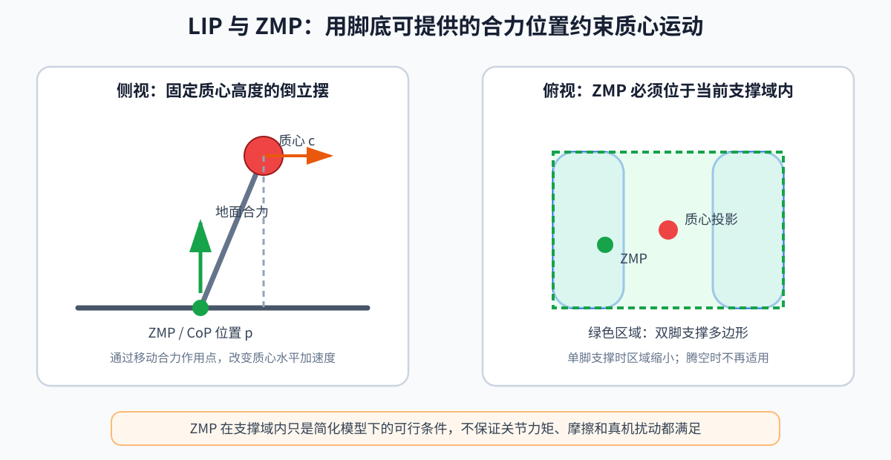

# 第 08 章：LIP 与 ZMP——把行走简化成“控制一个倒立摆”

> **所属部分**：第二部分 · 传统模型控制。
>
> **前置知识**：[第 03 章](03-动力学与接触.md)、[第 04 章](04-反馈控制基础.md)、[第 06 章](06-最优化控制.md)。
>
> **核心问题**：怎样把几十自由度的人形平衡，简化成可快速预测的质心与支撑点问题？
>
> **下一步**：[第 09 章：SLIP 与 VMC](09-SLIP与VMC.md)提供另一种弹簧腿直觉；二者随后在 WBC 中落地。

LIP 是 Linear Inverted Pendulum，线性倒立摆，用固定高度的倒立摆近似机器人；ZMP 是 Zero Moment Point，零力矩点，用来描述脚底合力作用位置是否仍在可支撑范围内。这套方法是理解双足平衡最好的第一模型。



第 03 章已经给出了浮动基全身动力学，为什么这里不直接把几十个自由度全部放进预测？因为刚入门时，我们先想回答一个更小的问题：

> 身体正在向前移动时，脚底的受力中心应该放在哪里，才能让它不倒？

LIP 暂时忽略手臂和每个关节，把几十自由度的问题压缩成“一个质点和一个支撑点”。它不能生成完整关节动作，但能让平衡、支撑区域和未来落脚第一次变成可计算的问题。后面的 WBC（Whole-Body Control，全身控制）才负责把这些高层结果落实到全身关节。

## 1. 静态稳定

机器人静止时，若 COM（Center of Mass，质心）竖直投影落在支撑多边形内，通常可以静态平衡。

支撑多边形是所有有效接触区域的凸包：

- 双脚平放时，约是包围两脚的多边形；
- 单脚支撑时，只剩一只脚底；
- 点足模型中，支撑区域退化成点，几乎没有静态稳定裕度。

但机器人加速时，质心投影在脚内也不一定稳定，所以需要动态指标。

## 2. LIP 的假设

LIP 把全身质量集中到质心，并假设：

1. 质心高度 `z_c` 恒定；
2. 腿没有质量；
3. 地面水平、刚性，脚不滑；
4. 忽略绕质心的角动量变化；
5. 水平 `x`、`y` 方向可以分别处理。

这些假设很强，却把复杂人形变成一个可快速求解的线性模型。

## 3. 核心方程

在 `x` 方向：

```text
x_ddot
=
ω²(x-p),
ω=√((g)/(z_c))
```

符号解释：

- `x`：质心的水平位置，单位 m；
- `x_ddot`：质心水平加速度，单位 m/s²；
- `p`：ZMP 的水平位置，单位 m；
- `ω`：LIP 的自然频率参数，单位 1/s；
- `g`：重力加速度大小，约 9.81 m/s²；
- `z_c`：假定不变的质心高度，单位 m。

也可整理成：

```text
p=x-(z_c)/(g)x_ddot
```

它说明：

- 静止或匀速时 `x_ddot=0`，ZMP 与质心投影相同；
- 想让质心向前加速，ZMP 要位于质心后方；
- 能实现的 ZMP 被脚底支撑区域限制，因此加速度也受限。

### 数值例子

`z_c=0.8` m，质心位置 `x=0.05` m，希望向前加速度 `x_ddot=0.5` m/s²：

```text
p=0.05-(0.8)/(9.81)×0.5
≈0.009 m
```

ZMP 约在原点前方 9 mm。若需要更大加速度，`p` 会进一步后移；超出脚底后，就不能只靠保持脚不动来实现。

## 4. ZMP 到底是什么

脚底存在分布式压力。把所有压力合成为一个等效地面反力，其作用点就是常说的 CoP（Center of Pressure，压力中心）。在满足特定平面接触条件时，ZMP 与 CoP 可对应。

ZMP 的定义是：地面反力在该点产生的水平力矩为零。工程上常用足底力/力矩传感器计算：

```text
p_x=-(τ_y)/(F_z),
p_y=(τ_x)/(F_z)
```

- `p_x,p_y`：压力中心在脚坐标系中的位置；
- `τ_x,τ_y`：足底测得的横滚/俯仰力矩；
- `F_z`：竖直法向力；
- 符号正负取决于坐标系约定。

`F_z` 接近零时不能使用这个比值，因为脚没有可靠接触，数值也会爆炸。

## 5. 离散模型

定义状态：

```text
x_k=
[
x_k
x_dot,k
],
u_k=p_k
```

- `x_k`：第 `k` 步质心位置；
- `x_dot,k`：质心速度；
- `u_k`：把 ZMP 位置作为输入。

精确离散后：

```text
x_(k+1)
=
A_dx_k
+B_du_k
```

其中：

```text
A_d=
[
cosh(ωΔt)  (sinh(ωΔt))/(ω)
ωsinh(ωΔt)  cosh(ωΔt)
]
```

```text
B_d=
[
1-cosh(ωΔt)
-ωsinh(ωΔt)
]
```

- `Δt`：离散时间步长；
- `cosh`、`sinh`：双曲余弦和双曲正弦；
- 不需要手算，理解它们来自连续倒立摆方程的精确积分即可。

## 6. 写成 MPC/QP

MPC（Model Predictive Control，模型预测控制）负责预测未来多步；QP（Quadratic Programming，二次规划）负责快速求解其中的二次目标和线性约束。

目标可以是跟踪质心速度和参考 ZMP：

```text
J=
Σ_(k=0)^(N-1)
[
q_v(x_dot,k-x_dot,ref,k)²
+r_p(p_k-p_ref,k)²
]
```

- `q_v`：速度误差权重；
- `r_p`：ZMP 偏差权重；
- `N`：预测步数。

支撑约束：

```text
p_min,k≤ p_k≤ p_max,k
```

当支撑脚切换时，`p_min,k,p_max,k` 随时间变化。模型线性、目标二次、约束线性，因此是 QP。

## 7. Capture Point 直觉

Capture Point（CP，捕获点）是“若立刻把脚放在那里，理想 LIP 可以停住而不再迈步”的位置：

```text
ξ=x+(x_dot)/(ω)
```

- `ξ`：捕获点；
- `x`：质心位置；
- `x_dot`：质心速度；
- `ω=√(g/z_c)`。

例子：`z_c=0.8` m，`ω≈3.5` s⁻¹，`x=0`、向前速度 0.7 m/s：

```text
ξ≈0+(0.7)/(3.5)=0.2 m
```

直觉上要向前迈约 0.2 m 才能“接住”正在前倒的身体。这是落脚点控制的重要桥梁。

## 8. 为什么会失败

- 蹲起、跳跃使质心高度不再恒定；
- 大幅挥臂使角动量不可忽略；
- 脚不是理想平面接触；
- 快速动作中冲击和关节惯量很重要；
- ZMP 只能告诉你所需合力作用位置，不能直接给出所有关节力矩；
- ZMP 在支撑域内是模型下的可行条件，不是现实中“绝不摔倒”的充分保证。

## 9. 本章小结

LIP/ZMP 的价值不在于它能覆盖所有动作，而在于它第一次把动态平衡变成了：

> 预测质心运动，并把所需的地面合力作用点限制在脚能提供的区域内。

这里的“稳定”更接近“未来仍保留可执行的恢复方案”：当前 ZMP（Zero Moment Point，零力矩点）和捕获点是否允许机器人用已有支撑面或下一步接住身体。它不是给某一帧贴上永久安全标签。即使高层质心轨迹在 LIP 模型中可行，也还要经过全身运动学、接触力、关节力矩和真实反馈的检验。

## 10. 练习

1. `z_c` 增大时，`ω` 变大还是变小？
2. 质心向前速度增大时，捕获点向哪里移动？
3. 为什么单脚支撑比双脚支撑的 ZMP 可行域小？
4. 若 ZMP 优化可行但全身 IK（Inverse Kinematics，逆运动学）无解，说明哪一层出了问题？

答案：1）变小；2）向前；3）支撑多边形缩小；4）简化质心计划没有充分考虑全身运动学约束，需要调整轨迹或加入全身层。
