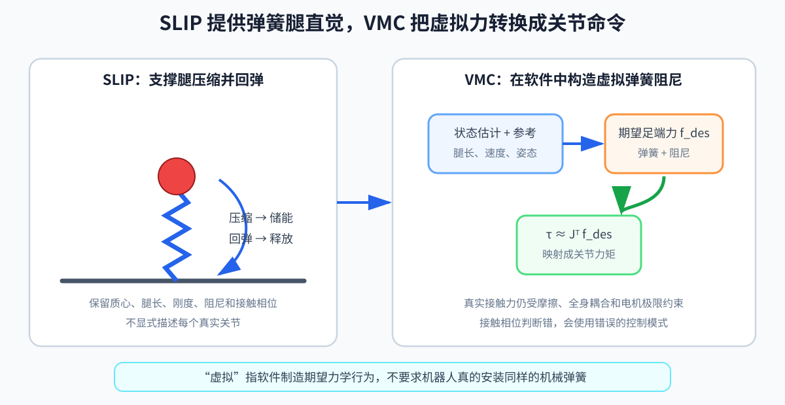

# 第 09 章：SLIP 与 VMC——跟着一条腿经历落地、压缩、回弹和下一次落脚

> **所属部分**：第二部分 · 传统模型控制。
>
> **前置知识**：[第 03 章：动力学与接触](03-动力学与接触.md)、[第 04 章：反馈控制](04-反馈控制基础.md)；建议先读[第 08 章](08-LIP与ZMP.md)。
>
> **核心问题**：跑跳时质心高度明显变化，怎样用虚拟弹簧、阻尼和落脚位置组织一整步运动？
>
> **下一步**：[第 10 章：WBC 与 TSID](10-WBC与TSID.md)会把多任务和物理限制统一处理。

## 怎么读这一章

第 08 章让机器人像固定高度的倒立摆。本章换一副眼镜：

> 机器人正在向前小跑。右脚落地以后，右腿先压缩吸收冲击，再回弹推起身体；与此同时，左脚在空中摆向下一个落点。

整章沿着一整步展开：

```text
摆动脚选择下一落点
→ 脚接触地面
→ 支撑腿压缩并吸收冲击
→ 弹簧回弹推动身体
→ 支撑力减小，脚离地
→ 两腿交换职责
```

第一遍读第 1～7 节，理解这个时间故事。第 8～10 节的接触估计、雅可比映射和方法边界可以第二遍读。

SLIP 是 Spring-Loaded Inverted Pendulum，弹簧负载倒立摆。VMC 是 Virtual Model Control，虚拟模型控制。SLIP 给出弹簧腿的运动直觉；VMC 尝试在真实多关节机器人上用软件制造类似弹簧、阻尼和姿态作用。



---

## 1. 为什么跑步不能继续假设质心高度不变

平缓行走时，固定质心高度的 LIP 很有用。但观察跑步中的一条支撑腿：

```text
脚刚落地
→ 膝和踝开始弯曲
→ 身体下降
→ 到达最低点
→ 腿重新伸展
→ 身体被推起
```

质心高度在明显变化。落地时还需要吸收能量，离地前又要释放能量。若仍把腿当成完全刚性的无长度变化支杆，就看不见这段最重要的过程。

SLIP 把复杂腿暂时想成一根会压缩和回弹的弹簧：

```text
质心质量
   ●
   ╲
    ╲  弹簧腿
     ╲
      × 脚底接触点
```

它仍然忽略真实膝、踝和腿部质量，但保留了跑跳中最重要的一条竖向故事：**落地压缩，随后回弹。**

---

## 2. 一根弹簧腿怎样产生支撑力

设：

- `l_0`：腿的自然长度；
- `l`：当前脚到质心的距离。

当：

```text
l<l_0
```

腿比自然长度短，说明弹簧被压缩。最简单的弹簧力写成：

```text
F_spring
=
k(l_0-l)e
```

- `F_spring`：沿腿方向作用于身体的弹簧力向量；
- `k`：弹簧刚度，单位 `N/m`；
- `l_0-l`：压缩量，单位 `m`；
- `e`：从脚指向质心的单位向量，只提供方向，没有单位。

例如：

```text
l_0=0.90 m
l=0.85 m
k=2000 N/m
```

压缩量是：

```text
l_0-l=0.05 m
```

弹簧力大小为：

```text
2000×0.05=100 N
```

腿压得越短，回弹作用越大。

但只有理想弹簧时，能量会在压缩和回弹之间不断交换，机器人可能上下弹个不停。真实控制还需要阻尼。

---

## 3. 阻尼为什么负责“别一直弹”

加入阻尼后：

```text
F_leg
=
[k(l_0-l)-d·l_dot]e
```

- `F_leg`：弹簧和阻尼合成的腿部期望力；
- `d`：阻尼系数，单位 `N·s/m`；
- `l_dot`：腿长变化速度，本章约定腿变长时为正。

分别看两个阶段。

### 落地后正在压缩

腿长在减小，所以：

```text
l_dot<0
```

此时 `-d·l_dot` 为正，阻尼会增加抵抗压缩的作用，帮助吸收落地冲击。

### 最低点后正在回弹

腿长在增加，所以：

```text
l_dot>0
```

此时阻尼项为负，减少回弹作用，避免弹得过猛。

弹簧和阻尼分工类似第 04 章的 PD（Proportional-Derivative，比例—微分）：

```text
弹簧：根据长度误差恢复
阻尼：根据长度变化趋势刹车
```

刚度太大且系统有延迟，会产生猛烈冲击或振荡；阻尼太小会弹跳不止；阻尼太大又会让动作沉重、回弹不足。

---

## 4. 一整步由两个物理模式组成

腿在一整步中不是始终做同一件事。

### 支撑相：脚在地面上

stance phase 是支撑相。

这时脚能够通过地面给身体提供外力，控制器关心：

- 腿压缩了多少；
- 身体应该获得多大竖直支撑；
- 水平力应该让身体加速还是减速；
- 躯干是否需要姿态力矩；
- 接触力是否超过摩擦能力。

### 摆动相：脚在空中

swing phase 是摆动相。

这时脚不接触地面，不能提供地面反力。控制器关心：

- 下一落脚点在哪里；
- 脚应抬多高避免绊倒；
- 何时开始下落；
- 落地速度是否太大。

所以同一条腿的职责会切换：

```text
支撑相：通过地面影响身体
摆动相：为下一次接触准备位置
```

gait（步态）描述多条腿的支撑相和摆动相怎样随时间组织。

接触判断若晚几毫秒，可能出现两种危险：

- 脚已经落地，控制器却还按摆动轨迹向下砸；
- 脚已经离地，控制器却仍指望它提供支撑力。

这不是简单的“模式标签错了”，而是控制器误判了当前能够从环境获得哪些外力。

---

## 5. VMC：真实腿没有弹簧，也可以表现得像弹簧

许多机器人腿由电机和刚性连杆组成，并没有一根从脚连到质心的物理大弹簧。

VMC 的做法是：

```text
在软件里假想一根弹簧和阻尼器
→ 根据当前状态算出希望身体受到的虚拟力
→ 再把这股任务空间力换算成关节力矩命令
```

例如质心高度控制，约定世界竖直向上为正：

```text
F_z,des
=
mg
+K_p(z_des-z)
+K_d(z_dot,des-z_dot)
```

- `F_z,des`：希望所有支撑脚共同给身体提供的竖直合力；
- `m`：整机质量；
- `g`：重力加速度大小；
- `mg`：抵消重力所需的前馈支撑力；
- `z_des、z`：期望和当前质心高度；
- `z_dot,des、z_dot`：期望和当前竖直速度；
- `K_p`：高度方向虚拟刚度，单位 `N/m`；
- `K_d`：高度方向虚拟阻尼，单位 `N·s/m`。

为什么先有 `mg`？

若机器人静止在目标高度：

```text
z_des-z=0
z_dot,des-z_dot=0
```

两个反馈项都为零，但地面仍必须提供约 `mg` 的力才能托住身体。`mg` 是已知重力的前馈；反馈项负责修正高度和速度误差。

`F_z,des` 只是期望总支撑力，不是某只脚已经测到的真实力。双脚同时支撑时，还要决定它怎样分给左右脚并检查摩擦范围。

---

## 6. 虚拟力怎样变成关节力矩

第 02 章给出了雅可比转置关系。若把 `F_virtual` 定义为希望外界通过脚施加给机器人的力：

```text
τ_contact
=
J_contactᵀF_virtual
```

- `J_contact`：支撑脚接触雅可比；
- `F_virtual`：希望地面对机器人施加的虚拟力或 wrench；
- `τ_contact`：这股外力对应到关节侧的广义力矩贡献。

这条式子建立在虚功关系上，但不能被误读成“完整控制命令永远等于 `JᵀF`”。真实关节力矩还可能需要处理：

- 重力和惯性；
- 多只脚之间的接触力分配；
- 躯干姿态任务；
- 摆动脚任务；
- 关节限位和力矩限幅；
- 摩擦和接触单边性。

简单 VMC 可以直接构造并叠加这些虚拟作用；任务多、约束强时，通常需要第 10 章的 WBC 统一协调。

---

## 7. 摆动脚应该落在哪里：Raibert 落脚直觉

支撑腿压缩和回弹只能处理脚已经落地后的作用。下一只脚落在哪里，会决定下一支撑相是加速还是减速。

想象身体正在向前跑：

- 脚落得更靠身体前方，落地后更容易产生向后的制动力；
- 脚落得相对靠后，更容易在支撑时继续向前推动身体。

Raibert 风格启发式可以写成：

```text
x_foot
=
x_hip
+T_s/2 · v
+K_v(v-v_des)
```

- `x_foot`：下一落脚点；
- `x_hip`：当前髋部或质心水平位置；
- `T_s`：预计下一支撑相持续时间；
- `v`：当前水平速度；
- `v_des`：期望速度；
- `K_v`：速度误差反馈增益，单位 `s`。

第一部分：

```text
T_s/2 · v
```

估计身体在半个支撑周期内会向前走多远，让脚落在较自然的相对位置。

第二部分：

```text
K_v(v-v_des)
```

根据速度误差修正：

- 跑得比目标快，`v-v_des>0`，脚向前多放一点以加强减速；
- 跑得太慢，脚相对向后一些以利于加速。

具体正负仍取决于实现坐标定义。

数值例子：

```text
x_hip=0
T_s=0.3 s
v=1.0 m/s
v_des=0.8 m/s
K_v=0.1 s
```

则：

```text
x_foot
=0+0.3/2×1.0+0.1×(1.0-0.8)
=0.15+0.02
=0.17 m
```

得到的只是候选落脚点。还要检查腿能否到达、地形是否安全、摆动时间是否足够以及落地冲击是否可接受。

---

## 8. 躯干为什么也需要控制

即使腿长和落脚点都合理，躯干仍可能因为地面反力、手臂摆动和惯性向前翻转。

小姿态误差下，可以构造期望身体力矩：

```text
τ_body,des
=
-K_R e_R
-K_ωω
```

- `τ_body,des`：希望外部接触对身体产生的姿态控制力矩；
- `e_R`：当前姿态相对期望姿态的误差向量；
- `ω`：身体角速度；
- `K_R、K_ω`：姿态误差和角速度反馈增益；
- 负号：作用方向朝向减小姿态误差和旋转趋势。

这里特意不用上一节的 `K_p、K_d` 名字，提醒读者它们不是质心高度控制的同一组数。

大角度时不能直接逐项相减 roll、pitch、yaw，应使用旋转矩阵或四元数构造姿态误差。所有姿态误差、角速度和力矩还必须使用一致坐标系。

身体期望力矩与腿部期望合力需要一起分配到当前支撑脚。简单双足 VMC 做到这里已经开始接近一个全身协调问题。

---

## 9. 接触检测把一整步连接起来

现在把落地、支撑和离地重新连起来。

### 9.1 脚何时真正落地

足底法向力超过阈值并持续一小段时间，可以作为接触证据。

为了避免测量在阈值附近抖动，常使用迟滞：

```text
F_z>F_on  → 进入接触
F_z<F_off → 离开接触
F_on>F_off
```

- `F_on`：确认落地的较高阈值；
- `F_off`：确认离地的较低阈值。

例如力从 49 N 抖到 51 N 时，不会在同一个 50 N 阈值附近每周期反复切换。

### 9.2 没有足底传感器时怎么办

可以结合：

- 关节力矩和运动学估计足端外力；
- 足端高度和速度；
- IMU（Inertial Measurement Unit，惯性测量单元）检测到的冲击；
- 步态计划中的预期接触时刻。

雅可比转置关系：

```text
τ≈Jᵀf
```

从外力 `f` 推到关节广义力很直接，反过来却不一定有唯一答案。关节力矩还包含重力、惯性、摩擦和其他接触贡献，`Jᵀ` 也未必可逆。工程上通常先扣除模型能够解释的作用，再结合接触假设用最小二乘或观测器估计外力，不能简单“除以 `Jᵀ`”。

### 9.3 计划相位不等于真实相位

规划器可能认为右脚应在 `0.30 s` 落地，但现实可能：

- 地面比预计更低，脚还在空中；
- 地面更高，脚提前碰撞；
- 脚碰到地面却立即滑动；
- 足底传感器出现噪声。

因此控制器应区分：

```text
计划接触相位
估计接触相位
真实接触状态
```

真实状态无法完整直接读取，估计器只能根据证据判断。控制相位切换还需要平滑处理，不能在一次不可靠测量后让关节力矩瞬间跳变。

---

## 10. 把一整步写成控制循环

```go
func legControlTick(
	estimatedState EstimatedState,
	gaitReference GaitReference,
) JointTorque {
	contact := estimateContact(estimatedState, gaitReference)

	if contact.IsReliableStance {
		// 支撑相：根据腿长、腿长速度、质心和姿态误差，
		// 构造希望地面施加给身体的虚拟作用。
		desiredWrench := virtualSpringDamper(
			estimatedState,
			gaitReference,
		)

		// 再把任务空间作用变成受限的关节命令。
		return mapAndLimitSupportWrench(desiredWrench, estimatedState)
	}

	// 摆动相：选择下一落脚点并跟踪一条抬脚—前摆—落地轨迹。
	footTarget := raibertFootPlacement(estimatedState, gaitReference)
	return trackSwingFoot(footTarget, estimatedState)
}
```

这个循环的完整因果顺序是：

```text
状态估计判断当前相位
→ 支撑腿构造弹簧阻尼作用，或摆动腿生成落脚轨迹
→ 映射并限制关节命令
→ 驱动器和真实接触产生运动
→ 新测量更新接触与身体状态
→ 下一周期继续
```

`desiredWrench` 是希望现实接触产生的作用，不是足底已经产生的测量真值。命令能否实现仍取决于摩擦、执行器、模型和延迟。

---

## 11. SLIP、VMC、LIP 和 WBC 分别做了什么

| 方法 | 它主要提供的视角 | 它没有自动解决什么 |
|---|---|---|
| LIP/ZMP | 固定高度下，质心与支撑点怎样影响动态平衡 | 跑跳中的腿压缩、完整关节力矩 |
| SLIP | 弹簧腿怎样在跑跳中压缩和回弹 | 真实多关节怎样产生这些作用 |
| VMC | 用软件构造虚拟弹簧、阻尼和姿态作用 | 多任务冲突和所有硬约束的统一处理 |
| WBC | 在完整动力学、接触和限幅下协调当前全身任务 | 自动决定很远未来的步态和落脚计划 |

它们不是必须四选一的阵营。

一个系统可以：

```text
用 Raibert 启发式给下一落脚点
→ 用 SLIP/VMC 生成直观支撑目标
→ 用 WBC 在多接触和力矩限制下落实
```

也可以使用 MPC（Model Predictive Control，模型预测控制）或学习策略替代其中某个高层模块。

---

## 12. 一整步最常怎样失败

沿时间顺序排查比只看最终摔倒更有效。

### 落脚以前

- 落脚点超出腿的工作空间；
- 摆动脚抬得不够高，途中绊到地面；
- 预计落地时间错误；
- 脚的下落速度太大。

### 落地瞬间

- 接触检测太晚；
- 仍使用摆动控制向下追目标；
- 虚拟刚度太大，产生冲击峰值；
- 命令变化没有平滑过渡。

### 支撑压缩阶段

- 阻尼太小，身体继续剧烈下降；
- 摩擦约束未检查，脚发生滑动；
- 多脚支撑力分配不合理；
- 状态估计把滑动脚当作固定支点。

### 回弹和离地阶段

- 阻尼太大，回弹能量不足；
- 支撑力归零时机不对；
- 相位提前切换，身体失去所需支撑；
- 下一摆动腿还没准备好。

所以“把 `k` 或 `d` 再调大一点”不是通用答案。故障可能来自落脚规划、相位估计、摩擦、延迟、力矩饱和或任务冲突。

## 本章小结

1. SLIP 用弹簧腿保留了跑跳中“落地压缩—吸收冲击—回弹推起”的核心过程。
2. VMC 在软件中构造期望弹簧、阻尼和姿态作用，再尝试映射为关节命令；“虚拟”不表示作用是假的，而是硬件不必真的装对应弹簧。
3. 支撑相通过环境外力影响身体，摆动相为下一接触准备脚的位置；接触判断错误会让控制器使用错误物理模式。
4. Raibert 落脚规则用当前速度和期望速度调整下一落点，跑得过快时通常把脚放得更靠前以减速。
5. VMC 直观但不自动解决多任务和所有硬约束，复杂人形通常还需要 WBC 或其他约束协调层。

## 练习

1. `l_0=0.9 m`、`l=0.85 m`、`k=2000 N/m`，忽略阻尼时弹簧力大小是多少？
2. 为什么只有弹簧、没有阻尼时，系统容易持续振荡？
3. 为什么向前跑得太快时，脚通常要落得更靠前？
4. 接触检测为什么需要 `F_on>F_off` 的迟滞？
5. 计划说脚已经落地，为什么控制器仍不能直接相信？

参考答案：

1. `100 N`。
2. 理想弹簧只储存和释放能量，没有机制消耗振荡。
3. 更靠前的落脚位置在下一支撑相更容易产生减速作用。
4. 避免测量噪声让接触状态在同一阈值附近反复切换。
5. 真实地形、时延和模型误差会让脚提前、延后、落空或滑动，必须结合传感器证据估计。
