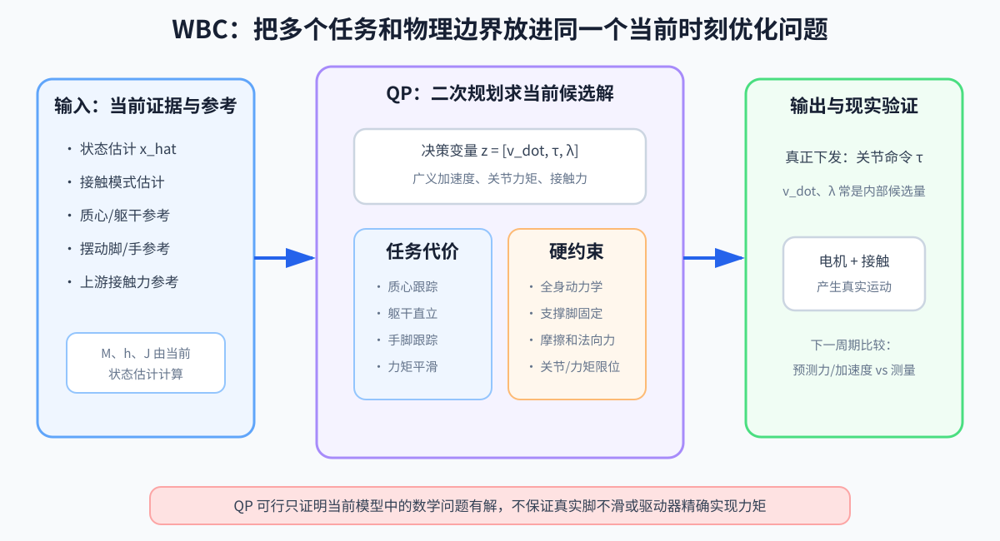

# 第 10 章：WBC 与 TSID——双脚要站稳，右手又要向前伸，整台身体怎样协商

> **所属部分**：第二部分 · 传统模型控制。
>
> **前置知识**：[第 02 章：运动学与雅可比](02-运动学与雅可比.md)、[第 03 章：动力学与接触](03-动力学与接触.md)、[第 06 章：最优化控制](06-最优化控制.md)。
>
> **核心问题**：脚、质心、躯干和手的要求互相影响时，怎样在动力学、摩擦和电机限制内生成当前关节力矩？
>
> **下一步**：[第 11 章](11-SRBD与凸MPC.md)和[第 12 章](12-质心动力学与NMPC.md)会解释这些全身参考怎样通过预测得到。

## 怎么读这一章

整章只追踪一个动作：

> 机器人双脚站在地上，身体保持直立，同时把右手向前伸 `20 cm` 去碰按钮。

这个动作看起来简单，却同时要求：

```text
右手要动
双脚不能滑
身体不能倒
质心不能跑得太危险
关节不能超限
电机不能输出无限力矩
```

第一遍读第 1～8 节，只理解这些要求怎样被装进同一道选择题。公式中的矩阵形状和 HQP 可以第二遍再看。

本章的展开顺序是：

```text
几个局部控制器为什么会打架
→ WBC 本次到底选择什么
→ 先加入绝对不能违反的物理规则
→ 再加入希望尽量完成的身体任务
→ 目标冲突时怎样取舍
→ 最终怎样变成关节命令并接受反馈检验
```

WBC 是 Whole-Body Control，全身控制。TSID 是 Task-Space Inverse Dynamics，任务空间逆动力学。不同项目对两个名称的使用范围略有差异；本章关心它们共同的核心：**从身体任务出发，在全身动力学和接触约束下求当前可执行作用。**



---

## 1. 为什么给每个身体部位各写一个 PD 还不够

最直接的想法是给每个部位各放一个 PD（Proportional-Derivative，比例—微分）控制器：

```text
右手有一个 PD：把手拉向按钮
躯干有一个 PD：把身体拉回直立
质心有一个 PD：把质心拉回双脚中间
两只脚各有一个 PD：让脚保持不动
```

每个局部控制器单独看都合理，但它们作用在同一副身体上。

右手向前伸时：

- 肩和肘必须转动；
- 手臂质量向前移动；
- 整机质心会略微前移；
- 躯干可能受到反作用而转动；
- 双脚的受力分配需要改变。

如果右手控制器只顾手的位置，可能要求肩部猛烈向前；躯干控制器同时又要求肩和身体不要动；脚部控制器则假设地面能提供任意大的摩擦力。把几个控制器输出的关节力矩直接相加，可能出现：

```text
多个任务争抢同一个关节
→ 命令互相抵消或突然变大
→ 力矩饱和
→ 支撑脚需要不可能的摩擦力
→ 手仍没到目标，身体还可能失衡
```

问题不是 PD 本身错误，而是局部控制器不知道全身其他任务和共同限制。

WBC 要解决的就是：

> 不让每个身体部位各自作战，而是在同一时刻对全身动作、地面作用和电机作用一起作出选择。

---

## 2. WBC 的输入和输出是什么

在这个“站稳并伸手”的控制周期中，WBC 收到三类信息。

### 当前状态判断

```text
x_hat
```

它通常包含：

- 浮动基位置、姿态和速度；
- 所有关节位置和速度；
- 双脚是否可靠接触；
- 可能还有接触力估计和不确定性。

### 上游给出的参考

```text
右手目标：向前 20 cm
躯干目标：保持直立
质心目标：留在安全区域
双脚目标：保持当前接触
```

这些是“希望发生什么”，不保证都能同时做到。

### 模型和限制

```text
全身质量与惯量
关节连接关系
接触雅可比
电机力矩范围
关节限位
地面摩擦近似
```

WBC 根据这些信息，计算当前周期的关节命令。若使用力矩接口，最关键的输出是：

```text
τ_cmd = 当前准备下发的关节力矩命令
```

但在得到 `τ_cmd` 以前，它还需要在内部同时考虑：

- 全身应该怎样加速；
- 左右脚应该分别承受多大接触作用；
- 电机应该提供多少关节力矩。

这就是下一节决策变量的来历。

---

## 3. 为什么要同时选择 `v_dot、τ、λ`

一种常见 WBC 会把本次待求量装进：

```text
z=
[
v_dot
τ
λ
]
```

`z` 是第 06 章讲过的决策变量总盒子。这里分别装着：

- `v_dot`：候选全身广义加速度；
- `τ`：候选关节电机力矩；
- `λ`：候选接触力或接触 wrench。

### 3.1 为什么需要候选加速度 `v_dot`

“右手向前移动”“躯干不要继续前倾”这些身体任务，最容易写成当前期望加速度。

例如身体已经略微前倾且还在继续向前转，控制器需要一个把这种趋势刹住的角加速度。右手离目标还有距离，也需要一个向目标方向加速的要求。

因此 `v_dot` 是连接“身体任务”与“动力学所需作用”的桥梁。

它不是某一个点的三维加速度，而是把下面这些量排在一起：

```text
浮动基线加速度
浮动基角加速度
所有关节角加速度
```

若机器人有 `n` 个可驱动关节，`v_dot` 的长度通常是 `6+n`。

### 3.2 为什么需要候选接触力 `λ`

人形躯干没有固定在世界上。双脚站地时，机器人整体保持和改变运动，必须借助地面反力。

右手向前伸产生反作用时，左右脚应该怎样重新分担压力？地面需要提供多少水平摩擦力？这些接触作用并不是提前完全知道的，所以把它们作为待求量 `λ`。

本章统一约定：

> `λ` 表示环境施加给机器人的接触力或 wrench。

若一个模块输出“机器人对地面的力”，方向要按作用与反作用取反。

### 3.3 为什么还要候选电机力矩 `τ`

即使知道希望怎样加速、地面提供怎样的力，还要计算各关节电机需要补上多少作用。这就是 `τ`。

所以三者不是互不相关的三个答案：

```text
希望全身怎样加速 v_dot
+ 地面能提供什么接触作用 λ
↔ 电机需要提供什么关节力矩 τ
```

它们必须共同满足同一条全身动力学关系。

有些实现会用代数消去其中一部分变量，最终 QP 的 `z` 不一定长得完全一样。但无论怎样实现，背后的三个物理问题仍然存在。

---

## 4. 先加入第一条硬规则：不能违反全身动力学

第 03 章的浮动基动力学是：

```text
M(q) · v_dot+h(q,v)
=
Sᵀτ+J_cᵀλ
```

在当前一个控制周期中，状态估计给出了当前 `q、v`，因此：

```text
M(q)、h(q,v)、J_c(q)
```

都可以先根据当前状态计算出来，作为这道题里的已知系数。真正等待求解器选择的是 `v_dot、τ、λ`。

逐项翻译：

- `q`：当前全身配置，包括浮动基位姿和关节角；
- `v`：当前广义速度，包括浮动基速度和关节速度；
- `M(q)`：当前姿势下的全身质量矩阵；
- `v_dot`：候选全身加速度；
- `h(q,v)`：重力、科里奥利和离心等模型作用；
- `Sᵀτ`：关节电机力矩放入全身广义力后的结果；
- `J_c`：当前所有支撑接触的雅可比；
- `J_cᵀλ`：接触力对全身产生的广义作用。

这条等式在说：

> 候选加速度、候选接触力和候选电机力矩必须彼此匹配，不能各自编造。

例如求解器不能一边说“身体向前获得很大加速度”，一边又给出几乎为零的地面水平力和不足的关节力矩。那组数不符合动力学，必须被淘汰。

由于当前状态确定以后，三个待求量在线性地出现在方程中，所以这条动力学关系可以成为 QP 的线性等式约束。

---

## 5. 第二条硬规则：两只支撑脚不能随便移动

当前场景假设双脚稳定平放在地面上。若使用理想刚性接触模型，支撑脚加速度应为零：

```text
J_c · v_dot
+J_dot,c · v
=0
```

先回忆任务空间加速度关系：

```text
接触点加速度
=J_c · v_dot+J_dot,c · v
```

因此右侧设为零，就是要求候选全身加速度不能让支撑脚穿进地面、离开地面或沿地面加速滑动。

- `J_dot,c`：接触雅可比 `J_c` 随时间的变化率；
- `J_dot,c·v`：机器人已经在运动时，由当前速度和构型变化产生的接触点加速度部分；
- 只写 `J_c·v_dot=0` 会漏掉这一项。

这仍然是模型中的理想约束。真实脚底会变形，地面可能打滑，接触估计也可能错误。WBC 只能根据当前接触判断构造数学问题；下一周期仍要用传感器检查现实是否遵守了这个假设。

---

## 6. 地面和电机还各有自己的边界

满足动力学和“脚不动”还不够，因为求解器可能要求地面与电机提供无限大的作用。

### 6.1 电机力矩限制

每个关节都有允许范围：

```text
τ_min≤τ≤τ_max
```

- `τ_min、τ_max`：每个关节力矩的下限和上限；
- 它们通常是向量，每个关节可以有不同范围。

若伸手动作需要肩关节 `120 N·m`，而肩部最大只能提供 `80 N·m`，WBC 不能假装这条任务已经做到。它必须降低手部任务完成程度，或者让身体其他部分协助。

### 6.2 地面只能推，不能像胶水一样拉

对于普通地面，法向接触力必须满足：

```text
λ_z≥0
```

若解要求 `λ_z<0`，意思是地面要把脚向下吸住。普通脚底做不到，原接触假设或任务要求需要改变。

### 6.3 摩擦有限

简单摩擦棱锥近似：

```text
|λ_x|≤μλ_z
|λ_y|≤μλ_z
```

- `λ_x、λ_y`：地面对脚的水平切向力；
- `λ_z`：竖直法向力；
- `μ`：摩擦系数。

右手猛烈向前伸时，身体受到反作用，脚可能需要额外水平摩擦力。若所需水平力超过 `μλ_z`，求解器必须降低动作要求，而不是输出一条现实中必滑的接触力。

### 6.4 关节不能在下一步穿过限位

可以用一个很短的时间步近似预测关节位置：

```text
q_next
≈q+q_dotΔt+1/2 · q_ddotΔt²
```

- `q、q_dot`：当前关节位置和速度；
- `q_ddot`：`v_dot` 中属于关节加速度的部分；
- `Δt`：一个控制周期；
- `q_next`：下一周期的近似关节位置。

再要求：

```text
q_min≤q_next≤q_max
```

这只是一小步预测，不能保证很远未来不碰限位，但能防止当前命令继续把已经接近限位的关节加速推向危险方向。

到这里，WBC 已经知道哪些候选答案绝对不能使用。

---

## 7. 现在才加入“右手向前伸”的任务愿望

硬规则负责排除不合法答案。接下来要在合法答案中比较：哪一组动作更能完成任务？

### 7.1 先把手的位置误差变成加速度要求

设右手任务变量为 `x_hand`。它可以是三维位置，也可以是位置加姿态。为了直观，先只想成三维位置。

希望手向目标运动，可以写一个任务空间 PD：

```text
x_ddot,hand,cmd
=
x_ddot,hand,des
+K_p(x_hand,des-x_hand)
+K_d(x_dot,hand,des-x_dot,hand)
```

- `x_hand`：当前右手位置，由 `x_hat` 经过正运动学得到；
- `x_dot,hand`：当前右手速度；
- `x_hand,des`：按钮所在的期望手位置；
- `x_dot,hand,des`：期望手速度；
- `x_ddot,hand,des`：上游轨迹提供的前馈加速度；
- `K_p、K_d`：手部任务空间反馈增益；
- `x_ddot,hand,cmd`：根据参考和当前误差得到的手部命令加速度。

这条式子仍只是“手希望怎样加速”，还不是关节力矩。

### 7.2 候选全身加速度会造成怎样的手部加速度

运动学关系给出：

```text
x_ddot,hand
=
J_hand · v_dot
+J_dot,hand · v
```

- `J_hand`：右手任务雅可比；
- `J_dot,hand`：它随时间的变化率；
- `x_ddot,hand`：候选 `v_dot` 实际会产生的手部加速度。

把“实际候选”减去“希望得到”，形成任务残差：

```text
e_hand
=
J_hand · v_dot
+J_dot,hand · v
-x_ddot,hand,cmd
```

若 `e_hand=0`，候选全身加速度正好实现手部命令加速度；不为零则表示没有完全做到。

### 7.3 用代价而不是硬约束表达“尽量做到”

给手部残差一个平方代价：

```text
Cost_hand
=
e_handᵀW_hand e_hand
```

- `W_hand`：手部任务各方向的权重矩阵；
- `Cost_hand`：一个非负分数，越小表示手部任务完成得越好。

为什么手部任务通常不是绝对硬约束？因为目标可能超出手臂长度，或者与平衡、电机限制冲突。若强迫它精确成立，整道题可能无解。

躯干、质心和姿态任务也能用相同套路构造：

```text
参考与当前状态
→ 命令任务加速度
→ 用雅可比算候选任务加速度
→ 两者相减得到残差
→ 对残差平方打分
```

这就是 TSID 中“Task-Space”的含义：先在手、脚、质心、躯干等任务空间描述希望发生的运动，再用逆动力学把它们落实到全身作用。

---

## 8. 把所有内容装进同一道 QP

现在终于可以完整地写出 WBC 当前周期的选择题。

### 8.1 决策变量

```text
z=[v_dot,τ,λ]
```

### 8.2 必须满足的硬约束

```text
全身动力学必须成立
支撑脚加速度必须符合接触假设
电机力矩不能超限
法向力不能要求普通地面向下吸脚
接触力不能超过摩擦范围
下一步关节位置不能穿过限位
```

### 8.3 希望尽量减小的总代价

```text
Cost
=
w_hand Cost_hand
+w_torso Cost_torso
+w_com Cost_com
+w_τ‖τ‖²
+w_λ‖λ-λ_ref‖²
```

- `Cost_hand`：右手任务误差代价；
- `Cost_torso`：躯干姿态任务代价；
- `Cost_com`：质心任务代价；
- `‖τ‖²`：避免关节力矩无必要地过大；
- `λ_ref`：若高层 MPC 给出了期望接触力，用这一项跟踪它；没有时可省略；
- `w_hand、w_torso、w_com、w_τ、w_λ`：各项目标权重。

第 06 章已经说明：权重表达偏好，不能取消硬约束。

### 8.4 求解器返回什么

QP 返回一组：

```text
v_dot,best
τ_best
λ_best
```

它们在当前状态估计、模型和约束下彼此一致。

真正准备交给驱动接口的通常是 `τ_best`，记作：

```text
τ_cmd=τ_best
```

`v_dot,best` 和 `λ_best` 多数是内部候选量，也应记录到日志中，以便与之后测得的运动和接触力比较。

---

## 9. 当右手目标太远时，WBC 会怎样

假设按钮实际在手臂工作空间之外，或者伸手会要求脚底产生超过摩擦上限的水平力。

WBC 不会“理解按钮太远”这句话，但数学问题会表现出冲突：

```text
手部任务想继续向前
↕
关节限位、摩擦和身体平衡不允许
```

若手部只是软任务，QP 会在合法范围内尽量靠近：

- 手部任务残差变大；
- 躯干和质心仍尽量保持；
- 力矩和摩擦约束不被突破。

这对应第 06 章的力矩例子：希望 `5 N·m`，上限是 `3 N·m`，最后只能选择合法范围内的 `3 N·m`。

如果把“右手必须精确到达”也写成硬等式，目标不可达时整个 QP 会不可行。系统需要：

- 修改上游参考；
- 允许身体或脚步配合移动；
- 把手部精确要求改成软任务；
- 或明确报告任务无法完成。

WBC 只能在给定候选动作范围里协调，不能替上游发明一个新落脚点，也不能让手臂突然变长。

---

## 10. 权重优先和严格优先不是一回事

### 10.1 加权和：都放进一个总分

把不同任务乘权重后相加最容易实现：

```text
Cost
=w_1Cost_1+w_2Cost_2+...
```

增加 `w_torso`，通常会让求解器更重视躯干误差；增加 `w_hand`，通常会更努力伸手。

但“权重 1000”不等于数学意义上的绝对优先级，因为：

- 两个任务的单位和原始尺度可能不同；
- 一个任务误差可能天然比另一个大很多；
- 极端权重会让数值问题变差；
- 低优先任务仍可能略微改变高优先任务结果。

实际使用前应按可接受误差尺度做归一化。

### 10.2 HQP：先保住上层，再处理下层

HQP 是 Hierarchical Quadratic Programming，层级二次规划。

它按严格顺序处理：

```text
第一层：先找到安全接触和平衡任务的最好结果
第二层：在不破坏第一层结果的前提下尽量伸手
第三层：在不破坏前两层的前提下优化姿态或省力
```

这更接近：

```text
安全接触 > 平衡 > 手部精度 > 动作好看
```

代价是需要多层求解或更复杂的优先级实现。

但即使使用 HQP，也必须谨慎决定什么是真正的硬约束、什么是最高优先任务。错误优先级只会被更严格地执行。

---

## 11. WBC 在每个控制周期怎样运行

可以把实现骨架写成：

```go
func controlTick(
	estimatedState EstimatedState,
	reference MotionReference,
) JointCommand {
	// 1. 根据当前状态估计计算本周期已知的动力学和雅可比。
	modelTerms := computeWholeBodyModel(estimatedState)

	// 2. 把手、躯干和质心参考变成任务加速度命令。
	taskCommands := buildTaskCommands(estimatedState, reference)

	// 3. 创建候选全身加速度、关节力矩和接触力。
	decision := newDecisionVariables("v_dot", "tau", "lambda")

	// 4. 加入动力学、接触、摩擦、限位等硬规则。
	constraints := buildPhysicalConstraints(
		modelTerms,
		estimatedState,
		decision,
	)

	// 5. 加入手、躯干、质心和用力大小等任务代价。
	cost := buildTaskCost(taskCommands, modelTerms, decision)

	// 6. 求出当前状态和模型下最合适的一组候选量。
	solution := solveQP(cost, constraints)

	// 7. 只把经过安全检查的关节命令交给驱动器。
	return safetyFilter(solution.JointTorque)
}
```

这只是数据流伪代码。`newDecisionVariables` 创建的是尚未求值的 QP 未知量，不是从传感器读取加速度和接触力。

真实闭环是：

```text
参考 + x_hat
→ WBC 建立并求解当前 QP
→ 关节命令 u
→ 驱动器与电机形成 u_real
→ 机器人和地面产生真实运动
→ 传感器测量 y
→ 估计器更新 x_hat
→ 下一周期重新求解
```

因此，`λ_best` 不是足底传感器已经测到的真实接触力，`v_dot,best` 也不是现实已经产生的加速度。它们是模型中与当前候选命令配套的预测量。

---

## 12. WBC 为什么可以很快，又为什么看不远

WBC 通常只解决“当前这一帧”的全身协调，不在同一道题里展开未来几十步。

当前 `q、v` 固定后：

- 动力学对 `v_dot、τ、λ` 是线性的；
- 任务残差对 `v_dot` 是线性的；
- 残差平方以后形成二次目标；
- 摩擦和力矩限制可以写成线性不等式。

所以常能构造成 QP，并以较高频率运行。

但只看当前一帧也带来边界：

- 它能努力保持当前双脚接触，却不会自动决定三步以后该踩哪里；
- 它能减少当前手部误差，却不一定知道继续前伸会在半秒后让身体无法恢复；
- 它依赖上游给出合理的质心、脚步、手和接触参考。

这就是为什么常见系统使用：

```text
较低频规划器或 MPC：考虑未来
↓ 给出轨迹与接触力参考
较高频 WBC：落实当前全身动作
↓
真实机器人
```

高层看得远但模型粗，低层看得近但身体细。二者不是重复模块。

---

## 13. 用“右手没伸到”排查 WBC

如果机器人没有摔倒，但右手始终碰不到按钮，不要立刻把 `w_hand` 调大一万倍。按因果链检查：

### 第一步：参考是否真的可达

- 按钮是否超出手臂工作空间；
- 上游是否允许躯干或脚步配合；
- 参考位置使用的坐标系是否正确。

### 第二步：任务运动学是否正确

- `J_hand` 是否对应正确的手部 frame；
- 当前手位置和速度是否计算正确；
- 姿态误差和线位置误差是否混用了单位。

### 第三步：是否被硬约束挡住

- 肩或肘是否接近关节限位；
- 某个电机是否已经饱和；
- 摩擦约束是否已经紧张；
- 双脚接触假设是否与现实一致。

### 第四步：是否被其他任务压制

- 躯干或质心权重是否远大于手部任务；
- 任务是否未经归一化；
- HQP 中手部任务是否处于过低层级。

### 第五步：模型命令是否被现实实现

- `τ_cmd` 与电机反馈是否一致；
- 是否存在通信延迟或驱动器内部限幅；
- 预测 `λ_best` 与足底测量是否接近；
- 真实脚是否已经滑动。

建议记录：

- 动力学等式残差；
- 支撑脚速度和加速度残差；
- 每个任务归一化误差；
- 力矩饱和比例；
- 摩擦余量；
- QP 是否可行及求解耗时；
- 预测接触力与足底测量；
- 接触切换时的命令跳变。

只记录最终右手位置，无法判断问题发生在参考、运动学、约束、权重、模型还是执行器。

---

## 14. WBC 和 TSID 的边界

可以先这样理解两者：

- **WBC** 强调整台身体的多个任务和约束需要统一协调；
- **TSID** 强调从任务空间期望加速度出发，通过逆动力学求全身加速度、接触作用和关节力矩。

很多软件库和论文会把二者部分重叠地使用。与其争论名字，更重要的是检查实现是否明确回答：

```text
输入了哪些当前状态和参考
决策变量是什么
哪些是硬约束
哪些是软任务
接触力方向怎样定义
最终向硬件下发什么
求解失败时怎样降级
```

WBC 也不是万能层：

- 它依赖状态估计和接触判断；
- 它依赖质量、惯量和执行器模型；
- 刚性接触在冲击和软鞋底上只是近似；
- 当前帧 QP 不负责长时间规划；
- 错误参考和错误优先级仍会产生错误行为。

## 本章小结

1. 几个独立的局部 PD 会通过同一副身体互相影响，WBC 用统一的全身问题处理这种冲突。
2. 候选全身加速度 `v_dot`、接触力 `λ` 和关节力矩 `τ` 必须共同满足全身动力学。
3. 动力学、刚性接触、摩擦、力矩和限位通常是硬规则；手、躯干、质心等跟踪任务通常通过代价表达“尽量做到”。
4. 目标不可达时，WBC 应在合法范围内产生任务残差，而不是突破真实电机或地面能力。
5. WBC 只协调当前时刻，未来参考仍需要规划器、MPC 或策略提供；求出的候选量仍要接受真实反馈检验。

## 练习

第一遍只回答前四题：

1. 双脚站立并伸右手时，为什么手部 PD 和躯干 PD 可能互相影响？
2. `z=[v_dot,τ,λ]` 中三个量分别代表什么？
3. 为什么“支撑脚不动”要成为全身加速度的约束，而不是只把脚部关节锁死？
4. 按钮超出工作空间时，为什么不应该简单把手部任务写成必须精确满足的硬等式？
5. WBC 为什么常能构造成 QP？
6. WBC 和高层 MPC 分别更擅长什么时间范围的问题？

参考答案：

1. 手、躯干和脚通过同一套关节和全身动力学耦合，一个部位动作会改变质心、姿态和接触力需求。
2. 候选全身广义加速度、候选关节力矩和候选环境接触作用。
3. 脚是否移动由浮动基和所有相关关节共同决定，不能只看脚附近几个关节。
4. 不可达时会让整道题无解；通常应保留硬安全边界，并允许手部任务产生残差或修改上游参考。
5. 当前状态固定后，动力学和任务残差对决策变量线性，残差平方形成二次目标，常用物理边界可写成线性约束。
6. MPC 低频预测未来并给参考，WBC 高频落实当前全身协调并处理即时误差。
