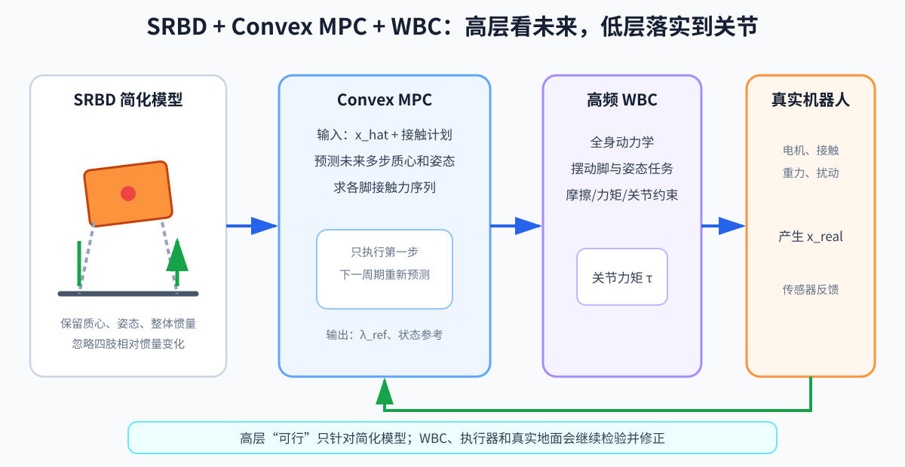

# 第 11 章：SRBD 与凸 MPC——高层预测接触力，低层落实全身力矩

> **所属部分**：第二部分 · 传统模型控制。
>
> **前置知识**：[第 03 章](03-动力学与接触.md)、[第 06 章](06-最优化控制.md)、[第 10 章](10-WBC与TSID.md)。
>
> **核心问题**：怎样牺牲部分全身细节，换取未来多步接触力的实时预测？
>
> **下一步**：[第 12 章：质心动力学与 NMPC](12-质心动力学与NMPC.md)比较更完整但更难求解的模型。

## 怎么读这一章

- **第一遍读第 1～4 节和第 7 节**：理解为什么高层暂时把机器人看成一个刚体，以及 MPC 输出的接触力为什么还不能直接送给电机。
- **第二遍读第 5～6、9 节**：再看目标、摩擦约束和接触计划。
- 第 8、10 节是实现与局限速查。第一次不要求自己推导线性化矩阵。

SRBD 是 Single Rigid Body Dynamics，单刚体动力学：把整台机器人近似成一个刚体。Convex MPC 是 Convex Model Predictive Control，凸模型预测控制：用容易快速求解的凸优化问题预测未来接触力。



## 1. 为什么简化

把完整人形动力学放进几十步预测窗口，变量多、非线性强，实时求解困难。SRBD 把机器人整体视作一个刚体：

- 保留质心位置、速度；
- 保留身体姿态、角速度；
- 接触力作为输入；
- 忽略腿和手臂相对身体运动造成的惯量变化。

对腿质量相对躯干较小的四足，这个近似常常很好；对四肢质量更明显且全身动作丰富的人形，误差更大。

## 2. 平移动力学

```text
m · c_ddot
=
m · g
+ Σ[i=1→n_c] f_i
```

- `m`：整机质量；
- `c`：质心位置；
- `c_ddot`：质心加速度；
- `n_c`：当前接触点数量；
- `f_i`：环境在第 `i` 个接触点施加给机器人的力；
- `g`：世界坐标系中的重力加速度向量，例如 `[0,0,-9.81]ᵀ m/s²`；
- `Σ[i=1→n_c]`：把所有当前接触力相加。

这里 `c、c_ddot、g、f_i` 必须在同一坐标系表达，通常选世界坐标系。

## 3. 转动动力学

```text
I · ω_dot
+ ω × (I · ω)
=
Σ[i=1→n_c]
(p_i-c) × f_i
```

- `I`：机体转动惯量矩阵；
- `ω`：角速度；
- `ω_dot`：角加速度；
- `p_i`：接触点位置；
- `ω×(Iω)`：陀螺耦合项。

这一形式采用机体坐标下近似固定的惯量 `I`，因此 `ω`、力臂和接触力也要转换到匹配的机体坐标再代入。若全部使用世界坐标，则世界系惯量会随姿态变化，公式不能不加处理地照抄。

右侧表示每个接触力对质心产生的力矩。本式把接触简化成点力；若脚底接触还能直接传递外力矩，还应把对应的接触力矩一并加入右侧。

## 4. 如何变成凸问题

原模型仍有姿态、角速度和接触位置的非线性。常见近似包括：

- 小姿态角或在参考轨迹附近线性化；
- 在一个预测周期内把某些旋转矩阵、接触位置视作已知；
- 忽略或近似陀螺项；
- 预先给定 contact schedule（接触时序）。

于是得到：

```text
x[k+1]
=
A_k · x[k]
+B_k · u[k]
+d[k]
```

- `x[k]`：质心和姿态相关状态；
- `u[k]=[f[1,k]ᵀ,…]ᵀ`：各脚接触力；
- `d[k]`：重力等已知偏置；
- `A_k,B_k`：当前参考附近的线性模型。

`x[k]` 的具体排列必须由实现声明，例如可包含质心位置、质心速度、姿态误差和角速度。它不是第 02 章的末端位置变量。`A_k、B_k` 的下标 `k` 表示线性化结果可能沿参考轨迹逐步变化。

## 5. MPC 目标

```text
总目标 =
Σ[k=0→N-1] {
    状态跟踪误差[k]ᵀ · Q · 状态跟踪误差[k]
    + u[k]ᵀ · R · u[k]
}
```

第一项追踪质心位置、速度和身体姿态；第二项避免接触力过大或分配剧烈。

- `N`：预测步数；
- `Q`：状态跟踪误差权重矩阵；
- `R`：接触力大小权重矩阵；
- `u[k]`：第 `k` 步所有候选接触力拼成的向量。

还可惩罚输入变化：

```text
Cost_Δu
=
Σ[k=1→N-1]
(u[k]-u[k-1])ᵀ R_Δ (u[k]-u[k-1])
```

- `R_Δ`：相邻两步接触力变化的权重矩阵；
- `Cost_Δu`：接触力跳变代价，越小表示序列越平滑。

## 6. 接触约束

支撑脚：

```text
f_i,z≥0,
|f_i,x|≤μf_i,z,
|f_i,y|≤μf_i,z
```

摆动脚：

```text
f_i[k]=0
```

这里统一用 `f_i` 表示第 `i` 只脚的接触力。支撑脚必须满足单边接触和摩擦近似；摆动脚没有接触地面，所以它的候选接触力必须为零。

若接触时序已知，这些都是线性约束，整个问题成为 QP（Quadratic Programming，二次规划），也就是“二次目标 + 线性约束”的优化问题。

## 7. 为什么 MPC 输出不能直接驱动电机

MPC 输出的是每只脚应该通过地面产生的力。电机需要的是关节力矩。两种转换：

### 雅可比转置

```text
τ
≈
Σ_i (J_iᵀ · f_i)
```

快，但没有统一处理完整动力学和其他任务。

这里仍约定 `f_i` 是地面对机器人的力。该近似只给出这些外力通过各腿产生的关节广义力贡献；重力、惯性、关节运动、多个任务和符号约定仍要处理，所以它不是一条完整电机命令公式。

### 低层 WBC

WBC（Whole-Body Control，全身控制）负责把高层接触力和身体运动参考落实成关节力矩。

把 MPC 的 `f_ref` 作为 WBC 任务：

```text
Cost_force=
‖λ-λ_ref‖_W_f²
```

- `λ_ref`：MPC 给出的期望接触力；
- `λ`：WBC 当前选择的接触力；
- `W_f`：接触力跟踪权重；
- `Cost_force`：两者差异的加权平方代价。

WBC 再结合全身动力学、摆动脚、姿态、限幅求关节力矩。这就是：

```text
Convex MPC（50–200 Hz）
    ↓ 接触力与状态参考
QP-WBC（500–1000 Hz）
    ↓ 关节力矩
Robot
```

## 8. 简化伪代码

```go
func mpcUpdate(
	estimatedState EstimatedState,
	reference MotionReference,
	contactSchedule ContactSchedule,
) ContactForce {
	// 在当前状态估计附近建立线性的单刚体模型。
	stateMatrix, inputMatrix, bias := linearizedSRBD(estimatedState, contactSchedule)

	// 把跟踪目标和摩擦限制组装成二次规划问题。
	costHessian, costLinear := buildQuadraticCost(
		stateMatrix, inputMatrix, bias, reference,
	)
	constraintMatrix, lower, upper := buildFrictionConstraints(contactSchedule)
	forceSequence := solveQP(
		costHessian, costLinear, constraintMatrix, lower, upper,
	)

	// MPC 只执行最优序列中的第一步。
	return forceSequence.First()
}

func controlTick(state EstimatedState, forceReference ContactForce) Vector {
	// WBC 把高层接触力参考落实成当前时刻的关节力矩。
	return solveWBCQP(WBCInput{
		State:               state,
		DesiredContactForce: forceReference,
		DesiredSwingFoot:    currentSwingReference(),
		DesiredTorso:        currentTorsoReference(),
	})
}
```

代码中的 `estimatedState` 是 `x_hat`，由它建立的未来 `x[k]` 是 SRBD 模型预测，不是真值。接触计划同样是一项关于未来的假设。高层求解可行，只表示简化模型中的质心与接触力轨迹可行；WBC、关节限位、执行器和真实地面仍可能否决它。

## 9. 接触计划不是免费得到的

Convex MPC 通常假设未来哪只脚接地已知。接触时序和落脚位置可能来自：

- 固定步态生成器；
- Raibert 落脚启发式；
- 单独的足步规划器；
- 更高层轨迹优化；
- 学习策略。

如果计划中的脚没按时落地，MPC 仍按错误接触模型预测，力分配会迅速失效。

这也说明 MPC 的滚动重算为什么重要：实际落地事件和状态测量会修正上一周期的预测。但若估计器没有识别出接触失配，重算只会继续使用错误假设。

## 10. 局限

- 忽略四肢摆动的惯量变化；
- 预设接触时序，难同时优化复杂接触；
- 线性化只在参考附近准确；
- 主要擅长 locomotion（移动），全身操作能力有限；
- 高层和低层模型不一致会产生跟踪偏差。

## 本章小结

- SRBD 把全身近似成一个刚体，以牺牲四肢惯量细节换取未来多步接触力的快速预测。
- 凸 MPC 通常需要线性化并预先给定接触时序；模型中的可行接触力还必须由 WBC 和真实机器人落实。
- 大幅挥臂、错误接触计划和高低层模型不一致，都会破坏简化模型的预测。

## 11. 练习

1. 机器人静止时，所有支撑脚竖直力之和应约等于什么？
2. 摆动脚在 MPC 中为什么要求接触力为零？
3. 为什么高层 MPC 频率可以低于 WBC？
4. 大幅挥动双臂时，SRBD 的哪个假设最可能失效？

答案：1）`mg`；2）它没有接触地面，不能施加地面反力；3）高层预测变化较慢，WBC 高频处理全身跟踪与扰动；4）整体固定惯量和忽略连杆相对运动的假设。
