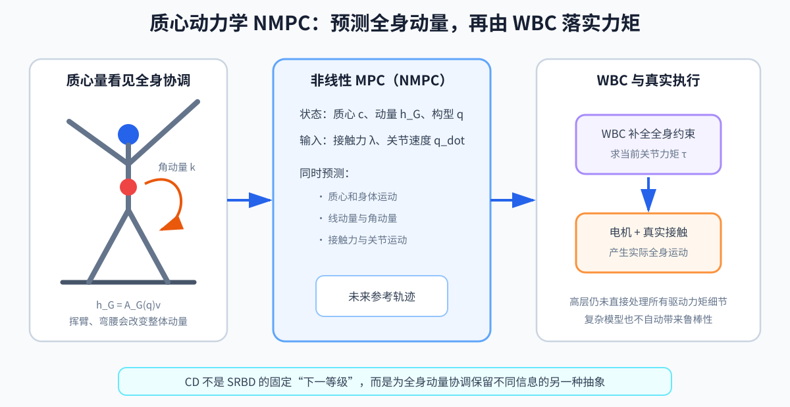

# 第 12 章：质心动力学与 NMPC——让预测控制看到全身运动

> **所属部分**：第二部分 · 传统模型控制。
>
> **前置知识**：[第 03 章](03-动力学与接触.md)、[第 06 章](06-最优化控制.md)、[第 10 章](10-WBC与TSID.md)；建议先读[第 11 章](11-SRBD与凸MPC.md)理解为何简化。
>
> **核心问题**：怎样在预测中保留关节运动对全身动量的影响？
>
> **下一步**：传统路线已形成完整控制链，可前往[第 19 章：Sim2Real 与控制工程](19-Sim2Real与控制工程.md)检查落地问题。

CD 是 Centroidal Dynamics，质心动力学，用来描述质心和全身动量；NMPC 是 Nonlinear Model Predictive Control，非线性模型预测控制，用非线性模型反复预测未来并更新当前动作。



## 1. 为什么 SRBD 不够

人形挥臂、弯腰、搬物时，各连杆相对质心的运动显著改变整体动量。SRBD（Single Rigid Body Dynamics，单刚体动力学）把惯量固定，无法准确描述这些变化。完整 WBD（Whole-Body Dynamics，全身动力学）又太大。质心动力学位于两者之间：

- 关注整机质心和动量；
- 保留关节构型对整体动量的影响；
- 不在高层直接求每个关节的驱动力矩。

这些模型不是从“低级”到“高级”的固定升级路线，而是为不同问题保留不同信息。质心动量关系本身描述全身量的聚合规律；具体 NMPC 如何选择状态、输入、接触模型和离散方法，仍会引入近似。模型更大不自动意味着闭环更可靠。

## 2. 质心动量

定义：

```text
h_G=
[
l
k
]
```

- `h_G∈ℝ^(6)`：关于质心 `G` 的空间动量；
- `l∈ℝ³`：线动量；
- `k∈ℝ³`：角动量。

质心动量矩阵（CMM，Centroidal Momentum Matrix）给出：

```text
h_G
=
A_G(q)v
```

- `A_G(q)∈ℝ^(6×(6+n))`：质心动量矩阵；
- `q`：全身构型；
- `v`：广义速度。

这条式子说明：即使质心位置相同，不同的关节姿态和速度也会产生不同角动量。挥手可以帮助平衡不是经验巧合，而是动量耦合。

## 3. 外力决定总动量变化

```text
l_dot
=
m · g + Σ_i f_i
```

```text
k_dot
=
Σ_i
(p_i-c)×f_i
+τ_i
```

内部关节力不能直接改变系统总动量，但能重新分配身体运动、改变构型和惯量，并影响接触位置。

## 4. 高层状态和输入

一种常见 NMPC 状态：

```text
x=
[
c
h_G
q_j
]
```

输入：

```text
u=
[
λ
q_dot,j
]
```

- `c`：质心位置；
- `h_G`：质心动量；
- `q_j`：关节角；
- `λ`：接触 wrench；
- `q_dot,j`：关节速度。

不同实现会选择不同状态。关键是高层保留关节运动对质心量的影响，却不直接用关节力矩作为输入。

同一个符号还要结合语境判断：估计器根据传感器得到的是当前 `h_G` 的估计，NMPC 沿 `f_model` 展开的是未来 `h_G` 的预测，而真实机器人拥有的是实际动量。三者数值接近是控制目标，不应在程序和日志中混为一个字段。

## 5. 为什么是非线性

非线性来自：

- 力矩臂 `(p_i-c)` 与接触力相乘；
- 接触位置由关节角的正运动学决定；
- `A_G(q)` 随构型变化；
- 三维旋转位于 `SO(3)`；
- 接触切换。

因此写成：

```text
x_dot=f(x,u)
```

这里的 `f` 是 NMPC 内部的非线性预测模型，也就是全书统一记号中的 `f_model`，不是对真实世界 `f_real` 的完整复制。

通常要使用：

- SQP（Sequential Quadratic Programming，序列二次规划）：把非线性问题反复近似成二次规划；
- DDP（Differential Dynamic Programming，微分动态规划）：利用时间递推结构优化轨迹；
- iLQR（iterative Linear Quadratic Regulator，迭代线性二次调节器）：反复线性化模型并求局部最优控制；
- 自动微分：让程序自动计算求解器需要的导数。

## 6. NMPC 可以共同规划什么

代价中可包含：

- 质心和动量跟踪；
- 手、脚末端位姿；
- 落脚点；
- 关节姿态；
- 接触力平滑；
- 力矩或速度正则；
- 碰撞距离。

相比 SRBD，它更可能让“伸手够物体”和“保持平衡”在同一预测窗口内协调。

## 7. NMPC + WBC

这里的 WBC 是 Whole-Body Control，全身控制：它使用更完整的全身动力学，高频跟踪 NMPC 给出的参考。

NMPC 输出：

- 未来状态轨迹；
- 接触力轨迹；
- 关节速度或构型轨迹。

WBC 高频跟踪这些参考，利用完整动力学求关节力矩：

```text
质心动力学 NMPC
→ c_ref, h_ref, q_ref, contact_force_ref
→ 全身 WBC
→ joint_torque
```

为什么还需要 WBC？高层模型仍省略了关节驱动力矩细节，且 NMPC 频率通常不足以直接处理高频扰动。

## 8. 自动微分

NMPC 需要大量导数：

```text
A_k=(∂ f)/(∂x),
B_k=(∂ f)/(∂u)
```

自动微分（Automatic Differentiation，AD）不是数值差分，也不是符号展开。它在程序计算图上用链式法则得到精确到浮点误差的导数。常见工具包括 CasADi、CppAD，以及支持自动微分和加速数组计算的 JAX。

数值差分：

```text
(∂ f)/(∂ x)
≈
(f(x+ε)-f(x))/(ε)
```

容易受步长 `ε` 和噪声影响，维度高时也慢。

## 9. 实时求解技巧

- warm start：以上一周期轨迹作为初值；
- multiple shooting：分段积分并加连续性约束；
- RTI（Real-Time Iteration，实时迭代）：每周期只做有限次 SQP 更新；
- 缩短窗口或使用非均匀时间网格；
- 稀疏线性代数；
- 将接触计划由外部给定以减少组合复杂度。

## 10. 局限

- 实现和调试成本高；
- 求解实时性困难；
- 对模型、状态估计和初值敏感；
- 多接触的离散组合仍难；
- 真机性能未必抵得上工程投入；
- 复杂模型不代表自动获得鲁棒性。

这解释了为什么强化学习迅速普及：它把大量非线性求解移到离线训练，但代价是仿真依赖、约束保证和可解释性问题。

## 本章小结

- 质心动力学保留全身构型与速度对整体动量的影响，位于固定惯量的 SRBD 和完整全身动力学之间。
- NMPC 能联合预测质心、动量、接触力和部分关节运动，但非线性、初值和实时求解成本明显更高。
- 高层模型仍未完整处理关节驱动力矩，通常需要 WBC 高频跟踪，并接受真实反馈检验。

## 11. 练习

1. CMM 的输入和输出分别是什么？
2. 手臂快速挥动时，线动量和角动量中哪个通常受影响更直观？
3. NMPC 为何常需要自动微分？
4. 为什么 NMPC 输出关节速度后仍不能直接替代 WBC 的关节力矩求解？

答案：1）输入广义速度，输出 6 维质心动量；2）角动量；3）反复线性化和优化需要动力学/代价导数；4）高层没有完整处理关节驱动力矩和高频全身约束。
