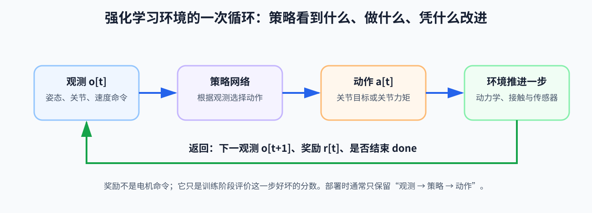

# 第 14 章：腿足强化学习工程——亲手定义“机器人要学什么”

> **所属部分**：第三部分 · 学习控制。
>
> **前置知识**：[第 13 章](13-强化学习基础.md)。本章默认你已经知道策略会反复经历“观察—动作—奖励—再观察”。
>
> **本章只做一件事**：在仿真里教一台人形机器人先站住，再跟随 `0.6 m/s` 的前进速度命令。
>
> **下一步**：[第 15 章：特权学习与鲁棒行走](15-特权学习与鲁棒行走.md)。

---

## 0. 先说结论：写训练环境，就是在设计一套控制器

第一次接触腿足强化学习，很容易产生一种错觉：

> 我把机器人丢进仿真，把神经网络和 PPO（Proximal Policy Optimization，近端策略优化）接上，网络自然会学会走路。

事实不是这样。

网络只能在我们给它的世界里学习：

```text
我们决定它能看见什么
→ 我们决定它能发出什么命令
→ 我们决定什么行为算“好”
→ 我们决定它从哪些状态开始练习
→ 我们决定什么时候算失败
```

这五件事分别对应：

```text
观测、动作、奖励、重置、终止
```

所以，训练环境不是装神经网络的空盒子。它就是我们写给策略的“题目”。题目写歪了，策略把它做到满分，也不等于机器人学会了我们心中的走路。

还要先分清四个经常被混在一起的东西：

```text
训练环境：出题并推进物理——给观测、执行动作、算奖励、决定重置

MLP：网络结构——规定输入数字经过哪些层的加权和激活，变成输出数字

Actor–Critic：两张正在学习的网络——Actor 出动作，Critic 帮助评价

PPO：训练办法——规定怎样用一批新经历更新 Actor 和 Critic
```

第 13 章已经把 MLP（Multi-Layer Perceptron，多层感知机）从“一组数字进去、一组数字出来”展开到了权重、偏置、激活函数、Actor 输出和参数训练。本章不再把它当成新名词，而是继续追问：**究竟是哪组观测数字进去，哪组具有物理含义的动作数字出来？**

“使用 PPO”没有自动决定观测、动作和奖励；“使用同一个 MLP”也没有自动让机器人会站、走和跑。网络最后学会什么，取决于整道训练题怎样定义。

腿足 RL（Reinforcement Learning，强化学习）工程的本质，是把“我想让机器人走得好”翻译成一套能够反复产生训练经历的闭环题目：

```text
它看见什么
+ 它能控制什么
+ 什么结果得分
+ 从哪些处境开始练
+ 会遇到哪些随机变化
= 它实际上学习的控制问题
```

PPO 只是求这道题的一种办法。题目没有包含的能力和过渡，算法通常不会凭空补出来。

本章不把这些名词拆成互不相关的清单。我们跟着同一台机器人，亲手把一个最小训练任务一步步搭出来。

---

## 第一遍：让一台什么都不会的机器人站起来

### 1. 第 0 次实验：只把机器人放进仿真

机器人以正常站姿出现在平地上。仿真一开始，它立刻倒下。

这不是强化学习失败了。此时根本还没有控制：

- 重力一直把身体往下拉；
- 关节没有主动支撑；
- 脚和地面发生接触；
- 仿真器只是在诚实地计算接下来会发生什么。

现在我们接入策略。每隔 `20 ms`，也就是以 `50 Hz` 的频率，做一次：

```text
读取机器人当前情况 o[t]
→ 策略根据 o[t] 输出 a[t]
→ 把 a[t] 变成关节命令
→ 仿真推进 20 ms
→ 看机器人变成什么样，并给出奖励 r[t]
```

这里：

- `t`：第几个策略时刻，不一定表示 1 秒；
- `o[t]`：第 `t` 个时刻交给策略的观测；
- `a[t]`：策略在这一刻输出的动作；
- `r[t]`：环境对这一步行为给出的分数。



注意：策略不是看一段录像后一次性给出整套动作。它每隔 `20 ms` 看一次当前情况，再决定下一小步。这仍然是反馈控制。

但第一个真正的问题来了：**它究竟能看见什么？**

---

### 2. 先给它“感觉”：观测决定策略知道什么

我们先给策略最基本的身体感觉：

```text
o[t] = [
    ω_body,
    g_proj,
    q-q_default,
    q_dot,
    a[t-1]
]
```

先不要被数组吓到。它只是在把几类数字排成一长行。

#### 2.1 它们分别是什么

`ω_body`：身体角速度。

它告诉策略，身体现在有没有快速向前栽、向后仰或左右翻滚。单位通常是 `rad/s`。

`g_proj`：重力方向在身体坐标系中的表示。

机器人不需要直接知道一个叫“俯仰角”的完美数字。重力总是指向世界下方；看看重力在自己身体里指向哪里，就能判断身体大致倾向哪边。

`q-q_default`：各关节相对默认站姿偏了多少。

- `q` 是当前关节角；
- `q_default` 是我们事先给定的自然站姿关节角；
- 两者相减后，策略更容易看出膝盖、髋部和踝部偏离站姿多少。

`q_dot`：关节速度。

只看关节位置不够。同一个膝关节角度，静止在那里和正在高速弯曲，下一刻会完全不同。

`a[t-1]`：上一次动作。

真实电机和底层控制都不会让命令瞬间无痕地消失。告诉策略上一动作，有助于它理解自己刚才做了什么，也更容易产生连续动作。

#### 2.2 为什么不直接把“真实状态”全给它

在仿真里，我们几乎可以读取一切真值：真实基座速度、真实摩擦系数、精确外力、精确地形高度。

但真机部署时，策略真正得到的是：

```text
真实机器人 x_real
→ 传感器测量 y
→ 状态估计与信号处理
→ 交给策略的观测 o[t]
```

`o[t]` 不是上帝视角的 `x_real`。

如果训练时让策略依赖一个真机根本拿不到的量，仿真成绩再好，部署时也像一个突然失去眼睛的人。

因此，给 Actor——也就是部署时真正输出动作的策略网络——设计观测时，要逐项问：

1. 真机上能获得吗？
2. 它来自传感器还是估计器？
3. 坐标系是什么？
4. 单位是什么？
5. 会有多大延迟和噪声？

现在，机器人终于有了一点“感觉”。但它还没有手脚可用，因为我们尚未定义动作。

---

### 3. 再给它“肌肉接口”：动作决定策略能控制什么

神经网络通常输出一组没有单位的数，例如每个数都限制在 `[-1,1]`。这组数不能直接扔给电机。我们必须规定它的物理含义。

对初学者最友好的办法，是让策略修改关节目标位置：

```text
q_des = q_default + α · a[t]
```

这句话的意思是：

```text
默认站姿
+ 策略给出的一点偏移
= 本次希望关节去到的位置
```

其中：

- `a[t]`：策略输出的无量纲动作；
- `α`：动作缩放系数，把 `[-1,1]` 变成多少弧度的关节偏移；
- `q_default`：默认站姿；
- `q_des`：期望关节位置，单位是 rad。

例如某个膝关节：

```text
q_default = 0.4 rad
α = 0.25 rad
a[t] = 0.8
```

那么：

```text
q_des = 0.4 + 0.25×0.8 = 0.6 rad
```

策略没有直接让膝盖“立刻变成 `0.6 rad`”。它只是提出目标。底层关节 PD（Proportional-Derivative，比例—微分）控制器再根据当前位置和速度计算力矩：

```text
策略动作 a[t]
→ 期望关节角 q_des
→ 关节 PD
→ 力矩命令 τ_cmd
→ 电机和机器人
→ 实际关节运动
```

位置目标动作比较容易训练，是因为底层 PD 像弹簧和阻尼一样，已经替策略承担了一部分局部稳定工作。

#### 3.1 动作范围过大会怎样

假如 `α` 取得很大，网络输出的一点变化就会变成巨大的关节目标跳变：

```text
小小的网络探索
→ 很大的目标角变化
→ 很大的 PD 力矩
→ 机器人猛烈抽动甚至摔倒
```

如果 `α` 太小，机器人又可能没有足够的动作范围来恢复平衡。

所以动作空间不是“网络最后一层有几个神经元”这么简单。它直接规定了策略能够使用怎样的控制手段。

#### 3.2 另外两种常见动作

直接力矩动作：

```text
τ_cmd = τ_scale · a[t]
```

它更直接，但对探索、控制频率和电机模型更敏感。随机动作可能立刻产生危险力矩。

残差动作：

```text
u = u_nominal + α · a[t]
```

这里 `u_nominal` 是传统控制器或参考轨迹原本给出的命令，策略只负责修正它。残差和原命令必须具有相同单位：力矩只能加力矩，角度只能加角度。

本章继续采用最容易理解的“关节位置目标”动作。

现在策略能看，也能动了。但它还不知道什么叫站得好。

---

### 4. 第 1 个奖励：只要不倒就给分

我们先写一个极简单的规则：机器人每活过一步，就得到一点奖励。

```text
r[t] = r_alive
```

同时规定，出现以下情况时结束本回合：

- 身体高度低于阈值；
- 身体倾斜过大；
- 膝盖、躯干等不允许接触地面的部位碰地；
- 关节严重超限；
- 已经达到本回合最大时长。

一次从初始化到结束的训练过程叫 episode，中文常译作“回合”。

策略很快学会“不立刻摔倒”，但姿态可能非常难看：两腿岔开、膝盖死顶、身体不停抖。它没有做错，因为我们只说了“别倒”，没说怎样站。

这暴露了奖励的本质：

> 奖励不是老师在旁边表达欣赏；奖励是优化问题真正追逐的数字目标。

于是我们补充姿态、角速度和动作平滑等奖励，让它更像一个稳定站立的机器人。

但这里要克制。每加一项，都应该能回答：

> 它在阻止哪一种已经观察到的坏行为？

否则奖励会慢慢变成一锅互相打架的数字。

---

## 第二遍：让站稳的机器人开始前进

### 5. 给出 `0.6 m/s` 命令

现在我们给观测增加期望速度：

```text
v_cmd = [0.6, 0]
```

它表示希望机器人在身体水平坐标系中：

- 向前速度为 `0.6 m/s`；
- 横向速度为 `0 m/s`。

完整观测变成：

```text
o[t] = [
    v_cmd,
    ω_body,
    g_proj,
    q-q_default,
    q_dot,
    a[t-1]
]
```

注意，命令不是事实。

- `v_cmd` 是“希望多快”；
- `v_xy` 是机器人实际或估计的水平速度。

策略要学习的，正是根据两者之间的差异不断修正动作。

#### 5.1 速度跟踪奖励

可以先用一句人话表达：

```text
实际速度越接近期望速度，分数越高。
```

一种常见写法是：

```text
r_v = exp(-‖v_xy-v_cmd‖² / σ_v²)
```

逐层拆开：

1. `v_xy-v_cmd`：实际速度与期望速度之差；
2. `‖...‖`：把二维误差变成一个非负的“误差有多大”；
3. 平方后，大误差会受更重惩罚；
4. `σ_v`：我们认为多大的速度误差还可以接受，单位也是 `m/s`；
5. `exp(...)`：把结果平滑压到 `0～1` 附近。

当速度完全正确时：

```text
v_xy-v_cmd = 0
→ r_v = exp(0) = 1
```

误差越大，`r_v` 越接近 0。

#### 5.2 只奖励速度，会发生什么

机器人可能学会用非常猛烈的步态追速度：

- 关节频繁撞限位；
- 动作每一帧剧烈跳变；
- 脚在地面滑动；
- 用很大的力矩换取一点速度精度；
- 甚至扑倒后依靠惯性向前滑。

这不是策略“作弊成性”，而是我们定义的分数真的允许这么做。

于是加入两个简单惩罚。

力矩惩罚：

```text
r_τ = -w_τ · ‖τ‖²
```

动作跳变惩罚：

```text
r_change = -w_change · ‖a[t]-a[t-1]‖²
```

负号表示：力矩越大、动作变化越猛，总分越低。

`w_τ` 和 `w_change` 是权重，表示我们有多在意这两件事。它们没有脱离任务的“标准正确值”。权重太大，机器人可能为了省力而不走；平滑惩罚太大，机器人遇到推搡时又可能不敢快速反应。

一个最小总奖励可以写成：

```text
r[t] =
    w_v · r_v
    + r_alive
    + r_τ
    + r_change
```

这里的 `r[t]` 只在训练时帮助算法比较行为好坏。部署到真机后，不是每算出一次奖励，电机才会运动。真正在线运行的是已经训练好的策略反馈回路。

#### 5.3 从固定 `0.6 m/s` 到同一个策略控制停、走、跑

本章先固定 `0.6 m/s`，是为了让第一道题简单，并不表示每个速度都必须训练一张新网络。

后续可以让每个仿真环境随机收到不同命令：

```text
环境 1：v_cmd=0
环境 2：v_cmd=0.3 m/s
环境 3：v_cmd=0.8 m/s
环境 4：v_cmd=2.0 m/s
```

同一个 Actor 读取当前身体观测和 `v_cmd`，便可能学成条件策略：

```text
a[t]=Actor(o_body[t],v_cmd[t])
```

- `o_body[t]`：当前时刻的身体观测，例如 IMU（Inertial Measurement Unit，惯性测量单元）、关节和上一动作；
- `v_cmd[t]`：当前时刻希望机器人跟随的速度命令；
- `a[t]`：同一个 Actor 根据身体现状和命令给出的当前关节动作。

这里不是“每个动作训练一个模型”。Actor 每个控制周期输出一次数值动作；站立、行走和跑步是较长时间形成的行为。

但把命令范围扩大，并不保证技能自动出现：

- 若训练中从未给过零速度和减速过程，`v_cmd=0` 不一定会稳定停车；
- 若电机、奖励和数据只支持慢走，把命令改成 `2.0 m/s` 不会凭空产生跑步；
- 若训练时命令整回合固定，策略可能不会处理从跑步突然切到停止的过渡；
- 走和跑差异很大时，也可以先训练专项策略，再按第 18 章的方法统一蒸馏。

所以“一个策略还是多个策略”不是 PPO 预先规定的答案。真正要检查的是：条件输入能否区分意图，训练分布是否覆盖每种技能和技能之间的过渡。

#### 5.4 `v_cmd=0` 为什么不是“把速度清零”

速度命令变成零时，机器人可能仍然：

- 带着向前的身体动量；
- 处在单脚支撑中间；
- 有一条腿正在摆向前方；
- 保留上一周期的动作和步态历史；
- 需要先落脚、吸收冲击，再进入双脚稳定支撑。

所以：

```text
把命令数字改成 0
≠ 现实速度瞬间变成 0
≠ 当前身体立刻变成站立状态
```

停车是一段有时间顺序的闭环行为：

```text
移动中的身体
→ 收到零命令
→ 减速并处理正在进行的摆腿
→ 建立可靠支撑
→ 消除剩余速度和摆动
→ 稳定站立
```

如果训练采样中零命令只占很小比例，或者零命令总在完美站姿时出现，策略就没有真正练过“从运动中停下”。反过来，若大量样本都奖励原地不动，策略又可能找到“从来不走最安全”的便宜答案。训练设计必须同时控制：移动样本、稳定站立样本，以及移动→停止→重新起步的过渡样本各占多少。

---

### 6. 奖励漏洞：策略会实现“你写下的目标”，不是“你心里的目标”

把训练视频和每一项奖励曲线放在一起看，常会发现：

| 我们写的规则 | 策略可能找到的省事办法 |
|---|---|
| 只奖励前进位移 | 扑倒后向前滑 |
| 只惩罚能耗 | 原地不动 |
| 姿态奖励特别强 | 不敢迈大步，也不敢加速 |
| 脚离地奖励写得过强 | 原地高抬腿 |
| 动作平滑惩罚特别强 | 被推时也慢吞吞 |

这类现象叫 reward hacking，中文常说“奖励漏洞”或“钻奖励空子”。

面对它，正确顺序不是立刻再塞十个惩罚，而是：

1. 明确坏行为到底是什么；
2. 检查现有奖励是否真的测到了它；
3. 检查某个奖励是否存在更便宜的取巧方式；
4. 只增加最直接、最可解释的一项；
5. 单独记录这一项的时间序列和回合总和；
6. 重新看视频，确认行为确实按预期改变。

奖励设计本质上是在把“走得好”翻译成数字。翻译越模糊，策略越可能忠实地完成错误版本。

---

### 7. 机器人只会从完美站姿出发

经过训练，机器人能从默认站姿开始走到 `0.6 m/s`。但我们把初始身体倾斜 5°，它立刻摔倒。

原因很简单：它从没练过这种开局。

训练每回合开始时，从什么状态生成机器人，叫 reset distribution，也就是“重置分布”。

如果永远从同一个完美姿势开始，策略学到的是：

> 从完美站姿出发怎样走。

而不是：

> 在一小片真实可能出现的状态范围内怎样恢复并继续走。

所以可以逐渐随机化：

- 初始关节角；
- 初始关节速度；
- 身体轻微倾斜；
- 速度命令；
- 出现外力的时刻和方向。

但一开始就把所有随机范围拉满，机器人可能连一次偶然成功都遇不到，奖励信号也就没有学习方向。

这引出课程学习。

---

### 8. 课程学习：先让它会，再让它难

我们可以安排这样的训练课程：

```text
第 1 级：平地站立
→ 第 2 级：平地小速度行走
→ 第 3 级：更宽速度范围
→ 第 4 级：小推力和轻微参数变化
→ 第 5 级：斜坡、台阶、随机地形
```

这叫 curriculum learning，课程学习。

它不是为了“降低标准”，而是让策略先积累可复用的基本能力，再把能力扩展到困难条件。

升级最好根据实际表现，而不是死等固定训练步数。例如：

```text
最近 100 个回合中
速度跟踪合格且摔倒率低于阈值
→ 才扩大地形或扰动难度
```

如果难度上升后所有机器人都立刻失败，就应该回退或混合保留一些简单样本。课程不是一条只升不降的楼梯，而是在“学得到”和“有挑战”之间保持平衡。

---

### 9. 训练时可以有老师，但学生不能偷看答案

仿真里有些信息非常准确：

- 真实基座线速度；
- 精确地形高度；
- 外部扰动力；
- 当前摩擦系数；
- 负载质量。

它们可以帮助 Critic 更准确地判断当前局面未来大概能得到多少回报。但部署时的 Actor 不能依赖这些仿真真值。

于是可以采用非对称 Actor–Critic：

```text
Actor：只看真机可获得的观测，负责输出动作
Critic：训练时额外看仿真特权信息，负责辅助学习
部署：只保留 Actor
```

这叫 privileged observation，特权观测。

它并不等于“训练时随便把真值都塞给策略”。关键边界是：**真正部署的那条动作生成路径，不能依赖上线后消失的信息。**

把第 13 章的一次更新放进来：

```text
部署观测 o_deploy ─────────→ Actor → 动作 a
          │                              ↓
          │                         环境推进、奖励
          │                              ↓
          └─ 加上仿真特权信息 ─→ Critic → 价值预测
                                           ↓ 与奖励合成优势估计
                                  PPO 更新 Actor 与 Critic
```

Critic 没有给 Actor 一份“正确关节动作”。它只是借助更多信息，更准确地判断 Actor 的这次经历比预期好还是差。Actor 仍然通过奖励和优势估计学习。

这与下一章的 Teacher–Student 不同：Teacher 是另一张真正输出动作的策略，Student 会模仿 Teacher 给出的动作标签。两个方法都能使用特权信息，但信息进入训练的方式不同。

如果 Actor 和 Critic 共享部分网络，实现时还必须保证 Critic 的特权输入不会通过共享路径泄漏到 Actor 输出。判断边界的办法始终是：导出部署 Actor 后，沿着“观测到动作”的整条计算路径，是否仍然需要仿真才有的真值？

第 15 章会继续追问：老师看得更多，怎样把这种优势教给只能看普通传感器的学生？

---

## 第三遍：训练为什么快，部署为什么还会失败

### 10. 几千台机器人同时练习

真实机器人摔一次要扶起来，仿真机器人可以同时复制几千份：

```text
机器人 1：练小速度
机器人 2：被向左推
机器人 3：在低摩擦地面
……
机器人 4096：练斜坡
```

如果每个并行环境收集 `T` 个时刻，总样本数是：

```text
N_samples = N_env × T
```

- `N_env`：并行环境数量；
- `T`：每个环境本轮收集的离散步数；
- `N_samples`：这一轮训练得到的样本总数。

例如：

```text
4096 × 24 = 98,304 个样本
```

并行仿真让强化学习能够快速试错，但它没有改变控制问题本身。每一个仿真机器人仍在独立经历观察、动作、物理响应和下一次观察。

#### 10.1 rollout、iteration、mini-batch 和 checkpoint 是什么

训练日志经常直接出现这些词。把它们放回一次 PPO 训练：

```text
1. 当前 Actor 在每个并行环境连续运行 T 步
   这段新经历叫 rollout（轨迹片段/采样段）

2. 汇总所有环境的 rollout
   得到这一轮用于更新的数据

3. 把大批数据切成较小的 mini-batch
   让优化器分几次处理

4. 可能把这一轮数据重复遍历几个 epoch
   但更新幅度仍受 PPO 约束

5. 完成若干次网络更新
   这一轮常叫一个 iteration（训练迭代）

6. 定期保存 Actor、Critic 等训练状态
   保存文件叫 checkpoint（检查点）
```

这些词不是完全统一的国际计量单位，不同代码库的日志命名可能略有差异，必须回到具体实现确认。例如 `checkpoint 50` 可能表示第 50 次保存，不一定表示 5000 万样本。

如果从旧 checkpoint 继续训练：

```text
继承旧网络已经学会的能力
→ 当前 Actor 重新采集 rollout
→ PPO 用新经历继续更新
```

这就是项目版本可以逐代接力的原因。它不是每一版都从随机网络重新学站立，也不是把所有历史 rollout 永久反复使用。

#### 10.2 最后的 checkpoint 不一定最好

PPO 训练不是“能力只增不减”的存档升级。网络共享同一组参数，后续更新在改善快跑或抗扰时，也可能把较早学会的站立、横移或停车改坏。于是可能出现：

```text
checkpoint 8750：停车稳定、横移尚可
checkpoint 10000：平均奖励更高，却更容易在停车末端摇晃
```

这不是文件损坏，而是训练目标、采样比例和共享参数共同造成的非单调变化。因此 checkpoint 选择应当像发布版本验收：

1. 定期保存候选模型；
2. 用固定的独立场景套件逐个回放；
3. 分别检查站、走、跑、停、转弯和扰动恢复；
4. 记录哪个旧能力被救回，哪个旧能力被伤害；
5. 选择通过门槛的版本，而不是自动取训练编号最大的文件。

在 [G1-Command-RL](https://github.com/dingda-beep/G1-Command-RL) 的从零训练中，基本站立、移动和过渡能力在不同训练阶段逐步出现，也会发生遗忘；项目最终依靠外部场景评估和版本谱系选择 checkpoint。这说明“训练了上亿步”描述的是付出的采样量，不等于最后一步天然汇集了全部最好能力。

---

### 11. 仿真频率和策略频率不是一回事

假设物理仿真以 `500 Hz` 推进，即每 `2 ms` 算一次物理变化；策略只以 `50 Hz` 输出新动作，即每 `20 ms` 决策一次。

那么一个策略动作需要保持：

```text
500 / 50 = 10 个物理步
```

这个数字常叫 decimation：

```text
decimation = 10
```

完整过程是：

```text
策略输出一次 a[t]
→ 同一个动作保持 10 个物理小步
→ 20 ms 后重新构造观测
→ 策略输出 a[t+1]
```

如果训练时是 `50 Hz`，部署时却变成 `100 Hz`，同一个网络会以两倍速度改变命令。动作的时间意义、历史、延迟和反馈增益全都变了。

所以部署频率不是一个无关紧要的配置项。它属于策略的一部分。

改变策略频率后，还要重新审视第 13 章的折扣因子 `γ` 和按步累计的奖励，因为“一步”代表的真实时间已经改变。

---

### 12. 数字尺度不一致，网络会很难学

观测中可能同时出现：

- `0.6 m/s` 的速度；
- 几个 `rad/s` 的角速度；
- 数十 `rad/s` 的关节速度；
- `[-1,1]` 的上一动作。

如果数值尺度差异很大，网络训练会更困难。常见做法是归一化：

```text
o_normalized = clip((o-μ)/σ, -c, c)
```

用人话说：

```text
先减去平常的中心值 μ
→ 再除以典型变化尺度 σ
→ 最后把极端异常值限制在 [-c,c]
```

其中：

- `μ`：观测均值或人工设定的中心；
- `σ`：标准差或人工尺度；
- `c`：裁剪阈值；
- `clip`：超过范围就截到边界。

这里的 `μ、σ` 是观测归一化参数，不是第 13 章随机策略分布的均值和标准差。

最容易发生的部署错误之一，是训练和真机使用了不同的：

- 关节排列顺序；
- 坐标系；
- 单位；
- 归一化统计量；
- 动作缩放系数；
- 控制频率。

这时网络本身可能完全没坏，但它收到的是另一种语言。

---

### 13. 不要只盯着“总奖励上涨”

训练曲线显示总奖励不断上升，只能说明策略越来越会拿我们定义的分。它不能单独证明机器人真的走得更好。

至少还要看：

- 速度跟踪误差；
- 摔倒率与回合长度；
- 关节是否经常撞限位；
- 力矩、机械功率和动作变化率；
- 足端是否滑移；
- 不同地形、摩擦和负载区间的成功率；
- 最差一部分环境，而不只是平均值；
- 动作是否经常被裁剪到上限。

训练算法还常记录：

- 策略熵：随机探索还剩多少；
- KL（Kullback–Leibler，库尔贝克—莱布勒）散度：新旧策略变化有多大；
- Critic explained variance：价值网络对当前回报变化解释得怎样。

这些是诊断学习过程的工具，不是机器人安全性的证明。

例如，平均奖励提高，但低摩擦地面上的成功率从 `70%` 掉到 `30%`，部署风险可能反而更高。

更可靠的做法是先写一张**能力验收表**，再选 checkpoint。例如：

| 场景 | 不能只看什么 | 应该单独记录什么 |
|---|---|---|
| 零命令站立 | 一段最好视频 | 长时间漂移、跌倒率、误触发恢复次数 |
| 加速与匀速 | 平均速度奖励 | 跟踪误差、饱和、功率、脚滑 |
| 移动→停止→重启 | 最终是否站住 | 停车距离、过渡跌倒、重新起步成功率 |
| 侧移与快速转弯 | 全方向平均值 | 每个方向和速度区间的独立成功率 |
| 推扰或落地 | 平均恢复率 | 同一初始状态下的成功、伤害与救回 |

最后一行的“伤害与救回”需要成对比较。固定同一个随机种子和扰动快照，让基线策略与候选策略面对尽量相同的处境：

```text
基线失败、候选成功 → rescue（救回）
基线成功、候选失败 → harm（伤害）
```

只报告候选“总共成功多少次”，可能掩盖它在救回 20 次的同时伤害了另外 18 次。对于准备上真机的策略，新增能力是否破坏已有安全基线，和平均分提高同样重要。

---

### 14. 把整个实验重新走一遍

现在再看，我们不是把一堆 RL（Reinforcement Learning，强化学习）技巧拼在一起，而是在一步步定义一个闭环控制问题。

#### 14.1 我们想要什么

```text
机器人先站住，再跟随 0.6 m/s 前进命令。
```

#### 14.2 策略能知道什么

```text
速度命令
+ 身体角速度和倾斜线索
+ 关节位置与速度
+ 上一次动作
```

#### 14.3 策略能做什么

```text
在默认站姿附近修改各关节目标角。
```

#### 14.4 什么算做好

```text
速度接近命令
+ 不摔倒
+ 不使用过大力矩
+ 动作不过度跳变
```

#### 14.5 它从哪里开始练

```text
先从简单站姿和平地开始
→ 再扩大初始误差、命令、扰动和地形范围
```

#### 14.6 真正运行的反馈链

```text
仿真或真机当前状态
→ 传感器与估计器形成观测 o[t]
→ 策略输出 a[t]
→ 缩放为 q_des
→ 关节 PD 产生力矩命令
→ 电机和物理世界响应
→ 下一次观测
```

训练时，奖励在这条链旁边评价哪种行为更值得保留：

```text
                         → 奖励 r[t] → 更新策略参数
机器人响应 → 下一观测 ─┤
                         → 继续下一次闭环控制
```

部署时，参数更新和奖励计算通常消失，但下方的物理反馈闭环继续存在。

这就是本章最重要的世界观：

> 强化学习没有绕开控制设计。观测、动作、奖励、重置和频率，就是你用另一种方式写下的控制设计。

---

### 15. 一个适合初学者的最小实验顺序

不要一开始就上随机地形、视觉、负载和全套奖励。按下面的顺序，每一步只增加一个主要变量：

1. 单个环境可视化，确认关节顺序、正负方向和动作缩放；
2. 固定参数，只训练平地站立；
3. 加入小范围速度命令；
4. 检查策略是否通过不合理姿态或大力矩取巧；
5. 加入小推力，观察恢复行为；
6. 扩大初始状态和物理参数范围；
7. 再加入地形课程；
8. 用不参与训练的独立条件评估；
9. 导出模型，逐项核对真机接口、频率和归一化；
10. 从安全约束下的小范围真机测试开始。

每一步都应该留下：

- 配置版本；
- 奖励分项曲线；
- 代表性成功与失败视频；
- 观测和动作的单位、顺序、频率；
- 独立评估结果。

否则，当第 8 步突然失败时，很难知道问题是在网络、奖励、接口还是物理差异。

---

## 本章小结

我们从一台会立刻倒下的机器人出发，依次解决了五个问题：

1. **观测**：它能知道什么；
2. **动作**：它能用什么方式改变世界；
3. **奖励**：训练到底在偏爱什么行为；
4. **重置与课程**：它会从哪些处境开始练习；
5. **频率与归一化**：训练得到的数字语言能否原样带到真机。

它们共同定义了策略面对的控制问题。网络和 PPO 很重要，但它们只能认真求解我们实际写下来的题目。

下一章要处理一个更真实的困难：仿真老师可以知道真实摩擦、真实速度和外力，真机学生却看不到。怎样利用老师的优势，又不让学生在部署时失明？

---

## 练习

1. 为什么 `v_cmd=0.6 m/s` 不是机器人当前真实速度？
2. 为什么 `q_des` 也不是下一时刻必然达到的关节角？
3. 只奖励“不要摔倒”，机器人可能学出什么奇怪行为？
4. 训练策略频率为 `50 Hz`、物理仿真频率为 `1000 Hz`，decimation 是多少？
5. 为什么 Actor 不应直接读取仿真中的真实摩擦系数？
6. 非对称 Actor–Critic 中，Critic 看到真实摩擦以后，会直接给 Actor 正确动作吗？
7. 为什么给统一策略输入 `v_cmd=0`，仍不保证它自然学会从跑步稳定停车？
8. 从 checkpoint 继续训练时，继承了旧能力，为什么还要采集新 rollout？
9. 为什么训练编号最大的 checkpoint 不一定最适合部署？

参考答案：

1. 它是希望达到的命令，实际速度还取决于策略、执行器、接触和环境；
2. 它只是交给底层控制器的目标，电机能否达到还受误差、力矩上限和物理响应影响；
3. 例如岔开腿、锁死膝盖或持续抖动，只要没有触发终止就可能拿高分；
4. `1000/50=20`；
5. 真机通常无法直接准确获得这个量，部署时该输入会消失；
6. 不会；Critic 输出价值预测，奖励与价值共同形成优势估计，PPO 再据此更新 Actor；
7. 稳定停车是一个跨多帧的过渡过程，必须在命令变化和对应身体状态的训练分布中出现；
8. PPO 是 on-policy 方法，旧权重可以继承，但更新仍需要与当前策略足够接近的新经历；
9. 后续更新可能改善某项能力却遗忘另一项，必须用独立的多场景门槛选择版本。
