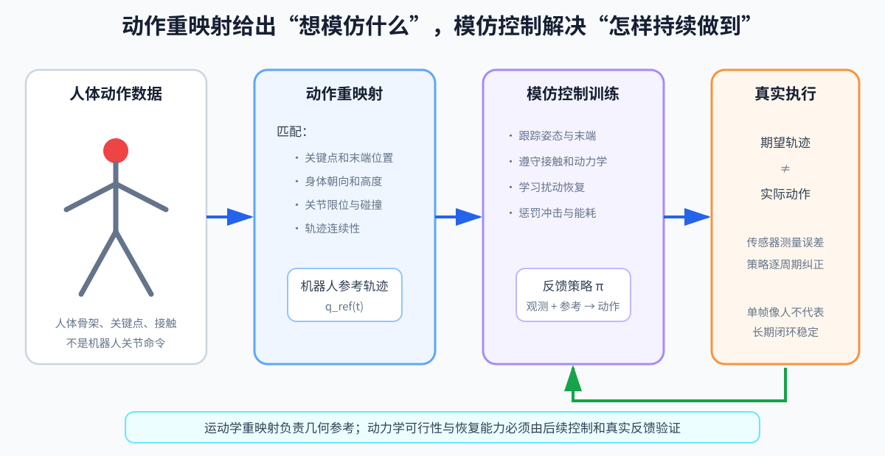

# 第 17 章：动作重映射与模仿学习——让机器人学人的动作，但遵守自己的身体

> **所属部分**：第三部分 · 学习控制。
>
> **前置知识**：[第 02 章](02-运动学与雅可比.md)、[第 03 章](03-动力学与接触.md)、[第 13 章](13-强化学习基础.md)和[第 14 章](14-腿足强化学习工程.md)。
>
> **核心问题**：怎样把人体动作变成机器人参考，再训练出受扰后仍能跟踪的闭环策略？
>
> **下一步**：[第 18 章：多动作策略与 BFM](18-多动作策略与BFM.md)。

## 怎么读这一章

- **第一遍读第 1～5 节**：只理解人体动作为什么不能复制关节角，以及单帧几何可行为什么不等于整段物理可行。
- **第二遍读第 6～7、11～12 节**：再看参考跟踪奖励和训练入口。
- 第 8～10 节的 AMP、判别器和模式崩溃属于另一条模仿路线，第一次可以选读。

前几章的策略主要从速度命令和奖励中学会“完成任务”，但奖励很难精确描述“像人一样挥手、转身或起舞”。动作捕捉数据可以直接提供想模仿的运动样例。

问题是，人体数据不是机器人命令：人的腿长、关节轴和自由度与机器人不同，而且一段视觉上自然的人体动作不一定满足机器人的力矩和接触限制。因此流程分成两步：

```text
人体动作数据
→ 重映射：变成机器人几何上可参考的轨迹
→ 模仿控制：让机器人在物理约束下真正执行
```

重映射回答“机器人应该模仿什么姿态”；模仿学习回答“受到扰动时，怎样持续做出这段动作”。两者不能互相替代。

参考轨迹是期望运动，不是实际运动记录。部署时，策略每周期比较当前观测与参考相位或未来参考，再输出纠偏动作；真实姿态是否跟上，要由下一次测量确认。因此“单帧看起来像”只验证外观，“受到扰动后还能继续跟踪”才验证了闭环行为。

## 1. Retarget 是什么

Retargeting（动作重映射）把人体动作数据转换为机器人参考轨迹。人的骨骼比例、关节数、关节轴、限位和脚底结构与机器人不同，不能复制角度。

例如人体数据说“膝关节弯曲 60°”，不能直接把 60° 写进机器人膝关节：

- 人体数据与机器人关节的零位可能不同；
- 正方向可能相反；
- 人的髋部通常用三维旋转描述，机器人可能拆成三个有固定轴的关节；
- 人腿和机器人腿长度不同，相同角度不会得到相同脚的位置；
- 人体动作没有机器人关节限位、电机能力和脚底接触信息。

所以重映射通常不追求“关节数字相同”，而是选择更有意义的外部效果，例如脚落在对应位置、手朝向一致、躯干方向接近，同时让机器人关节保持在合法范围内。其输出是机器人可使用的**参考轨迹**，还不是电机命令。



## 2. SMPL

SMPL 是 Skinned Multi-Person Linear Model，一种参数化人体模型。它可以先理解成一个“输入体型和关节姿态，就能生成完整人体网格与骨架关键点”的函数，而不是一种机器人控制器。

常见参数：

- pose `θ`：身体各关节姿态；
- shape `β`：身高、胖瘦、比例等体型；
- root transform：人体根节点全局位姿。

SMPL-H 增加手部；SMPL-X 进一步统一身体、手和面部。数据格式、关节顺序和坐标系必须从具体数据集确认。

在本章流程中，SMPL 的作用只是把动作数据恢复成统一的人体姿态和关键点。重映射器再拿这些关键点作为目标，寻找机器人自己的关节角。SMPL 参数不会直接发送给机器人电机。

## 3. 重映射流程

1. 读入人体 pose、shape、root；
2. 统一 Y-up/Z-up、左右手系和单位；
3. 以 pelvis（骨盆）等根节点对齐；
4. 选择人体关键点与机器人 frame 的对应关系；
5. 按比例或优化拟合体型；
6. 对每帧或整段轨迹求 IK（Inverse Kinematics，逆运动学）或优化，把目标姿态换算成机器人关节角；
7. 检查关节限位、碰撞、足底接触和时序连续；
8. 重采样到训练控制频率。

## 4. 单帧重映射目标

```text
min_q
Σ_i
w_i
‖
p^robot_i(q)
-
p^human_i
‖²
+
w_reg‖q-q_nom‖²
```

- `i`：被匹配的关键点；
- `p^robot_i(q)`：机器人第 `i` 个点的 FK（Forward Kinematics，正运动学）位置，即由关节角算出的关键点位置；
- `p^human_i`：缩放后人体关键点；
- `w_i`：关键点权重；
- `q_nom`：舒适/默认关节姿态；
- `w_reg`：正则权重。

整行还需要按下面方式读：

- `min_q`：允许调整机器人关节角 `q`，寻找让总误差最小的一组姿态；
- `Σ_i`：把所有匹配关键点的误差相加；
- `p^robot_i(q)` 与 `p^human_i` 必须先放在同一坐标系、同一长度单位下比较；
- `‖·‖²`：关键点位置误差向量的平方长度；
- 正则项 `‖q-q_nom‖²`：关键点同样接近时，偏向更靠近默认姿态的解。

约束：

```text
q_min ≤ q ≤ q_max
```

还可加足底平面、手物接触和自碰撞约束。

## 5. 为什么要优化整段轨迹

逐帧位置都很好，速度仍可能跳变。加入时间平滑：

```text
Cost_smooth
=
w_v Σ_t
‖(q[t+1]-q[t])/Δt‖²
+
w_a Σ_t
‖(q[t+1]-2q[t]+q[t-1])/Δt²‖²
```

- `Cost_smooth`：整段轨迹的平滑代价；这里不用 `J_smooth`，避免和雅可比 `J` 混淆；
- 第一项近似关节速度并限制过快变化；
- 第二项是除以 `Δt²` 的离散二阶差分，近似关节加速度；
- `t`：轨迹帧编号；`Δt`：相邻两帧的时间间隔；
- `w_v、w_a`：速度和加速度平滑权重。

若省略 `/Δt` 和 `/Δt²`，这些项只能叫“相邻帧差分”和“二阶帧差分”；一旦重采样频率改变，其物理意义和权重都会改变。

更连续的参考通常更容易被物理仿真中的策略跟踪，因为不会要求瞬间改变速度或接触。

运动学可行仍不等于动力学可行。重映射后通常还需 RL（Reinforcement Learning，强化学习）或轨迹优化，把动作变成机器人能实际完成的行为。

## 6. DeepMimic

DeepMimic 把参考轨迹跟踪奖励加入 RL：

```text
r_t
=
w_q r_q + w_ee r_ee
+w_root r_root
+w_task r_task
```

- `r_q`：关节姿态跟踪；
- `r_ee`：end-effector（末端）跟踪；
- `r_root`：根节点/躯干跟踪；
- `r_task`：前进等额外任务；
- `w_*`：各项权重。

姿态奖励示意：

```text
r_q
=
exp
(
-k_q‖q-q_ref‖²
)
```

- `q`：当前机器人关节姿态；
- `q_ref`：当前参考相位对应的关节姿态；
- `k_q`：把姿态平方误差转换成无量纲指数的正尺度；若 `q` 用 rad，`k_q` 的量纲应与 `1/rad²` 匹配；
- `exp`：指数函数，误差为零时该项为 1，误差增大时向 0 衰减。

策略输入当前或未来参考轨迹，因此部署时也必须知道要跟踪哪段动作。

即使参考每一帧都几何可行，帧与帧之间也可能要求过大的速度、加速度、力矩或摩擦力。模仿控制的任务不是机械复制参考，而是在真实约束下选择尽可能接近参考且能够持续恢复的动作。

## 7. 三个关键训练技巧

### RSI

RSI 是 Reference State Initialization，参考状态初始化。它让训练回合从轨迹的随机时刻附近开始，不必每次都从第一帧学起。

### 自适应采样

把轨迹分段，失败率高的片段获得更高重置概率，使训练聚焦难点。

### Early Termination

当身体严重偏离或摔倒时提前结束，避免无意义样本。但边界太严会导致剧烈恢复和低容错。

## 8. AMP

AMP 是 Adversarial Motion Priors，对抗运动先验。它不要求部署时输入完整参考轨迹，而是学习“动作风格”。

增加判别器 `D_φ`：

- 专家数据 `s^expert` 应判为真；
- 策略动作片段 `s^policy` 应判为假；
- Actor 获得骗过判别器的 style reward。

一种风格奖励形式：

```text
r_style
=
-log
(1-D_φ(s^policy))
```

- `D_φ(·)∈(0,1)`：像专家数据的概率；
- `log`：自然对数；
- 判别器认为越像专家，风格奖励越高。

总奖励：

```text
r
=
w_task r_task
+w_style r_style
```

任务奖励让机器人听手柄速度命令，风格奖励让步态像人。

## 9. 判别器看什么

可以输入一帧状态，也可以输入连续多帧：

```text
s^motion_t
=
[
q[t-H+1:t],
q_dot[t-H+1:t],
root features
]
```

- `H`：判别器一次查看的历史帧数；
- `q[t-H+1:t]、q_dot[t-H+1:t]`：从过去第 `t-H+1` 帧到当前帧的关节位置和速度序列；
- `root features`：根节点高度、姿态、线速度或角速度等特征，具体内容和坐标系必须由实现声明；
- `s^motion_t`：交给判别器的当前动作片段，不是完整环境真状态。

单帧只能判断姿势，难判断运动；历史太长又让判别器容易抓住细微数据集伪影，Actor 很难获得有效奖励。

## 10. 模式崩溃

数据集有多种动作时，Actor 可能只学会一种最容易骗过判别器的风格，这叫 mode collapse（模式崩溃）。

缓解：

- 保持数据风格一致；
- 加任务/技能条件；
- 平衡数据采样；
- 判别器正则化；
- 多判别器或条件判别器；
- 直接使用轨迹条件的 DeepMimic/多技能方法。

## 11. DeepMimic 与 AMP 怎么选

| | DeepMimic | AMP |
|---|---|---|
| 部署输入 | 完整参考轨迹 | 任务命令即可 |
| 目标 | 精确复现动作 | 学动作风格 |
| 适合 | 舞蹈、特定技能 | 仿人行走、风格化控制 |
| 泛化 | 受参考集限制 | 少量数据可提供先验 |
| 主要风险 | 轨迹外恢复差 | 判别器不稳、模式崩溃 |

## 12. 数据质量优先级

实践中值得优先检查：

> 本体性能 > 重映射轨迹质量 > RL 算法细节。

这不是严格定律，但强调了一个现实：电机范围不足、PD（Proportional-Derivative，比例—微分控制）不合适或参考轨迹突变时，更复杂的 PPO（Proximal Policy Optimization，近端策略优化）网络无法凭空创造物理可行性。

## 本章小结

- 重映射把人体数据变成符合机器人骨架与限位的参考轨迹，模仿控制再让机器人在真实扰动下跟踪它。
- 单帧姿态相似不代表整段轨迹在速度、加速度、接触和力矩上可执行。
- DeepMimic 偏向精确参考跟踪，AMP 偏向学习动作风格；数据质量和本体能力通常先于算法细节。

## 13. 练习

1. 为什么不能直接复制人体关节角到机器人？
2. 单帧 IK 都可行，为什么整段轨迹仍可能难学？
3. DeepMimic 部署时为什么需要参考轨迹？
4. AMP 中任务奖励和风格奖励分别负责什么？

答案：1）骨架和关节定义不同；2）速度、加速度、接触可能不连续；3）策略以它作为动作条件并精确跟踪；4）前者完成速度/方向等目标，后者使运动分布接近专家。
