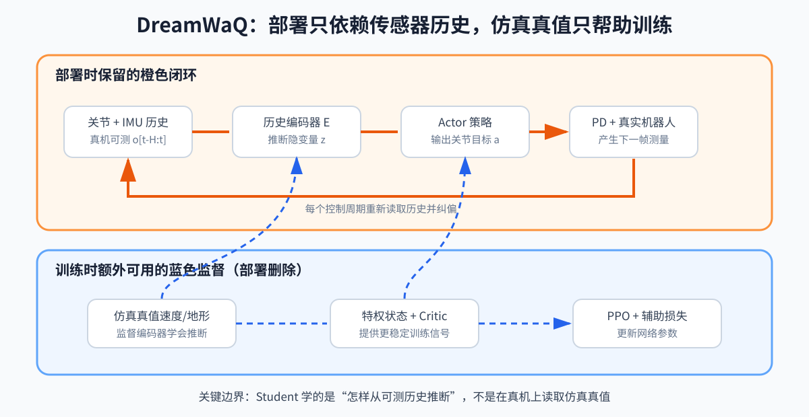

# 第 17 章：特权学习与鲁棒行走——Teacher–Student、DAgger、DreamWaQ

上一章要求 Actor 只能使用真机可获得的观测，但这会遇到一个矛盾：行走需要知道身体速度、地形、摩擦和扰动，真机却往往不能直接、准确、无延迟地测到它们。

如果把仿真真值直接输入策略，训练容易，却无法部署；如果完全丢掉这些信息，策略又可能学不好。特权学习解决的正是这个矛盾：

```text
训练时利用仿真中额外可见的信息帮助学习
部署时只保留依靠真实传感器运行的部分
```

Teacher–Student、非对称 Actor–Critic 和历史编码器是几种不同实现，不应只把它们记成论文名字。

## 1. Teacher–Student

Teacher（教师策略）在仿真中看到特权状态：

```text
o^teacher
=
[
o^deploy,
o^privileged
]
```

Student（学生策略）只看真机可获得的：

```text
o^student
=
o^deploy
```

Teacher 先用 RL（Reinforcement Learning，强化学习）通过试错学到任务上限，Student 再模仿 Teacher 动作：

```text
L_action
=
‖
π_student(o^student)
-
π_teacher(o^teacher)
‖_2²
```

Student 将“不可直接观测的信息”压缩成从历史和本体感知推断出的行为。

## 2. 为什么离线行为克隆会失败

先看行为克隆（Behavior Cloning，BC）在做什么：让 Teacher 在仿真中运行，记录“看到什么观测、采取什么动作”，再把这些记录当作普通监督学习数据训练 Student。若 Student 遇到的状态与数据集相同，这种方法可以很有效。

问题出在闭环执行。假设 Teacher 走路时每一步都把身体倾角保持在 `0°` 附近，所以数据集几乎只有正常姿态。Student 第一步产生了一个小误差，使身体倾斜到 `3°`；下一步它收到的是训练数据中很少出现的观测，动作可能更不准，身体于是倾斜到 `8°`。误差改变了下一时刻的数据分布，新的陌生状态又继续放大误差。

```text
小动作误差
→ 到达 Teacher 很少访问的状态
→ Student 在陌生状态上误差更大
→ 到达更陌生的状态
```

训练数据来自 Teacher 的状态分布，部署数据却逐渐来自 Student 自己的状态分布，这叫 covariate shift（协变量偏移/状态分布偏移）。它不是简单的“数据数量不够”，而是缺少 Student 犯错后真正会到达的恢复场景。

这类似于只用生产系统的成功请求训练故障恢复模型：模型自己造成的新异常状态从未出现在训练集里。下一节的 DAgger 会让 Student 真正进入环境，再请 Teacher 为这些状态补标签。

## 3. DAgger

DAgger 是 Dataset Aggregation，数据集聚合。循环：

1. 让 Student 与环境交互；
2. 在 Student 实际访问的状态上查询 Teacher 应采取的动作；
3. 把这些状态-Teacher 动作对加入数据集；
4. 更新 Student。

关键不是 Teacher 自己执行，而是 Teacher 给 Student 所在状态打标签。

```go
state := env.Reset()
done := false

for !done {
	// 环境实际执行学生策略的动作，使数据覆盖学生会到达的状态。
	observation := studentObservation(state)
	studentAction := student.Act(observation)

	// 教师读取仿真特权信息，为同一状态给出正确动作标签。
	teacherLabel := teacher.Act(privilegedObservation(state))
	replay.Add(observation, teacherLabel)

	state, done = env.Step(studentAction)

	// 用不断扩充的数据集更新学生策略。
	student.Update(replay.Sample())
}
```

## 4. 蒸馏的边界

- Student 通常难超过 Teacher；
- 动作 MSE（Mean Squared Error，均方误差）会平均化多峰行为；MSE 衡量学生动作与教师动作的平方差；
- Teacher 对同一可见观测可能因不同隐藏状态输出不同动作，Student 无法唯一判断；
- 两阶段训练成本高；
- Student 分布仍可能与真机不同。

可以给 Student 加历史编码、概率输出，或蒸馏后再用 RL 微调。

历史并不能创造不存在的信息。只有当隐藏状态已经通过关节响应、IMU、接触或动作延迟在时间序列中留下可辨识痕迹时，Student 才可能推断它。若两种摩擦或扰动在已有历史中产生相同观测，却要求相反动作，任何确定性 Student 都无法同时正确；这时需要新传感器、主动辨识、概率表示或更保守的控制。

## 5. DreamWaQ：一阶段隐式状态估计

DreamWaQ 的重要直觉：

> 真机不可直接测的基座速度、地形等信息，可能从一段关节和 IMU（Inertial Measurement Unit，惯性测量单元）历史中推断出来。

历史编码：

```text
z_t
=
E_ψ(
o_(t-H+1:t)
)
```

- `E_ψ`：参数为 `ψ` 的编码器；
- `H`：历史长度；
- `o_(t-H+1:t)`：最近 `H` 帧观测；
- `z_t`：隐式环境/动力学表示。

显式估计头：

```text
v_hat_t
=
g_v(z_t)
```

估计损失：

```text
L_est
=
‖v_hat_t-v^gt_t‖²
```

- `v^gt_t`：仿真 ground truth（真值）速度；
- 这个真值只在训练时作为监督，不在部署输入中。

Actor：

```text
a_t
=
π_θ(
o_t,z_t,v_hat_t
)
```

训练仍用 PPO（Proximal Policy Optimization，近端策略优化）更新策略，同时加入估计/重建等辅助损失。



读图提示：橙色路径是部署时保留的本体观测和策略动作；蓝色特权信息、真值监督、Critic（价值网络）和虚线损失只用于训练；右侧 PD（Proportional-Derivative，比例—微分）低层控制再把策略动作转换成关节力矩。

## 6. 为什么速度估计尤其重要

速度跟踪奖励通常是 locomotion 的主要目标。单帧 IMU 和关节位置不能可靠给出世界/机身线速度，但历史包含：

- 关节运动变化；
- 身体角速度；
- 接触周期；
- 动作与响应；
- 冲击模式。

编码器可学出与速度和地形有关的隐变量。对于动作模仿任务，完整参考轨迹和关节跟踪更重要，速度估计的相对收益可能没那么突出。

## 7. 隐式与显式估计

显式头的优点：

- 可用真值直接监督；
- 容易诊断误差；
- 给策略清晰物理量。

隐式 latent 的优点：

- 可表示难以命名的摩擦、延迟、地形和负载组合；
- 不受人工选择变量限制。

常见组合是显式估计关键量 + 隐式 latent 表示剩余信息。

## 8. 历史窗口的取舍

历史太短：

- 看不到完整步态周期；
- 难辨别速度和延迟。

历史太长：

- 输入更大；
- 旧信息干扰；
- 推理和训练成本上升。

若策略 50 Hz，历史 25 帧代表 0.5 s。必须把“帧数”翻译成物理时间。

## 9. QDD 与鲁棒学习

硬件进步也是一阶段学习成功的重要背景。QDD（Quasi-Direct Drive，准直驱）关节使用较低减速比，通常有：

- 较低减速比；
- 较好反驱性；
- 力矩控制带宽较高；
- 冲击下更可控的交互。

算法不能脱离本体评价。同一策略结构在高摩擦、高延迟或力矩不足的机器人上可能完全不同。

## 10. 实践选择

选择 Teacher–Student：

- 特权信息非常关键；
- 一阶段难以收敛；
- 有资源训练两阶段；
- 希望改变 Student 的指令接口。

选择 DreamWaQ 类一阶段：

- 硬件和随机化较成熟；
- 希望缩短训练流程；
- 历史中确实包含隐藏状态信息；
- 能设计可靠辅助监督。

二者可以组合，不是互斥标签。

无论采用哪一种，部署时运行的仍是“真实测量历史 → 隐状态估计/策略 → 当前命令 → 真实机器人”的在线闭环。Teacher 和特权真值只负责训练，不会在真机上替 Student 纠错。

## 11. 练习

1. DAgger 中环境执行谁的动作，标签由谁给？
2. Student 为什么不能直接输入仿真中的扰动力真值？
3. 50 Hz 策略使用 40 帧历史，对应多少秒？
4. 隐式 latent 比显式速度估计多表达了什么？

答案：1）通常执行 Student，Teacher 为 Student 到达的状态打动作标签；2）真机无法获得；3）0.8 s；4）未被人工命名的地形、摩擦、延迟、负载等综合信息。
