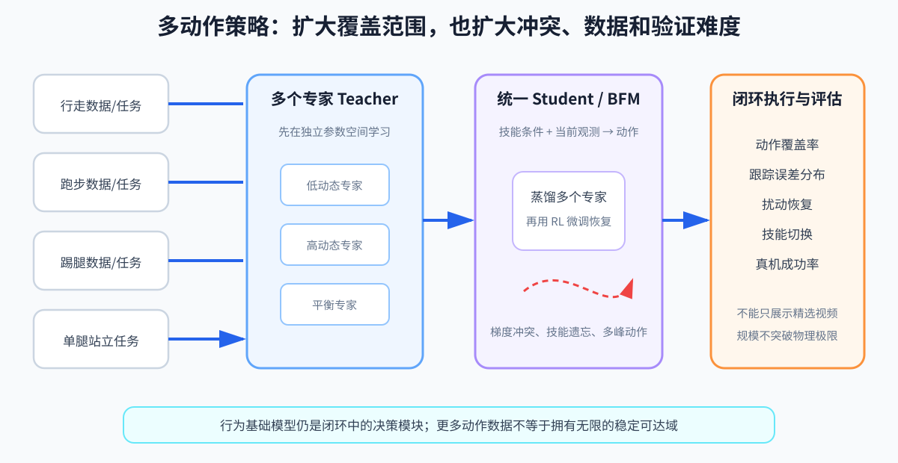

# 第 18 章：多动作策略与 BFM——从三个动作专家到一个行为系统

> **所属部分**：第三部分 · 学习控制。
>
> **前置知识**：[第 14 章：腿足强化学习工程](14-腿足强化学习工程.md)、[第 17 章：动作重映射与模仿学习](17-动作重映射与模仿学习.md)。
>
> **本章先解决一个具体问题**：机器人已经分别会走路、下蹲和踢腿，怎样让同一个策略同时拥有三种能力，并能从一种动作平稳切到另一种？
>
> **下一步**：[第 19 章：Sim2Real 与控制工程](19-Sim2Real与控制工程.md)。

---

## 怎么读这一章

本章其实包含两道难度不同的问题，不要求第一次连续读完：

```text
第 1～8 节：已知要走、蹲、踢，怎样训练并部署一个统一策略

第 9～15 节：不预先列完技能，怎样探索和组织更大的行为空间
```

如果你当前只想知道“走、跑、停是每个动作一个模型，还是一个统一模型”，读到第 8 节就可以停止。此时第一道问题已经完整结束。BFM（Behavior Foundation Model，行为基础模型）、FB（Forward–Backward Representation，前向—后向表征）和潜变量是另一条进阶研究路线，不是现代运控入门必须跨过的门槛，也不是统一策略的必需组件。

---

## 0. 先把两类问题分开

“让一个机器人会很多动作”至少有两条路线。

第一条路线是：我们已经知道要哪些技能，也有相应数据或专家。

```text
走路专家 + 下蹲专家 + 踢腿专家
→ 一个能够按命令调用三种技能的统一策略
```

第二条路线更开放：我们不想事先把所有技能都命名并逐一准备数据，希望机器人先探索自己能够到达的行为空间，以后再通过目标或偏好调用某种行为。

```text
大量无标签探索
→ 学习“哪些行为和状态可达”
→ 使用时再指定目标状态或偏好
```

前一类通常涉及多动作模仿、多 Teacher 蒸馏和统一策略；后一类会出现 FB（Forward–Backward Representation，前向—后向表征）、BFM（Behavior Foundation Model，行为基础模型）等更抽象的行为表征。

它们都在扩大行为覆盖，但不是同一个训练问题。本章先用大部分篇幅讲清第一条，再把第二条作为进阶地图。

已知技能的统一控制，本质上在解决三个矛盾：

```text
意图歧义：相同身体状态，走路、下蹲和踢腿要求不同未来

能力干扰：同一个网络学习新技能时，可能损害已经会的技能

过渡缺口：分别会两个技能，不等于会从一个技能安全进入另一个
```

技能条件解决第一项，专家训练与数据平衡缓解第二项，过渡数据和闭环训练解决第三项。多 Teacher、蒸馏、残差微调只是组织这些工作的工具，不是“多技能”三个字自动带来的能力。



---

## 第一部分：三个专家为什么还不等于一个完整机器人

### 1. 机器人已经有三个单技能策略

现在我们手里有：

- 策略 A：能稳定向前走；
- 策略 B：能从站立慢慢下蹲；
- 策略 C：能抬右腿完成一次踢腿。

每个策略单独运行时都很好。操作者现在发出一段命令：

```text
向前走 2 m
→ 停下并下蹲
→ 起身
→ 踢一下右腿
→ 恢复站立
```

最直接的想法是：需要哪个动作，就切换到哪个策略。

可是在“走路策略”切到“下蹲策略”的那个瞬间，两边对当前状态的理解可能完全不同：

```text
走路策略最后一个动作：
左脚支撑，右脚正在向前摆，身体还有前进速度

下蹲策略训练时见过的开局：
双脚稳定着地，身体几乎静止
```

直接切换后，下蹲策略突然接手一个自己从未见过的状态，可能立刻失衡。

这揭示第一层困难：

> 分别会三个动作，不等于会在三个动作之间生活。

真正的多动作系统不仅要覆盖每个技能内部，还要覆盖技能之间的过渡状态。

---

### 2. 为什么不直接把所有数据塞进一个网络

我们把走路、下蹲和踢腿数据混在一起，训练一个策略。结果可能是：

- 走路依然很好；
- 下蹲只能蹲到一半；
- 踢腿动作越来越小；
- 继续训练踢腿后，走路又开始摇晃。

原因不止一个。

#### 2.1 同一个观测，可能对应不同合理动作

机器人直立静止时：

- 如果命令是“开始走”，下一步应该移重心并迈腿；
- 如果命令是“下蹲”，下一步应该弯曲髋膝；
- 如果命令是“踢腿”，下一步可能先转移到左脚支撑。

只给身体状态而不给技能命令，策略无法知道操作者想要哪一种未来。

所以统一策略至少需要某种条件输入：

```text
a[t] = π(o[t], c[t])
```

- `o[t]`：当前身体观测；
- `c[t]`：技能命令、动作标签、目标状态或未来参考；
- `π`：统一策略；
- `a[t]`：当前动作。

`c[t]` 的作用不是描述机器人现在怎样，而是告诉策略“接下来想做什么”。

若统一策略使用 MLP，常见实现是把 `o[t]` 与 `c[t]` 拼成同一个输入向量：

```text
[身体观测 o[t]，技能条件 c[t]]
→ 同一组 MLP 权重
→ 当前动作 a[t]
```

“统一”的关键是所有技能共用同一组网络参数，并由条件输入消除意图歧义；它不是看到“走路”就暗中换一张 MLP，看到“下蹲”再换另一张。若部署时真的切换不同专家，那是本节后面的路线 B。

#### 2.2 数据量不平衡

假设训练库有：

```text
走路：100 万帧
下蹲：10 万帧
踢腿：2 万帧
```

如果完全随机抽帧，网络绝大多数时间都在优化走路。它即使完全忘记踢腿，对总平均损失的影响也很小。

因此，“我把踢腿数据放进去了”不等于“训练过程真的重视了踢腿”。

#### 2.3 不同技能会争夺同一组参数

走路训练的一次更新可能希望某些参数让摆腿更快；下蹲训练的一次更新却希望同一组参数让动作更慢、更稳定。

数学上，梯度可以先理解为：

```text
为了让某项训练误差下降，网络参数应该往哪个方向改。
```

如果技能 `i` 和技能 `j` 的方向明显相反，会出现：

```text
gradient(L_i) · gradient(L_j) < 0
```

其中：

- `L_i、L_j`：两个技能各自的训练损失；
- `gradient(L_i)`：让技能 `i` 的误差下降时，参数倾向修改的方向；
- 中间的点表示向量点积；
- 点积小于 0，表示两种修改方向总体上相互冲突。

不需要会算这条式子。它只是在表达一个朴素事实：同一套参数同时服务许多不同动作，今天改善一个动作，可能会损害另一个。

#### 2.4 机器人的能力边界不同

动作库里的人类踢腿可能太高、太快；某段下蹲可能要求机器人达不到的关节角；某个转身需要超过摩擦和力矩上限。

统一模型再大，也不能把物理不可行的动作变成可行。数据仍要经过第 17 章的重映射、筛选和闭环验证。

### 2.5 工程上不是只有“一个模型”与“多个模型”两个答案

先再次澄清“动作”这个词：

```text
RL（Reinforcement Learning，强化学习）动作 a[t]：某一个控制周期输出的一组数值
技能：许多周期连续形成的站立、走路、跑步、下蹲等行为
```

不会为每一帧数值动作训练一个模型。真正要选择的是技能怎样组织，常见有三种路线。

#### 路线 A：从零训练一个条件统一策略

```text
身体观测 + 速度/技能/参考命令
→ 同一个 Actor
→ 全身关节动作
```

训练分布同时包含慢走、快走、停止和切换过程。优点是最终结构直接；困难是不同技能从训练早期就会共享参数、争夺数据和梯度。

#### 路线 B：多个专家在部署时切换

```text
上层状态机选择技能
→ 当前专家策略
→ 动作
```

单技能容易做到较强，但切换瞬间容易进入新专家没见过的身体状态，需要专门的过渡控制和安全切换条件。

#### 路线 C：先训练专家，再蒸馏成一个统一策略

```text
多个专项专家
→ 组合教师
→ 统一 Student
→ 最终只部署 Student
```

这是本章接下来重点讲的路线。专家只在训练阶段帮助学生，并不代表部署时必须运行多个网络。

三条路线没有脱离任务的绝对胜负。技能差异、数据量、网络容量、切换要求和训练稳定性会决定具体选择。

---

## 第二部分：先让专家各自学好，再教一个学生整合

### 3. 多 Teacher：让不同技能先在自己的世界里学会

一种清楚的工程路线是先训练多个 Teacher（教师/专家策略）：

```text
走路数据 → 走路 Teacher
下蹲数据 → 下蹲 Teacher
踢腿数据 → 踢腿 Teacher
```

每个 Teacher 只需要解决相对单一的问题：

- 观测和动作接口仍然统一；
- 奖励或模仿目标针对该技能设计；
- 参数不会直接被另外两种技能的梯度拉扯；
- 可以为踢腿分配更多困难状态，而不被海量走路数据淹没。

多 Teacher 不是最终产品。它只是把“先学好各门单科”和“再综合成一个学生”分开处理。

---

### 4. Student 蒸馏：让一个策略模仿三个老师

接下来训练一个统一 Student（学生统一策略）。每次随机选择一个技能 `i`：

```text
选择技能 i
→ 让对应 Teacher_i 在当前观测 o 上给出动作
→ Student 同时读取 o 和技能条件 i
→ 调整 Student，让它的动作接近 Teacher_i
```

放回第 13 章的网络内部看，这里的“调整 Student”就是反向传播并修改**同一张 Student 网络**的 `W、b`。Teacher 的权重不会被复制粘贴成三块后一起部署；它们只在训练时产生动作标签。最终 Student 仍然是一次输入身体观测和技能条件、一次输出全身动作的统一策略。

蒸馏损失常写成：

```text
L_distill = E_(i,o) ‖π_S(o,i) - π_T_i(o)‖²
```

逐项翻译：

- `i`：当前抽到的技能，例如走路、下蹲或踢腿；
- `o`：当前身体观测；
- `π_T_i(o)`：第 `i` 位 Teacher 给出的动作；
- `π_S(o,i)`：Student 在同一观测、同一技能条件下给出的动作；
- 两者相减并平方：Student 越不像老师，损失越大；
- `E_(i,o)`：对许多技能和观测样本取平均；
- `L_distill`：整批数据上的蒸馏误差。

动作接口必须完全一致：

- 关节顺序相同；
- 单位相同；
- 动作缩放相同；
- 默认姿态相同；
- 控制频率相同。

否则，Student 看似在拟合数字，实际却在把一个老师的右膝命令当成另一个接口中的左踝命令。

#### 4.1 为什么蒸馏不能只看离线数据

假设 Student 的踢腿动作比 Teacher 小一点。一次只差一点，连续执行几十步后，身体重心可能越来越偏。Student 进入 Teacher 数据从未覆盖的新状态，错误继续放大。

这与第 15 章行为克隆的分布偏移是同一个问题：

```text
离线单步动作很像
≠ 闭环轨迹一定很像
```

所以还要让 Student 真正在环境中执行，再让 Teacher 对 Student 访问到的状态给标签，或进行后续闭环强化学习微调。

#### 4.2 动作误差很小，接触轨迹仍可能完全分开

假设 Teacher 和 Student 的 29 个关节动作平均只差 `0.01`。这个数字看起来很小，但腿足闭环中存在接触切换：脚早落地几毫秒、晚离地几毫秒，都可能改变冲击、支撑力和下一帧观测。

```text
这一帧只有很小动作误差
→ 落脚时刻发生一点变化
→ 接触冲量与承重脚变化
→ 下一帧身体姿态和速度不同
→ Student 进入另一条闭环轨迹
```

因此：

```text
离线动作 MSE 很小
≠ Student 的长期轨迹接近 Teacher
≠ 接触场景中的成功率接近 Teacher
```

动作 MSE 适合检查“网络有没有基本学到标签”，但最终还必须让 Student 自己驱动仿真，测站立、过渡、接触、扰动和长时间运行。若要判断新 Student 是否伤害旧能力，最好使用第 14 章的同种子、同初始快照成对比较。

---

### 5. 只有三个技能片段，仍然没有学会切换

Student 现在能在“技能条件保持不变”的回合里分别走路、下蹲和踢腿。但如果训练时从未改变过条件，它仍没练过：

```text
走路中的某一刻
→ 收到下蹲命令
→ 先停稳
→ 进入双脚支撑
→ 再开始下蹲
```

解决方法不是只在推理时把标签从 A 突然改成 B，而是把切换本身也放进训练分布。

可以加入：

- 随机时刻切换技能条件；
- 专门的过渡动作数据；
- 从一个技能的中间状态重置到另一个技能；
- 对动作跳变、身体冲击和失衡设置代价；
- 给策略未来几帧参考，让它提前准备；
- 必要时让上层状态机选择安全切换时机。

这里出现一个很重要的分工：

```text
上层：现在允许切到哪个技能、何时切
统一策略：在当前身体状态下怎样连续执行这个意图
```

端到端策略也可以自己学习切换，但物理上的过渡状态仍必须出现在数据和评估中。不给它练，不会因为网络叫“基础模型”就自然拥有。

---

### 6. 残差强化学习（RL）微调：让 Student 为自己的闭环错误负责

蒸馏后，Student 已经大体会三种动作。现在可以在环境中继续用强化学习微调，让它真正承担：

- 摔倒后果；
- 跟踪误差；
- 真实接触；
- 动作切换冲击；
- 外部扰动和参数变化。

一种保守做法是先冻结 Student 主体，只训练一个较小的残差策略：

```text
a[t] = a_student[t] + α · a_res[t]
```

- `a_student[t]`：蒸馏 Student 的基础动作；
- `a_res[t]`：残差网络给出的修正；
- `α`：限制修正幅度；
- `a[t]`：最终送入动作缩放和安全裁剪的动作。

这相当于说：

```text
先保留已经学会的大体动作
→ 只允许新训练做有限修正
→ 确认稳定后再考虑更大范围微调
```

如果策略是随机分布，还可以用 KL（Kullback–Leibler，库尔贝克—莱布勒）散度限制新策略离原 Student 太远：

```text
L = L_PPO + β · D_KL(π_new ‖ π_student)
```

只需理解：

- `L_PPO`：强化学习本身希望优化的部分；
- `D_KL`：衡量新旧策略分布差异；
- `β`：多强地阻止新策略一下子偏离原技能；
- `β` 太小可能忘掉蒸馏动作，太大又可能无法修正闭环缺陷。

残差不是绝对安全保证。最终动作仍可能饱和，仍要经过关节、力矩、速度和碰撞限制，并在真实闭环中验证。

---

### 7. 数据采样：不能让“已经会的动作”永远占满课堂

训练中常出现：

- 走路样本最多，也最容易；
- 下蹲偶尔失败；
- 踢腿和技能切换几乎一直失败。

如果仍按原始数据量采样，训练算力会继续大量花在走路上。

可以为每个动作片段维护失败分数 `e[i]`，失败越严重，采样概率越高：

```text
p[i] = (e[i]+ε)^α / Σ_j (e[j]+ε)^α
```

其中：

- `p[i]`：下次抽到片段 `i` 的概率；
- `e[i]`：片段当前失败或困难程度；
- `ε`：一个很小的正数，避免成功片段概率变成绝对 0；
- `α`：多强地偏向难例；
- 分母把所有概率归一化，使它们加起来等于 1。

但不能只训练最难片段。否则走路一旦被判定为“已经会了”，几万次更新都不再出现，网络又可能慢慢忘掉它。

实际常混合：

```text
一部分按困难程度采样
+ 一部分保持均匀或按技能平衡采样
```

困难采样是处理本节数据失衡的一种工程手段，不属于某个模型名字的自动能力。

[SONIC：Supersizing Motion Tracking for Natural Humanoid Whole-Body Control](https://arxiv.org/abs/2511.07820) 则是另一项“大规模动作跟踪”例子：它同时扩大网络容量、动作数据量和训练计算量，并研究规模增长怎样影响统一人形控制器。它提醒我们，所谓 scale 不是只把网络层数加深；数据质量、覆盖、采样、算力和模型容量必须一起匹配。不能把某篇工作的具体规模经验当作所有项目的固定优先级。

---

### 8. 统一策略完整运行一次

再执行开头那串命令：

```text
1. 上层发送“向前走”条件和速度命令
2. Student 根据当前身体反馈连续输出走路动作

3. 接近目标位置时，上层发送“准备下蹲”
4. 策略先减速、落下摆动脚，进入更适合下蹲的状态
5. 技能条件逐渐或在合适时刻切为“下蹲”
6. 策略闭环执行下蹲

7. 收到“起身并踢腿”命令
8. 策略先恢复站立并把重心转到左脚
9. 再执行右腿踢击
10. 足底和身体反馈显示落脚后，恢复双脚站立
```

这里真正统一的，不只是一个网络文件，而是：

- 一致的观测与动作接口；
- 明确的技能或目标条件；
- 对单技能和过渡状态都覆盖的训练分布；
- 同一个反馈闭环中的连续执行；
- 上层命令、安全逻辑和低层控制的配合。

如果只展示三个精选动作视频，却不展示切换、扰动和失败恢复，就还不能证明系统拥有可用的多动作能力。

### 8.1 “基座—专项专家—组合教师—单网络”到底在做什么

真实项目常出现这样的版本谱系：

```text
从零 PPO（Proximal Policy Optimization，近端策略优化）统一策略
→ 多轮 checkpoint 接力训练
→ 得到综合能力较好的基座策略
→ 从基座分叉出跑步、抗扰等专项专家
→ 组合教师汇集专家长处
→ 蒸馏回一个统一 Student
```

这里的“基座”是一个已经会基本站立、行走和跟随命令的策略 checkpoint，不是机器人动力学里的浮动基座，也不是因为 MLP 网络结构本身稀有。第 13 章已经区分了网络结构和网络参数：难得的是经过大量闭环训练以后，权重 `W、b` 已经进入“会控制这台机器人”的有效区域。

多轮版本接力通常表示：

```text
加载上一版 Actor/Critic
→ 修改奖励、课程、扰动或数据范围
→ 当前策略重新采集大量仿真经历
→ 继续 PPO 更新
```

它不一定每一版都从随机权重重练，也不代表每一版训练相同步数。版本号或 checkpoint 后缀不能直接当成样本数。

专项专家从基座出发，是因为它们不必重新学习最基础的站立和平衡，可以把训练集中在某项短板上。组合教师则是训练期的动作答案来源；最终 Student 把这些能力压回一张统一网络。

还要把“多教师”和“特权学习”分开：

- 教师和 Student 看相同的可部署观测：这是多教师蒸馏；
- 教师选择专家时额外知道真实扰动、摩擦或场景标签：同时属于第 15 章的特权学习；
- PPO 阶段只有 Critic 看到仿真真值：这是非对称 Actor–Critic，不等于 Teacher 给动作标签。

因此，一条完整谱系中可能同时出现“checkpoint 接力”“专项微调”“多教师蒸馏”和“特权学习”，但它们描述的是四件不同的事情。

### 8.2 统一接口，不等于内部必须是一块“纯 MLP”

这一章前面为了建立直觉，把最终 Student 写成一张统一网络。但工程中的“统一”还可以有更宽、也更实用的含义：

```text
上层始终调用同一个输入输出接口
→ 内部可以有共享主干、多个专家、连续门控或短时记忆
→ 最终仍只向下游给出一组全身动作
```

例如一个部署策略可能始终表现为：

```text
1015 维当前观测与历史
→ 一个 ONNX 推理入口
→ 29 维关节动作
```

但 ONNX 内部可以同时保留日常行走专家、恢复专家和一个有界连续 gate（门控）。网络外部还可能有一位因果事件检测器，依据最近几帧 IMU（Inertial Measurement Unit，惯性测量单元）线加速度维护“恢复权限还剩多久”。这依然可以是一个统一部署系统，因为上层不需要手动在“走路模型文件”和“恢复模型文件”之间切换；但它不再是“一个无状态、内部完全同质的 MLP”这句过强假设。

只要门控带有事件记忆，就必须明确：

- trigger：哪些连续证据会触发；
- duration：触发后权限持续多久；
- rearm/reset：什么条件下复位并允许再次触发；
- authority：恢复专家最多能以多大权重覆盖日常策略动作。

这些不是网络权重里的装饰参数。它们会改变闭环行为，必须与模型一起版本化和测试。

[G1-Command-RL](https://github.com/dingda-beep/G1-Command-RL) 最终真机版本提供了一个具体反例：从零 PPO 基座、专项专家与蒸馏一路发展后，最可靠的部署单位并不是“只剩一张纯 MLP 才算成功”，而是 `policy.onnx + deploy_contract + 因果事件状态`。单一调用入口与内部模块化并不矛盾；真正应当追求的是接口清楚、状态可复位、权限有边界、行为可复现。

---

## 第三部分：进阶问题——如果我们不想预先列完所有技能呢

### 9. 从“技能标签”走向“可达行为空间”

前面的 Student 明确知道：

```text
技能 1 = 走路
技能 2 = 下蹲
技能 3 = 踢腿
```

但人的动作远不止三个。为每个动作单独收数据、重映射、训练 Teacher，再加入统一策略，成本很高。

于是出现更开放的问题：

> 能不能先让机器人广泛探索，学习“从当前状态采取某类行为后，未来容易到达哪些状态”，等真正有任务时再指定目标？

先用一个简单房间机器人理解：

```text
训练时：
不逐个写“去门口”“去桌边”“去窗边”的任务，
而是让它探索房间中哪些位置彼此可达。

使用时：
给出“门口”这个目标状态，
让策略调用能够到达门口的行为方向。
```

对人形机器人，“目标状态”可以不只是空间位置，还可能包括身体姿态、关节、速度和接触状态。因此，到达目标可能表现为走到某处，也可能表现为蹲下、转身或摆出某种姿势。

BFM 是 Behavior Foundation Model，行为基础模型。这个名称表达一种愿望：一个模型覆盖较大的行为范围，并能被不同目标调用。但这个术语仍在演化，不能只凭“Foundation Model”就假设它具有语言模型那样的开放泛化能力。

---

### 10. 潜变量 `z`：不是人工写好的技能编号

这类方法常给策略一个潜变量 `z`：

```text
a[t] = π(s[t], z)
```

- `s[t]`：当前状态或观测；
- `z`：选择某种行为方向的内部向量；
- `π`：策略；
- `a[t]`：动作。

`z` 通常不是：

```text
z=1 表示走路
z=2 表示下蹲
z=3 表示踢腿
```

它更像潜空间中的一个方向。改变 `z`，策略可能产生不同的可达行为。某个 `z` 到底代表什么，要通过执行后到达了哪些状态来解释。

这给了系统更连续的行为选择，但也带来困难：

- 很难保证每个 `z` 都对应有意义动作；
- 不同 `z` 可能产生相似行为；
- 学到的动作可能物理可行却很不像人；
- 潜空间在新本体或真机上可能失真。

---

### 11. FB 在尝试学习什么

FB 是 Forward–Backward Representation，前向—后向表征。

第一次阅读只需要把两个模块理解成：

```text
Backward B：把一个未来目标状态编码成“想去哪个行为方向”
Forward F：判断当前状态和候选动作，对这个行为方向有多大帮助
```

一个抽象价值写法是：

```text
Q(s,a,z) ≈ F(s,a,z)^T z
```

不要先推导，先看输入输出：

- `s`：当前状态；
- `a`：候选动作；
- `z`：目标或技能的潜方向；
- `F(s,a,z)`：Forward 网络产生的向量；
- `F(s,a,z)^T z`：两个向量的匹配程度；
- `Q(s,a,z)`：这个动作对于技能方向 `z` 有多好。

如果使用时给出目标状态 `s_goal`，可以先编码：

```text
z_goal = B(s_goal) / ‖B(s_goal)‖
```

意思是：

```text
目标状态
→ Backward 网络编码
→ 把编码归一化成一个方向
→ 交给 Actor 选择动作
```

分母是向量长度；实现中要防止它接近 0 导致除零。

[BFM-Zero：一种可由目标或奖励提示的行为基础模型](https://arxiv.org/abs/2511.04131)会把这种表征用于：

- goal reaching：到达给定目标状态；
- motion tracking：连续编码一串目标状态并跟随；
- reward guidance：根据某种偏好选择潜变量；
- 不更新网络参数，只在允许范围内搜索更合适的 `z`。

搜索可写成：

```text
z_best = arg max_(z∈Z) Score(z)
```

- `Z`：允许尝试的潜变量范围；
- `Score(z)`：采用这个 `z` 后的任务表现；
- `arg max`：返回让分数最高的那个 `z`；
- `z_best`：最终选中的潜变量。

这些公式不是新的机器人力学。它们是在描述“怎样组织和调用已经学到的行为覆盖”。最终动作仍要经过同样的电机、接触和真实反馈。

---

### 12. 为什么自由探索出的动作不一定像人

假设机器人发现一种奇怪但有效的移动方式：半蹲、双臂快速摆动、脚掌持续小跳。

只要这种行为：

- 没违反关节和接触约束；
- 能到达目标状态；
- 在训练分数上表现好；

无监督探索就没有理由拒绝它。

因此：

```text
物理可行
≠ 人类自然
≠ 硬件友好
≠ 公众场景可接受
```

如果需要拟人或特定风格，还要加入：

- 人体或机器人动作数据；
- AMP（Adversarial Motion Priors，对抗运动先验）等运动风格判别器；
- 自碰撞和关节限位；
- 力矩、功率和冲击惩罚；
- 任务条件和安全限制。

[FBCPR](https://arxiv.org/abs/2504.11054) 是 Forward–Backward Representations with Conditional-Policy Regularization，可译为“带条件策略正则的前向—后向表征”。对应工作使用与潜变量条件相关的判别器，鼓励策略覆盖无标签动作数据中的状态。它不是“所有风格损失和物理惩罚”的统称；自碰撞、能耗和硬件限制仍是另外需要明确设计的内容。

这也说明，具体研究缩写不能只凭字母猜模块。MPC（Model Predictive Control，模型预测控制）、PPO（Proximal Policy Optimization，近端策略优化）已有较稳定的通用含义，而 FBCPR 这类方法名必须回到原论文的输入、损失和部署方式理解。

#### 12.1 它和 DeepMimic 的根本差别

DeepMimic 一类方法从参考动作数据出发：

```text
数据先定义“想会什么”
→ 策略学习闭环跟踪这些动作
```

FB 一类方法更强调：

```text
先探索并组织可达行为空间
→ 使用时再用目标或偏好选行为
```

前者目标明确、动作风格直接，但覆盖受数据限制；后者可能覆盖更广，却更难训练和解释，也不保证探索到的都是有意义动作。

它们不是简单的“旧方法”和“新方法”，而是在数据定义、行为覆盖和可控性之间做不同选择。

---

## 第四部分：模型会多少，必须在完整闭环里回答

### 13. 怎样评估一个多动作或行为基础模型

不能只挑选最漂亮的视频。至少分别回答：

#### 13.1 单技能质量

- 走路、下蹲、踢腿各自跟踪误差怎样；
- 与对应单技能专家差多少；
- 动作是否撞限位、饱和或产生大冲击。

#### 13.2 技能覆盖

- 动作库中有多少片段能稳定完成；
- 最差的动作是什么；
- 少数高动态技能有没有被平均指标掩盖。

#### 13.3 技能切换

- 从走路切到下蹲是否稳定；
- 任意两技能都能切，还是只有特定顺序；
- 切换时动作、接触力和身体速度是否突变。

#### 13.4 扰动和分布外状态

- 动作中被推后能否恢复；
- 没见过的技能组合会怎样；
- 参考目标稍微超出训练范围时，是保守退化还是猛烈失控。

#### 13.5 真机闭环

- 仿真中会的动作有多少能上真机；
- 真机延迟、摩擦、执行器和状态估计误差下是否仍稳定；
- 切换和恢复是否经过安全层；
- 连续运行多长时间后仍然可靠。

“能生成很多动作”描述的是输出覆盖；“真实机器人能够稳定、连续、安全地执行很多动作”才是控制能力。

---

### 14. 规模扩大不会取消物理世界

更多动作数据、更大网络、更多并行环境确实可能扩大覆盖，但同时也增加：

- 数据清洗与重映射成本；
- 低质量动作污染；
- 训练算力和复现成本；
- 采样失衡；
- 评估遗漏；
- 分布外恢复时的不可预测动作。

而下面这些边界不会因为模型变大而消失：

- 电机最大力矩；
- 关节活动范围；
- 脚底摩擦；
- 状态估计误差；
- 控制和感知延迟；
- 碰撞与人机安全。

BFM 仍然是完整机器人闭环中的一个决策模块，不是相机、估计器、电机驱动、安全系统和真实反馈的总和。

---

### 15. 把整章压缩成两条故事线

#### 故事一：已知要哪些技能

```text
分别训练走路、下蹲、踢腿 Teacher
→ 用技能条件把意图区分开
→ 蒸馏到统一 Student
→ 让 Student 在自己的闭环状态上继续学习
→ 专门训练技能过渡
→ 平衡简单、困难和旧技能的采样
→ 在真机完整轨迹中评估
```

#### 故事二：不想预先列完技能

```text
广泛探索可达行为
→ 用潜变量组织不同的行为方向
→ 用目标状态或偏好选择 z
→ 必要时加入人类风格和物理正则
→ 检查潜在覆盖是否真的变成稳定真机能力
```

两条路线最后都回到同一个现实：

```text
当前真实机器人
→ 传感器和状态估计
→ 条件化策略或行为模型
→ 动作命令
→ 电机、接触与环境
→ 新的真实机器人状态
```

行为模型扩大的是闭环里“策略可能做什么”，没有取消闭环本身。

---

## 本章小结

- 三个单技能专家不等于一个多技能系统，因为策略还要面对共享参数、数据失衡和技能过渡。
- 多 Teacher、Student 蒸馏、闭环微调和自适应采样，把“分别学会”和“统一执行”分成可管理的阶段。
- 统一部署可以是一张纯网络，也可以是单一入口下的专家、门控和有限状态；判断标准是闭环接口和状态是否完整复现，而不是内部是否只有一种层。
- BFM/FB 进一步尝试学习更大的可达行为空间，并通过潜变量调用行为；潜变量不是天然带名字的技能按钮。
- 行为覆盖不等于拟人、稳定或真机可执行，必须分别评估单技能、切换、扰动、分布外目标和真机安全。

下一章会面对所有仿真训练最终都躲不开的问题：这些策略在仿真中学到的反馈关系，为什么到了真实机器人上会改变？

---

## 练习

1. 为什么三个单技能策略直接切换可能摔倒？
2. 统一策略为什么需要技能条件或未来参考？
3. 为什么困难采样不能彻底取消已学会技能的均匀采样？
4. FB 中的 `z` 通常是人工规定的“走路=1、下蹲=2”吗？
5. 为什么一个模型能生成一千种动作，仍不能证明真机有一千种可靠技能？

参考答案：

1. 新策略可能接手一个自己训练中从未见过的中间状态；
2. 相同身体状态可能对应多种合理未来，条件用来说明现在想做哪一种；
3. 长期不再采样的旧技能会因共享参数继续更新而被遗忘；
4. 通常不是，它是训练中形成语义的潜空间方向；
5. 生成覆盖没有验证执行器、接触、估计误差、技能切换、扰动恢复和长期闭环稳定性。
