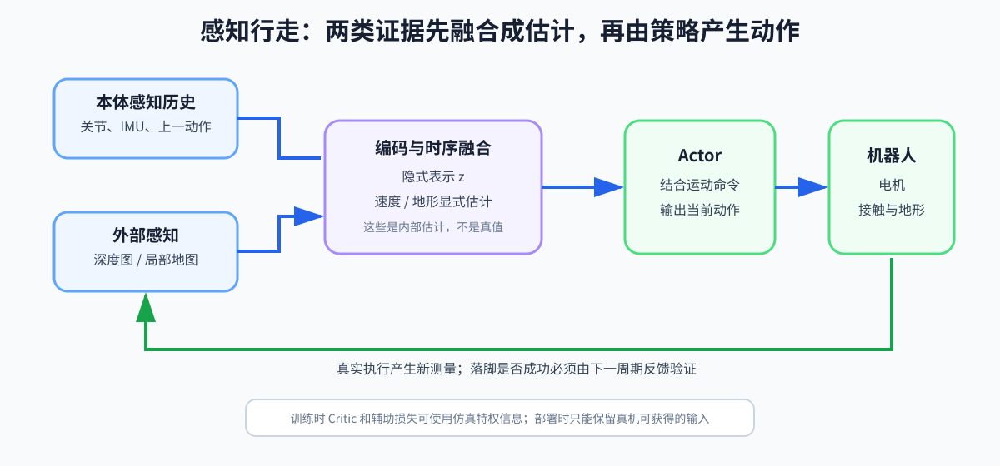
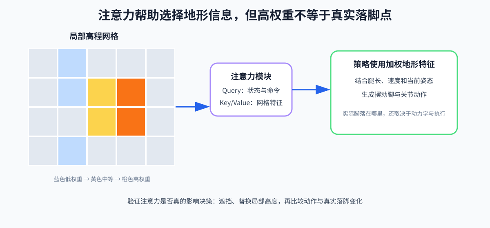

# 第 18 章：感知行走与落足点——从“摸着走”到“看着踩”

盲走策略靠本体感知和历史，在脚碰到障碍后再适应。感知行走把深度图或局部地图纳入控制，以提前选择动作和落脚点。

## 1. PIE 的主线

PIE 的[论文全名](https://arxiv.org/abs/2408.13740)是 **Parkour with Implicit-Explicit Learning Framework for Legged Robots**，可译为“面向腿足机器人跑酷的隐式—显式学习框架”。这里的 Implicit-Explicit 指网络既学习难以直接命名的隐式表示，也显式估计速度、地形等物理量。可以把它的工程主线先概括为“视觉 + DreamWaQ”：

```text
本体历史 → proprio encoder ┐
                           ├→ 时序融合 → latent/速度/地形估计 → Actor
深度图   → depth encoder  ┘
```



PIE 在这里也可代表一类感知一阶段鲁棒行走框架。重要的是理解：策略同时学习状态估计、地形表征和控制。

读图提示：上方 Critic（价值网络）可使用训练期特权观测；中间 Actor（策略网络）产生动作；下方灰色区域把本体历史与深度图进行时序融合，并显式预测速度和地形。部署时不存在仿真特权输入。

深度图、高程图、注意力权重和预测落脚点都只是对环境的证据或内部估计，不是地形真值。它们必须继续被翻译成机器人能达到的脚轨迹、允许的接触时序和身体运动；最终是否真的踩稳，仍由真实几何、摩擦、执行器和反馈决定。

## 2. 深度图是什么

深度图每个像素存相机到场景表面的距离。它不是 RGB（Red-Green-Blue，红绿蓝三通道）颜色图。常见问题：

- 近距离遮挡；
- 空洞和无效值；
- 反光/透明物体；
- 相机外参误差；
- 时延；
- FOV（Field of View，视场）有限，也就是相机能看见的角度范围有限。

仿真与真机应统一：

- 距离单位；
- 裁剪范围；
- 图像方向；
- 无效像素编码；
- 相机位姿和更新频率。

## 3. 为什么需要时序

单帧图像看不出自运动速度，也可能被遮挡。GRU（Gated Recurrent Unit，门控循环单元）或历史堆叠可以融合多帧。

递归形式：

```text
h_t
=
GRU
(e_t,h_(t-1))
```

- `e_t`：当前图像与本体特征；
- `h_(t-1)`：上一时刻隐藏状态；
- `h_t`：当前时序记忆。

Transformer Encoder 若只处理当前 token 集合，本身不自动拥有跨控制周期记忆；必须输入历史 token 或配合递归状态。

## 4. 显式地形与隐式编码

只给策略一个抽象 latent，可能难以探索稀疏沟壑：失败动作得不到足够清晰的地形信用分配。

显式输出可以是：

- 局部高度图；
- 下一步若干候选落脚高度；
- 台阶边缘；
- 可通行概率。

损失：

```text
L_terrain
=
‖
m_hat_t-m^gt_t
‖²
```

- `m_hat_t`：预测地图或高度；
- `m^gt_t`：仿真真值。

显式监督可加快学习，但现实 OOD（Out of Distribution，分布外）地形上错误估计可能误导策略。OOD 指训练数据很少或从未覆盖的新情况。

## 5. 高程图

Robot-centric elevation map（机器人中心高程图）把周围地面离散成网格，每格一个高度：

```text
M∈ℝ^(H× W)
```

- `H,W`：网格高和宽；
- 地图随机器人移动、旋转；
- 2.5D 表示每个水平位置通常只保留一个高度。

它适合地面和台阶，不擅长悬垂物、多层结构和洞穴顶部。

## 6. 注意力落脚点

MHA 是 Multi-Head Attention，多头注意力。它让网络从多个“关注角度”同时挑选重要地形信息。将每个地图点变成 key/value：

```text
k_i,v_i
=
φ(
local geometry_i,
x_i,y_i,z_i
)
```

把机器人状态和运动命令变成 query：

```text
q=ψ(o_proprio,v_cmd)
```

单头注意力权重：

```text
α_i
=
exp(qᵀ · k_i / √d) / Σ_j exp(qᵀ · k_j / √d)
```

- `α_i`：第 `i` 个地图点的重要性；
- `d`：key 的特征维度；
- `√(d)`：缩放，避免点积随维度变大；
- 分母使所有权重和为 1。

地图编码：

```text
z_map
=
Σ_i (α_i · v_i)
```

策略可根据速度命令和当前姿态关注不同位置，隐式形成落脚区域选择。



图中的彩色点表示策略对候选地形位置分配的注意力权重，它们是内部关注区域，不等于已经执行的真实落脚点。

## 7. 注意力不是因果证明

注意力热图能帮助诊断，但高权重点不一定就是策略决策的因果来源。可做更强验证：

- 遮挡高权重区域，观察动作变化；
- 替换局部高度；
- 对地图特征求梯度敏感度；
- 比较预测落脚点与真实落脚点。

## 8. 两阶段课程

常见：

1. 完美地图、简单地形，先学会利用感知；
2. 加入噪声、延迟、位姿误差和复杂地形，训练鲁棒性。

如果一开始地图极差且任务太难，策略可能学会忽略视觉，退化成盲走。应记录遮挡/置零视觉后的性能差异，确认视觉真的被使用。

## 9. 感知时延

若相机 30 Hz、策略 50 Hz、图像处理 40 ms，当前动作看到的可能是两三个控制周期之前的地形。随机化“总延迟”比只加像素噪声更重要。

可以：

- 给策略历史和动作；
- 预测当前地图；
- 时间戳对齐并做状态外推；
- 限制高速运动。

## 10. 失败边界

- 浓烟、强光、透明物导致感知失效；
- 高草等近距离遮挡；
- 前视相机不支持可靠后退/侧移；
- 训练地形缺少墙，策略可能把墙当高台；
- 2.5D 地图漏掉头顶障碍；
- 注意力增加推理负载和训练成本。

系统应在感知不可信时退化到保守盲走或停机，而不是继续输出高动态动作。

因此感知系统除了输出“哪里适合踩”，还应输出置信度、数据年龄或有效性标志。控制器据此选择正常行走、减速、重新观察或停机。没有这种失败出口，感知误差会被下游当成确定参考继续放大。

## 11. 练习

1. 为什么只加高斯像素噪声不足以模拟真机深度相机？
2. Query、Key、Value 在落脚注意力中分别来自什么？
3. 如何检测策略是否完全忽略视觉？
4. 为什么 2.5D 高程图无法完整表示桌子？

答案：1）还存在空洞、遮挡、外参误差、延迟和结构性伪影；2）机器人状态/命令、地图点特征、地图点内容；3）遮挡或打乱视觉并比较性能/动作；4）同一 `(x,y)` 可能同时有地面和桌面两个高度。
