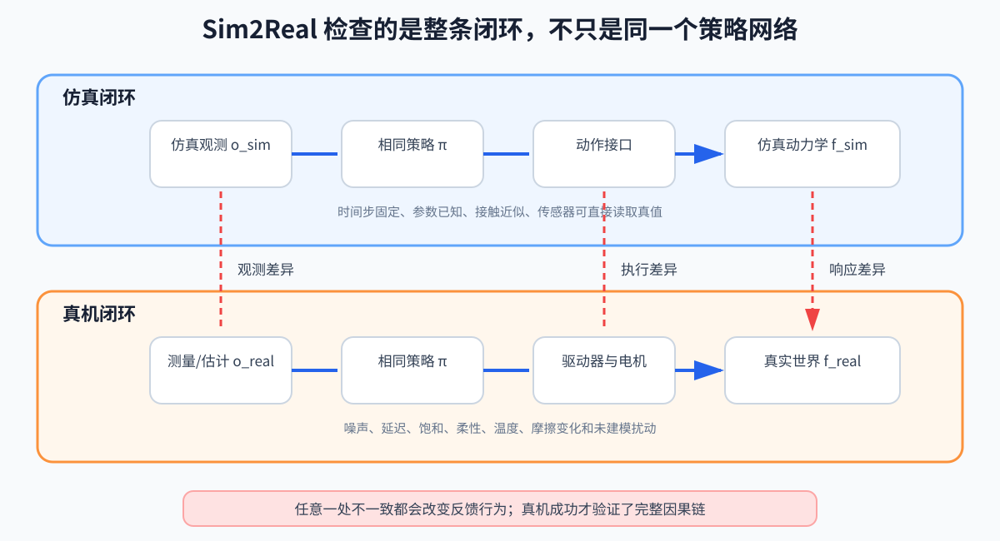

# 第 19 章：Sim2Real 与控制工程——仿真能走，真机为什么不走

> **所属部分**：第四部分 · 集成与实践；传统控制和学习控制在这里汇合。
>
> **前置知识**：[第 05 章](05-状态估计.md)、[第 07 章](07-人形控制系统架构.md)，以及至少一条具体控制路线。
>
> **核心问题**：模型、接口、传感器、执行器和时延的差异怎样沿闭环传播？
>
> **下一步**：[第 20 章：传统控制与学习控制如何选](20-传统控制与学习控制如何选.md)。

## 怎么读这一章

- **第一遍读第 1、5、6、9 节**：先检查观测、命令和真实响应三条接口是否一致。
- **第二遍读第 2～4 节**：再理解接触模型、域随机化和系统辨识分别在补什么差距。
- 第 7～8 节是真机部署安全清单，需要实验前逐项执行，而不是只读一遍。

Sim2Real 是 Simulation to Reality，从仿真迁移到现实。它不是只属于强化学习的问题：传统模型控制也在做“数学模型到现实”的迁移。

## 1. Gap 在哪里

为什么仿真中能走，换到真机却可能立刻发抖甚至摔倒？控制器学到或算出的其实是一个闭环规律：

```text
看到某种观测 → 发出某个动作 → 预期机器人这样响应
```

只要现实中的“观测”“动作”或“响应”有一环和仿真不同，这条规律就可能失效。例如训练中 `0.1 rad` 的关节目标立即生效，真机却有 30 ms 延迟；策略会在旧动作尚未完成时继续纠错，最终形成振荡。

所以 Sim2Real 不是一个神秘的新算法，而是系统地寻找并缩小两套闭环之间的差异。下面的分类是在回答：差异究竟可能从哪里进入系统？

也可以把它写成两套状态转移：

```text
仿真：x_sim[k+1] = f_sim(x_sim[k], u_sim[k], Δt_sim)
现实：x_real[k+1] = f_real(x_real[k], u_real[k], disturbance[k], Δt_real)
```

- `u[k]`：控制器或策略原本发出的命令；
- `u_sim[k]`：仿真执行器模型实际施加的输入；若仿真没有执行器动态，它可能被简单设成等于 `u[k]`；
- `u_real[k]`：真机驱动器、电机和传动系统最终真正实现的输入；
- `Δt_sim、Δt_real`：仿真和真实闭环实际经过的时间步长；
- `disturbance[k]`：真机这一周期受到的未建模外界扰动。

这两行不能都直接写 `u[k]`，否则等于提前假设“仿真和真机完全照着命令执行”，把最常见的执行器差异从公式中删掉了。

在 `f_sim` 中成功，只证明控制器适合所测试的仿真模型和参数分布。真机测试检验的是观测、估计、动作接口、执行器、接触和反馈时序组成的整条因果链，而不只是检查策略网络是否输出了一个看似合理的动作。



### 模型参数

- 质量、质心、惯量；
- 摩擦、阻尼、齿隙；
- 电机力矩常数；
- 鞋底刚度；
- 电池电压和温度。

### 接触

- 仿真地面过平；
- 摩擦模型过理想；
- 穿透深度和接触刚度不真实；
- 时间步长改变冲击；
- 自碰撞几何过简。

### 执行器

- 命令延迟；
- 力矩带宽；
- 饱和和变化率；
- SEA/QDD 等结构差异；
- 低层驱动器内部控制未知。

QDD 是 Quasi-Direct Drive，准直驱，通常低减速比、高力矩密度、较好反驱性。SEA 是 Series Elastic Actuator，串联弹性执行器，在电机和负载间引入弹性元件。

### 传感器和计算

- IMU（Inertial Measurement Unit，惯性测量单元）偏置、编码器噪声；
- 状态估计延迟；
- 丢包和时钟偏差；
- 神经网络/求解器实际耗时抖动；
- CPU（Central Processing Unit，中央处理器）与 GPU（Graphics Processing Unit，图形处理器，擅长大规模并行计算）上的数值差异。

## 2. 仿真器中的接触不是现实复刻

常见接触处理大致包括：

- penalty/spring-damper：允许微小穿透，用弹簧阻尼产生反力；
- constraint/time-stepping：每个时间步求满足非穿透和冲量约束的解；
- soft contact：为稳定和速度使用柔化近似。

没有“对所有任务绝对最真实”的设置。并行训练常牺牲精细接触换吞吐量。

## 3. Domain Randomization

Domain Randomization（域随机化，DR）在训练中随机改变参数：

```text
m∼ U(m_min,m_max)
```

- `U(a,b)`：在区间 `[a,b]` 均匀采样；
- `m`：质量。
- `∼`：从右侧给出的随机分布中采样；
- `m_min、m_max`：训练随机化允许的质量下界和上界。

可随机：

- 质量和惯量；
- 摩擦；
- 电机强度；
- PD（Proportional-Derivative，比例—微分控制）增益；
- 观测噪声；
- 动作延迟；
- 外部推力；
- 地形。

目标不是让策略“见过一切”，而是让它不依赖仿真器某个过于精确的偶然细节。

鲁棒性的含义也不是模型复杂到包含世界全部细节，而是闭环在一组合理的模型误差、噪声和扰动下仍能恢复。扩大随机化范围只有在策略还能从可用观测中辨认并应对这些变化时才有意义。

随机范围太窄无效；太宽则训练问题可能变得不可学。范围应由测量、系统辨识和风险分析驱动。

## 4. System Identification

System Identification（系统辨识，SysID）用真实输入输出数据估计模型参数。

例子：给单关节安全的扫频或阶跃命令，记录位置、速度、电流，拟合：

- 等效惯量；
- 阻尼；
- 静摩擦；
- 延迟；
- 电流到力矩比例。

不要一开始就在全身行走中同时猜所有参数。先做组件级实验，再做整机残差分析。

## 5. 动作接口必须一致

训练输出可能是关节位置偏移：

```text
q_des
=
q_default
+αa
```

- `a`：策略动作，常裁剪在 `[-1,1]`；
- `α`：动作缩放，单位 rad；
- `q_default`：默认站立角。

然后低层 PD：

```text
τ_cmd
=
K_p · (q_des-q)
- K_d · q_dot
```

- `q、q_dot`：由真机传感器或状态估计得到的当前关节位置和速度；
- `K_p、K_d`：与训练一致的逐关节位置和速度增益；
- `τ_cmd`：PD 请求的关节力矩命令，不是真实电机已经实现的 `τ_real`。

驱动器限幅、延迟和电机动态仍会造成 `τ_real≠τ_cmd`。日志最好同时记录策略动作、`q_des`、`τ_cmd` 和电机反馈，才能判断差异在哪一层产生。

真机必须和训练时保持：

- 关节顺序；
- 正负方向；
- 零位；
- 动作缩放；
- 增益；
- 控制频率；
- 动作保持方式；
- 延迟模型。

这类接口错误比“算法不够先进”常见得多。

## 6. 观测接口必须一致

检查：

- 观测顺序；
- 坐标系；
- 归一化均值和尺度；
- 历史帧顺序；
- 重力投影定义；
- 速度是世界系还是身体系；
- 四元数顺序；
- 是否使用仿真真值。

一阶段策略若偷偷使用了真机不可测的质心真速度，就不是可部署策略。

## 7. 渐进式部署

推荐门控：

1. 离线回放真实日志，检查策略输出范围；
2. 软件在环（SIL，Software-in-the-Loop）：真实控制软件连接模拟机器人；
3. 硬件在环（HIL，Hardware-in-the-Loop）：把真实控制器或驱动硬件接入测试，但暂不让机器人承重；
4. 吊架/保护绳下低增益站立；
5. 原地踏步；
6. 低速行走；
7. 逐步扩大命令和扰动范围。

每一级都定义进入条件和回退条件，不凭“看起来差不多”升级。

## 8. 安全预算

真机实验前至少明确：

- 最大关节力矩、速度、位置；
- 最大动作变化率；
- 可接受机身 roll/pitch；
- 急停链路；
- 通信超时时间；
- 电机温度阈值；
- 吊架承载和人员站位；
- 摔倒后的动作策略。

机器人摔倒不是普通异常，它会改变传感器、接触和机械结构状态。恢复控制应是单独设计的行为。

## 9. 诊断顺序

真机一启动就异常：

1. 检查关节索引、方向、零位和单位；
2. 检查控制频率与延迟；
3. 检查观测坐标系与归一化；
4. 检查 PD 增益和动作缩放；
5. 检查力矩饱和；
6. 再检查模型参数和训练分布；
7. 最后才考虑更换算法。

这种顺序先排除离散的软件契约错误，再处理连续的模型误差。

## 本章小结

- Sim2Real 是模型、传感器、动作接口、执行器、接触和时延组成的整条闭环差异，不只属于强化学习。
- 随机化用于覆盖不确定性，系统辨识用于缩小已知误差；二者都不能修复训练与部署接口不一致。
- 真机部署应按观测、动作、模型、求解/策略、驱动和反馈顺序诊断，并设置明确安全预算与降级出口。

## 10. 练习

1. 域随机化和系统辨识分别解决什么？
2. 为什么训练与部署的 PD 增益不同会造成大 gap？
3. 一个策略使用了仿真真值线速度，真机有什么替代方案？
4. 为什么真机部署应该从站立而不是直接跑步开始？

答案：1）DR 提高对参数分布的鲁棒性，SysID 缩小模型中心值误差；2）相同动作对应完全不同力矩和闭环动态；3）状态估计、历史编码器或 Teacher–Student 蒸馏；4）减少接触模式、速度和能量，便于隔离接口与估计问题。
