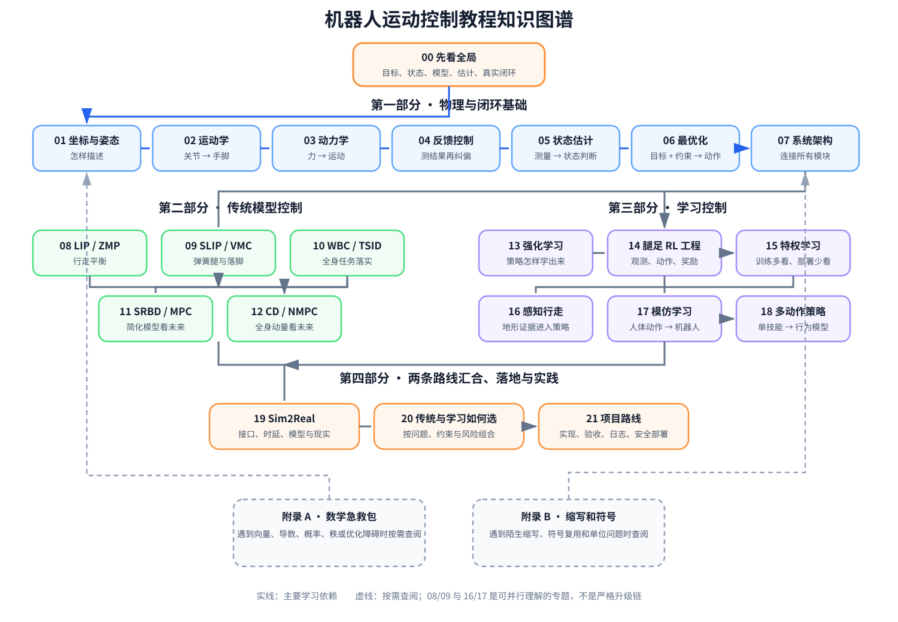

# 机器人运动与控制：给软件工程师的入门教程

这套教程写给没有系统学过机器人学、数学基础可能已经生疏的软件工程师。它不要求先背公式，而是从真实控制问题出发，逐步建立“状态 → 模型 → 估计 → 决策 → 电机 → 反馈”的完整认识。

## 从这里开始

第一次阅读请先打开：[导读：知识地图、章节依赖和学习路线](导读.md)。

导读会说明：

- 为什么状态估计属于所有控制方法的共同基础；
- 传统控制和学习控制分别从哪里开始；
- 每一章依赖哪些前置知识；
- 数学急救包应该在什么时候查，而不是要求你先一次读完；
- 怎样从阅读过渡到可验收的项目。



## 全书结构

### 入口

| 章 | 内容 | 解决的问题 |
|---|---|---|
| 00 | [先看全局](00-先看全局.md) | 运控系统究竟在做什么 |

### 第一部分：物理与闭环基础

| 章 | 内容 | 解决的问题 |
|---|---|---|
| 01 | [坐标系与姿态](01-坐标系与姿态.md) | “位置和方向”如何严谨表达 |
| 02 | [运动学与雅可比](02-运动学与雅可比.md) | 关节如何决定手脚的位置和速度 |
| 03 | [动力学与接触](03-动力学与接触.md) | 力矩、运动和地面反力如何关联 |
| 04 | [反馈控制基础](04-反馈控制基础.md) | 为什么机器人必须不断测量和纠偏 |
| 05 | [状态估计](05-状态估计.md) | 测量怎样变成控制器使用的状态判断 |
| 06 | [最优化控制](06-最优化控制.md) | 目标互相冲突、能力又有限时怎样选择 |
| 07 | [人形控制系统架构](07-人形控制系统架构.md) | 导航、规划、控制、估计和安全层怎样连接 |

### 第二部分：传统模型控制

| 章 | 内容 | 解决的问题 |
|---|---|---|
| 08 | [LIP 与 ZMP](08-LIP与ZMP.md) | 简化质心动态平衡为何可计算 |
| 09 | [SLIP 与 VMC](09-SLIP与VMC.md) | 弹簧腿、落脚点和动态运动 |
| 10 | [WBC 与 TSID](10-WBC与TSID.md) | 多任务、接触约束与关节力矩 |
| 11 | [SRBD 与凸 MPC](11-SRBD与凸MPC.md) | 用简化模型预测接触力 |
| 12 | [质心动力学与 NMPC](12-质心动力学与NMPC.md) | 全身协调的预测控制 |

### 第三部分：学习控制

| 章 | 内容 | 解决的问题 |
|---|---|---|
| 13 | [强化学习基础](13-强化学习基础.md) | 观测怎样经过 MLP 变成动作，策略又怎样从反复尝试中学会反馈 |
| 14 | [腿足强化学习工程](14-腿足强化学习工程.md) | 怎样亲手定义站立与速度跟踪训练题目 |
| 15 | [特权学习与鲁棒行走](15-特权学习与鲁棒行走.md) | 训练老师看得到真值，真机学生怎样行动 |
| 16 | [感知行走与落足点](16-感知行走与落足点.md) | 怎样从看见台阶走到真实踩稳 |
| 17 | [动作重映射与模仿学习](17-动作重映射与模仿学习.md) | 人体动作怎样变成机器人可执行的闭环参考 |
| 18 | [多动作策略与 BFM](18-多动作策略与BFM.md) | 三个动作专家怎样变成一个行为系统 |

### 第四部分：集成与实践

| 章 | 内容 | 解决的问题 |
|---|---|---|
| 19 | [Sim2Real 与控制工程](19-Sim2Real与控制工程.md) | 为什么模型或仿真可行，真机仍可能失败 |
| 20 | [传统控制与学习控制如何选](20-传统控制与学习控制如何选.md) | 按问题、约束和风险选择或组合方案 |
| 21 | [从零到站立行走的项目路线](21-项目路线.md) | 把知识变成分阶段、可验收的工程 |

### 按需查阅的附录

| 附录 | 内容 | 使用方式 |
|---|---|---|
| A | [数学急救包](附录A-数学急救包.md) | 遇到向量、导数、秩、概率或优化符号障碍时，按导读索引查对应小节 |
| B | [缩写和符号速查](附录B-缩写和符号速查.md) | 遇到陌生缩写、符号复用或单位问题时查阅 |

## 贯穿全书的一条主线

```text
人的目标 → 任务与参考 → 控制器/策略 → 电机 → 真实机器人与环境
                         ↑                    │
                         └─ 估计状态 ← 传感器 ┘
```


控制器不是“输入目标，直接返回正确动作”的魔法函数。它持续面对几类性质不同的信息：

- `x_real`：真实世界当前是什么状态，通常无法完整直接读取；
- `y`：传感器实际测到了什么；
- `x_hat`：估计器根据证据形成的当前判断；
- `u`：控制程序发出的命令；估计器会用已经发出的旧命令帮助预测状态；
- `u_real`：驱动器、电机和传动最终在现实中实现的输入，可能因为饱和、延迟和摩擦而不同于 `u`；
- `f_model`：程序内部关于“状态怎样随时间和输入变化”的近似规则；
- `h_real`：现实中的传感器怎样把真实状态变成读数 `y` 的过程；
- `x_model`：内部模型根据 `x_hat`、候选 `u` 和时间步长预测出的状态。

区分命令与现实输入、真实状态、传感器测量、状态估计和模型预测，是理解后续所有传统控制与学习控制方法的基础。符号表只能帮助查询；每个符号第一次进入因果链时，正文仍应说明它从哪里来、被谁使用以及为什么需要它。

## 文档约定

- 公式使用普通 Markdown 可显示的纯文本写法；
- 每个关键公式紧邻符号、维度或单位解释；
- Go 代码用于表达数据流和算法结构，不绑定特定数值库；
- 英文全称用于检索论文和代码，中文解释用于理解职责；
- 软件类比只能补充物理例子，不能代替物理解释；
- 每章开头说明所属部分、前置知识、核心问题和下一步。

## 与原始蓝本的关系

本教程由《人形机器人运动控制 Know-How》蓝本重构而来。当前仓库不包含蓝本文件。教程保留“建模 + 求解”的总框架，同时重新组织数学地基、传统控制、学习控制、状态估计、Sim2Real 和项目路线，使内容可以被初学者按依赖关系学习。
