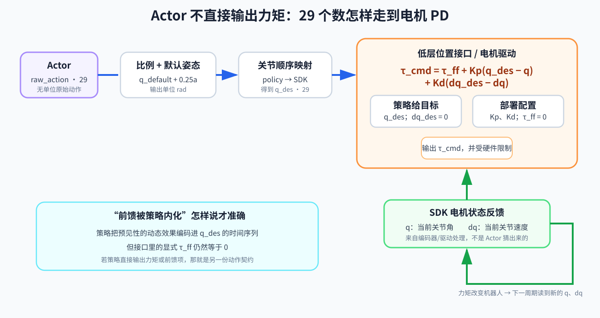

# 06 动作设计：网络输出怎样变成力矩

## 6.0 先把真实接口完整写出来

许多电机位置接口可以用下面的关系理解：

\[
\tau_{cmd}
=\tau_{ff}
+K_p(q_{des}-q)
+K_d(\dot q_{des}-\dot q)
\]

把每个变量钉在程序中：

| 变量 | 是什么 | 在当前参考部署中从哪里来 |
|---|---|---|
| \(q\) | 当前关节角反馈 | SDK 的电机状态 `motor_state.q()`，通常来自编码器和驱动处理 |
| \(\dot q\) | 当前关节速度反馈 | SDK 的电机状态 `motor_state.dq()`，可能是测量或驱动估计后的速度 |
| \(q_{des}\) | 期望关节角 | actor 输出经过动作比例、默认姿态和关节映射后得到 |
| \(\dot q_{des}\) | 期望关节速度 | 当前 G1 位置策略部署把电机命令中的 `dq` 设为 0 |
| \(\tau_{ff}\) | 显式前馈力矩 | 当前参考部署把电机命令中的 `tau` 设为 0 |
| \(K_p,K_d\) | 位置和速度反馈增益 | 由部署配置加载，进入相应 SDK 电机槽位 |
| \(\tau_{cmd}\) | 低层接口期望产生的命令力矩 | 由电机驱动/低层控制根据以上量形成，受硬件限制保护 |

因此当前案例的程序链可以准确写成：

```text
q, dq = read_motor_state()
raw_action = actor(observation)
q_des = q_default + 0.25 × raw_action
dq_des = 0
tau_ff = 0
send(q_des, dq_des, Kp, Kd, tau_ff)
```

这就是“网络输出 29 个数”与“电机产生力矩”之间缺失的全部接口骨架。



## 6.1 网络没有直接控制“走路”

本案例的 actor 最后一层输出 29 个数：

\[
a=[a_1,a_2,\ldots,a_{29}]
\]

第 \(i\) 个数只对应一个关节。它先被解释为相对默认姿态的位置增量：

\[
q_i^{target}=q_i^{default}+s_i a_i
\]

当前示例的 \(s_i=0.25\;rad\)。若某个膝关节默认角为 `0.3 rad`，网络输出 `0.4`，那么：

\[
q^{target}=0.3+0.25\times0.4=0.4\;rad
\]

这个 `0.4` 是关节目标角，不是电机力矩。接下来低层 PD 才根据目标与现实误差产生力矩：

\[
\tau_i=K_{p,i}(q_i^{target}-q_i)-K_{d,i}\dot q_i
\]

所以完整链路是：

```text
actor 的 29 个归一化动作
→ 动作比例与默认姿态
→ 29 个关节目标角
→ 关节重排、限位和变化率限制
→ 低层 PD
→ 力矩
→ 电机与机器人运动
```

## 6.2 为什么常用“位置目标 + PD”

它给 RL 一个相对平滑、容易学习的动作接口：

- 默认姿态提供合理中心；
- 动作比例限制一次输出能偏离多远；
- PD 把位置误差转换成恢复力矩；
- 快速低层环能在两个策略时刻之间持续响应。

这也解释了为什么你用 PD 公式训练的策略能部署到真机：只要仿真和真机对动作、目标、增益、周期的解释足够一致，策略学习到的就是“怎样移动关节目标来协调身体”，而不是绑定某个仿真器的神秘命令。

可以说策略把许多“为了走路应当提前怎样用力”的效果编码进了 \(q_{des}\) 的时序：它知道下一帧应把目标往哪里移动，PD 随后依据误差产生力矩。但要严格区分：这叫**通过位置目标间接形成动态效果**；接口中的显式 \(\tau_{ff}\) 仍然是 0。若另一套策略直接输出前馈力矩，它就是另一种动作契约。

## 6.3 PD 参数也是策略环境

将目标代入 PD：

\[
\tau=K_p(q^{default}+sa-q)-K_d\dot q
\]

可以看出，即使 actor 输出完全一样，改变 \(K_p\)、\(K_d\)、默认姿态或动作比例，最终力矩都会改变。它们都是策略所处环境的一部分。

例如部署端把 `scale=0.25` 误写成 `0.5`，策略每个动作的幅度翻倍；把 `Kp=40` 误写成 `100`，同样的位置误差产生更大力矩。网络本身没变，闭环系统已经变了。

单关节近似下，可先用二阶极点/自然频率配置：

\[
K_p=J\omega_n^2,\qquad K_d=2\zeta J\omega_n
\]

- \(J\)：该关节附近采用的等效转动惯量近似；
- \(\omega_n\)：希望闭环响应有多快；
- \(\zeta\)：希望阻尼多大。

它把“拍脑袋调 Kp/Kd”变成明确起点。但人形各关节的等效惯量会随姿态、其他关节和落脚接触改变，驱动器还有延迟、限流、摩擦和柔性。因此公式给出**初始设计与量级解释**，最终仍需仿真、台架和受控真机逐级验证；策略训练也必须使用准备部署的增益或其合理随机范围。

## 6.4 为什么不直接输出力矩

直接力矩控制并非错误，它能给予策略更直接的控制权，也常用于研究。但对本案例，位置目标接口更容易利用现有真机低层控制与稳定的高频跟踪。

两种接口的取舍是：

| 接口 | 优点 | 代价 |
|---|---|---|
| 关节位置目标 + PD | 平滑、复用低层控制、工程常见 | 策略受 PD 动态影响，仿真与真机增益必须对齐 |
| 直接力矩 | 表达直接、少一层动作解释 | 对模型、频率、噪声和安全更敏感，真机接口未必开放 |

不要把“更底层”自动理解为“更先进”。合适的动作空间取决于执行器接口、任务和验证能力。

## 6.5 三层限幅

动作安全不应只依赖网络输出分布：

1. **归一化动作限幅**：限制 \(a_i\)；
2. **关节目标限幅**：限制 \(q_i^{target}\) 在批准范围内；
3. **目标变化率限幅**：限制相邻周期 \(q_i^{target}-q_{i,prev}^{target}\)。

底层还应有力矩、电流、速度和硬件限位保护。限幅会改变策略实际收到的反馈，因此部署使用的处理最好在训练和评估中也出现。

## 6.6 `last_action` 到底是哪一个动作

观测里的 `last_action` 必须明确定义：

- 是网络原始输出？
- 是裁剪后的归一化动作？
- 是乘比例后的增量？
- 还是最终关节目标？

当前参考实现中的 `last_action` 是动作管理器保存的**原始策略动作**，也就是进入 `scale` 和 `offset` 之前的 29 个数。自建部署端必须与之完全一致。否则策略以为自己上次要求了归一化动作 `0.4`，实际收到的历史却可能是处理后的 `0.4 rad` 目标值；两者数值偶尔相同，语义却不同。

## 6.7 本章检查

当策略输出全零时，机器人目标姿态是什么？

答案是 `q_default`，不是全关节零度。这是验证动作链最简单也最重要的测试：向动作处理器输入 29 个零，逐项核对输出是否等于训练默认姿态，再核对它们被发送给正确电机。

如需复习 PD 为什么能由目标位置产生恢复力矩，可回到运控教程的[关节 PD 增益从零推导](../运控/关节PD增益从零推导-为什么简单公式能用于RL真机.md)。
