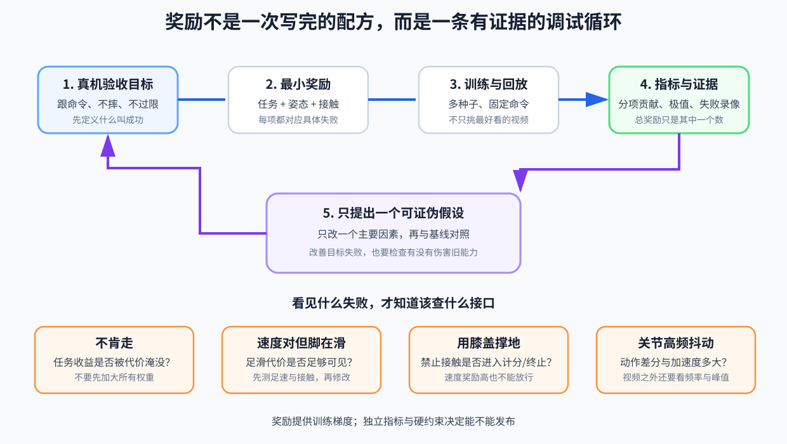

# 08 奖励设计与奖励漏洞

## 8.0 奖励函数的输入和输出

把奖励写成程序接口：

```text
reward_scalar, reward_terms = reward_fn(
    current_state,
    next_state,
    velocity_command,
    action,
    contacts
)
```

- 输入是仿真器知道的本步前后状态、命令、策略动作和接触；
- 输出给 PPO 的核心是一个标量 `reward_scalar`；
- `reward_terms` 是为了让程序员看清每项贡献而记录的明细。

奖励不是部署输入。真机运行 actor 时通常不会一边计算奖励一边改网络；奖励只在训练阶段把“这次状态转移有多好”写进 rollout。



## 8.1 奖励不是愿望清单

奖励函数在每个策略步给出一个数：

\[
r_t=\sum_k w_k r_{k,t}
\]

训练算法寻找能让长期累计奖励更大的行为。它不会理解“优雅”“像人”“安全”这些未被准确表达的词，也不会自动遵守你心里没写出来的规则。

因此奖励设计不是把所有好词各写一项，而是：

> 用可计算信号区分希望保留和必须排除的行为，同时用独立验收指标检查策略有没有找到歪路。

## 8.2 从最小闭环开始

对于速度行走，最小任务信号是：

- 跟踪水平线速度；
- 跟踪转向角速度；
- 存活或保持有效姿态。

但只用速度奖励可能出现：机器人用膝盖摩擦地面移动、身体剧烈摇晃却平均速度正确、脚不断打滑。于是加入行为质量项：

- 惩罚竖直速度和横滚/俯仰角速度；
- 惩罚身体倾斜和高度偏差；
- 惩罚足部滑动和非足部接触；
- 惩罚关节限位、过大速度/加速度；
- 惩罚动作突变和能耗；
- 鼓励合适的交替步态和抬脚高度。

这些项不是“越多越专业”。每一项都必须回答：它阻止哪个具体失败行为？

## 8.3 权重不能脱离数值尺度

假设：

```text
速度奖励原始值约 0~1，权重 1
关节加速度平方和原始值约 100000，权重 -0.000001
```

第二项虽然权重看起来小，乘上原始值后可能与任务奖励同量级。只比较权重数字没有意义，应记录每一项的：

\[
\text{每步贡献}=w_k r_{k,t}
\]

训练面板至少画出各奖励项的未加权统计和加权贡献。否则你以为在优化速度，实际可能由姿态或动作平滑惩罚主导。

## 8.4 指数跟踪奖励在做什么

常见速度跟踪形式是：

\[
r_v=\exp\left(-\frac{\lVert v-v^{cmd}\rVert^2}{\sigma^2}\right)
\]

- 误差为零时奖励接近 1；
- 误差增大时奖励平滑下降；
- \(\sigma\) 决定多大误差仍能得到明显信号。

若 \(\sigma\) 太小，初始策略几乎到处得到零，难以区分“很差”和“稍微没那么差”；太大则跟踪很不准也能得高分。它不是纯数学美观，而是在调节学习信号的可见范围。

## 8.5 四个典型奖励漏洞

### 漏洞一：速度对了，但身体方式不对

只奖励基座速度，策略可能滑行、蹭地或大幅摆臂。修正前先回放并确认原因，再加入足滑、非期望接触、姿态或动作质量指标。

### 漏洞二：为了不摔，拒绝移动

存活奖励和稳定惩罚过强，速度收益不够，最优办法可能是站着不动。检查零命令与非零命令下各项贡献，确认跟踪改善能抵消必要的运动代价。

### 漏洞三：高频抖动骗过平均量

平均速度正确，但关节目标每步剧烈跳变。需要查看动作差分、关节加速度、力矩和频谱，而不是只看轨迹视频。

### 漏洞四：回合结束规则被利用

如果摔倒后不再承受后续惩罚，策略可能发现“早摔反而少扣分”。终止奖励、超时处理和回报统计必须一起检查。

## 8.6 先建立“失败录像 → 指标 → 修改”链

不要看到不好看就同时修改十个权重。一次规范迭代是：

```text
观察：零命令时持续踏步
证据：足速、动作变化率和能耗在零命令区偏高
假设：训练分布缺少显式站立样本，且跟踪项不区分静止质量
改动：增加站立环境比例或命令条件化静止约束
对照：保持其余配置不变，多随机种子重训
验收：零命令改善，且行走跟踪未显著退化
```

这叫可证伪的实验。若一次改很多项，即使结果变好，也不知道真正原因。

## 8.7 奖励与验收必须分家

如果选 checkpoint 仍只按总奖励最高，策略会被你写下的同一套偏好既训练又裁判。独立验收应包括未直接优化的量、分布外边缘、多随机种子和长时测试。

奖励用于提供梯度；验收用于决定能否发布。二者目标相关，但角色不同。

## 8.8 面对新机器人，奖励按能力一层层长出来

不要第一天就复制一份包含二十项的“豪华奖励”。一个更能排错的生长顺序是：

### 第一步：只证明能维持有效状态

小范围初始姿态、零命令、平地。用姿态、高度、禁止接触、关节限位和存活相关信号建立站立基线。此时发现摔倒，优先排查模型、默认姿态、PD 与观测，不要先怪步态奖励。

### 第二步：让任务收益足以推动它移动

加入小范围前向速度跟踪。若策略仍站着不走，比较“移动带来的跟踪收益”和“动作、能耗、姿态惩罚”，确认后者没有把一切运动压死。

### 第三步：纠正它找到的歪方法

只有录像和指标确认出现脚滑、蹭地、抖动或撞限位后，才加入对应项或硬约束。每加一项都做消融：它是否真的减少目标失败？是否损害跟踪和恢复？

### 第四步：扩展技能时做条件化

加入零命令、横移和转向后，某些要求要随命令变化。例如行走时希望交替迈步，零命令时却希望安静站立；无条件的强步态奖励可能逼机器人原地踏步。

### 第五步：随机化后重新检查奖励尺度

质量、摩擦和延迟变化会改变能耗、误差和动作量的分布。原来平衡的权重可能不再平衡，因此要重新查看各分量贡献，而不是假设奖励一旦写好永远不动。

这套顺序的本质是：**奖励不是先验配方，而是任务定义、失败证据和对照实验之间不断收紧的接口。**
