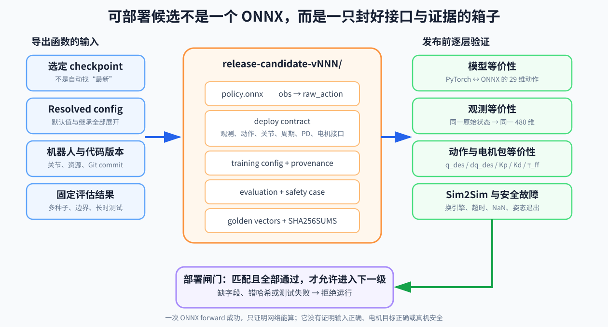

# 13 导出模型与部署契约

## 13.0 导出程序真正的输入输出

```text
policy.onnx, deploy_config, provenance = export(
    selected_checkpoint,
    resolved_training_environment,
    robot_joint_definition,
    software_versions
)
```

如果导出函数只接收 checkpoint，它就无法可靠知道关节顺序、默认姿态、观测历史和周期。配置必须从实际解析后的训练环境一同产生，不能在部署端重新猜。



## 13.1 冻结候选版本

当某个 checkpoint 通过固定评估集后，不要让部署端“自动找最新模型”。应明确冻结：

```text
run id
checkpoint 路径与哈希
训练代码 commit
解析后的环境/算法配置
机器人资源版本
评估报告版本
```

任何训练继续、配置改动或重新导出都生成新的候选版本。

## 13.2 官方 play 脚本做了两件事

当前 Unitree RL Lab 的 play 流程会加载 checkpoint，并导出：

```text
exported/policy.pt
exported/policy.onnx
```

如果网络带有观测 normalizer，导出函数还需要把它一起包含，避免训练端先归一化而部署端忘记。

另外，项目的部署配置导出会提取：

- `joint_ids_map`；
- `step_dt`；
- stiffness、damping、默认关节位置；
- 命令范围；
- 动作比例、偏移、裁剪和受控关节；
- 每项观测的参数、缩放、裁剪和历史长度。

这说明官方工作流本身也把“网络 + 配置”当成共同部署产物。

还要再多看一层代码：当前 G1 部署的 `deploy.yaml` 保存了 Kp/Kd，但 `dq_des=0` 与 `tau_ff=0` 是部署状态进入时由 C++ 明确设置的。它们虽然不在 YAML 中，仍然是策略动作含义的一部分。完整的发布契约应把这种“代码中固定的接口选择”也显式记录，不能误以为配置文件没写就代表不存在。本教程的教学 JSON 因此专门增加了 `motor_interface` 字段。

## 13.3 契约至少要回答什么

### 时间

```text
physics_dt
decimation
policy_period
允许的状态年龄
推理 deadline
```

### 观测

```text
项的精确顺序
每项维度和单位
坐标系
相对量的参考值
缩放、裁剪与归一化
历史长度、排列和初始化
```

### 动作

```text
维度和关节语义
动作类型
比例与偏移
裁剪和变化率限制
关节顺序到 SDK 顺序的映射
PD 增益与低层模式
```

### 安全与来源

```text
命令包络
状态/动作有限数检查
关节与姿态边界
超时和失联行为
模型、配置、代码和机器人版本
```

## 13.4 为什么不能在 C++ 里重新猜一遍

最脆弱的做法是：训练工程里写一套观测，部署工程师凭文档在 C++ 中另写一套。即使双方都“理解正确”，也可能在顺序、角度单位、坐标旋转、历史初始化或限幅时机上分叉。

更稳妥的方法：

1. 从已解析的训练环境自动导出机器可读契约；
2. 部署程序只从契约加载，不维护第二份魔法数字；
3. schema 校验拒绝缺字段、错维度和未知版本；
4. 使用 golden vector 做跨语言逐项测试；
5. 模型与契约哈希绑定，禁止混配。

## 13.5 三个必须做的等价性测试

### 固定输入测试

给相同 480 维观测，PyTorch 与 ONNX 的 29 维动作应在规定数值容差内一致。

### 原始状态到观测测试

给相同 IMU、关节、命令和历史，训练端与部署端产生的 480 个值逐项一致。这比只测网络更重要，因为大量部署错误发生在网络之前。

### 动作到电机目标测试

给相同动作，训练端和部署端经过 scale、offset、clip、rate limit 与 joint map 后，得到相同的 SDK 电机目标。

## 13.6 数值容差不是“差不多就行”

浮点后端可能有微小差异，应根据数据类型和网络测试设定绝对/相对容差。但以下情况不能用容差掩盖：

- 一整段观测顺序错位；
- 符号相反；
- 角度与弧度混用；
- 历史帧颠倒；
- 关节映射错误；
- normalizer 遗漏。

容差用于接受数值实现差异，不用于接受语义差异。

## 13.7 本仓库的实践代码

[实践目录](实践/README.md)提供一个只依赖 Python 标准库的小型契约检查器。它不会代替 Isaac Lab 训练，却能在普通电脑上演示：

```text
读取契约
→ 验证时间、维度和关节双射
→ 按固定顺序构造 480 维历史观测
→ 处理 29 维动作
→ 执行有限数、时间戳和姿态保护
```

先把这些不变量写成自动测试，再接入 ONNX Runtime 和真机 SDK。

官方对 ONNX 导出和输入输出描述的说明可参考 [Isaac Lab RL API](https://isaac-sim.github.io/IsaacLab/main/source/api/lab_rl/isaaclab_rl.html) 与 [Isaac Lab IO Descriptors](https://isaac-sim.github.io/IsaacLab/develop/source/policy_deployment/01_io_descriptors/io_descriptors_101.html)。
