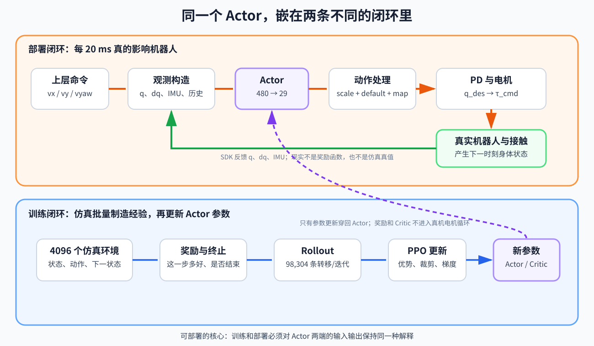

# 从仿真到真机：RL 运控训练与部署实战

这不是一套“再讲一遍 PPO”的教程。

它只追问一个工程问题：

> 怎样训练出一个不仅会在训练窗口里走，而且能够被解释、复现、导出、复核，并最终有资格进入真机测试的运控策略？

全书用一个贯穿案例来回答：**G1 风格的 29 自由度人形机器人，根据前进、横移、转向速度命令行走；神经网络输出 29 个关节位置增量，低层 PD 控制器把它们变成电机力矩。**

参考实现选用当前 Unitree RL Lab 的 G1-29DOF 速度任务：Isaac Lab 建立并行仿真环境，RSL-RL 用 PPO 训练，MuJoCo 做 Sim2Sim，策略导出为 ONNX，部署程序通过 Unitree SDK 连接机器人。工具会更新，但贯穿全书的“接口契约、验证方法和安全边界”不会随某个版本失效。

## 全书采用程序员的接口视角

每遇到一个新概念，先把它当成函数，不允许只留下名词：

```text
# 先追踪数据从哪里来、经过谁、再交给谁，不先被算法名淹没。
输出 = 模块(输入)
```

随后固定追问五件事：

1. 谁调用这个模块？
2. 输入中的每个量从哪里来？
3. 输出的每个量表示什么、单位是什么？
4. 输出交给谁，怎样影响下一时刻？
5. 训练与部署是否使用完全相同的解释？

本案例最核心的两个接口是：

```text
# 反馈、命令和控制器记忆共同组成 Actor 唯一能看见的输入。
observation = build_observation(
    IMU,              # 机身角速度和姿态信息
    joint_q, joint_dq, # 当前关节位置与速度反馈
    velocity_command, # 上层希望的 vx、vy、yaw_rate
    last_action,      # Actor 上一次输出
    history           # 最近若干帧的时间信息
)

# Actor 只输出无量纲动作；动作处理器再把它翻译成关节目标。
raw_action = actor(observation)                 # 480 维观测 → 29 维原始动作
q_des = q_default + 0.25 × raw_action

# 电机包还包含部署配置给出的 dq_des、Kp、Kd 和 tau_ff。
send_to_motor(q_des, dq_des=0, Kp, Kd, tau_ff=0)
```

第二段中 `dq_des=0、tau_ff=0` 是当前参考部署的具体选择，不是所有 RL 控制器的宇宙定律。教程会明确区分“这个案例确实这样做”和“其他系统也可以怎样做”。

第一次阅读建议紧接着打开[输入输出总表：从上层命令到电机，再回到 PPO](输入输出总表-从命令到电机再回到PPO.md)。它把全书所有主要模块按“调用者—输入—输出—下一站”放在一张表里。



## 最终交付物不是一个权重文件

一个可部署候选版本至少包含：

```text
policy.onnx                 神经网络：观测 → 动作
policy_contract.json/yaml   观测顺序、缩放、历史、动作含义、关节映射、周期
training_config             任务、奖励、随机化、PPO 超参数
provenance                  代码版本、模型版本、随机种子、训练检查点
evaluation_report           跟踪误差、摔倒率、功耗、极值、长时测试
safety_case                 超时、失联、姿态异常、限位、急停和回退逻辑
```

缺少其中任何关键项，得到的都只是“某次训练产生的文件”，还不能叫可部署模型。

## 学习主线

| 阶段 | 要回答的问题 | 章节 |
|---|---|---|
| 看清终点 | “部署成功”究竟指什么 | [00](00-先看终点-可部署模型不是权重文件.md) |
| 定义问题 | 机器人要学什么，什么绝不能交给奖励碰运气 | [01](01-任务定义与安全边界.md) |
| 搭起环境 | 为什么选这套工具，怎样复现实验 | [02](02-技术栈与可复现实验.md) |
| 对齐机器人 | URDF/USD、关节顺序和执行器参数如何进入训练 | [03](03-机器人模型与关节映射.md) |
| 对齐时间 | 物理步、策略步、PD 步和延迟是什么关系 | [04](04-一个控制周期.md) |
| 对齐输入 | 480 维观测究竟从哪里来 | [05](05-观测设计-策略到底看见什么.md) |
| 对齐输出 | 29 个数怎样一路变成电机力矩 | [06](06-动作设计-网络输出怎样变成力矩.md) |
| 定义训练分布 | 一个策略如何学会站、走、横移、转向 | [07](07-命令分布与课程学习.md) |
| 写奖励 | 怎样把验收目标翻译成奖励并识破漏洞 | [08](08-奖励设计与奖励漏洞.md) |
| 管理回合 | 初始状态、终止和重置怎样塑造行为 | [09](09-重置终止与训练课程.md) |
| 真正训练 | 一轮 PPO 到底收集了什么、更新了什么 | [10](10-PPO训练循环与首个基线.md) |
| 调试实验 | 不靠“看起来会走”选择模型 | [11](11-训练诊断消融与检查点选择.md) |
| 获得鲁棒性 | 随机化、扰动和特权 critic 各自解决什么 | [12](12-鲁棒化与特权学习.md) |
| 冻结并导出 | 为什么 ONNX 必须和部署配置绑定 | [13](13-导出模型与部署契约.md) |
| 换引擎复核 | MuJoCo 失败是在告诉你什么 | [14](14-Sim2Sim与差异诊断.md) |
| 接近真机 | 实时循环、状态机、看门狗和低层接口 | [15](15-真机控制程序与安全状态机.md) |
| 分级验收 | 怎样从离线数据走到小范围真机动作 | [16](16-真机分级测试与上线验收.md) |
| 串起全局 | 从新建实验到发布候选版本的完整清单 | [17](17-端到端项目路线.md) |
| 迁移新机 | 面对一台从未训练过的机器人，第一步到最后一步怎样走 | [18](18-面对全新机器人-从零到可部署候选.md) |

补充材料：

- [导读：怎样学才不会在中途失去主线](导读.md)
- [输入输出总表：从命令到电机再回到 PPO](输入输出总表-从命令到电机再回到PPO.md)
- [附录 A：实验记录与发布模板](附录A-实验记录与发布模板.md)
- [附录 B：症状到原因的排障表](附录B-症状到原因的排障表.md)
- [附录 C：名词不再猜——训练与部署词语表](附录C-训练与部署词语表.md)
- [实践代码：在没有 Isaac Lab 的机器上先验证部署契约](实践/README.md)
- [训练实验手册：从两次迭代短跑到发布候选](实践/训练实验手册.md)

## 读完后应当具备的能力

你不一定能一次训出商业级人形策略，但应当能够：

1. 从真机验收指标反推任务、观测、动作和奖励，而不是盲调权重；
2. 精确写出策略的输入输出契约，解释每一维从哪里来、到哪里去；
3. 看懂一次 PPO 训练消耗了多少仿真步，区分迭代、回合和 checkpoint；
4. 用曲线、回放、消融、长时测试和多随机种子判断策略是否真的变好；
5. 发现训练与部署在关节顺序、单位、频率、历史缓存和默认姿态上的不一致；
6. 设计 Sim2Sim 和真机分级测试，让错误先在低代价阶段暴露；
7. 明白 RL 负责学什么，传统软件、PD、限幅、状态估计和安全状态机负责什么。

## 安全说明

教程中的参数是**特定开源版本的阅读样例**，不是给任意一台 G1 直接上电使用的万能参数。真机测试必须由熟悉机器人低层接口和现场安全流程的人员执行，并使用支撑、足够净空、物理急停、通信超时、姿态保护和逐级放量。一次 ONNX 推理成功，绝不等于具备电机使能资格。
