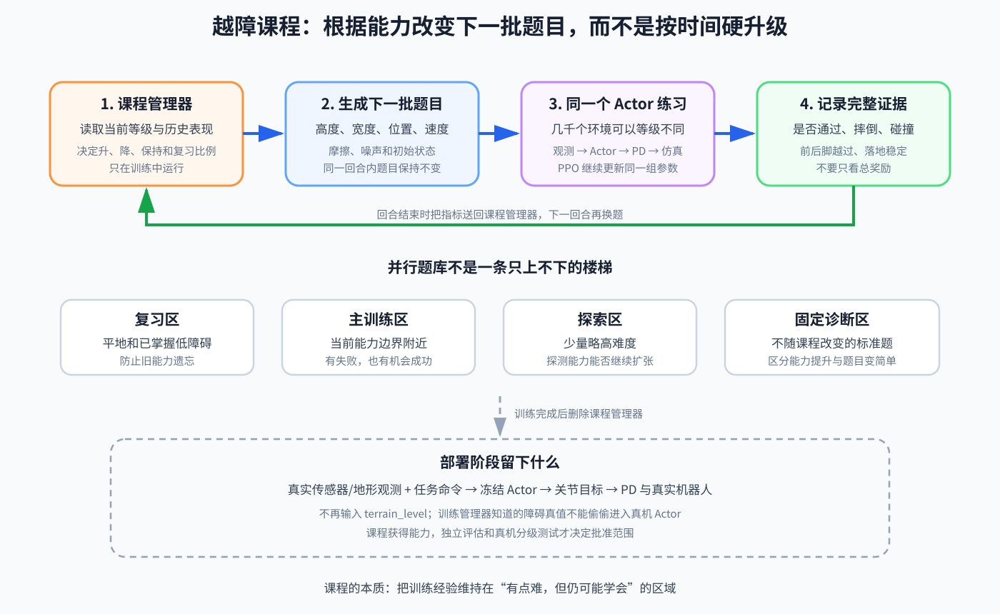

# 专题：越障课程学习——让训练难度跟着机器人能力增长

> **专题定位**：连接[第 07 章：命令分布与课程学习](07-命令分布与课程学习.md)、[第 09 章：重置、终止与训练课程](09-重置终止与训练课程.md)和[第 11 章：训练诊断](11-训练诊断消融与检查点选择.md)。
>
> **前置能力**：机器人已经能在平地根据小范围速度命令稳定行走。如果平地还站不住，先不要用障碍物掩盖模型、PD、观测或奖励问题。
>
> **核心问题**：为什么把一堵墙放进仿真并写上“跨过去奖励 +1”，通常不足以让随机策略学会越障？训练程序究竟怎样决定下一次给机器人出多难的题？

## 怎么读这篇教程

- 第一次读第 0～4 节，先抓住课程在训练闭环中的位置；
- 准备写代码时读第 5～8 节，那里给出输入输出、升级规则和验收指标；
- 训练已经出现怪现象时，直接查第 9～11 节。

这一篇只讲一件事：**怎样组织越障训练题目**。高度图、深度相机怎样形成观测，见运控教程的[第 16 章：感知行走与落足点](../运控/16-感知行走与落足点.md)；PPO 怎样更新 Actor，见[第 10 章](10-PPO训练循环与首个基线.md)。

---

## 0. 第一晚：4096 台机器人一起撞墙

你已经训练出一个平地行走策略，于是创建一道 `20 cm` 高的台阶。每个并行环境都放一台机器人，命令它向前走，跨过去给高奖励，摔倒就结束。

第一批 rollout 出现了：

```text
有些机器人还没走到台阶就摔倒
有些前脚撞上台阶后摔倒
有些膝盖撞上去后翻倒
几乎没有机器人偶然完整通过
```

PPO 得到很多失败样本，却不一定得到“怎样开始变好”的信息。

这里很容易产生一个误会：

> 失败样本很多，所以策略应该很快知道不能这样做。

但只知道“一整段行为失败”，不等于知道几百毫秒前哪个关节动作应该怎样改变。若所有尝试都同样失败，奖励不能区分：

```text
完全没有抬脚
已经多抬了 2 cm
前脚成功越过但后脚撞到
两只脚都越过但落地后摔倒
```

对学习器来说，它们可能都只是一个低分回合。

于是你把台阶暂时降到 `3 cm`。某些随机探索恰好让摆动脚越过；这些轨迹得到稍高回报，PPO 开始增加类似动作的概率。策略稳定通过以后，再出现 `5 cm`、`8 cm` 和更复杂的障碍。

这就是 curriculum learning，课程学习。经典论文将这一思想系统化为：先利用容易样本建立能力，再逐渐增加训练难度。[Curriculum Learning](https://ronan.collobert.com/pub/matos/2009_curriculum_icml.pdf)

但“先低后高”只是表面现象。真正的课程是一条反馈闭环。

---

## 1. 课程到底是什么

先把课程写成程序员能检查的接口：

```text
# 课程管理器只在训练中出题，不在真机上输出关节动作。
next_level, next_task_distribution = curriculum_manager(
    current_level,       # 当前训练难度；可以按并行环境分别保存
    episode_metrics,     # 刚结束回合的成功、摔倒、进度和碰撞证据
    curriculum_config,   # 升降级阈值、难度上限、各等级参数
    random_seed          # 保证题目采样可以复现
)
```

- `current_level`：这个环境当前在练什么难度；
- `episode_metrics`：上一题实际做得怎样，不只是总奖励；
- `curriculum_config`：人定义的题库边界和升级规则；
- `next_level`：下一回合使用的难度等级；
- `next_task_distribution`：下一回合从哪些障碍高度、宽度、位置和命令中采样。

等级只是便于理解和实现的一种表示。课程也可以不设整数关卡，而是连续调整“障碍高度采样上限”或不同题型的概率；只要它根据能力改变后续训练分布，本质仍然是课程。

课程改变的是机器人**接下来会遇到什么经验**：

```text
课程管理器选择题目
→ 环境生成障碍与初始状态
→ 同一个 Actor 闭环执行
→ 环境记录成功和失败证据
→ 课程管理器决定下次升、降还是保持
```



因此课程不是：

- 一套手写越障关节轨迹；
- 每个难度训练一张独立模型；
- 到第 1000 次迭代无条件升一级；
- 部署时还要运行的障碍控制器；
- 把所有随机范围一起慢慢拉大。

通常是**同一个 Actor、同一组持续更新的参数**，在逐渐变化的训练分布上学习。

---

## 2. 课程、奖励、观测和随机化不是一回事

一次越障训练中，这几个模块同时出现，最容易被混成“都是训练配置”。

| 模块 | 它回答的问题 | 越障例子 | 部署时是否存在 |
|---|---|---|---|
| 课程 | 下一题有多难 | 下一回合台阶是 `3 cm` 还是 `10 cm` | 不存在 |
| 奖励 | 刚才做得多好 | 是否通过、脚是否撞击、落地是否稳定 | 通常不存在 |
| 观测 | Actor 当前知道什么 | 高度扫描、关节、IMU、命令 | Actor 用到的部分必须存在 |
| 终止 | 这次尝试何时结束 | 摔倒、越界或超时 | 训练终止不等于真机保护 |
| 域随机化 | 同一类题目的现实参数怎样变化 | 摩擦、质量、延迟、传感噪声 | 变化来自现实，不是软件采样器 |

课程可以逐渐扩大随机化，也可以逐渐改变命令，但职责仍要分开。例如：

```text
台阶高度从 3 cm 升到 6 cm       课程在改变题目
跨过台阶得到任务分数             奖励在评价结果
Actor 读取前方高度点              观测在提供证据
地面摩擦在 [0.6, 0.9] 随机       域随机化在制造现实差异
```

课程并不会凭空给 Actor 新信息。课程管理器知道障碍真值，只能用于训练出题、评估或 Critic；如果真机 Actor 看不到前方地形，就不能把精确障碍高度偷偷放进 Actor 输入。

---

## 3. “难度”不是一个天然存在的数字

说“第 5 级比第 4 级难”之前，必须先说明哪里更难。越障难度至少有这些方向：

```text
障碍几何：高度、宽度、沟宽、坡度、边缘形状
接近条件：起始距离、接近角度、障碍出现位置
运动要求：前进速度、是否允许停顿、通过时间
身体条件：初始姿态、负载、推扰
接触条件：摩擦、恢复系数、地面柔软度
感知条件：噪声、延迟、遮挡、地图分辨率
地形组合：单个台阶、连续台阶、台阶后接斜坡
```

因此可以把难度想成一个调参面板，而不是一根唯一滑杆：

```text
difficulty = {
    step_height,
    step_width,
    approach_angle,
    command_speed,
    friction_range,
    observation_noise,
    terrain_sequence_length,
}
```

第一次建立课程时，不要同时推高所有旋钮。否则难度升级后全体失败，你无法判断原因到底是台阶太高、速度太快、摩擦太低还是感知太吵。

一个实用原则是：

> 每次只让一种主要困难明显增长，其他维度保持在策略已经证明能处理的范围。

---

## 4. 一条能解释的越障课程怎样长出来

下面的厘米数只是叙事示例，不能直接当成任意机器人的配置。真实上限要由腿长、关节范围、电机能力、碰撞几何和安全目标决定。

### 第 0 级：障碍还没有出现

先证明同一机器人、同一 PD、同一观测能够：

```text
平地稳定前进
→ 停止
→ 重新起步
→ 承受小初始误差
```

如果这一步失败，加入台阶只会让错误更难定位。

### 第 1 级：障碍固定而且很低

先让障碍的位置、朝向和高度基本固定。目的不是获得通用能力，而是回答：

```text
当前动作空间允许抬脚吗？
当前观测能看见障碍吗？
当前奖励能区分“差一点”和“完全没做”吗？
```

### 第 2 级：只扩大高度范围

策略能稳定通过低障碍后，在一小段高度范围内采样。仍保持接近方向和命令速度简单，让失败主要说明抬脚、质心转移或落地能力不足。

### 第 3 级：随机障碍位置和接近条件

现在让机器人不能只背诵“走到固定时刻就抬脚”：

```text
障碍距离变化
接近角度小范围变化
命令速度小范围变化
```

若 Actor 没有前方地形观测，这一级很可能暴露信息不足：相同身体状态和命令下，有时前方有障碍、有时没有，Actor 却看见完全相同的输入。

### 第 4 级：增加地形种类

在台阶之外逐渐加入：

- 窄障碍；
- 下台阶；
- 小沟；
- 斜坡；
- 不同间距的连续障碍。

不要只用一个等级平均所有地形。`10 cm` 上台阶与 `10 cm` 沟槽不是同一种困难，应分别统计能力。

### 第 5 级：加入现实差异

最后才逐步增加：

- 摩擦、质量和电机响应变化；
- 观测噪声与延迟；
- 小推扰；
- 地图误差或遮挡。

这一顺序不是宇宙定律。它的价值是每一级只引入少量新因果，使失败仍然可解释。

---

## 5. “通过障碍”必须被拆成可计算证据

只用“机器人向前走了多远”升级，会把许多坏动作误判为掌握：它可能绕开障碍、把障碍撞走、用膝盖爬过去，甚至摔倒后滑到终点。

一次真正的越障成功至少可以拆成：

```text
正确接近障碍
→ 前脚无碰撞越过
→ 前脚在合法区域落地
→ 后脚无碰撞越过
→ 躯干和膝盖没有非法接触
→ 通过后继续稳定若干控制周期
```

课程管理器可以读取下面的回合指标：

| 指标 | 它防止的误判 |
|---|---|
| `reached_goal` | 根本没有到达障碍另一侧 |
| `front_foot_clearance` | 前脚其实撞上障碍 |
| `rear_foot_clearance` | 只过了前脚，后脚被绊倒 |
| `forbidden_contact_count` | 用膝、手或躯干爬过去 |
| `post_crossing_stable_time` | 刚越过就摔倒也被算成功 |
| `torque_saturation_ratio` | 靠长时间电机饱和勉强通过 |
| `foot_slip` | 落脚以后明显滑动 |

这些指标不一定全部进入奖励。课程升级可以使用独立验收指标，而不是直接复用总奖励：

```text
奖励负责让 PPO 学习
课程指标负责判断题目是否已经掌握
最终评估负责判断能力是否真的可发布
```

三者相关，但不能由同一个总分包办。

---

## 6. 最小的自动升降级程序

课程通常在某个并行环境回合结束、准备重置时更新，而不是每个物理步都改变障碍。这样同一回合内题目不会突然变形。

```python
def update_curriculum(env_ids, episode_metrics, level, max_level):
    """根据刚结束回合的证据，更新这些并行环境下一回合的难度。"""

    # 成功不仅要求到达终点，还要求合法接触并在通过后保持稳定
    mastered = (
        episode_metrics.reached_goal[env_ids]
        & (episode_metrics.forbidden_contacts[env_ids] == 0)
        & (episode_metrics.post_crossing_stable_time[env_ids] >= STABLE_TIME)
    )

    # 明确失败用于降级；普通超时可单独分析，不必一律视为同一种失败
    failed = (
        episode_metrics.fallen[env_ids]
        | episode_metrics.stuck[env_ids]
        | episode_metrics.severe_collision[env_ids]
    )

    # 掌握当前题目的环境升一级，明显失败的环境降一级
    level[env_ids] += mastered.to_int()
    level[env_ids] -= failed.to_int()

    # 课程不能超出已经定义并验证过的题库边界
    level[env_ids] = clip(level[env_ids], minimum=0, maximum=max_level)

    return level
```

- `env_ids`：这一刻刚结束回合、即将重置的并行环境编号；
- `episode_metrics`：这些回合分别留下的结果证据；
- `level`：每个并行环境当前等级组成的数组；
- `max_level`：题库已经定义的最高等级；
- `STABLE_TIME`：通过障碍后至少还要稳定多久，由任务配置给出；
- `mastered.to_int()`：把“掌握/未掌握”从真假值转换成 `1/0`；
- `clip(...)`：把等级限制在 `0～max_level`，避免数组越界。

这段代码表达结构，不绑定 PyTorch 或某个仿真框架。真实实现还应避免一次幸运就升级、一次偶然摔倒就降级，可以维护最近多个回合的滑动统计：

```text
最近 N 次成功率持续高于升级阈值 → 升级
最近 N 次严重失败率持续高于降级阈值 → 降级
介于两者之间                    → 保持
```

升级阈值要高于降级阈值，中间留出保持区，可以减少等级在边界附近来回抖动。

成熟腿足环境也采用类似的“游戏关卡”思想。[legged_gym 的基础环境](https://github.com/leggedrobotics/legged_gym/blob/master/legged_gym/envs/base/legged_robot.py)在环境重置时根据行走进度更新各环境地形等级；[Isaac Lab 地形接口](https://isaac-sim.github.io/IsaacLab/develop/source/api/lab/isaaclab.terrains.html)则把地形难度组织为 `0～1` 的参数，并支持按难度生成不同地形。具体升级指标仍然要根据你的越障任务重写，不能因为代码来自成熟项目就原样照搬。

---

## 7. 4096 个并行环境不必上同一堂课

训练画面里虽然同时有几千台机器人，它们共享的是 Actor 参数，不必共享同一个课程等级：

```text
环境 0～999：复习较低障碍
环境 1000～2999：练当前主难度
环境 3000～3999：尝试略高难度
环境 4000～4095：固定诊断题
```

这里的固定诊断题如果仍进入 PPO rollout，就只能叫训练期探针，不能冒充最终独立测试。真正的独立评估要在另一组环境和随机种子上运行，并且不把结果用于网络更新。

每个环境结束后可以独立升降级。这样产生的 rollout 会同时包含：

- 已掌握行为，防止遗忘；
- 当前边界附近的高信息样本；
- 少量更难尝试，探测能力是否能够继续扩张；
- 固定题目，帮助判断策略真的变好还是题目只是变了。

具体比例不是通用答案。重要的是不要把所有环境一次性推入新难度。如果升级后 `4096` 个环境全部迅速摔倒，本轮 rollout 又会退化成几乎无法区分的失败样本。

到达最高等级也不表示永远停在那里。可以继续在已批准难度范围内随机采样，防止最高级环境把整个训练分布占满。

---

## 8. 课程配置和状态也要版本化

仅保存 Actor checkpoint 不足以复现一次课程训练。至少还要保存：

```text
各等级地形参数
每种地形的采样比例
升降级指标和阈值
统计窗口长度
当前每个并行环境的等级
命令范围和采样规则
随机化范围
地形生成随机种子
课程代码版本
```

续训时如果只加载网络参数，却把所有环境等级重置为零，训练分布已经改变；反过来，加载一个尚未掌握高障碍的旧 Actor，却恢复到很高课程等级，也可能立即产生全失败数据。

因此 checkpoint 更准确地应绑定：

```text
Actor/Critic 参数
+ 优化器状态
+ 课程状态
+ 环境和奖励配置
+ 数据与代码版本
```

课程面板至少记录：

```text
每个等级的环境数量
每种地形的成功率和失败原因
升降级次数
当前难度分布
各等级的奖励分项
各等级的动作、力矩和碰撞极值
```

只画一个平均 `terrain_level`，可能掩盖“一部分环境已到顶，另一部分长期困在最低级”的分裂。

---

## 9. 五个最常见的课程陷阱

### 陷阱一：只升级，不复习

策略学会高抬腿以后，可能在平地也始终高抬腿，能耗上升、速度下降。课程必须保留平地、无障碍和旧等级样本。

### 陷阱二：按训练步数硬升级

第 `1000` 次迭代并不代表能力已经形成。换一个随机种子、机器人质量或奖励尺度，学习速度都可能变化。时间表可以用于最初调试，正式课程更应依据能力指标。

### 陷阱三：一次增加所有难度

高度、速度、摩擦、噪声同时增加，失败后无法归因。先分轴扩大，再在最终阶段测试组合。

### 陷阱四：Actor 偷看课程等级

把 `terrain_level=4` 输入 Actor 很方便，但真机没有这个数字。除非上层部署接口真的会提供等价模式命令，否则这是特权泄漏。

Actor 应依据可部署的高度图、视觉、本体状态和任务命令行动。课程等级可以给课程管理器和 Critic 使用。

### 陷阱五：最高等级已经物理不可行

课程只能安排经验，不能增加腿长、关节范围和电机力矩。若障碍超出机器人能力，永久训练只会制造永久失败。

升级前应先用运动学检查、参考轨迹、轨迹优化或 Oracle 控制器回答：这个目标是否存在合理可行解？

---

## 10. 为什么有时课程越训越差

假设策略在第 2 级成功率很高，升到第 3 级后突然归零。不要立刻把 PPO 学习率调小。先按因果链检查。

### 第一问：机器人有足够信息吗

固定身体状态和速度命令，分别在前方“有障碍”和“无障碍”运行。如果 Actor 的观测完全相同，它无法知道什么时候应该高抬脚。

可以暂时给 Oracle Actor 或诊断策略提供完美地形高度：

```text
Oracle 仍失败
→ 优先检查动作空间、奖励、物理能力和探索

Oracle 成功，部署观测 Actor 失败
→ 优先检查地形感知、坐标、历史和延迟
```

Oracle 只用于定位，不能成为最终真机输入。

### 第二问：升级指标被奖励漏洞骗了吗

如果“走过一半距离”就升级，机器人可能从障碍旁边绕过。回放升级样本，核对脚、膝、躯干接触和落地稳定。

### 第三问：难度跨度是不是太大

第 2 级与第 3 级不能只看编号。比较实际参数：台阶是否突然从 `5 cm` 变成 `15 cm`，同时速度和摩擦也改变了？等级相邻不代表物理难度相邻。

### 第四问：旧能力是不是被新样本淹没

在固定平地和低障碍评估集上回放当前 checkpoint。如果旧能力下降，增加复习分布或降低高难度样本占比，而不是只看训练平均难度继续上涨。

---

## 11. 课程成功，不等于模型可以越障部署

训练结束时课程管理器可以删除，但必须把它声称覆盖的范围变成独立评估矩阵：

| 地形 | 高度/宽度分箱 | 命令速度分箱 | 摩擦分箱 | 感知噪声分箱 | 成功率与最坏极值 |
|---|---|---|---|---|---|
| 上台阶 | … | … | … | … | … |
| 下台阶 | … | … | … | … | … |
| 窄障碍 | … | … | … | … | … |
| 小沟 | … | … | … | … | … |

这套评估地形应使用训练中未见的随机种子和组合。否则“训练课程成功率很高”可能只表示策略熟悉那批地形网格。

还必须回到部署契约：

```text
训练 Actor 看见的地形表示
= 真机能够按相同坐标、范围、频率和延迟构造的表示
```

如果训练使用无噪声仿真高度扫描，真机却只有延迟深度图，课程把台阶从低练到高也无法弥补输入语义不同。

真机仍要从低风险顺序逐级验收：

```text
离线传感回放
→ 支撑下验证观测和动作
→ 平地
→ 低而宽的软障碍
→ 批准范围内逐渐增加难度
```

训练课程负责获得能力，真机分级测试负责控制风险；二者不是同一个“逐级”。

---

## 12. 从零实现时，照这个顺序做

### 第一步：冻结平地基线

保存平地策略、配置和评估报告。后续所有越障版本都要与它比较，确认新能力没有摧毁站、走、停和转向。

### 第二步：建立可复现地形题库

每个地形生成器接收明确参数和随机种子：

```text
terrain = generate_obstacle(
    obstacle_type,   # 台阶、窄障碍、小沟或斜坡
    geometry,        # 高度、宽度、位置和朝向
    physics,         # 摩擦和恢复系数
    random_seed      # 能重新生成同一道题
)
```

### 第三步：先做固定低障碍短跑

只验证观测、碰撞、奖励、终止和成功判据。此时不急着自动升级。

### 第四步：加入单轴课程

先只改变高度或宽度之一。记录每个等级的成功率和失败阶段。

### 第五步：改为按能力升降级

用多个回合统计而非一次结果。保留保持区和旧难度复习样本。

### 第六步：逐个加入位置、命令和地形种类

每次只增加一个主要因素，并用固定评估判断旧能力是否受损。

### 第七步：最后加入随机化和感知退化

根据真机测量范围加入，而不是为了显得鲁棒把噪声无限放大。

### 第八步：冻结课程外的独立评估

候选 checkpoint 不按训练平均奖励或平均等级选，而按独立地形矩阵、最坏极值和旧能力回归测试选。

---

## 13. 最后回答：越障一定需要课程吗

不一定。

如果：

- 已经有很强的预训练策略；
- 有高质量参考运动或 Teacher；
- 初始状态能直接覆盖越障关键阶段；
- 奖励足够密集；
- 随机策略也有不低的成功概率；

那么固定混合难度也可能训练成功。

但从随机参数或普通平地策略开始，直接面对大量高难度障碍，经常产生“全是失败、没有渐进方向”的数据。课程的价值是提高有效经验比例，并让失败仍然可以解释。

所以更准确的结论是：

> 课程不是越障能力的物理组成部分，也不是必须采用的算法定律；它是管理训练分布的工程工具。当最终任务远超当前策略能力时，它通常能显著改善学习效率和排错能力。

## 本专题小结

1. 课程管理器的输入是当前难度、回合指标、配置和随机种子；输出是下一回合的难度与题目分布。
2. 课程改变经验分布，奖励评价结果，观测提供 Actor 的证据，四者不能混为一谈。
3. 同一个 Actor 可以在许多并行环境的不同等级上同时训练，不是一级一张模型。
4. 难度是由障碍、命令、接触、随机化和感知等多个方向组成的面板，不应一次全部拉高。
5. 升级应根据完整越障证据，而不是总奖励、单次幸运或仅仅走过的距离。
6. 课程要允许保持、降级和旧题复习，并把状态与配置一起版本化。
7. 课程不能弥补不可观测、物理不可行或训练—部署接口不一致。
8. 最终发布资格来自课程之外的独立评估与真机分级测试。

## 检查自己是否真正理解

1. 为什么 `20 cm` 台阶前有很多失败样本，仍不代表 PPO 能学会怎样抬脚？
2. 课程与奖励的输入输出分别是什么？
3. 为什么几千个并行环境不应同时无条件升级？
4. 只用行走距离作为升级标准可能出现哪些作弊行为？
5. 为什么不能把课程等级直接喂给最终 Actor？
6. 训练课程逐级成功以后，为什么仍然需要独立地形评估？
