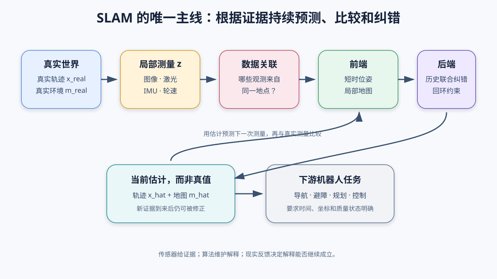

# 00 先看全局：SLAM 不是“扫描世界”，而是在证据不足时持续猜测并纠错

> 本章位置：全书起点。
>
> 本章只回答一个问题：一台没有 GPS、没有现成地图的机器人，究竟怎样同时回答“我在哪里”和“周围是什么样”？

## 1. 先把机器人扔进一栋陌生楼里

假设机器人刚被放到一栋从未见过的楼里：

- 没有 GPS；
- 没有建筑图纸；
- 相机一次只看见前方一小块；
- 激光一次只扫到附近；
- IMU 会漂；
- 轮子可能打滑；
- 走过的地方以后可能还会再经过。

机器人想把不同时间看到的东西拼成一张地图，首先要知道每次拍照时自己在哪里。可是它想判断自己在哪里，又需要知道当前看到的墙角、门框和以前地图里的哪些位置相同。

```text
想建图 → 先要知道每次观测时机器人在哪里
想定位 → 又要拿当前观测和地图进行比较
```

这不是两个互不相干的任务，而是一个互相咬住的循环。这就是：

**SLAM（Simultaneous Localization and Mapping，同时定位与建图）。**



## 2. SLAM 的本质不是“地图算法”，而是状态估计

SLAM 经常展示漂亮点云，所以人很容易把它理解成“把传感器画成地图”。这只看到了结果，没有看到本质。

现实中的机器人真正拥有一条轨迹，环境也真正存在：

```text
x_real：机器人在现实中的真实轨迹
m_real：现实中的真实环境
```

但程序通常拿不到它们。程序拿到的是传感器测量：

```text
z：图像、激光点、角速度、加速度、轮速等测量
```

因此程序做的是：

```text
看见带噪声且不完整的测量 z
              ↓
猜一个轨迹 x_hat 和地图 m_hat
              ↓
检查这个猜测能否解释测量
              ↓
解释不好就修正猜测
```

这里的 `hat` 读作“帽子”，表示估计值：

- `x_hat`：算法当前估计的轨迹；
- `m_hat`：算法当前估计的地图。

所以更准确地说：

> SLAM 是一个根据连续传感器证据，联合估计机器人轨迹与环境结构，并不断用新证据修正旧判断的问题。

它不会读取“上帝视角真值”，输出也不是绝对真相。

## 3. 一帧测量为什么远远不够

看一张普通照片，你可以知道画面左边有门、右边有桌子，却不能只凭像素准确知道：

- 门离相机几米；
- 相机在楼里的绝对位置；
- 这扇门是不是十分钟前见过的那扇门；
- 相机和门究竟谁动了；
- 画面外面有什么。

激光也不是全知的。它只给出当时从传感器到反射点的距离和方向，并不会告诉你这个点属于哪堵墙，更不会自动告诉你下一圈扫描中的哪个点和它是同一个地方。

单次测量只是局部证据。SLAM 的能力来自三个动作：

1. 在不同时间和不同坐标系中积累证据；
2. 判断哪些证据可能来自同一地点；
3. 找到一组最能同时解释这些证据的轨迹和地图。

## 4. 先分清四个容易混淆的词

### 4.1 定位：地图已知，只求自己在哪里

例如仓库地图已经测好，机器人把当前激光和地图对齐，求当前位姿。这叫 Localization（定位）。

```text
已知地图 m
当前测量 z
求当前位姿 x
```

### 4.2 建图：轨迹已知，只求环境长什么样

例如相机位置由高精度外部设备提供，把每个位置看到的深度放进统一坐标系。这叫 Mapping（建图）。

```text
已知轨迹 x
连续测量 z
求地图 m
```

### 4.3 里程计：主要估计相邻时刻走了多少

Odometry（里程计）关心的是短时间相对运动：

```text
上一时刻位姿
    + 本次估计的相对运动
    = 当前位姿
```

轮式里程计使用编码器；视觉里程计（VO）使用图像；激光里程计使用点云；视觉惯性里程计（VIO）联合相机和 IMU。

里程计像在黑暗中数步子。每一步只错一点，累计一千步后也会偏得很远。这叫**漂移**。

### 4.4 SLAM：轨迹和地图都未知，要一起估计

```text
地图未知 + 位姿未知 + 测量有噪声
                  ↓
       同时估计轨迹和地图
```

完整 SLAM 往往包含里程计，但不等于里程计。它还会维护地图，识别旧地点，并利用长时间约束修正累计漂移。

### 4.5 导航不是 SLAM

SLAM 回答“我在哪里、环境是什么样”；导航还要回答：

- 我要去哪里；
- 哪条路能走；
- 怎样绕开障碍；
- 应该给底盘什么速度命令。

因此常见关系是：

```text
传感器 → SLAM → 位姿/地图 → 规划与避障 → 控制器 → 电机
```

SLAM 是导航的重要上游，但不是整套导航。

## 5. 位姿到底是什么

位姿（Pose）不是只有位置。它包含：

- 位置：机器人在哪里；
- 姿态：机器人朝向哪里。

平面机器人常用三个量：

```text
(x, y, θ)
```

- `x, y`：平面位置；
- `θ`：朝向角。

三维运动需要三个位置量和三个旋转自由度。工程中通常用旋转矩阵、四元数或李群元素保存旋转，而不是把三个角简单相加。本章只需记住：

> 地图里的每条观测都带着一个“当时传感器在哪里、朝哪里”的问题。

下一章会专门把坐标系和位姿讲清楚。

## 6. SLAM 主循环到底在做什么

以相机为例，一次新图像到来后，系统可能经历：

```text
1. 读取新图像和时间戳
2. 找出可以稳定识别的局部图案
3. 在上一帧或局部地图中寻找对应位置
4. 根据对应关系估计当前相机位姿
5. 检查误差，拒绝明显错误的对应
6. 决定是否加入关键帧和新地图点
7. 联合修正近期的多个位姿和地图点
8. 判断是否回到了过去来过的地方
9. 向导航、建图或增强现实模块发布结果
```

这不是唯一实现方式，但几乎每个 SLAM 系统都在回答其中大部分问题。

可把它压缩成全书唯一主线：

```text
现实运动与环境
      ↓ 产生
传感器测量
      ↓ 先把时间和坐标对齐
可比较的证据
      ↓ 判断谁和谁来自同一地点
数据关联
      ↓ 用短时证据估运动
前端/里程计
      ↓ 用较长历史一起纠错
后端优化
      ↓ 发现“我又回来了”
回环约束
      ↓
轨迹估计 + 为任务服务的地图
```

## 7. 为什么新证据可以修改过去

假设机器人沿走廊走了一圈，每米产生 1 厘米误差。走完 100 米后，估计位置可能已经偏了 1 米。

这时机器人看见了起点那块独特的消防栓。它得到一个新事实：

```text
“当前地点”和“起点”其实是同一个地点。
```

如果只把当前点强行挪回起点，轨迹会在末端折断。更合理的办法是：把这一米误差分摊到此前许多段运动上，稍微修正整条历史轨迹和地图。

这就是后端优化和回环的直觉：

> 过去的估计不是已经封死的历史，而是当前证据下仍可修正的解释。

## 8. “同时”并不一定意味着每个变量每一毫秒一起求

名字中的 Simultaneous 容易让人误以为：程序必须在一个巨大方程中，每一帧同时计算从开机到现在的所有位姿和所有地图点。

不是。

真实系统受算力和延迟限制，常拆成不同时间尺度：

- 前端高频估计最近的相对运动；
- 局部后端修正最近一小段轨迹和地图；
- 回环线程偶尔寻找很久以前的地点；
- 全局优化低频修正整张图。

它们在逻辑上共同估计轨迹和地图，在计算上可以分线程、分区域、分频率完成。

## 9. 为什么 SLAM 注定会有不确定性

有些信息不是“算法不够强”，而是证据本身没有提供。

例如：

- 一张单目图像中的一个像素只确定一条空间射线，不能确定射线上的距离；
- 机器人在完全相同的白墙前横向移动，图像几乎没有可跟踪纹理；
- 激光面对一条无限长直墙，只靠墙很难判断沿墙方向移动了多少；
- 静止 IMU 的微小偏置经过两次积分后会变成不断增长的位置误差；
- 两个长得完全相同的走廊可能造成错误回环。

专业术语“可观性”背后的朴素问题就是：

> 当前测量中到底有没有足够信息区分不同的真实情况？

如果两种不同运动产生完全相同的测量，再强的优化器和神经网络也不能只凭这批测量确定哪一种是真的。只能增加新的运动、新的传感器、先验信息，或者承认不确定。

## 10. SLAM 没有唯一“正确地图”

在没有外部绝对定位时，系统通常可以把开机位置定义为世界原点：

```text
第一帧位置 = (0, 0, 0)
第一帧朝向 = 0
```

换一个原点、把整张地图整体旋转一下，只要轨迹和地图内部关系没有改变，系统对导航可能仍然同样正确。这叫**规范自由度（Gauge Freedom）**。

单目 SLAM 还可能缺少绝对尺度：算法知道桌子大约是门的一半宽，却不知道门是 1 米还是 10 米。整张地图和轨迹同时放大，图像投影仍可能完全一样。

所以评价 SLAM 不能只问“坐标数值是否和真值逐项相同”，还要先处理坐标系和尺度对齐。

## 11. SLAM 的地图不是越密越好

地图首先是给任务用的：

- 为相机定位服务：少量稳定特征点可能足够；
- 为二维导航服务：占据栅格要能判断哪里可通行；
- 为三维避障服务：需要表面或距离场；
- 为机械臂抓取服务：需要目标几何与语义；
- 为人看效果：彩色稠密点云很直观，却未必方便规划。

因此“建了一张很漂亮的图”不等于 SLAM 系统对机器人有用。第 12 章会专门讨论地图表示。

## 12. 这套教程怎样避免越读越烦

第一次阅读，只抓住每章四件事：

```text
现实困难是什么？
系统手里有什么证据？
它现在要估计什么未知量？
这一步仍然会怎样失败？
```

遇到公式，不要先问“我能不能手算”，先问：

```text
等号左边是谁？
等号右边每一项从哪里来？
这个公式是在描述现实、预测测量，还是修正估计？
```

如果正文突然使用一个没有解释的符号，那是讲义的问题，不是你的问题。

## 13. 本章最小结论

如果只带走五句话，请记住：

1. SLAM 是根据局部、带噪声的传感器证据，联合估计轨迹和地图。
2. 程序拿到的是测量 `z`，输出的是估计 `x_hat、m_hat`，不是现实真值。
3. 里程计提供短时连续运动，但相对误差会随时间累积。
4. 地图帮助定位，位姿也帮助建图；这就是“同时”的本质。
5. 回环和后端允许新证据重新修正过去，但缺失的信息不能凭空创造。

## 14. 读完自检

不用背定义，试着用自己的话回答：

1. 为什么不知道位姿就难以建图，不知道地图又难以定位？
2. 视觉里程计和完整视觉 SLAM 有什么差别？
3. 为什么相邻两帧都估得不错，长时间轨迹仍会漂？
4. 为什么回到起点能帮助修正整段历史？
5. 为什么没有 GPS 时，地图原点可以是人为规定的？

下一章：[坐标系、位姿与轨迹](01-坐标系位姿与轨迹.md)。我们先解决最容易让整套 SLAM 讲乱的问题：一个坐标到底是“相对于谁”说的。
