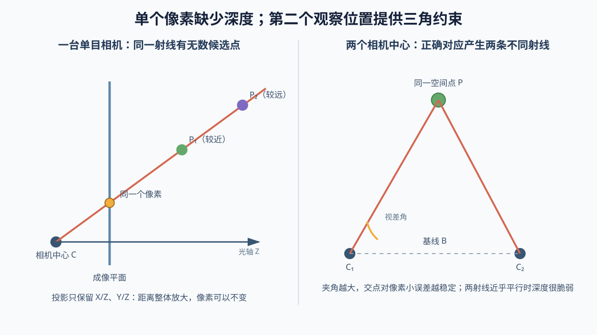

# 03 相机成像与深度：一个像素只告诉你方向，没有告诉你距离

> 前置：[传感器与测量](02-传感器与测量.md)。
>
> 本章目标：从小孔成像推导 `u = f_x X/Z + c_x`，理解内参、外参、畸变、深度、双目和单目尺度。

## 1. 先问一个决定视觉 SLAM 命运的问题

相机拍到一个像素 `(u, v)`。这个像素对应现实中的三维点在哪里？

直觉上好像能“从照片里看到物体”，但几何上答案是：

> 只凭一个普通单目像素，通常无法确定唯一三维位置。它只确定从相机出发的一条空间射线。

这不是算法缺陷，而是三维世界被投影到二维图像时，距离这一维被压掉了。



## 2. 先看二维侧视图

建立一个简化相机：

- 小孔位于原点；
- 相机光轴是 `Z` 轴；
- 空间点在相机坐标系中为 `(X, Z)`；
- 成像平面放在小孔前方距离 `f` 的位置；
- 点在成像平面上的位置记作 `x`。

空间点、小孔和像点形成两个相似三角形：

```text
x / f = X / Z
```

所以：

```text
x = f X / Z
```

每个符号：

- `X`：空间点相对相机向右多少；
- `Z`：空间点沿光轴向前多远，也叫光学深度；
- `f`：成像平面到小孔的距离，即焦距；
- `x`：点落在理想成像平面上的横向位置。

这个式子已经揭示两个重要事实：

1. `X` 越大，像点越靠右；
2. `Z` 越大，同样大小的物体投影越靠近中心，也就是“近大远小”。

## 3. 扩展到三维

空间点在相机坐标系中写为：

```text
p_c = [X, Y, Z]ᵀ
```

理想成像平面坐标为 `(x, y)`：

```text
x = f X / Z
y = f Y / Z
```

这里 `Y` 表示相机坐标系中的竖直方向。不同相机坐标约定可能令正方向朝上或朝下，但投影的除深度结构相同。

注意：当 `Z <= 0` 时，点位于相机后方或投影边界上，通常不能作为正常可见点处理。

## 4. 从成像平面坐标到像素坐标

真实图像使用像素 `(u, v)`，原点通常在图像左上角；横向和纵向的像素密度也可能不同。因此使用：

```text
u = f_x X/Z + c_x
v = f_y Y/Z + c_y
```

逐个解释：

- `u, v`：像素坐标；
- `X, Y, Z`：三维点在相机坐标系中的坐标；
- `f_x, f_y`：用像素作单位的横向和纵向焦距；
- `c_x, c_y`：主点坐标，也就是光轴与成像平面交点在图像中的位置。

`f_x、f_y、c_x、c_y` 统称相机内参，因为它们描述相机内部成像几何。

矩阵写法是：

```text
    [ f_x   0   c_x ]
K = [  0   f_y  c_y ]
    [  0    0    1  ]
```

`K` 叫相机内参矩阵。它只是把上面两条标量公式紧凑地放在一起，并没有额外的神秘物理。

## 5. 一个具体投影例子

假设：

```text
f_x = 500 像素
f_y = 500 像素
c_x = 320 像素
c_y = 240 像素
```

一个点在相机坐标系中：

```text
X = 1 米
Y = 0.5 米
Z = 5 米
```

投影：

```text
u = 500 × 1/5 + 320 = 420
v = 500 × 0.5/5 + 240 = 290
```

所以像素约为 `(420, 290)`。

如果这个点沿同一视线退到两倍远，同时 `X、Y、Z` 都乘 2：

```text
(X, Y, Z) = (2, 1, 10)
```

投影仍是：

```text
u = 500 × 2/10 + 320 = 420
v = 500 × 1/10 + 240 = 290
```

两个距离完全不同的三维点落在同一个像素上。这就是单帧单目无法确定深度的直接证据。

## 6. 像素反投影为什么是一条射线

已知像素 `(u, v)`，把投影公式整理：

```text
X/Z = (u - c_x) / f_x
Y/Z = (v - c_y) / f_y
```

右边都已知，但 `Z` 未知。令深度为任意正数 `Z`：

```text
X = Z (u - c_x) / f_x
Y = Z (v - c_y) / f_y
```

因此每选一个不同的 `Z`，都会得到一个不同的三维点，而它们都投到同一像素。这些点连成一条从相机中心出发的射线。

更紧凑地写：

```text
p_c = Z K⁻¹ [u, v, 1]ᵀ
```

- `K⁻¹`：内参矩阵的逆，把像素方向变回归一化相机方向；
- `Z`：仍然未知的深度；
- `[u, v, 1]ᵀ`：像素的齐次写法。

公式的重点不是矩阵，而是前面的未知比例 `Z`。

## 7. 世界地图点怎样投到当前图像

一个地图点保存在世界坐标系：

```text
p_w
```

相机投影需要相机坐标，因此先用世界到相机的位姿变换：

```text
p_c = T_cw p_w
```

再把 `p_c = [X, Y, Z]ᵀ` 代入：

```text
u_hat = f_x X/Z + c_x
v_hat = f_y Y/Z + c_y
```

这里使用 `u_hat, v_hat`，因为它们是根据当前位姿和地图点**预测**出的像素，不是相机实际测到的像素。

若实际匹配像素是 `(u, v)`，重投影残差为：

```text
r = [u - u_hat, v - v_hat]ᵀ
```

它表示：当前位姿与地图点的估计，预测这个点应该落在 `(u_hat, v_hat)`；相机实际却在 `(u, v)` 找到它，两者差了多少像素。

后面讲的 PnP（利用三维点到二维像素对应估计相机位姿）和 BA（让多个位姿与地图点接受多帧重投影误差的联合修正），核心都围绕这条关系展开。这里只需先知道它们要使用重投影残差，完整名称和过程会在对应章节解释。

## 8. 内参与外参千万不要混

### 内参：相机内部如何把射线变成像素

典型内参：

```text
f_x, f_y, c_x, c_y, 畸变参数
```

改变图像缩放和裁剪后，像素单位内参也需要相应改变。

### 外参：两套坐标系如何相互变换

例如：

```text
T_bc：相机坐标系 c 到机体坐标系 b
T_ci：IMU 坐标系 i 到相机坐标系 c
```

外参描述传感器装在机器人什么位置、朝什么方向。相机内参再准，外参错了，多传感器融合仍会失败。

## 9. 镜头畸变是什么

理想小孔模型假设直线投影仍是直线。但真实镜头为了获得更大视场或受制造影响，会让像素偏离理想位置。

### 径向畸变

越靠图像边缘，偏移通常越明显。桶形或枕形变形主要属于这一类。

### 切向畸变

镜片与成像平面没有完美对齐时产生非对称偏移。

标定会估计一组畸变参数。系统可以：

- 先把整张图像校正为近似理想图像；
- 或在投影模型中直接加入畸变。

必须保证特征像素和投影模型使用同一种约定。拿畸变图像中的像素，却用无畸变投影公式直接比较，会产生系统性残差。

## 10. 相机标定究竟求了什么

常见标定板上有已知几何关系的角点。相机从不同位置拍摄后，已知：

- 标定板角点在板坐标系中的位置；
- 它们在每张图像中的像素位置。

标定算法寻找一组内参、畸变参数和每张图的相机相对标定板位姿，使预测像素尽量接近实际检测像素。

所以标定本身也是一个“建立测量模型、最小化重投影残差”的估计问题。

标定结果不只看总平均误差，还应检查：

- 图像是否覆盖视场各区域；
- 姿态和距离是否足够丰富；
- 是否有模糊和角点误检；
- 单张图误差是否异常；
- 实际运行分辨率和对焦状态是否与标定一致。

## 11. 深度从哪里来

单个像素只有射线。要确定射线上的位置，必须增加额外证据。

### 11.1 已知物体或平面

如果知道点位于某个已知平面，射线与平面的交点可给出深度。二维码、标定板和已知地面都利用了类似思路。

### 11.2 两个不同观察位置

同一个三维点从两个不同相机中心看，得到两条射线。理想无噪声时，两条射线交点就是三维点。这叫三角化。

### 11.3 双目相机

双目在同一时刻提供两个已知相对位置的视角，相当于固定基线的三角化。

### 11.4 RGB-D 或激光

传感器通过主动光、飞行时间、结构光等方式提供距离测量，使每个有效像素或激光方向获得尺度。

### 11.5 IMU、轮速或已知运动尺度

它们可以给视觉系统补充米制尺度或运动约束，但需要正确标定和可观的运动。

## 12. 双目深度公式为什么是 `Z = fB/d`

考虑已经校正到水平对齐的双目相机：

- 左右相机光轴平行；
- 两相机中心间距为 `B`，称为基线；
- 同一三维点在左、右图的横坐标为 `u_L、u_R`；
- 视差 `d = u_L - u_R`；
- 为简化，使用相同像素焦距 `f`。

由相似三角形可得：

```text
d = f B / Z
```

整理：

```text
Z = f B / d
```

含义非常直观：

- 基线 `B` 越大，同一深度产生的视差越大；
- 点越远，视差 `d` 越小；
- 视差越小，同样 1 像素误差造成的深度误差越大。

数值例子：

```text
f = 500 像素
B = 0.1 米
d = 25 像素
```

则：

```text
Z = 500 × 0.1 / 25 = 2 米
```

若远处点视差只有 2 像素，视差误差 0.5 像素就会造成很大的相对深度误差。这就是双目远距离深度变差的原因。

## 13. 单目尺度为什么凭图像本身无法确定

假设某组相机轨迹和地图点能生成当前所有图像。把：

- 相机之间的平移全部乘 10；
- 地图中所有点的三维坐标也全部乘 10；

则点相对相机的 `X、Y、Z` 同时乘 10，而投影只用比例：

```text
X/Z，Y/Z
```

比例不变，图像就不变。

因此仅靠理想单目图像，系统可以恢复“形状和运动的相对比例”，却无法知道整个世界应该用 1 米还是 10 米解释。这个整体比例就是尺度。

引入已知基线的双目、深度相机、IMU、轮速、已知物体尺寸或高度等米制信息，才能约束尺度。

## 14. 视差太小为什么三角化不可靠

想象两次拍照位置几乎没有变化，两条观测射线几乎重合。射线角度只要有极小测量误差，交点就可能从 3 米跳到 30 米。

因此：

- 纯旋转几乎不产生平移视差，不能可靠三角化新点；
- 远处物体视差小，深度不确定性大；
- 相机平移方向与观察射线接近时，几何也会变差；
- 需要足够基线，但基线过大又会让外观变化、遮挡和匹配变难。

SLAM 系统会在“足够容易匹配”和“足够有三角化视差”之间选择关键帧。

## 15. 滚动快门为什么破坏“一帧一个位姿”

全局快门近似同时曝光整张图；滚动快门则逐行曝光。机器人快速运动时，图像顶部和底部对应不同相机位姿。

如果算法仍假设整张图来自同一个 `T_cw`，直线可能弯曲，特征投影也出现随行位置变化的误差。

处理方法可能包括：

- 减小曝光时间和运动速度；
- 使用全局快门；
- 在模型中加入每行时间和连续运动；
- 联合 IMU 进行运动补偿。

## 16. 归一化坐标是什么

去掉内参影响后：

```text
x_n = (u - c_x) / f_x = X/Z
y_n = (v - c_y) / f_y = Y/Z
```

`(x_n, y_n)` 叫归一化相机坐标。它表示像素对应射线的方向比例，暂时不含未知深度 `Z`。

许多多视图几何公式使用归一化坐标，是为了先讨论相机之间的几何关系，不让像素焦距和主点混在里面。

## 17. 本章最小结论

```text
三维相机点：[X, Y, Z]ᵀ
像素投影：u = f_x X/Z + c_x
          v = f_y Y/Z + c_y
像素反投影：得到一条方向已知、深度未知的射线
世界点投影：先 p_c = T_cw p_w，再用相机投影
内参：相机内部射线怎样变成像素
外参：不同坐标系之间怎样变换
单目：没有外部米制信息时整体尺度不确定
双目：Z = fB/d，但远处小视差导致深度误差变大
```

## 18. 读完自检

1. 为什么 `(1, 0.5, 5)` 和 `(2, 1, 10)` 会投到同一像素？
2. `K` 和 `T_cw` 分别解决什么问题？
3. 为什么地图点必须先变到相机坐标系，才能投影？
4. 双目视差为什么随距离增加而变小？
5. 为什么单目算法不能仅凭图像确定一米到底有多长？

下一章：[数据关联与特征匹配](04-数据关联与特征匹配.md)。投影模型告诉我们“已知同一个点时几何应该怎样”，但现实首先要解决更危险的问题：两张图里的两个位置究竟是不是同一个空间点。
