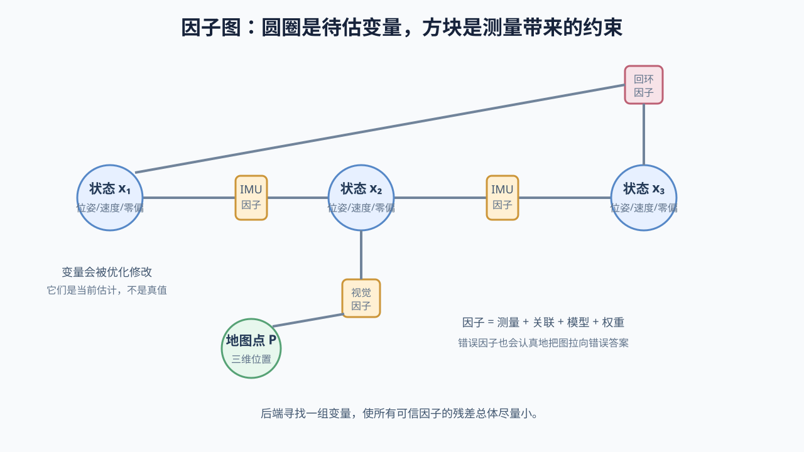

# 10 后端、BA 与因子图：把“谁测到了谁”画成图，再让一段历史共同改口

> 前置：[IMU 预测与多传感器融合](09-IMU预测与多传感器融合.md)。
>
> 本章目标：理解为什么当前位姿不能只由当前帧决定，BA、因子图、滑动窗口、边缘化和位姿图分别保留了什么信息。

## 1. 为什么只优化当前帧不够

当前帧看到一个地图点，重投影偏了 4 像素。可能是：

- 当前位姿错；
- 地图点位置错；
- 创建该地图点的旧关键帧位姿错；
- 像素观测错；
- 标定或时间模型错。

若前端只允许调整当前位姿，就默认地图和过去全都正确。这个假设在短时跟踪中可换取速度，但不能永远成立。

后端的作用是：

> 保留一段历史中的变量和观测关系，让多个位姿、地图点、速度与零偏共同承担误差，而不是把所有矛盾都塞给当前帧。

## 2. BA 的名字没有它看起来那么玄

BA 全称 Bundle Adjustment，束调整。

“束”可以想象成：从多个相机中心射向许多三维点的观测射线束。若位姿和三维点正确，每条射线应该穿过与它对应的地图点。

BA 同时调整：

- 多个相机位姿；
- 多个三维地图点；

使所有图像重投影误差总体尽量小。

## 3. 一个只有三帧两点的 BA

假设：

- 三个关键帧位姿：`T_1、T_2、T_3`；
- 两个地图点：`P_A、P_B`；
- 第 1 帧看到 A 和 B；
- 第 2 帧只看到 A；
- 第 3 帧看到 A 和 B。

观测关系：

```text
T_1 ──看见── P_A
T_1 ──看见── P_B
T_2 ──看见── P_A
T_3 ──看见── P_A
T_3 ──看见── P_B
```

每条“看见”都对应一个实际像素和一个重投影残差。

总成本：

```text
cost = Σ 所有观测的加权鲁棒重投影误差
```

优化时：

- 移动 `P_A` 会同时影响三帧中的 A 残差；
- 调整 `T_1` 会同时影响它看到的 A、B；
- 多个交叉观测让变量互相制约。

这就是联合优化比逐帧独立修正更一致的原因。

## 4. BA 的完整公式先逐项读

一种常见表达：

```text
min  Σ ρ( r_ijᵀ W_ij r_ij )
T_i,P_j
```

其中：

```text
r_ij = z_ij - project(T_i, P_j)
```

逐个解释：

- `T_i`：第 `i` 个相机位姿，是待估变量；
- `P_j`：第 `j` 个地图点，是待估变量；
- `z_ij`：相机 `i` 实际观察地图点 `j` 的像素；
- `project(T_i, P_j)`：根据当前位姿和点预测像素；
- `r_ij`：这次观测的二维重投影残差；
- `W_ij`：该观测的权重；
- `ρ`：降低大异常残差支配力的鲁棒核；
- `Σ`：只对真实存在的观测关系求和；
- `min` 下方的 `T_i,P_j`：优化器允许修改的变量。

它不是说每个相机都看见每个点，而是只为实际关联到的观测建立残差。

## 5. 局部 BA 和全局 BA

### 局部 BA

优化当前附近的一小组关键帧和地图点。与局部区域相连但不希望移动的外部关键帧，可作为固定边界提供参考。

优点：规模受控，可频繁运行。

### 全局 BA

优化整个地图中大量关键帧和地图点，通常在回环后或离线精化时进行。

优点：能更全面传播修正；缺点是昂贵，地图大时无法每帧运行。

真实系统常用：

```text
高频当前位姿优化
    + 中频局部 BA
    + 回环后的位姿图/全局修正
    + 可选低频或离线全局 BA
```

## 6. 为什么 BA 的矩阵很大，却仍能算

地图点通常只被少数相机看到，一个残差只连接：

```text
一个位姿变量 + 一个地图点变量
```

它不会同时依赖世界里所有变量。因此雅可比和 `H` 大部分位置是零，称为稀疏结构。

求解器利用这种稀疏性，避免把大矩阵当成全是非零的普通矩阵处理。

## 7. Schur 消元的直觉：先把大量地图点临时消掉

BA 中地图点往往比相机位姿多，但每个点只和少量相机相连。可先从线性方程中消去地图点更新，得到只关于相机位姿的小一些的系统；求出位姿更新后，再回代求地图点更新。

```text
大问题：相机位姿 + 大量地图点
      ↓ 利用连接结构消去地图点
较小问题：相机位姿之间怎样一起调整
      ↓ 回代
恢复每个地图点的调整
```

这叫 Schur Complement（舒尔补）技巧。第一遍不需要推公式，只需知道 BA 的高效不是因为问题不大，而是利用了“观测图很稀疏”的结构。

## 8. 因子图把优化问题画成什么

Factor Graph（因子图）有两类节点：

- 变量节点：要估计的未知状态；
- 因子节点：测量或先验产生的约束。

例如视觉惯性滑窗：

```text
        视觉因子          视觉因子
P_A ─────────── x_k ─────────── P_B
                  │
               IMU 因子
                  │
               x_{k+1}
                  │
               轮速因子
                  │
              轮速测量
```

图的边表示“这条残差依赖哪些变量”，不是机器人真正走过的道路。

## 9. 为什么因子图是统一语言

不同传感器都可以表达为：

```text
当前相关状态 → 预测测量
实际测量 - 预测测量 → 残差因子
```

典型因子：

- 视觉重投影因子：连接相机位姿和地图点；
- IMU 预积分因子：连接相邻关键状态的位姿、速度和零偏；
- 轮速因子：约束相邻机体运动；
- GNSS 因子：约束某时刻全局位置；
- 回环因子：连接时间上很远但空间上相同的关键帧；
- 先验因子：固定参考系或引入已有知识。

增加传感器不是把数据“塞进融合器”，而是定义：它连接哪些变量、预测模型是什么、残差怎样算、噪声多大、何时失效。

## 10. 图中的“变量”和现实中的“状态”仍要区分

因子图节点 `x_k` 是算法保存的状态候选，不是现实状态本身。优化修改节点数字，是在修改算法对历史的解释。

因子也不是事实本身，而是：

```text
测量数据 + 数据关联 + 测量模型 + 噪声假设
```

只要其中任何部分错，因子就可能向图中注入错误约束。



## 11. 位姿图为什么可以不保留所有地图点

回环后要修正很长轨迹时，全局 BA 可能太贵。可以只保留关键帧位姿作为变量，用相邻运动和回环估计作为边：

```text
T_1 ─ T_2 ─ T_3 ─ ... ─ T_100
 │                            │
 └──────── 回环约束 ─────────┘
```

每条边记录两个关键帧间的相对位姿测量。优化让节点位姿之间的关系尽量符合这些边。

这叫 Pose Graph Optimization（位姿图优化）。它牺牲了原始像素与地图点的细节，换取更小的全局问题。

## 12. 滑动窗口为什么存在

视觉惯性系统若从开机起保留所有状态，问题规模不断增长，无法保证实时。

滑动窗口只保留最近 `N` 个关键状态：

```text
[x_{k-N+1}, ..., x_k]
```

新关键帧进入时，最旧状态退出。窗口内变量可以反复联合优化，窗口大小保持有界。

但最旧状态不能直接删除，否则它携带的历史信息也会消失。于是需要边缘化。

## 13. 边缘化是什么：删变量，但尽量保留它对剩余变量的影响

假设图中：

```text
x_1 --测量-- x_2 --测量-- x_3
```

现在窗口不再保留 `x_1`。如果把 `x_1` 和连接它的因子直接扔掉，`x_2` 会失去来自更早历史的约束。

边缘化（Marginalization）把 `x_1` 消去，同时生成一个作用在剩余变量上的先验：

```text
历史 x_1 及其测量
       ↓ 消去 x_1
对 x_2（有时还有其他相连变量）的浓缩先验
```

于是系统不再保存完整旧状态，却保留它对当前窗口的主要信息影响。

## 14. 边缘化不是无损压缩

非线性问题在当前估计附近线性化后进行边缘化。生成的先验依赖当时的线性化点。后续状态变化很大时，这份旧线性近似可能不再完全准确。

另外，边缘化会让原本稀疏的变量之间产生更密集联系。

所以滑窗是在交易：

```text
固定计算成本
      ↕
丢失重线性化完整历史的自由，并引入近似
```

它不是简单“删除最老一帧”。

## 15. 增量平滑是什么

另一类后端不每次从头求整个图，而是在新变量和因子到来时更新受影响的部分，例如 iSAM 系列。

直觉：

```text
新测量通常只直接连接少量节点
→ 复用旧求解结构
→ 只重算真正受影响的部分
```

它适合长期图优化，但实现仍需处理重线性化、变量排序和回环造成的大范围影响。

## 16. 信息矩阵和协方差在因子里表达什么

一条测量可能在不同方向上精度不同。例如激光看到一面墙：

- 沿墙法向距离约束很强；
- 沿墙切向位置约束弱。

协方差矩阵 `Σ` 描述误差在各方向的大小与相关性；信息矩阵常为：

```text
W = Σ⁻¹
```

它用于加权残差。协方差大表示不确定强，对应信息和权重小。

不能为了“让某传感器起作用”就随意把信息矩阵设得极大。过度自信的错误因子会把整张图拉坏。

## 17. 为什么后端会出现不一致

常见来源：

- 重复使用同一信息，却假装它们互相独立；
- 边缘化后旧线性化先验与新状态差太远；
- 外点没有剔除；
- 噪声模型低估真实误差；
- 未建模的时间偏移、温漂和动态场景；
- 不可观自由度被错误当成有精确信息。

数值残差很小并不能证明统计上一致。系统可能通过扭曲多个状态，过度迎合一个错误且高权重的因子。

## 18. 后端优化和前端输出怎样共存

后端可能把过去关键帧和当前局部地图整体修正。前端仍需继续处理新图像，因此要定义清楚：

- 前端何时读取后端更新；
- 地图点被删除时如何避免悬空引用；
- 回环大修正后当前跟踪参考怎样切换；
- 发布给控制器的局部连续坐标是否允许跳变；
- 发布给地图和任务规划的全局坐标怎样更新。

常见做法是区分连续局部里程计坐标与可全局校正的地图坐标，再维护二者之间的变换。第 14 章会详讲。

## 19. 一张表看清不同优化范围

| 类型 | 主要变量 | 主要约束 | 目的 |
|---|---|---|---|
| 当前位姿优化 | 当前帧位姿 | 当前像素/点云与固定局部地图 | 高频跟踪 |
| 局部 BA | 近期关键帧和地图点 | 局部多帧重投影 | 局部一致性 |
| 视觉惯性滑窗 | 近期位姿、速度、零偏、地图点 | 视觉 + IMU + 先验 | 有界实时融合 |
| 位姿图 | 长期关键帧位姿 | 相邻与回环相对位姿 | 传播全局漂移修正 |
| 全局 BA | 全部或大量位姿与地图点 | 原始多帧视觉观测 | 全局精化，昂贵 |

## 20. 本章最小结论

1. BA 同时调整多个相机位姿和地图点，使多帧重投影证据整体一致。
2. 稀疏观测结构和 Schur 消元让大型 BA 可计算。
3. 因子图用变量节点和测量因子统一表达视觉、IMU、轮速、GNSS 和回环。
4. 位姿图只保留关键帧及其相对位姿约束，适合大范围轨迹修正。
5. 滑窗通过边缘化把旧状态影响浓缩成先验，以固定算力换取近似。
6. 后端只能优化被建模并正确关联的证据，不能自动发现所有错误物理假设。

下一章：[回环检测与重定位](11-回环检测与重定位.md)。现在我们有能力修正一段历史，接下来需要得到最关键的长程证据：“当前位置其实和很久以前的位置相同。”
