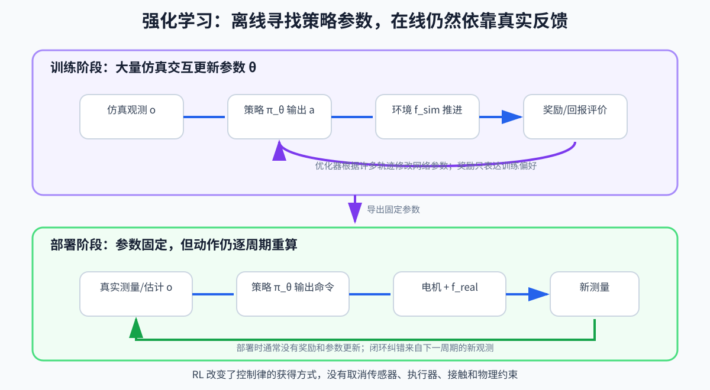

# 第 13 章：强化学习基础——一台机器人怎样从反复尝试中学出反馈控制

> **所属部分**：第三部分 · 学习控制。
>
> **前置知识**：[第 04 章：反馈控制](04-反馈控制基础.md)、[第 05 章：状态估计](05-状态估计.md)、[第 06 章：最优化控制](06-最优化控制.md)。
>
> **核心问题**：没有在部署时反复求解显式模型时，策略怎样通过大量训练学会“看到当前情况就作出动作”？
>
> **下一步**：[第 14 章：腿足强化学习工程](14-腿足强化学习工程.md)。

## 怎么读这一章

本章只追踪一台训练中的机器人：

> 它最初不会站，也不会向前走。仿真器每一步给它观测，策略输出关节目标，环境推进后给出奖励。经过许多次摔倒和更新，策略逐渐学会站稳并跟踪前进速度。

沿着这一轮训练理解：

```text
看到当前观测
→ 尝试一个动作
→ 环境产生下一状态
→ 得到奖励
→ 记录整段经历
→ 判断哪些动作比预期更好
→ 修改策略
→ 用新策略重新采集经历
```

第一遍读第 1～8、12～13 节。第 9～11 节解释 PPO（Proximal Policy Optimization，近端策略优化）、GAE（Generalized Advantage Estimation，广义优势估计）和 on-policy（同策略训练），属于第二遍；公式看不懂时先保留故事，不会影响下一章。

RL 是 Reinforcement Learning，强化学习。Deep RL 只是说策略或价值函数通常由深度神经网络表示。网络并没有改变强化学习的基本循环，但它也不应被当成一个无法打开的黑箱：本章第 6 节会从一个加权求和开始，讲清最常见的 MLP（Multi-Layer Perceptron，多层感知机）怎样把一组观测数字变成一组动作数字。

第一遍只需要真正认识六个角色：

```text
环境：保存机器人和地面，并推进物理
观测：机器人当前能够得到的线索
Actor：根据观测决定动作
动作：Actor 交给环境的当前命令
奖励：环境对刚才结果给出的训练分数
Critic：训练时帮助判断这次动作比预期好还是差
```

其中只有 Actor 负责给机器人动作。Critic 不控制电机，也不在真机旁边监督机器人；它通常只在训练阶段帮助 Actor 学习。Actor 和 Critic 是两种**工作角色**，MLP 是实现这些角色时常用的**网络结构**，PPO 和 GAE 则是“怎样利用一批经历更新网络”的**训练办法**。这三个层次不能混成同一个名词。

强化学习的本质也可以先压缩成一句话：

> 它不直接得到“每个状态下正确动作是什么”的答案，而是根据动作造成的长期后果，逐渐优化一条“当前观测 → 当前动作”的反馈规则。

神经网络负责表示这条规则，Actor–Critic 帮助从经历中评价和修改它，PPO 约束每次修改不要过猛。三者不是三个互相竞争的控制流派。

---

## 1. 为什么不直接为每种情况手写动作

第 06 章的 MPC（Model Predictive Control，模型预测控制）会在运行时根据模型预测未来，并在线寻找动作。WBC（Whole-Body Control，全身控制）也会根据当前任务和约束在线求当前全身作用。

另一种思路是手写大量规则：

```text
身体向前倾 2° 时，髋关节这样动
身体向前倾 4° 且右脚支撑时，关节那样动
地面稍滑、速度偏快、左脚即将落地时，再换一套规则
```

很快会遇到组合爆炸：姿态、速度、接触、地形、命令和扰动可以形成无数种情况。

强化学习换了一种计算分工：

```text
训练时：
让机器人在仿真中经历大量情况
→ 尝试动作并观察长期结果
→ 逐渐修改策略网络

部署时：
当前观测
→ 策略网络前向计算
→ 当前动作
```

它把大量搜索和试错放到训练阶段，最后得到一个能快速调用的反馈规则。

但这不是免费能力。设计者仍然决定：

- 仿真器怎样描述机器人和地面；
- 策略能看到哪些观测；
- 策略能输出什么动作；
- 什么行为得到奖励；
- 从哪些初始状态和随机条件训练；
- 哪些失败会结束回合。

RL 没有消灭控制设计，只是把一部分设计从显式方程移到了环境、数据和训练目标中。

---

## 2. 先看一轮最小交互，不要先背 MDP（马尔可夫决策过程）

假设策略以 `50 Hz` 运行，每 `0.02 s` 作出一次动作。

### 第 `t` 步：策略看见观测

环境给策略：

```text
o[t]=
[
速度命令
身体角速度
身体倾斜线索
关节位置
关节速度
上一动作
]
```

`o[t]` 叫作 observation，观测。它不是上帝视角下的完整真实状态，而是策略部署时能够获得的信息组合。

### 策略输出动作

策略网络计算：

```text
a[t]=policy(o[t])
```

假设 `a[t]` 表示各关节相对默认姿态的目标偏移。它仍然只是命令，不是机器人下一刻必然达到的关节角。

### 环境推进真实或仿真物理

动作经过缩放和底层 PD（Proportional-Derivative，比例—微分）控制，变成关节命令；仿真器处理动力学、接触和碰撞，推进到下一时刻。

```text
当前状态 + 动作
→ 环境 step
→ 下一状态
```

### 环境给出奖励

若机器人：

- 速度更接近命令；
- 身体没有摔倒；
- 动作不过分抖动；
- 脚没有严重打滑；

就得到较高奖励。相反，摔倒、用力过猛或偏离命令会降低奖励。

这一轮最小交互是：

```text
观测 o[t]
→ 动作 a[t]
→ 环境推进
→ 奖励 r[t]
→ 新观测 o[t+1]
```

训练会并行重复成千上万次这条链。

---

## 3. 训练反馈和部署反馈不是一回事

这两个“反馈”很容易混淆。

### 训练内部的学习反馈

一批轨迹采完以后，算法根据奖励和价值估计修改网络参数：

```text
经历和奖励
→ 计算哪些动作比预期好
→ 更新神经网络参数 θ
```

这是跨许多回合发生的 **学习过程**。

### 部署时的物理反馈

策略参数固定以后，真机仍然每个周期执行：

```text
真实运动
→ 传感器测量
→ 状态估计和观测
→ 策略输出新动作
→ 电机影响真实运动
```

这是毫秒级持续运行的 **控制闭环**。

因此：

```text
训练结束 ≠ 部署时开环播放
```

固定的是网络参数，不是动作序列。机器人被推以后，观测会改变，策略仍应输出不同动作作出反馈。

部署时通常也不需要继续计算训练奖励。奖励负责在训练阶段塑造策略，不是推着真机运动的神秘能量。



---

## 4. 现在再给交互循环起名：MDP

MDP 是 Markov Decision Process，马尔可夫决策过程。

它不是某种神经网络，而是对“这道学习题到底是什么”的定义。常写成：

```text
(𝒮,𝒜,P,r,γ)
```

把它放回正在学走路的机器人：

- `𝒮`：状态空间，环境中所有可能真实或仿真状态的集合；
- `𝒜`：动作空间，策略被允许输出的所有动作；
- `P`：当前状态执行动作以后，下一状态可能怎样变化；
- `r`：这一步行为得到多少奖励；
- `γ`：未来奖励相对当前奖励的重要程度。

### 4.1 状态和观测为什么要分开

仿真环境可能知道完整状态 `s[t]`：

```text
真实基座速度
精确接触力
地面摩擦系数
外部推力
所有关节状态
```

真机策略却通常只能得到观测 `o[t]`：传感器测量、状态估计和历史的组合。

因此策略实际运行的是：

```text
a[t]∼π_θ(·|o[t])
```

而不是直接读取完整 `s[t]`。

### 4.2 `P` 不是程序里一定要显式存储的表

数学上可写：

```text
P(s[t+1]|s[t],a[t])
```

读作：已经给定当前状态和动作时，下一状态出现的可能性。

- 竖线 `|`：在右侧条件已经给定的情况下；
- 这里的 `P` 是状态转移规律，不是第 05 章状态估计协方差 `P`。

连续人形系统不可能真的把所有状态转移存成巨大表格。训练时，仿真器的 `step()` 承担了“给定状态和动作，产生下一状态”的角色。

### 4.3 Markov 性在说什么

Markov 性理想地要求：当前状态已经包含预测未来所需的信息，不必再查更早历史。

但策略只有部分观测时，单帧可能看不见：

- 线速度；
- 接触是否刚刚发生；
- 执行器延迟；
- 地面摩擦；
- 外部扰动趋势。

所以腿足控制更接近 POMDP（Partially Observable Markov Decision Process，部分可观测马尔可夫决策过程）。历史堆叠、RNN（Recurrent Neural Network，循环神经网络）、GRU（Gated Recurrent Unit，门控循环单元）和状态估计器，都是在利用过去证据补足当前单帧看不见的信息。

---

## 5. 为什么不能只奖励眼前一步

假设策略发现：猛地向前扑倒，可以在短时间内获得很高前进速度。

若奖励只看当前 `0.02 s` 的位移，它可能认为这是一条好动作；但半秒后机器人会摔倒。

因此训练要评价从现在开始的一段未来结果。

累计折扣回报写成：

```text
G[t]
=
r[t]
+γr[t+1]
+γ²r[t+2]
+...
```

也可以紧凑写成：

```text
G[t]
=
Σ[k=0→∞]γ^k r[t+k]
```

- `G[t]`：从第 `t` 步开始的累计折扣回报；
- `r[t+k]`：未来第 `k` 步奖励；
- `γ∈[0,1)`：折扣因子；
- `γ^k`：未来越远，权重通常越小；
- 有限回合在终止时停止，不是真的必须运行无限久。

若 `γ=0.99`、策略频率 `50 Hz`，一秒以后对应 50 个策略步，奖励权重约为：

```text
0.99^50≈0.605
```

因此 `γ` 与真实控制频率绑定。把同一个 `γ` 从 `50 Hz` 直接搬到 `200 Hz`，它代表的真实时间范围会改变。

回报的世界观是：

> **一个动作好不好，不只看它立即造成什么，还要看它把机器人带进了怎样的未来。**

---

## 6. 打开策略黑箱：MLP 怎样把观测变成动作

策略记作 `π` 或 `μ`。它的本质是一条反馈规则：输入当前观测，输出当前动作。

策略不一定非要由神经网络实现。查表、手写规则和线性反馈也都可以表示策略。但在人形机器人深度强化学习中，Actor 和 Critic 最常用的基础结构之一是 MLP：Multi-Layer Perceptron，多层感知机。

先不要被“感知机”和“深度”吓到。对本书而言，可以先把 MLP 理解成：

> **许多层可调的加权计算器串在一起，把固定长度的一组输入数字，变成固定长度的一组输出数字。**

本节只回答后文真正需要的七个问题：数字怎样进入网络、一层在算什么、为什么层与层之间要有激活函数、Actor 最后输出什么、Critic 为什么也能使用 MLP、训练究竟修改了什么，以及 MLP 有没有记忆。

### 6.1 `1014 → 29` 到底省略了什么

假设某个人形机器人的观测共有 `1014` 个数，动作共有 `29` 个数。项目文档可能把 Actor 写成：

```text
1014 → 29
```

这句话只说明**接口尺寸**：一次送入 `1014` 个观测数，一次得到 `29` 个动作数。它没有说明中间怎样计算。

实际网络可能是：

```text
1014 维观测
→ 512 个隐藏量
→ 256 个隐藏量
→ 29 维动作分布均值
```

代码配置可能把它简写成：

```text
Linear(1014,512)
→ ELU
→ Linear(512,256)
→ ELU
→ Linear(256,29)
```

- `Linear(1014,512)`：把 `1014` 个输入重新组合成 `512` 个数；
- `ELU`：一种激活函数，稍后解释；
- `Linear(512,256)`：再把 `512` 个数组合成 `256` 个数；
- 最后一层产生 `29` 个输出。

这只是讲解用的例子，不是所有人形策略必须采用的尺寸。网络究竟有几层、每层多宽，要看具体代码或配置；只看到 `1014 → 29`，不能断言中间没有隐藏层。

这几类数字的身份也不同：

```text
1014：观测维数，可能包含当前身体信息、命令和多帧历史
512、256：隐藏层宽度，是网络内部使用的中间表示
29：动作维数，例如 29 个关节的目标偏移
```

隐藏量不是新传感器，也不要求人为给每一个量起物理名字。它们是网络在训练中形成的内部组合。

按功能还可以这样分：

```text
输入层：接住外部送来的观测数字，本身通常不负责学习复杂变换
隐藏层：反复组合输入，形成供网络内部使用的表示
输出层：产生任务需要的结果，例如动作均值或价值
```

不同资料对“MLP 有几层”的计数习惯可能不同：有人只数带权重的 `Linear`，有人口头上也把输入层算进去。看到“3 层 MLP”时，最好直接查看每个 `Linear(in,out)`，不要只靠层数名称猜结构。

### 6.2 一层到底在算什么：先看一个输出

先把 `1014` 个输入缩小成三个：

```text
x₁：身体前后倾斜线索
x₂：身体俯仰角速度
x₃：膝关节位置偏差
```

某个中间计算单元可以做：

```text
z = w₁x₁ + w₂x₂ + w₃x₃ + b
```

这种小计算单元常被叫作 artificial neuron，人工神经元，或 node，节点。“神经元”只是借用了生物学比喻；在这里它首先就是一条可训练的加权计算。

- `x₁、x₂、x₃`：进入这一层的数字；
- `w₁、w₂、w₃`：weight，权重，决定各输入对结果影响多大、方向是正还是负；
- `b`：bias，偏置，给整体结果增加一个可调的基准；
- `z`：加权相加后的结果。

例如当前输入是：

```text
x₁=0.1，x₂=0.4，x₃=-0.2
```

网络当前学到的权重和偏置是：

```text
w₁=0.8，w₂=-0.5，w₃=0.3，b=0.1
```

那么：

```text
z
=0.8×0.1 + (-0.5)×0.4 + 0.3×(-0.2) + 0.1
=-0.08
```

这里没有神秘判断器，只有乘法和加法。不同计算单元使用不同权重，就会从同一批输入中提取不同组合。例如一个可能逐渐对“身体正在向前倒”敏感，另一个可能对“膝关节已经接近极限”敏感；这些含义不是程序员逐项写进去的，而是训练后可能形成的内部功能。

一层会同时计算许多个这样的 `z`。把它们合并写成矩阵形式，就是：

```text
z = Wx + b
```

- `x`：这一层收到的一列输入数字；
- `W`：把所有权重排在一起形成的矩阵；
- `b`：所有偏置排成的向量；
- `z`：这一层同时产生的一列结果。

所以矩阵没有增加新的魔法，它只是把很多条“乘权重再相加”一次写完。`Linear` 也不是说机器人只能学线性运动；它只是说**这一小层内部**先做线性加权，整个 MLP 还会加入下一小节的非线性计算。

### 6.3 为什么不能只堆很多个 `Linear`

假设网络只有加权相加：

```text
x → Linear 1 → Linear 2 → Linear 3 → 输出
```

无论叠多少层，整体仍然可以合并成一次更大的加权相加。它很难表达这类带转折的反馈关系：

```text
身体只有轻微晃动时，不必大幅迈步
身体明显要倒时，迅速跨步恢复
关节接近极限时，又必须换一种动作
```

因此每个隐藏层的加权结果之后，通常还要经过 activation function，激活函数：

```text
h = φ(Wx+b)
```

- `φ`：希腊字母 phi，这里代表激活函数；
- `z=Wx+b`：加权相加的结果；
- `h=φ(z)`：经过激活以后，送给下一层的隐藏量。

激活函数会对每个数做一个简单的弯折或压缩，使整个网络能够组合出弯曲的、分段的复杂关系。常见名字包括 ReLU、ELU 和 Tanh。第一遍不需要背它们的公式，只要知道：

> `Linear` 负责重新混合信息，激活函数负责让多层组合不再等价于一条直线。

输出层是否再使用 Tanh 等激活函数，由具体策略实现决定，不能看到动作范围是 `[-1,1]` 就自动假设所有网络都完全相同。

### 6.4 多层为什么可能有用

一层直接从上千个观测数跳到 29 个动作，要一次学会所有组合。加入隐藏层以后，网络可以逐级重新组织信息：

```text
原始观测
→ 若干局部组合
→ 更高层的身体运动模式
→ 各关节动作
```

可以用一个不严格但有帮助的直觉理解：前面的隐藏层可能组合出“身体正在前倒”“右脚可能刚接触”“当前命令要求加速”等模式，后面的隐藏层再把多个模式组合成协调的全身动作。

但不要把这种解释当成网络内部必然存在的人类语言标签。训练只调整数字参数，并没有在某个神经元上刻下“前倒检测器”。要证明某个隐藏量实际表示什么，还需要专门分析。

MLP 也叫 fully connected feed-forward network，全连接前馈网络：

- **全连接**：相邻两层之间，每个输出通常都能使用上一层的全部输入；
- **前馈**：一次计算从输入向输出前进，网络内部没有自动把上一次结果保留下来的循环；
- **多层**：通常指输入到输出之间存在一层或多层隐藏计算。

这里的“前馈网络”是神经网络结构术语，不等于第 04 章“根据模型提前补偿重力”的控制前馈。两个词都含 feed-forward，但讨论层级不同。

### 6.5 Actor 怎样用 MLP 输出动作

先看确定性策略：

```text
a[t]=μ_θ(o[t])
```

- `o[t]`：当前观测；
- `μ`：把观测映射到动作的策略函数；
- `θ`：网络里全部可学习参数，主要就是各层的 `W` 和 `b`；
- `a[t]`：当前动作；
- 相同观测和相同参数通常得到相同动作。

若使用 MLP 实现它，展开以后就是：

```text
观测 o[t]
→ 观测归一化
→ 多层 Linear + 激活函数
→ 29 个网络输出
→ 动作缩放/限幅
→ 29 个关节动作 a[t]
```

网络输出的 29 个数并不天然具有“度”“N·m”或“电机电流”的单位。第 14 章必须继续定义：它们究竟代表关节位置目标偏移、关节力矩，还是其他控制量；每个数要乘多大的动作尺度；最后交给哪一层控制器。MLP 只负责数字映射，不会自己决定物理接口。

PPO 训练中通常使用随机策略：

```text
a[t]∼π_θ(·|o[t])
```

- `π_θ(·|o[t])`：给定观测后，对可能动作定义的概率分布；
- 圆点 `·`：尚未指定的动作位置；
- `∼`：从这个分布中采样。

连续控制常让 Actor 的 MLP 输出高斯分布的均值，再为各动作维度提供标准差：

```text
μ = MLP_Actor(o)
a ∼ 𝒩(μ,diag(σ²))
```

- `μ`：动作分布均值，常由 Actor 的最后一层输出；
- `σ`：每个动作维度的探索尺度，可以是单独学习的一组参数，也可以由网络产生，取决于实现；
- `𝒩`：高斯分布；
- `diag(σ²)`：把各动作方差放在协方差矩阵对角线上。

训练时从分布采样，能让机器人在仿真中尝试略有不同的动作；部署时常使用均值 `μ`，减少随机抖动。采样、限幅、Tanh 变换和动作缩放的先后顺序会影响实际分布，读代码时必须看具体实现。

探索不是“随便破坏机器人”。它应发生在仿真和安全范围中，并通过动作限制、重置和课程控制风险。

### 6.6 Actor 和 Critic 都能是 MLP，但工作完全不同

同一种 MLP 结构可以承担不同任务，就像同一种计算机可以运行不同程序：

```text
Actor MLP：观测 → 29 维动作均值或动作分布参数

Critic MLP：状态/观测 → 1 个价值预测
```

因此：

- MLP 描述“数字经过什么结构计算”；
- Actor 描述“这张网络负责产生动作”；
- Critic 描述“这张网络负责预测处境前景”；
- PPO 描述“怎样根据训练经历修改这些网络”。

Actor 和 Critic 通常有各自的权重。即使两者碰巧都是 `512→256` 的隐藏层，也不代表它们学到相同内容。Critic 还可能在训练时额外读取仿真特权信息，所以它的输入尺寸甚至可以与 Actor 不同。第 8 节会讲 Critic 为什么出现，第 14～15 章再讲特权信息的边界。

### 6.7 训练到底改变了什么

网络结构可以看成一排已经接好的可调旋钮：层数和每层宽度规定“旋钮怎样连接”，权重 `W` 和偏置 `b` 是“旋钮当前拧到哪里”。

从零训练时，权重通常从小的随机值开始。于是最初的 Actor 基本不会走路：

```text
随机权重
→ 观测经过 MLP
→ 近似随机且没有协调意义的动作
```

一批交互完成后，奖励、Critic 和优势估计帮助判断哪些采样动作比预期好。训练程序再经历：

```text
计算训练损失
→ 反向传播：算出每个权重怎样微调会改善损失
→ 优化器让大量 W、b 各自改变一点
→ 得到稍有不同的新 Actor 和 Critic
```

backpropagation，反向传播，不是把机器人在时间上倒着运行，也不是把动作从电机传回网络。它是在训练计算图中，把输出误差对各层参数的影响从后往前算出来。gradient，梯度，可以先理解成“每个可调旋钮往哪边动一点，训练目标会改善”。

PPO 不会把一句“向前走”直接写入某个神经元，也不会逐项给 29 个关节生成标准答案。它利用大量经历反复微调参数，使有利动作在相似观测下逐渐更容易出现。

这也解释了三个经常混淆的词：

```text
architecture / 网络结构：有几层、每层多宽、怎样连接
parameters / 网络参数：训练学到的 W 和 b 等数值
checkpoint / 检查点：某一训练时刻保存的参数和相关训练状态
```

继续训练一个 checkpoint，通常是保留已经学到的参数，再用新经历继续修改，而不是重新设计一次 MLP。checkpoint 还可能包含观测归一化统计、优化器状态等内容，具体由项目保存格式决定。

还要分清 forward pass 和 backward pass：

```text
前向计算 / 推理：使用当前 W、b，从观测算到动作
反向传播 / 训练：根据损失计算应怎样修改 W、b
```

真机部署通常只做前向推理，不运行 PPO、Critic、奖励计算、反向传播和优化器。机器人仍能对扰动作出不同动作，是因为输入观测变了，不是因为网络在真机上临时重新训练。

### 6.8 普通 MLP 没有时间记忆

普通 MLP 每次只处理这一次送进来的数字：

```text
当前输入 → 当前输出
```

计算结束后，它不会自动记住上一周期看见了什么。这会遇到一个问题：只看当前一帧身体姿态，有时无法区分“正在向左倒”和“刚从左侧恢复到这里”。两者当前角度可能相同，但过去变化方向不同，需要的动作也可能不同。

工程上常见三种补法：

```text
方法 A：当前观测里直接加入估计速度等动态信息

方法 B：把最近若干帧观测拼接成一个长向量，再交给 MLP

方法 C：使用 RNN、GRU 等带内部记忆的网络
```

如果把 30 帧、每帧 30 多个数拼起来，输入达到 `1014` 维并不奇怪。这时不是 MLP 自己拥有记忆，而是输入端把一段过去打包成了当前输入。MLP 可以从这个固定历史窗口里比较变化，尝试推断速度、接触、延迟或扰动线索；窗口以外的信息仍不会自动保留。

这正好接回第 4.3 节的 POMDP：历史堆叠、RNN/GRU 和状态估计器，都是在用过去证据补足当前单帧看不见的状态。第 15 章会进一步讨论怎样从历史中推断摩擦、外力等隐藏信息。

### 6.9 把完整数据流重新连起来

现在可以把“策略网络”这个黑箱展开：

```text
传感器和状态估计
→ 构造当前观测与历史
→ 按训练时的统计量归一化
→ Actor MLP 做多层加权、激活和组合
→ 得到动作均值/动作分布
→ 训练时采样，部署时常取均值
→ 动作缩放、限幅和低层控制
→ 电机与真实世界
```

MLP 是这条链中“观测数字怎样变成动作数字”的计算结构。它很重要，但它不是完整控制器：观测从哪里来、动作有什么物理意义、底层怎样执行、安全怎样保证，都由网络外的系统共同决定。

---

## 7. Actor 已经能输出动作，为什么仍不知道该怎样改

第 6 节已经打开了 Actor：观测经过 MLP 的多层计算，最终得到动作。可这只解释了**网络怎样算出当前动作**，还没有解释**训练怎样知道这次动作值得鼓励还是抑制**。

Actor 是 actor network，策略网络。Actor 这个英文词原意是“行动者”。它的职责非常具体：

```text
当前观测 o[t]
→ Actor
→ 当前动作 a[t]
```

例如，机器人身体已经略微向前倾。Actor 读取 IMU（Inertial Measurement Unit，惯性测量单元）、关节和速度命令，给出 29 个关节目标。环境执行这些目标后，机器人可能迈步接住身体，也可能继续前倾并摔倒。

### 7.1 同一张 Actor MLP 有两个完全不同的时期

训练时，Actor 会探索，网络参数也会被反复修改：

```text
观测 → 尝试动作 → 看长期结果 → 修改 Actor
```

部署时，Actor 的层数、权重和偏置通常全部固定，但它仍然每周期读取新观测并重新做一次前向计算：

```text
真机新观测 → 已训练 Actor → 新动作
```

所以“Actor 固定”不等于“动作固定”。

### 7.2 奖励不能直接告诉 Actor 正确答案

监督学习常有明确答案：

```text
这张图片的正确标签是“猫”
```

但行走 RL 通常只有结果分数：

```text
这一步奖励 0.8
后来又走了十步
最后摔倒
```

奖励没有直接告诉网络：

```text
“左髋第 17 个输出应该增加 0.03”
```

更麻烦的是，同样得到 `0.8` 分，在一个本来就很稳定的状态里可能很差，在一个即将摔倒的状态里却可能已经是非常好的抢救。Actor 需要的不是孤零零的分数，而是：

> 这次选择，相对于当时那个处境的通常结果，究竟更好还是更差？

Critic 就是为这个比较而引入的。

---

## 8. Actor–Critic：两张一起学习的网络

Critic 是 critic network，价值网络。Critic 这个英文词原意是“评论者”或“评价者”。

先只看分工：

```text
Actor：看当前情况，决定做什么
Critic：看当前情况，估计从这里继续下去大概能得多少总分
```

两者通常是两张参数不同的神经网络；也有实现让它们共享前面的特征提取层。无论代码怎样组织，角色仍然不同：Actor 输出动作，Critic 输出一个价值估计。

### 8.1 Critic 输出的不是动作，而是“处境前景”

假设当前有三种处境：

```text
处境 A：双脚站稳，身体直立
处境 B：身体略微前倾，但还有机会迈步接住
处境 C：身体已经接近地面，几乎无法恢复
```

Critic 可能分别预测：

```text
V(A)=80：以后大概率还能稳定走很久
V(B)=45：有风险，但仍可能恢复
V(C)=3 ：很快可能结束回合
```

`V` 读作 Value，价值。它不是人民币价值，也不是某个传感器测量，而是：

> 从当前处境出发，以后继续按照当前 Actor 行动，预计还能获得多少累计奖励。

Critic 不需要提前把未来真的运行完才给出数字。它是一张正在学习的网络，会根据过去大量经历形成预测，因此它也可能预测错误。

### 8.2 一次迈步以后，怎样判断“比预期好”

机器人当前处于 B：身体略微前倾。

在动作发生前，Critic 预测：

```text
当前处境价值 = 45
```

Actor 随后尝试了一次迈步。环境推进后：

```text
这一小步立即得到奖励 = 1
下一处境的预计价值 = 55
```

若暂时取 `γ=0.9`，那么这次结果对应的更新目标约为：

```text
当前奖励 + 对下一处境前景的折扣
= 1 + 0.9×55
= 50.5
```

原来只预期 `45`，实际一步以后看到的前景约为 `50.5`：

```text
50.5 - 45 = +5.5
```

这个“新证据减去原预测”的差值，常记作：

```text
δ[t]
=
r[t] + γV(s[t+1]) - V(s[t])
```

- `δ`：希腊字母 delta，这里表示一步的“预测差”；
- `r[t]`：动作后立即得到的奖励；
- `V(s[t+1])`：Critic 对下一处境的价值预测；
- `V(s[t])`：Critic 原来对当前处境的价值预测。

在这个例子中，`δ[t]=+5.5`。它也叫 TD error，temporal-difference error，时序差分误差。名字可以第二遍再记，第一遍只记住它在比较“结果带来的新证据”和“原来的预期”。

这个正差值表达：

> 这次迈步以后，局面比原来预期的更好。

于是训练会做两件事：

```text
Actor：以后在相似观测下，更倾向于产生这类动作
Critic：修正自己的预测，让以后对这种处境判断得更准
```

如果动作后机器人更接近摔倒，差值可能为负，Actor 就会降低以后产生这类动作的倾向。

### 8.3 Critic 自己是怎样学会评价的

Critic 没有上帝赐予的正确答案。它也要从环境结果中学习。

常用的一步关系是：

```text
当前处境的价值
≈ 当前奖励 + 折扣后的下一处境价值
```

写成符号：

```text
V(s[t])
≈
r[t] + γV(s[t+1])
```

左边是 Critic 对当前处境原来的预测，右边是环境真的走了一步以后得到的新证据。训练会缩小两边的差距。

这有一点像不断更新天气预报：今天的预测会利用明天的实际发展来校正，但明天的预报本身也不一定完美。训练样本越来越多以后，Critic 通常逐渐形成有用的相对判断。

如果回合已经因为摔倒结束，后面没有“还能继续获得的未来奖励”，终止后的价值通常按 0 处理。若回合只是因为达到人为最大时长而截断，则不能总是简单当成真正失败，具体实现要区分 termination 和 truncation。

### 8.4 Actor 到底怎样被修改

训练时的 Actor 常输出一个动作概率分布，而不是死板的唯一动作。假设某次迈步动作比预期好：

```text
更新前：这种动作在相似观测下出现概率较低
更新后：这种动作出现概率稍微提高
```

若某次动作比预期差，则稍微降低它的概率。

这里的“稍微”非常重要。一次幸运或倒霉不能证明一种动作永远正确，尤其是接触、扰动和随机初始化都会改变结果。PPO 解决的主要问题之一，就是限制 Actor 每批数据不要改得过猛。

### 8.5 Value、Q 和 Advantage 现在分别是什么

有了上面的故事，再给三个评价量起名字：

```text
V(s)：只看当前处境，问“从这里继续，通常能得多少回报？”

Q(s,a)：在当前处境先指定动作 a，再继续行动，通常能得多少回报？

A(s,a)=Q(s,a)-V(s)：这个动作比当前处境下的通常选择好多少？
```

因此：

- `A>0`：比当前 Actor 在这个处境下的平均表现更好；
- `A<0`：比平均表现更差；
- `A≈0`：没有明显更好或更差。

Advantage 中文常译作“优势”。它不是说动作在所有情况下都优秀，而是说：**在这个具体处境中，它比当前策略通常会做的选择更好多少。**

实际 PPO 中不会为连续动作显式建一张巨大 `Q` 表，而会根据奖励和 Critic 的价值预测估计 `A`。下一节公式中的 `A_hat` 上方有帽子，正是在提醒我们：它是估计值，不是物理世界直接提供的真值。

### 8.6 一批 PPO 训练到底发生了什么

把两个网络放回完整训练循环：

```text
第 1 步：Actor 在许多并行仿真机器人上读取观测并尝试动作
第 2 步：环境返回奖励、新观测和是否结束
第 3 步：连续收集一小段经历
第 4 步：Critic 估计各处境的价值
第 5 步：根据奖励和价值，估计每个动作比预期好多少
第 6 步：稍微提高好动作的概率，降低差动作的概率
第 7 步：同时训练 Critic，让它以后预测得更准
第 8 步：用更新后的 Actor 重新采集新经历
```

所以 Actor–Critic 不是两个控制器争夺机器人：

```text
训练时：Actor 行动，Critic 帮助评价，两者都更新
部署时：通常只导出 Actor，Critic 退出
```

### 8.7 Critic 看见特权真值时，边界在哪里

仿真中可以让 Critic 额外看到真实摩擦、精确速度和外力，使训练评价更容易。这叫非对称 Actor–Critic：

```text
Actor：只看真机部署时能够获得的观测
Critic：训练时可以额外看仿真特权信息
```

特权信息只是帮助训练期的价值判断。只要某个仿真真值直接进入 Actor 的动作生成路径，真机部署时它就会突然缺少输入。第 14～15 章会专门展开这条边界。

### 8.8 四个不要混淆的结论

- Critic 评价的是预计训练回报，不是证明动作满足物理安全约束；
- Critic 也会犯错，它不是拥有正确答案的裁判；
- Critic 不给电机动作，真正部署的动作来自 Actor；
- Actor–Critic 是训练组织方式，不是机器人上新增了两个物理控制回路。

---

## 9. PPO：为什么更新策略时不要一步改得太猛

这一节属于第二遍。第一遍只读下面这段故事即可。

### 9.1 先不看公式：一批经历只能支持一次有限修改

假设 Actor A 在 4096 台仿真机器人上采集了一批经历。数据告诉我们：身体略微前倾时，某类迈步动作通常比预期好。

训练当然希望 Actor 以后更愿意迈这一步。但这批数据只证明：

```text
Actor A 偶尔这样迈步时，结果不错。
```

它没有证明：

```text
无论什么状态都应该强烈地迈这一步。
```

如果一次参数更新特别大，得到 Actor B，它的行为可能从“小步试探”突然变成“每次都猛跨”。Actor B 会进入 Actor A 从未访问过的身体状态，而手里的训练数据仍然来自 Actor A。此时继续拿旧经历大胆修改 Actor B，依据就越来越不可靠。

PPO 是 Proximal Policy Optimization，近端策略优化。它的核心态度是：

> **可以朝表现更好的方向更新，但一次不要离采集数据的旧策略太远。**

“近端”可以先理解成“这次更新只走近一点”。PPO 不是一种新的机器人动作，也不是部署时额外运行的控制器；它只是训练 Actor–Critic 的一种算法。

### 9.2 概率比在比较什么

训练时的 Actor 会为动作给出概率分布。对数据中已经发生的那个动作，可以比较：

```text
旧 Actor 当时有多倾向这个动作
新 Actor 现在有多倾向这个动作
```

新旧策略对同一个已采样动作的概率比写成：

```text
ratio_t(θ)
=
π_θ(a[t]|o[t])
/
π_θ_old(a[t]|o[t])
```

- `θ_old`：采集这批数据时使用的旧策略参数；
- `θ`：正在更新的新策略参数；
- 连续动作中，分子分母更准确地说是该动作处的概率密度；
- `ratio=1`：新旧策略对该动作的倾向相同；
- `ratio>1`：新策略更偏向该动作；
- `ratio<1`：新策略更少选择该动作。

例如：

```text
ratio=1.05：新 Actor 对这个动作的倾向提高约 5%
ratio=1.80：倾向一下提高了很多
ratio=0.70：倾向明显降低
```

如果这个动作的优势 `A_hat` 为正，训练希望 `ratio` 略微大于 1；若优势为负，训练希望它略微小于 1。但“略微”不能无限扩大。

### 9.3 clip 为什么出现

PPO 用裁剪目标限制利用“概率变化很大”获得的训练收益：

```text
L_clip
=
平均值
{
min(
ratio[t]·A_hat[t],
clip(ratio[t],1-ε,1+ε)·A_hat[t]
)
}
```

- `A_hat[t]`：从采样和 Critic 得到的优势估计；
- `ε`：允许概率比变化的范围，例如 `0.2`；
- `clip`：把数值限制在 `[1-ε,1+ε]`；
- `min`：使用更保守的收益。

若 `ε=0.2`，核心区间就是：

```text
[0.8,1.2]
```

可以把它理解成：同一批旧数据最多鼓励策略把某个动作的相对倾向推到一定程度；再继续猛推，训练目标不再额外奖励这种激进行为。

PPO 不是直接把每个神经网络参数裁剪到某个范围，而是在训练目标中限制新旧策略概率变化带来的收益。

它也不是一道绝对护栏：裁剪单批样本的训练收益，不等于数学上保证整个新策略处处都与旧策略很近。因此工程上还要观察实际 KL（Kullback–Leibler，库尔贝克—莱布勒）散度、动作变化和训练是否崩坏。

### 9.4 Actor 和 Critic 各优化什么

概念上，一批更新包含三件事：

```text
Actor：让优势为正的动作更可能出现，让优势为负的动作更少出现
Critic：缩小自己的价值预测误差
探索项：避免动作分布过早缩成几乎没有探索
```

论文可能把它写成“最大化目标”，代码也可能取负号后写成“最小化损失”。初学时不要被正负号形式带走，先检查三部分分别在推动什么。

具体权重属于训练实现。第一遍只需要记住：**PPO 使用与当前 Actor 足够接近的策略采集数据，再让 Actor 和 Critic 做有限幅度的更新。**

---

## 10. GAE：把多步“比预期好多少”合在一起

这一节也属于第二遍。

第 8 节的一步预测差是：

```text
δ[t] = 当前奖励 + 折扣后的下一价值 - 当前价值
```

只看当前这一个 `δ[t]`，判断很容易受 Critic 一次预测错误影响；但如果必须一直等到几十秒后的回合结束，再把全部结果归因给最早动作，随机扰动和后续动作又会带来很大波动。

GAE 想在两者中间找一个折中：既看眼前一步，也看后面几步的预测差，但越远影响越小。

例如从当前开始，连续三步的预测差是：

```text
δ[t]   = +2.0
δ[t+1] = +1.0
δ[t+2] = -0.5
```

GAE 会把它们按逐渐减小的权重合起来。于是当前动作的评价不只依赖眼前 `+2.0`，也会考虑它随后是否把机器人带进了更好或更差的局面。

GAE 是 Generalized Advantage Estimation，广义优势估计。它把未来多步时序差分误差按权重相加：

```text
A_hat_GAE[t]
=
Σ[l=0→∞]
(γλ)^l δ[t+l]
```

- `l`：从当前往后第几步；
- `λ∈[0,1]`：GAE 参数；
- `γλ`：每向后多看一步，权重再乘一次的衰减比例；
- `λ` 较小：更依赖短期 Critic，波动较小但可能偏差更大；
- `λ` 较大：看得更长，偏差可能更小但波动更大。

这里的 `λ` 只是 GAE 参数，不是动力学章节中的接触力。

GAE 最终产生的 `A_hat[t]` 会交给 PPO，用来判断数据中这个动作应该变得更常见还是更少见。它不是部署时输入 Actor 的新传感器，也不是机器人动力学中的物理量。

GAE 的作用可以压缩成一句话：在“相信短期价值估计”和“使用更长真实经历”之间作折中。

---

## 11. On-policy：为什么 PPO 的旧经历很快过期

策略更新以后，它访问的状态也会改变。

```text
昨天的策略：经常小步慢走
今天的策略：已经开始大步跑
```

昨天的数据主要来自“小步慢走时会到达的状态”，不完全代表今天策略的分布。

PPO 属于 on-policy（同策略）方法：

```text
用当前策略采集一批数据
→ 做有限轮更新
→ 用新策略重新采集
```

它不是“每个样本只能使用一次”的绝对字面规则，而是要求采样策略与正在更新的策略足够接近。

Off-policy（异策略）方法允许大量复用旧策略数据，但需要额外处理“数据来自谁”和“当前策略正在学什么”之间的分布差异。

腿足 PPO 看起来样本很多，通常是因为数千个仿真环境并行采样，而不是因为同一小批旧数据可以无限复用。

### 11.1 继续训练 checkpoint，不等于重新使用旧数据

这一点对理解项目中的版本谱系非常重要。假设实验这样演化：

```text
W2 → W4b → W4c → W5
```

它通常表示：

```text
读取上一版 Actor/Critic 的 checkpoint
→ 用继承来的网络继续与环境交互
→ 采集当前版本的新轨迹
→ 再做 PPO 更新
```

继承的通常是网络已经学会的能力，可能还包括观测归一化统计和优化器状态；并不表示 PPO 把 W2 时代的所有轨迹永久保存在一个大数据集中反复训练。

因此要区分：

```text
从零训练：Actor 和 Critic 随机初始化

继续训练：加载旧 checkpoint，但重新采集新经历

全量参数更新：继承 checkpoint 后，网络全部参数仍允许被 PPO 修改
```

一个阶段是否产生上亿个新样本，要由并行环境数、每轮采集长度和迭代次数计算，不能从版本名或 checkpoint 后缀猜测。第 14 章会给出这个乘法关系。

---

## 12. RL 与第 06 章最优化控制怎样对应

两条路线都在回答：当前情况下该采取什么动作，只是把计算放在不同位置。

| 最优化控制中的概念 | 强化学习中的对应 |
|---|---|
| 当前状态估计 `x_hat` | 环境状态 `s`；策略通常只见观测 `o` |
| 候选控制输入 `u` | 动作 `a` |
| 内部动力学模型 `f_model` | 训练环境或仿真器 `step()` |
| 代价越小越好 | 奖励或回报越大越好 |
| 在线求解器 | 训练过程 |
| 求出的反馈控制律 | 训练后的 policy |

MPC 在每个周期显式预测候选未来并在线求解。RL 在训练中通过大量环境交互，把“许多状态下应该怎样行动”压进网络参数；部署时只进行前向推理。

但 RL 仍依赖模型，只是位置不同：

```text
训练面对 f_sim
部署面对 f_real
```

仿真器中的质量、接触、摩擦、延迟和执行器响应决定策略训练时经历了什么。所谓 model-free 通常只表示算法不需要显式使用可微动力学方程求策略梯度，不表示物理模型和仿真质量不重要。

---

## 13. 把训练策略重新放回真实闭环

训练结束后，完整真机链条仍是：

```text
x_real
→ 传感器测量 y
→ 状态估计和观测构造 o
→ Actor 策略输出动作 a
→ 动作缩放和低层控制形成命令 u
→ 驱动器与执行器形成 u_real
→ 真实机器人和环境产生新 x_real
```

这里没有任何一步能被“训练奖励很高”自动保证。

需要逐项检查：

- 训练观测在真机是否真的可获得；
- 观测顺序、单位、坐标系和归一化是否一致；
- 动作究竟是位置、力矩还是残差；
- 策略频率和底层控制频率是否一致；
- 仿真接触和执行器是否覆盖现实差异；
- 动作是否经过限幅和安全检查；
- 分布外情况怎样检测和退出。

强化学习策略是控制闭环中的决策模块，不是完整机器人系统。

## 14. 常见误解

### “奖励高，所以行为一定正确”

错误。策略可能找到奖励漏洞，例如扑倒后滑行也获得前进奖励。

### “model-free，所以不需要运动学和动力学”

错误。观测、动作、奖励、仿真、接触和部署诊断都依赖对物理接口的理解。

### “训练完成以后，真机只播放动作”

错误。策略参数固定，动作仍根据每周期新观测在线变化。

### “输入有 1014 维，所以机器人安装了 1014 个传感器”

错误。输入维数统计的是送进网络的数字个数，可能包含命令、估计量、上一动作以及许多帧历史；同一个传感器的多轴、多帧数据都会占据多个维度。

### “Actor 和 Critic 都写成相同尺寸的 MLP，所以它们是同一张网络”

错误。结构尺寸相同只表示连接形式相似；两者通常拥有不同权重、输入和输出职责。只有代码明确共享参数时，才存在共享部分。

### “Critic 看到了真值，所以 Actor 也可以使用”

错误。训练时 Critic 可拥有特权信息，部署 Actor 的输入必须在真机可获得。

### “PPO 稳定，所以不需要检查训练分布”

错误。PPO 只是一种更新算法，不会自动修复奖励、接口、仿真和数据覆盖错误。

## 本章小结

1. RL 通过“观测—动作—环境后果—奖励”反复交互，在训练阶段寻找策略参数；部署时策略仍是在线反馈控制。
2. MDP 定义状态、动作、转移、奖励和未来权重；策略真正看到的通常只是部分观测。
3. MLP 用多层“加权相加 + 激活函数”把固定长度输入映射为输出；Actor 和 Critic 是网络承担的角色，PPO 是修改网络参数的训练办法。
4. 训练主要改变网络的权重和偏置；部署时参数固定，但新观测仍会经过前向计算产生新动作。普通 MLP 本身没有时间记忆，历史堆叠只是把过去打包进当前输入。
5. 回报评价动作带来的长期后果，Value、Q 和 Advantage 帮助判断处境与动作相对预期的好坏。
6. Actor 负责行动，Critic 负责训练期评价；PPO 通过限制单批数据上的策略变化，让更新不过分激进。
7. 奖励、仿真器、观测和动作接口共同定义策略学到什么；训练高分不能替代真机闭环验证。

## 练习

第一遍只回答前十题：

1. 训练结束后，RL 策略为什么仍然是反馈控制？
2. 状态 `s` 和策略观测 `o` 有什么区别？
3. 为什么只奖励当前一步前进速度，可能学出扑倒动作？
4. Actor 和 Critic 分别输出什么？哪一个给机器人动作？
5. Critic 为什么也需要训练，而不是天然知道正确评价？
6. Value、Q 和 Advantage 分别在评价什么？
7. 奖励和 Critic 在部署时是否必须继续运行才能驱动机器人？
8. `1014 → 29` 说明了什么，又省略了什么？
9. 一层中的 `W`、`b` 和激活函数分别做什么？
10. 为什么把 30 帧历史拼给 MLP，不等于 MLP 自己拥有永久记忆？
11. PPO 为什么不希望一次更新离旧策略太远？
12. 继续训练 checkpoint，为什么不等于反复使用这个版本以前的全部轨迹？
13. `50 Hz` 策略使用 `γ=0.99` 时，一秒后奖励大约还剩多少权重？

参考答案：

1. 它每周期读取新观测，再根据当前情况输出新动作；固定的是网络参数，不是动作序列。
2. 状态是环境完整描述，观测是策略实际能获得的证据，通常不完整且有噪声。
3. 当前速度高不代表长期结果好，扑倒后的失败可能在未来才发生。
4. Actor 输出动作分布或动作；Critic 输出价值估计。给机器人动作的是 Actor。
5. Critic 的价值不是传感器真值，它只能根据采集到的奖励、终止和后续处境不断修正预测。
6. Value 评价当前处境，Q 评价当前处境下先做某动作，Advantage 评价该动作比策略平均水平好多少。
7. 通常不需要；奖励和 Critic 主要服务训练，真机由观测—Actor—动作—物理响应形成闭环。
8. 它只说明一次输入 1014 个观测数、输出 29 个动作相关数；中间隐藏层、激活函数、归一化以及动作后处理都被省略了。
9. `W` 决定各输入怎样加权组合，`b` 提供可调基准，激活函数引入非线性，使多层网络能表达带转折的复杂关系。
10. MLP 仍只读取本次输入；只是输入构造器把有限长度的过去拼进来了，窗口以外的信息不会被普通 MLP 自动保存。
11. 数据由旧策略采集，变化太大会让这批数据和价值估计迅速失去代表性。
12. checkpoint 继承的是网络能力和相关训练状态；on-policy PPO 通常仍要用当前策略重新采集新轨迹。
13. `0.99^50≈0.605`。
