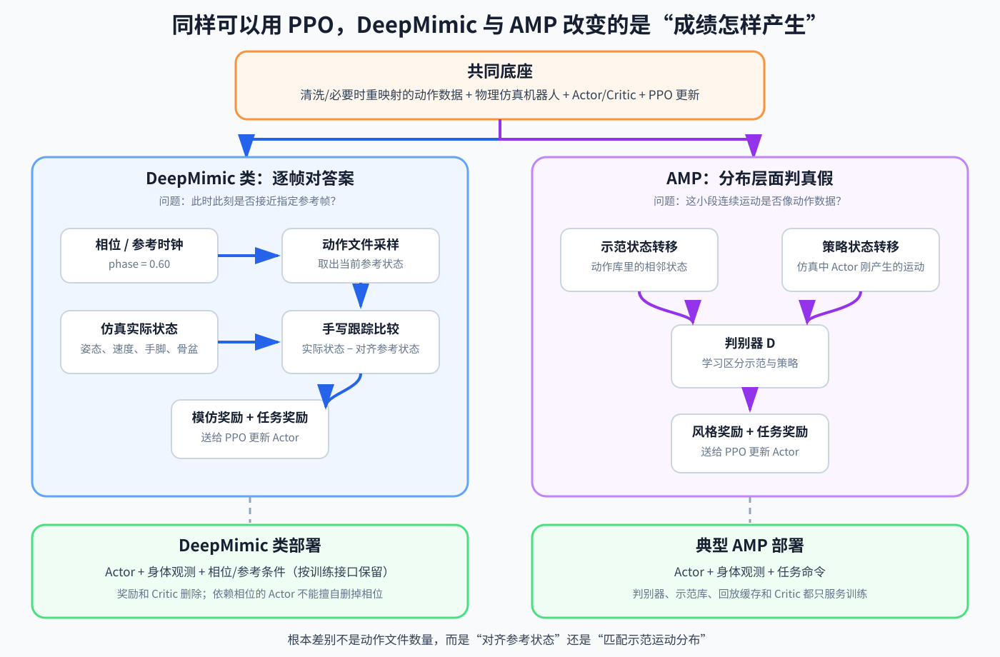

# 第 17 章：动作数据、重映射与运动模仿——数据只告诉“想怎样动”，控制器仍要学“现在怎样做”

> **所属部分**：第三部分 · 学习控制。
>
> **前置知识**：[第 02 章：运动学与雅可比](02-运动学与雅可比.md)、[第 13 章：强化学习基础](13-强化学习基础.md)、[第 14 章：腿足强化学习工程](14-腿足强化学习工程.md)和[第 15 章：特权学习](15-特权学习与鲁棒行走.md)。
>
> **核心问题**：动作数据通常只展示“身体应该怎样运动”，并没有给出电机应该怎样控制；机器人怎样把动作样例变成可恢复的闭环行为？
>
> **下一步**：[第 18 章：多动作策略与 BFM](18-多动作策略与BFM.md)。

## 怎么读这一章

- **第一遍读第 0～3、5～10 节**：先分清三种“模仿”，再把 DeepMimic 和 AMP 的训练输入、奖励与部署差别看完整。
- **第二遍读第 4 节**：需要处理人体动作数据时，再看重映射的优化形式。
- **准备真正写训练代码时重点读第 9.7～9.9 节**：那里直接回答“我已经有普通 PPO 工程，分别还要增加什么”。

本章继续使用一段简单动作：

```text
右手举过头顶
→ 慢慢深蹲
→ 起身向左转 90°
```

请始终记住：动作文件不是电机程序。它可能告诉我们某一时刻手、脚和身体在哪里，却通常不会告诉我们29个电机此刻分别应该输出什么目标或力矩。

本章真正要补上的桥梁是：

```text
动作数据描述“希望身体怎样运动”
→ Actor 根据当前身体误差决定“现在怎样做”
→ 电机和接触产生真实结果
→ 下一周期继续根据真实结果纠偏
```

---

## 0. 先分清三种不同的“模仿”

“模仿学习”这个词覆盖了几种很不一样的问题。如果不先分开，DAgger、DeepMimic 和 AMP 会看起来像一堆互相替代的算法名。

| 路线 | 数据直接提供什么 | 学习时主要比较什么 | 常见训练方式 |
|---|---|---|---|
| 行为克隆/DAgger（数据集聚合） | Teacher 的动作答案 | Student 动作与 Teacher 动作 | 监督学习 |
| DeepMimic 类参考运动跟踪 | 希望达到的身体状态 | 当前实际状态与当前对齐参考帧 | 手写跟踪奖励 + 强化学习 |
| AMP（对抗运动先验）风格模仿 | 一批看起来像目标风格的运动片段 | 策略运动与数据分布是否相似 | 判别器奖励 + 强化学习 |

### 0.1 DAgger：老师直接告诉“应该做什么动作”

第 15 章的 DAgger（Dataset Aggregation，数据集聚合）保存的是：

```text
Student 当前能看到的观测
+ Teacher 在这个状态给出的正确动作
```

Student 可以直接做监督学习：自己的动作越接近 Teacher 动作，损失越小。

### 0.2 参考运动跟踪：数据只告诉“身体应该是什么样”

动作捕捉或动画数据通常记录姿态和运动：

```text
手在哪里
脚在哪里
身体朝向哪里
关节怎样随时间变化
```

它没有记录“机器人电机应该怎样做”。Actor 必须通过仿真物理、跟踪奖励和强化学习，自己找到能让机器人接近参考状态的关节动作。

### 0.3 AMP：不指定当前必须跟踪哪一帧，只要求运动风格相似

AMP（Adversarial Motion Priors，对抗运动先验）可以用一批没有精确排列成任务顺序的动作片段，学习“什么样的连续运动像数据中的风格”。策略一边完成前进、转向等任务，一边获得风格奖励。

本章以第二条“参考运动跟踪”为主。第一条已经在第 15 章出现，第 8～9 节会把 DeepMimic 和 AMP 放进同一条 PPO 训练主线比较。

---

## 1. 一份参考动作究竟包含什么

先不要想神经网络。我们先打开一份动作文件。

一段机器人参考动作可能按时间保存：

```text
时刻或相位
根节点/骨盆的位置与朝向
各关节参考角 q_ref
各关节参考速度 q_dot_ref
手、脚等关键点的参考位置
哪些脚应该接触地面
```

不是每份数据都有全部字段。有些只有人体骨架关键点；有些已经是机器人关节轨迹；有些只有关键姿势，需要再插值成连续运动。

### 1.1 参考轨迹是什么

把连续许多时刻的参考状态排起来，就得到 reference trajectory，参考轨迹：

```text
第 0 帧希望怎样
→ 第 1 帧希望怎样
→ 第 2 帧希望怎样
→ ……
```

它是“希望发生的运动”，不是机器人已经实现的运动，也不是必须原样下发给关节的命令。

### 1.2 相位是什么

phase，动作相位，表示当前进行到整段动作的哪里。可以把一段动作从头到尾标成 `0～1`：

```text
phase=0.00：动作刚开始
phase=0.30：右手已经抬起，准备下蹲
phase=0.60：位于深蹲附近
phase=1.00：转身结束
```

周期行走也可以让相位走到 1 后重新回到 0。

相位不是 IMU（Inertial Measurement Unit，惯性测量单元）测出的物理状态。它通常由动作播放器、步态时钟或上层行为模块提供，用来告诉策略“当前希望跟踪参考动作的哪一部分”。

### 1.3 动作数据最关键的缺失：控制动作

即使动作文件完整记录了人的姿态和速度，它通常仍然没有机器人需要的：

- 关节位置目标；
- 关节力矩；
- 足底接触力；
- 受扰以后怎样恢复的动作。

这就是运动模仿仍然需要控制学习的根本原因：

> 动作数据描述目标状态，控制器负责根据当前真实状态产生动作。

---

## 2. 一次最小的参考运动训练怎样运行

现在假设参考数据已经转换成适合机器人的举手—深蹲—转身轨迹。

### 2.1 Actor 的输入与输出

一种常见形式是：

```text
a[t] = Actor(o_body[t], c_motion[t])
```

- `o_body[t]`：机器人当前身体观测，例如 IMU、关节位置、关节速度和上一动作；
- `c_motion[t]`：当前运动条件，可以是相位、当前参考、未来几帧参考或技能编号；
- `a[t]`：Actor 当前输出的关节动作，常被解释成关节位置目标偏移。

不同方法给 Actor 的运动条件不同：

```text
方式 A：只给动作相位或技能编号
方式 B：给当前参考姿态
方式 C：给当前参考 + 未来几帧参考
方式 D：只给手脚目标等任务参考
```

若 Actor 使用第 13 章的 MLP，最直接的做法就是先把身体观测和运动条件拼成一个长输入向量，再交给同一张网络：

```text
[当前身体观测，当前参考/相位/未来参考]
→ Actor MLP
→ 当前关节动作
```

参考动作不会自动住进网络里。它要么作为当前输入明确告诉 Actor“现在希望怎样动”，要么在训练中形成由相位、技能编号等较短条件触发的行为；选择哪一种，决定了部署时还需要提供什么命令。若连参考、相位和技能条件都不提供，同一个身体状态可能对应多个合理未来，Actor 无法凭空知道操作者此刻想模仿哪段动作。

所以不能笼统地说“运动模仿策略部署时必须输入完整参考轨迹”。准确说法是：

> 精确运动跟踪通常需要某种运动身份、相位或参考目标，但具体接口由方法定义。

### 2.2 环境怎样产生学习信号

一次控制周期是：

```text
读取当前身体观测
→ 读取当前相位对应的参考状态
→ Actor 输出动作
→ 动作缩放并交给关节 PD（Proportional-Derivative，比例—微分控制）
→ 仿真器推进动力学与接触
→ 得到机器人新的实际状态
→ 比较实际状态与参考状态
→ 形成跟踪奖励
```

如果机器人实际姿态、手脚位置和身体运动更接近参考，奖励通常更高；如果摔倒、脚滑、动作猛烈或严重偏离参考，奖励降低。

PPO（Proximal Policy Optimization，近端策略优化）再利用大量这样的经历修改 Actor–Critic。训练不是把参考关节角直接复制进 Actor 参数，而是在寻找：

```text
面对各种当前误差时，怎样输出动作才能在未来继续跟住参考。
```

### 2.3 部署时奖励通常消失，但参考和反馈仍然存在

训练结束后：

```text
动作库/上层模块给出运动条件
→ Actor 读取当前身体反馈
→ 输出当前关节动作
→ 电机和真实世界响应
→ 下一周期重新测量并纠偏
```

奖励和 Critic 通常不再运行。参考或相位负责说明“想做哪段动作”，身体观测负责说明“实际做到了哪里”。

### 2.4 被推以后为什么不会只会播放

机器人在深蹲中途被向右推。虽然动作相位仍然要求继续下蹲，但 IMU 和关节观测已经改变。

```text
离线播放：仍下发原来那一帧关节角，可能继续摔倒

闭环策略：发现身体向右偏
→ 临时调整腰、髋、踝和双臂
→ 尽量先恢复平衡
→ 再回到参考动作附近
```

模仿控制不是要求每个瞬间都像截图一样完美，而是在“接近参考”和“真实身体不能摔倒”之间持续处理误差。

---

## 3. 什么时候需要动作重映射

Retargeting，动作重映射，是把一种身体上的动作转换成另一种身体可以参考的运动。

但它不是所有运动模仿的必经步骤。

### 3.1 数据本来就是机器人动作

如果数据来自：

- 同型号机器人遥操作；
- 同一机器人仿真；
- 轨迹优化器；
- 另一套机器人控制器；

而且关节定义、单位和坐标已经一致，就可能不需要“人体到机器人”的重映射，只需要清洗、重采样和物理验证。

### 3.2 数据来自人或另一种机器人

这时不能直接复制关节角，因为：

- 骨骼长度不同；
- 关节数量和转轴不同；
- 关节零位和正方向不同；
- 人的髋、肩等三维关节与机器人机械结构不同；
- 人体动作没有机器人关节限位和电机能力；
- 人脚和机器人脚底的面积、接触方式不同。

例如“右手举过头顶”的意图，比“人的右肩等于某个角度”更值得保留。重映射会优先让机器人右手到达合适位置、躯干方向接近，同时允许它使用不同的肩肘关节角。


### 3.3 一条不带公式的重映射流程

```text
读取人体或源机器人动作
→ 统一单位、坐标方向和时间频率
→ 选择要保留的动作意图
   例如手、脚、骨盆、躯干和接触
→ 寻找机器人自己的关节姿态
→ 检查关节限位、自碰撞和脚底接触
→ 检查整段运动是否连续
→ 输出机器人参考轨迹
```

这里的几个数据词需要解释：

- `Y-up`：数据把 Y 轴定义为竖直向上；
- `Z-up`：数据把 Z 轴定义为竖直向上；
- `frame`：这里指某个身体部位附着的坐标系，不是视频的一帧；
- `pelvis/root`：骨盆或根节点，用来描述整个身体在世界中的总体位置与朝向；
- 重采样：把原始动作的时间点转换到训练需要的频率，例如从 `30 Hz` 转成 `50 Hz`。

### 3.4 SMPL 在这里是什么角色

SMPL（Skinned Multi-Person Linear Model）是一类参数化人体模型。可以先把它理解成：

```text
输入人体体型与姿态
→ 输出统一的人体骨架关键点和身体网格
```

SMPL-H 增加手部，SMPL-X 进一步包含身体、手和面部。它们是人体数据表示工具，不是机器人控制器，也不是运动模仿必须采用的网络。

在本章流程里，SMPL 最多负责把人体数据还原成关键点；后面的重映射器才寻找机器人参考姿态。

---

## 4. 可选数学：单帧重映射在求什么

第一次阅读可以跳过公式，只看开头这句话：

> 调整机器人关节角，让重要的手、脚和躯干尽量接近源动作，同时遵守机器人自己的关节范围并避免奇怪姿态。

一种示意目标是：

```text
在所有合法机器人关节角 q 中寻找：

关键点位置误差
+ 关键部位朝向误差
+ 偏离舒适姿态的代价
尽可能小的那组 q
```

紧凑写法可以是：

```text
q_best = arg min_q
[
  Σ_i w_i ‖p_robot_i(q)-p_source_i‖²
  + w_reg ‖q-q_nom‖²
]

同时满足 q_min ≤ q ≤ q_max
```

- `q`：候选机器人关节角；
- `q_best`：最终选中的机器人姿态；
- `arg min_q`：返回让括号内总误差最小的那组 `q`；
- `i`：被匹配的手、脚、膝、骨盆等关键点编号；
- `p_robot_i(q)`：通过正运动学算出的机器人关键点位置；
- `p_source_i`：转换到同一坐标系后的源动作关键点位置；
- `w_i`：这个关键点有多重要；
- `q_nom`：机器人较自然的默认姿态；
- `w_reg`：多强地避免机器人偏离默认姿态；
- `q_min、q_max`：关节允许的最小角和最大角。

这个公式只表达最基本的单帧几何拟合。真正的重映射还可能加入：

- 手脚朝向；
- 双脚与地面的接触关系；
- 自碰撞距离；
- 左右对称或动作风格；
- 相邻时刻的连续性。

不要把“这个优化问题有解”理解成“机器人能够按这个速度真实完成”。那是下一节的问题。

---

## 5. 单帧姿态可行，为什么整段动作仍可能不可执行

单帧重映射解决的是静态几何：某一瞬间机器人能不能摆出类似姿态。

真实动作还要回答：

```text
前一帧怎样到达这一帧
这一帧怎样继续到下一帧
```

### 5.1 时间太快

每一帧关节角都在限位内，不代表机器人能在 `0.1 s` 内从站立蹲到底。电机可能没有足够速度和力矩。

相邻两帧的关节速度可以近似理解成：

```text
关节速度
≈ 两帧关节角之差 ÷ 两帧间隔时间
```

相同角度变化放在 `1 s` 完成可能容易，压缩到 `0.1 s` 就可能完全不可行。

### 5.2 接触关系不连续

源动作可能默认左脚已经离地，但机器人参考轨迹前一帧还把很大重量压在左脚上。接触突然切换会要求不现实的脚底力，也可能导致打滑。

所以参考数据最好明确：

```text
哪只脚应该支撑
哪只脚应该摆动
接触大约何时建立或解除
```

### 5.3 几何平滑不等于动力学可行

让相邻关节角变化更平滑，可以减少跳变，但仍不能保证：

- 电机力矩足够；
- 质心不会跑出可恢复范围；
- 脚底摩擦足够；
- 接触冲击可接受；
- 机器人受到扰动后还能继续。

常见处理包括：

```text
放慢或重新定时动作
→ 整段轨迹优化
→ 在物理仿真中检查
→ 再训练闭环跟踪策略
```

因此，重映射输出仍然只是候选参考，不是真机成功证明。

---

## 6. 跟踪奖励怎样把参考状态变成学习信号

参考数据没有给正确电机动作，于是环境通过“实际运动与参考运动有多接近”评价Actor。

一种总奖励可以先用人话表示：

```text
关节姿态接近参考
+ 手脚位置接近参考
+ 骨盆和躯干接近参考
+ 接触关系合理
+ 完成额外任务
- 过大力矩、滑移和猛烈动作
```

紧凑写成：

```text
r[t]
= w_pose r_pose
+ w_ee r_ee
+ w_root r_root
+ w_contact r_contact
+ w_task r_task
- penalties
```

- `r_pose`：机器人关节姿态与参考姿态的接近程度；
- `r_ee`：end-effector，手脚等末端位置的接近程度；
- `r_root`：骨盆/躯干位置、朝向和速度的接近程度；
- `r_contact`：脚底接触是否与参考意图一致；
- `r_task`：前进、转向、击中目标等额外任务完成程度；
- `w_*`：各项重要程度；
- `penalties`：力矩、动作跳变、滑移等惩罚。

### 6.1 奖励是评价，不是动作命令

假设右手比参考位置低 `5 cm`。奖励只会说“手部跟踪不够好”，不会直接告诉Actor应该转动哪个肩关节多少度。

Actor 要通过大量经历学会：在不同身体状态下，哪些关节动作能让未来跟踪得更好。

### 6.2 参考通常应该是软目标

如果任何小偏差都受到巨大惩罚，策略可能为了追参考而忽略平衡，或者被推以后仍猛烈返回原轨迹。

可恢复的模仿策略需要允许：

```text
短时间偏离参考来保持平衡
→ 身体稳定后再逐渐回到参考
```

这也是“姿态看起来完全相同”和“动作能够在真实闭环中持续执行”的区别。

---

## 7. 四个真正重要的训练技巧

### 7.1 RSI：让策略从动作中间也会开始

RSI 是 Reference State Initialization，参考状态初始化。

如果每个训练回合都从举手动作第一帧开始，策略会大量练习开头，却很少到达后面的深蹲和转身。RSI 会随机选择一个参考相位，并把仿真机器人初始化到相应状态附近：

```text
随机抽到 phase=0.60
→ 设置对应关节姿态和速度
→ 设置骨盆位置与朝向
→ 设置合理的双脚接触
→ 从深蹲附近开始训练
```

只复制关节角而不复制速度、根节点和接触，可能生成一个表面像参考、下一瞬间却立刻爆炸的初始状态。因此 RSI 也是一次物理一致性检查。

### 7.2 困难片段采样：把训练时间花在真正不会的地方

把整段动作切成若干片段，记录每段的失败率：

```text
举手：几乎都会
深蹲最低点：偶尔摔倒
起身转向：经常失败
```

训练可以提高“起身转向”被抽到的概率，但仍应保留一些简单片段，避免共享网络逐渐忘记已经会的部分。

### 7.3 提前终止：减少已经失控后的无效数据

当机器人已经摔倒或严重偏离参考时，可以提前结束回合。这样训练不用继续收集躺在地上的大量无意义动作。

但阈值太严格也有副作用：策略一偏离就结束，从来没有机会学习大误差恢复。终止条件必须和希望获得的恢复能力一致。

### 7.4 扰动和随机化：让策略不只会理想播放

训练时可以逐渐加入：

- 外部推力；
- 初始姿态误差；
- 质量和摩擦变化；
- 执行器延迟；
- 参考速度或相位的小扰动。

目的不是让机器人遇到世界上一切情况，而是让Actor练习：实际身体偏离参考以后怎样继续闭环控制。

---

## 8. DeepMimic：每一时刻都有一张对齐的参考答案

[DeepMimic](https://arxiv.org/abs/1804.02717) 是“参考运动 + 物理仿真 + 强化学习”路线的经典工作。这里首先纠正一个最容易妨碍训练的分类错误：

> PPO 回答“怎样更新 Actor”，DeepMimic 回答“用什么训练题目和奖励教 Actor”。

所以“普通 PPO、DeepMimic、AMP”不是三个同级优化器。DeepMimic 和 AMP 都可以使用 PPO；变化的是动作数据怎样进入环境、奖励从哪里来、训练期间还要哪些网络。

### 8.1 一句话抓住本质

假设参考动作走到 `phase=0.60` 时，机器人应该位于深蹲最低点。DeepMimic 类方法每个控制周期都在问：

```text
参考时钟现在走到哪里？
→ 取出这一时刻的参考姿态和速度
→ 机器人实际状态离这张参考答案有多远？
→ 越接近，模仿奖励越高
```

因此它回答的是：

> **“此时此刻，你具体应该是什么样。”**

“对齐”非常关键。实际第 60 帧通常与参考第 60 帧比较，而不是从整个动作库里随便找一帧最像的姿态。

### 8.2 一个控制周期里究竟发生什么

下面不是某个框架可以直接运行的代码，而是训练接口的最小骨架：

```python
# 1. Actor 看当前身体反馈，以及“现在要做到哪里”的运动条件
# 原始 DeepMimic 常把相位放进策略状态；现代通用跟踪器也可能输入当前/未来参考状态
action = actor(policy_observation, phase, task_goal)

# 2. 动作进入 PD 和物理仿真，得到真实的下一状态
next_state = simulator.step(action)

# 3. 参考时钟向前走一个控制周期，取出与下一状态对齐的参考帧
next_phase = phase + policy_dt / motion_duration
# 周期动作在结尾回到开头；非周期动作通常在结尾终止或停住
next_reference = motion.sample(next_phase)

# 4. 把真实的下一状态与同一时刻的参考帧比较
imitation_reward = tracking_reward(next_state, next_reference)

# 5. 若还有前进、击球等目标，再加入任务奖励
total_reward = imitation_weight * imitation_reward \
             + task_weight * task_reward(next_state, task_goal)

# 6. 保存这一周期经历；积累成批数据后仍可用 PPO 更新 Actor 和 Critic
rollout_buffer.add(policy_observation, action, total_reward, next_state)
```

- `policy_dt`：Actor 两次输出动作之间经过的时间；
- `motion_duration`：参考动作从头到尾的总时长；
- `rollout`：Actor 与并行仿真环境连续交互得到的一批经历；
- `rollout_buffer`：PPO 更新前暂存这些经历的内存，不是动作捕捉数据集。

这里各项输入来自不同地方：

| 名称 | 从哪里来 | 训练时做什么 | 部署时是否还要 |
|---|---|---|---|
| `policy_observation` | IMU、关节和历史等身体反馈 | 告诉 Actor“我现在怎样” | 要，且必须来自真机可获得信号 |
| `phase` | 动作时钟或动作播放器 | 指定当前参考进度 | 原始相位策略通常要 |
| `reference` | 重映射后的动作文件 | 按相位采样对齐帧并计算跟踪奖励；通用跟踪器也可能把它喂给 Actor | 看策略接口，不一定把完整轨迹喂给 Actor |
| `task_goal` | 上层任务 | 表达前进方向、击球目标等 | 有任务条件时要 |
| `action` | Actor 输出 | 作为 PD 目标或其他控制命令 | 要输出给底层控制链 |

原始 DeepMimic 的 Actor 输出关节目标朝向，再由每个关节的 PD 控制器产生作用。换成人形机器人常见接口，就是本书反复使用的：

```text
Actor 输出 q_des 或它相对默认姿态的偏移
→ 关节 PD 根据 q_des、q、dq 产生力矩
→ 仿真器计算身体和接触的下一状态
```

DeepMimic 并没有取消 PD；它学习的是“每个周期该给 PD 什么目标”。具体工程也可以使用别的动作表示，不能把这个历史实现误写成所有模仿方法的硬性规定。

### 8.3 模仿奖励到底在比较什么

DeepMimic 不是拿参考关节角直接覆盖 Actor 输出，而是比较“执行以后身体变成什么样”。一个常见但非唯一的模仿奖励可写成：

```text
模仿奖励
= 关节姿态接近参考
+ 关节速度接近参考
+ 手脚位置接近参考
+ 骨盆/根节点运动接近参考
```

代码中常把误差转换成 `0～1` 左右的得分：误差很小时接近 `1`，误差越大越接近 `0`。不同项再加权相加。哪些部位被比较、权重多大，仍然是人设计的。

这揭示了 DeepMimic 的力量，也揭示了它的代价：

- 优点：目标非常明确，能精确学习空翻、舞蹈、起身等给定时序；
- 代价：要手工决定姿态、速度、末端、根节点等误差怎样计分；
- 风险：权重不合适时，机器人可能关节很像却脚底乱滑，也可能为保根节点而牺牲手臂动作。

### 8.4 RSI 为什么在这条路线里特别重要

RSI 会随机抽取参考相位，并把仿真机器人初始化到对应状态附近。它不是“让数据更多看起来高级”，而是在解决一个很直接的问题：

```text
总从动作开头训练
→ 后半段只有前半段成功后才能见到
→ 最难的片段长期没有练习机会
```

用 RSI 后，策略第一天就能直接练动作中间和结尾。初始化必须尽量同时处理关节角、关节速度、骨盆状态和接触，否则会制造“不属于这段运动”的假状态。

### 8.5 任务奖励不是必需，但它改变了“模仿”的含义

如果只有模仿奖励，策略的目标就是尽量播放参考动作。加入任务奖励以后，它可以在动作风格与任务成功之间折中：例如参考动作展示向前跑，任务目标却要求击中一个稍偏左的目标，策略可以偏离参考来完成击球。

```text
只有模仿奖励：把这段动作做出来
模仿奖励 + 任务奖励：大体按这段动作做，同时完成指定任务
```

任务奖励权重太大，策略可能不再像参考；模仿奖励太大，策略可能宁可跟准动作也不完成任务。这不是 PPO 的错误，而是训练目标真实表达出来的取舍。

### 8.6 部署时究竟留下什么

训练时用于打分的参考轨迹，不等于部署时必须把整份文件作为巨大张量塞进 Actor。真正必须留下的是 Actor 训练时承诺会使用的条件：

- 原始 DeepMimic 式单动作策略常使用当前身体状态和相位；
- 多动作策略可能再使用技能编号；
- 通用运动跟踪器可能使用当前与未来若干参考状态；
- 目标驱动策略可能使用速度、手脚目标或其他任务条件。

如果 Actor 训练时依赖相位，真机部署就必须有同样的相位时钟；不能导出 ONNX 时删掉它。依赖固定相位也有边界：受扰以后参考时钟仍在前进，身体可能还没恢复，参考答案却已经换到下一段。因此后续方法会使用未来参考、相位重置或更灵活的运动条件。

### 8.7 训练失败先看哪几张曲线

不要只看总奖励。至少分别记录：

```text
姿态跟踪分数
关节速度跟踪分数
手脚/末端跟踪分数
骨盆/根节点跟踪分数
任务成功率
每个动作相位的失败率
回合提前终止发生在哪个相位
```

例如总奖励上涨但脚底滑移变大，说明某些高权重项掩盖了接触问题；总在 `phase=0.65` 摔倒，则应该检查该段重映射、接触切换和采样比例，而不是盲目增加总训练步数。

---

## 9. AMP：没有对齐帧，用判别器学习“像不像”

[AMP](https://arxiv.org/abs/2104.02180) 是 Adversarial Motion Priors，对抗运动先验。它仍然可以用 PPO 训练 Actor，但不再为每个控制周期指定一张必须对齐的参考帧。

名字中的两个词也不是装饰：

- **Motion Prior，运动先验**：动作数据提前告诉训练系统“合理运动大概长什么样”；
- **Adversarial，对抗**：判别器努力识破策略运动，Actor 则努力产生更像示范、让判别器难以识破的运动。

这里的“对抗”发生在两个学习目标之间，不是机器人在和人打架。

假设动作库有许多自然行走片段。机器人当前从左脚支撑进入双脚交换，AMP 不问“你是否等于第 137 帧”，而是问：

> **“你刚才这小段连续运动，看起来像不像动作库里的运动？”**



### 9.1 先把三个容易混淆的输入拆开

AMP 工程里经常同时出现三种 observation。它们名字相似，但用途不同：

| 数据 | 给谁看 | 回答什么 | 是否允许用仿真真值 |
|---|---|---|---|
| `policy_obs`，策略观测 | Actor | “现在该输出什么动作？” | 真机 Actor 不能依赖部署时没有的真值 |
| `critic_obs`，价值观测 | Critic | “从现在开始大约还能得到多少奖励？” | 可选用特权信息，但只限训练 |
| `amp_obs`，风格特征 | 判别器 | “这段状态变化像不像示范数据？” | 可用为两边都能一致构造的运动特征 |

`amp_obs` 常包含身体姿态、速度、关键点等运动特征，并把相邻时刻组合成状态转移。它不是“Actor 的 1015 维输入”，也不能因为训练代码里能取到，就不加区分地全部喂给真机 Actor。

### 9.2 判别器究竟在学习什么

训练时准备两类小片段：

```text
真实样本：动作数据中的相邻状态
策略样本：机器人在仿真中实际产生的相邻状态
```

判别器是一个二分类网络。训练者告诉它哪类来自示范、哪类来自当前策略，它学习给两者不同分数。然后把策略片段的判别分数转换成风格奖励：越像示范，Actor 得分越高。

所以 AMP 不是“没有监督”。它的监督来自两类数据的来源标签，只是没有“当前必须对应动作文件第几帧”的逐帧对齐标签。

### 9.3 一批 AMP 训练数据怎样流动

下面仍是接口级伪代码。成熟实现通常先并行收集整批 rollout，再分别更新 PPO 与判别器，不会真的每个物理步都只更新一次网络：

```python
# ---------- 用当前 Actor 收集策略经历 ----------
action = actor(policy_observation, task_command)
next_state = simulator.step(action)

# 任务奖励回答“速度、方向或目标有没有完成”
reward_task = compute_task_reward(next_state, task_command)

# 把策略刚产生的相邻状态整理成判别器需要的运动特征
policy_transition = build_amp_transition(state, next_state)
policy_replay_buffer.add(policy_transition)

# rollout 还要保存 PPO 所需的观测、动作、任务奖励等数据
rollout_buffer.add(
    policy_observation,
    action,
    reward_task,
    next_state,
    policy_transition,
)

# ---------- 为判别器准备正负样本 ----------
# 正样本来自离线动作库，不要求与当前策略时刻一一对齐
demo_transition = motion_dataset.sample_transition()

# 负样本来自当前或近期 Actor 在仿真中产生的运动
policy_transition = policy_replay_buffer.sample()

# 判别器学习区分“示范运动”和“策略运动”
discriminator.update(demo_transition, policy_transition)

# ---------- 为这批 rollout 补上风格奖励 ----------
for transition in rollout_buffer:
    # 判别器只负责给策略产生的运动片段评分
    reward_style = style_reward(discriminator, transition.amp_transition)

    # 任务奖励说明“做什么”，风格奖励说明“做得像不像”
    transition.reward = task_weight * transition.reward_task \
                      + style_weight * reward_style

# PPO 仍根据带有总奖励的 rollout 更新 Actor 和 Critic
ppo.update(rollout_buffer)
```

这段流程里有两场同时进行的学习：

```text
判别器不断学习更会辨认真假运动
Actor 不断学习更会骗过判别器，同时完成任务
```

因此 AMP 的风格奖励不像手写脚高奖励那样固定。判别器更新以后，同一种坏动作明天可能会得到更准确的低分。这是它能自动学习复杂风格的原因，也是训练更难稳定的原因。

### 9.4 任务奖励和风格奖励各管一件事

对速度命令人形策略，可以这样理解：

```text
task_command = [vx, vy, yaw_rate]

任务奖励：有没有按命令前进、横移和转弯？
风格奖励：完成这些动作时，身体运动像不像示范？
```

没有任务奖励时，Actor 只需产生“像数据”的运动。若数据里原地动作很多，它完全可能原地踏步，而不理会你想让它前进。AMP 不是任务规划器；命令和任务奖励仍然负责说明“要去哪里、要做什么”。

反过来，只有任务奖励而没有足够的身体质量约束，策略可能用趴着滑、双腿乱甩等取巧方式完成速度目标。风格奖励负责拒绝这些“虽然得分，但不像目标运动”的解。

### 9.5 AMP 部署时为什么通常更轻

典型 AMP 训练完成后：

```text
保留：Actor、观测归一化、动作缩放、PD 和部署契约
删除：Critic、判别器、示范动作库、策略回放缓存
```

因为判别器只负责训练时发成绩，真机控制周期不再需要它。Actor 通常读取身体反馈和速度/任务命令，不必读取参考相位。若某个扩展方法给 Actor 增加了风格编号、潜变量或参考条件，那些输入仍必须保留；“AMP 一定没有任何运动条件”也不是普遍真理。

### 9.6 单条动作还是很多动作，不是两者的根本分界

下面两个判断都不可靠：

```text
一条动作数据 = DeepMimic
很多动作数据 = AMP
```

DeepMimic 可以分别训练多个片段或技能，AMP 也可以只从一类片段学习风格。真正的分界是：

```text
DeepMimic：拿实际状态与指定时刻的参考状态对齐比较
AMP：拿策略运动分布与示范运动分布做真假比较
```

### 9.7 同一个 PPO 工程，分别要增加什么

假设你已经有一个能训练速度命令行走的普通 PPO 工程。

两条路线都不必因为加入动作数据就改变 Actor 的最终关节输出：它仍然可以输出 `q_des` 偏移，继续经过同一套动作缩放、关节 PD 和仿真物理。主要变化发生在训练数据、策略条件和奖励生成处。

要改成 DeepMimic 类跟踪，通常增加：

```text
motion_loader              # 读取和插值参考动作
reference_clock / phase    # 指明当前对齐帧
reference_state            # 当前姿态、速度、末端和根节点参考
tracking_reward            # 手写各项跟踪误差和权重
RSI reset                  # 从动作随机相位初始化仿真
phase/reference condition  # 若 Actor 需要，加入策略观测和部署接口
per-phase metrics          # 记录每个相位在哪里失败
```

要改成 AMP，通常增加：

```text
motion_loader              # 读取示范动作并采样相邻状态
amp_feature_builder        # 用一致规则构造示范和策略运动特征
demo_buffer                # 保存或采样示范状态转移
policy_replay_buffer       # 保存近期 Actor 产生的状态转移
discriminator              # 区分示范与策略运动
discriminator_optimizer    # 单独更新判别器
style_reward               # 把判别分数变成 PPO 奖励
normalizer                 # 保持两类判别输入使用相同归一化
discriminator metrics      # 单独监控真假分数、损失和数据覆盖
```

PPO 的 rollout、GAE（Generalized Advantage Estimation，广义优势估计）、Actor 和 Critic 更新主干通常仍在；AMP 是在它旁边增加一条“动作库 → 判别器 → 风格奖励”的训练支路。NVIDIA 的 [IsaacGymEnvs HumanoidAMP 环境](https://github.com/isaac-sim/IsaacGymEnvs/blob/main/isaacgymenvs/tasks/humanoid_amp.py)及其[任务配置](https://github.com/isaac-sim/IsaacGymEnvs/blob/main/isaacgymenvs/cfg/task/HumanoidAMP.yaml)就是可对照的成熟实现：其中明确维护 AMP 观测历史、动作数据采样和参考状态初始化。仓库已经归档，适合读接口思想，不应不加核对地复制旧依赖。

### 9.8 训练 AMP 时最常见的四种“看起来在学”

| 现象 | 可能本质 | 优先检查 |
|---|---|---|
| 判别器很快把示范判高、策略判低，Actor 不进步 | 判别器过强或两类数据存在简单格式差异 | 特征顺序、坐标系、归一化、更新比例与正则 |
| 任务速度跟得很好，动作仍很怪 | 任务奖励压过风格奖励，或判别器没学到关键部位 | 分开奖励曲线、判别输入与动作可视化 |
| 动作很像示范，却不听速度命令 | 风格奖励过强或任务命令覆盖不足 | 命令采样、任务奖励尺度和停走过渡 |
| 大动作库最后只学会一种走法 | 策略找到最容易骗过判别器的少数模式 | 数据覆盖、分片评估、条件变量与模式坍缩 |

`batch` 是一次拿给网络更新的一小批样本。“模式坍缩”则是动作库明明很多样，策略却只反复使用少数最容易得分的动作。

若真假 batch 数量平衡，一个完全分不清的判别器准确率会接近随机猜测；但训练初期“接近随机”不自动代表学得好，也可能是网络或数据管线坏了。不能只盯一个准确率，必须同时看任务成功、风格得分、真假分数分布和真实动作回放。

### 9.9 到底选哪条：先看你要交付什么

| 你的真正目标 | 更直接的起点 | 原因 |
|---|---|---|
| 严格按节奏复现一段舞蹈、空翻或起身 | DeepMimic 类参考跟踪 | 每一时刻都有明确参考答案 |
| 按 `vx/vy/yaw_rate` 自由行走，同时动作自然 | AMP 或普通任务 RL + 风格约束 | 命令决定任务，动作库只定义风格 |
| 只要求完成速度任务，暂时没有高质量动作数据 | 普通 PPO | 先打通最短闭环，不必强行加入模仿模块 |
| 有大批无任务标签片段，想学共同运动风格 | AMP | 不需要给每段动作逐一标注任务顺序 |
| 想让任意参考动作都能被同一个策略跟踪 | 通用运动跟踪器 | Actor 需要显式读取参考条件，不只是固定相位 |

对第一次做全新机器人训练的人，最稳妥的学习顺序通常是：

```text
先用普通 PPO 证明观测、动作、PD、奖励和仿真能站住/行走
→ 再用一小段可行数据跑通 DeepMimic 类逐帧跟踪
→ 真正需要“任务可控 + 数据风格”时再加入 AMP 判别器支路
```

这不是说 AMP 一定要排在 DeepMimic 后面，而是逐帧跟踪的误差更容易看懂，适合验证重映射、相位、接触和数据读取是否正确。直接上 AMP 时，Actor、判别器、任务奖励和数据管线同时变化，排错难度明显更高。

无论选哪条，动作数据都不自动保证机器人力矩足够、接触正确、没有自碰撞或适合真机。重映射、物理可行性、执行器模型、随机化和部署安全仍然是共同底座。

---

## 10. 把举手—深蹲—转身完整走一遍

这个例子要求动作顺序和节奏明确，因此下面选择 DeepMimic 类参考跟踪，而不是 AMP 风格学习。

### 第一步：获得动作数据

人体动作捕捉记录了骨架关键点、姿态和时间变化，但没有机器人电机动作。

### 第二步：重映射成人形机器人参考

重映射器保留右手高度、骨盆下蹲、双脚接触和身体转向等意图，寻找机器人自己的关节姿态。

### 第三步：检查整段参考

检查关节限位、速度、接触切换、自碰撞和时间节奏。必要时放慢、平滑或修改动作。

### 第四步：训练闭环Actor

```text
当前身体观测 + 当前运动条件
→ Actor
→ 关节目标
→ PD、电机模型和仿真物理
→ 实际运动
→ 跟踪奖励
→ PPO更新
```

### 第五步：覆盖动作中间和失败状态

使用RSI从不同相位开始，提高困难片段采样，并加入小推力和参数变化。

### 第六步：部署到真机

动作库或上层行为模块给出“执行这段动作”和当前相位/参考，Actor根据传感器反馈输出关节动作。

如果下蹲中途被推，Actor可以暂时偏离参考先恢复平衡，再继续动作。最终结果由真实电机、接触和下一次测量决定。

这里通常不需要相机或激光雷达。参考动作来自内部动作库或上层命令，低层运动跟踪主要依靠IMU、关节和接触等身体反馈。只有当任务还要求根据外部环境选择动作或避障时，才需要第16章的外部感知链路。

---

## 11. 三条路线到底怎么选

### 已经有Teacher动作标签

例如另一位控制器能够在Student到达的状态上给出29维正确动作：

```text
选择行为克隆或DAgger
```

核心是监督学习动作映射。

### 已经有希望精确执行的动作轨迹

例如舞蹈、起身、踢腿或指定全身动作：

```text
选择参考运动跟踪
```

必要时先重映射，再用物理仿真和强化学习训练闭环策略。

### 只有一批风格动作，希望同时完成其他任务

例如希望机器人跟随速度命令，同时走得更像某类数据：

```text
考虑AMP类风格学习
```

这三条路线可以组合，但输入、监督信号和部署条件必须分别写清楚。

---

## 本章小结

1. 动作数据通常提供目标身体状态，不提供机器人电机动作；运动模仿控制要学习的是“当前状态怎样行动，才能继续接近参考”。
2. PPO 是更新 Actor/Critic 的方法；DeepMimic 类跟踪和 AMP 是两种构造训练题目与奖励的路线，都可以使用 PPO。
3. DAgger 模仿 Teacher 动作，DeepMimic 类方法逐时刻跟踪对齐参考，AMP 通过判别器匹配示范运动分布；三者不是同一件事。
4. AMP 的 `policy_obs`、`critic_obs` 和 `amp_obs` 服务不同网络，不能把训练时能取到的所有真值都塞进部署 Actor。
5. DeepMimic 类策略部署时常保留相位或参考条件；典型 AMP 部署会删除动作库和判别器，只保留 Actor 所需的身体观测与任务命令。
6. 只有当源身体与目标机器人不同时才需要重映射；机器人原生动作数据可以跳过人体重映射。
7. 单帧几何可行不代表整段动作在速度、力矩、摩擦和接触上可执行。
8. RSI、困难片段采样、合理终止和扰动训练，使策略从“会播放”走向“会闭环恢复”。
9. 部署时参考或风格只是训练意图，Actor 动作只是命令，真实执行结果仍要由身体反馈确认。

## 练习

1. 为什么动作捕捉数据通常不能直接当作机器人电机动作？
2. DAgger与参考运动跟踪最根本的监督信号有什么区别？
3. 动作相位是什么？它是传感器直接测出来的吗？
4. 为什么每一帧机器人都能摆出来，整段动作仍可能不可执行？
5. RSI为什么不能只设置关节角，而忽略速度、骨盆和接触？
6. DeepMimic类方法部署时是否一定要把完整参考轨迹输入Actor？
7. AMP中的Actor、Critic和判别器分别负责什么？
8. 为什么说 PPO 与 DeepMimic、AMP 不是同一层级的三个算法选项？
9. AMP 的 `policy_obs`、`critic_obs` 和 `amp_obs` 为什么不能混在一起理解？
10. 已有普通速度命令 PPO 工程时，加入 AMP 至少还要增加哪条训练支路？

参考答案：

1. 动捕通常只记录身体状态，没有机器人关节目标、力矩和接触力；人体结构也与机器人不同。
2. DAgger直接获得Teacher动作标签并做监督学习；参考运动跟踪得到目标状态，通过物理结果和奖励学习动作。
3. 相位表示动作进行到哪里，通常由动作时钟或上层模块提供，不是IMU直接测量。
4. 帧间时间可能要求过大速度、加速度和力矩，接触切换也可能不连续。
5. 相同关节角配上错误速度、根节点或脚底接触，下一瞬间可能完全不符合参考动力学。
6. 不一定；具体方法可能只输入相位、技能编号、当前/未来参考或任务目标。
7. Actor输出动作，Critic估计未来奖励并帮助训练，判别器提供“运动像不像数据”的风格信号。
8. PPO 规定怎样利用 rollout 更新网络；DeepMimic 和 AMP 规定动作数据怎样进入训练、奖励怎样产生。两者都可以把 PPO 当作策略更新器。
9. `policy_obs` 给部署 Actor 决策，`critic_obs` 只帮助训练期价值估计，`amp_obs` 给判别器评价运动风格；它们的使用者、语义和真机可用性都不同。
10. 增加“示范/策略状态转移 → 判别器 → 风格奖励”的支路，以及动作采样、回放缓存、一致归一化和独立监控；原有 PPO 主干通常仍保留。
